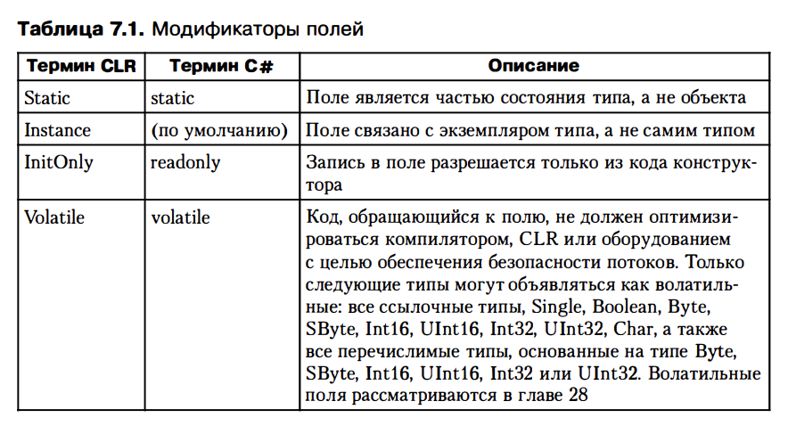

# Глава 7.  Константы и поля

Константа - идентификатор, значение которого никогда не меняется. Определяется во время компиляции. 
Компилятор сохраняет значение константы в метаданных модуля. Контанты можно определить только для элементарных типов: : Boolean, Char, Byte, SByte, Intlб, UInt1б, Int32, UInt32, Int64, UInt64, Single, DouЬle, Decimal и String
C# позволяет определить Const переменную, не относящуются к элементарному типу, если присводить ей значение null
Константы всегда считаются частью типа. Иначе говоря, константы считаются статическими, а не экземплярными членами. 
Встретив в сорце идентификатор константы, компилятор просматривает метаданные модуля, извлекает значение ее и внедряет его в генерируемый им IL-код.
csc не позволяет использовать для констант модификатор static, посколько всегда подразумевается, что контанты являются статическими.
Проблема версионирования для константы - если мы переопределим константу в dll сборке, тот кто использует эту сборку, подключив новый модуль должен будет перекомпилировать свое приложение. Нельзя применять константы во время выполнения (а не во время компиляции), если модуль должен задействовать значение, определенное в другом модуле.
В этом случае вместо контант следует использовать предназначенные только для чтения поля (readonly)

1) Поле (field) - это член данных, который хранит экземпляр значимого типа или ссылку на ссылочный тип.

Компилятор и механизм верификации гарантирует, что ни один метода, кроме конструктора, не сможем записать данные в поле, предназначенные только для чтения. Для изменения такого поля можно задействовать отображение
В csc возможны проблемы производительности, которые нужно учитывать при инициализации поля с использованием синтаксиса подстановки, а не присвоения в конструкторе
Неизменности поля ref type подразумевает неизменности ссылки, которую тип содержит, а вовсе не объекта, на которую указывает ссылка
