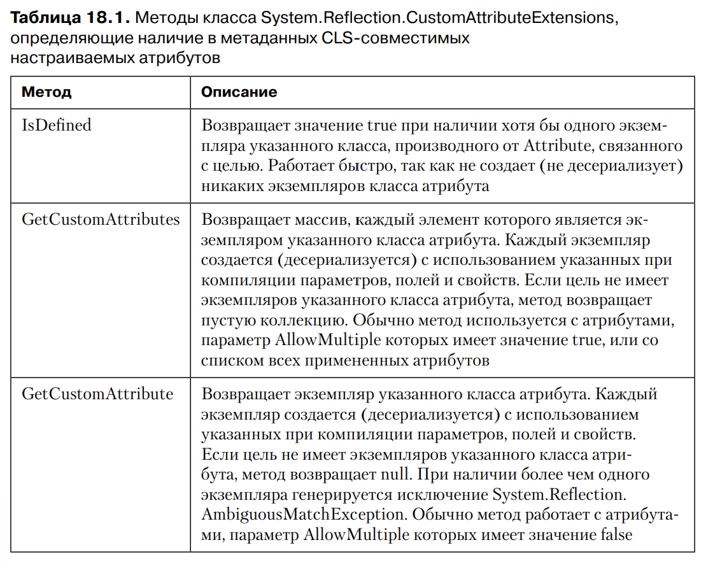
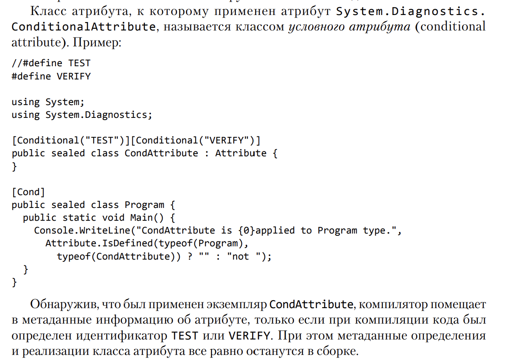

# Глава 18. Настраиваемые аттрибуты

1) Сфера применения настраиваемых атрибутов
	Настраиваемые атрибуты представляют собой лишь средство передачи некой
	дополнительной информации. Компилятор помещает эту информацию в метаданные 
	управляемого модуля. 

	Примеры:
	- DllImport: информирует CLR о том, что метод реализован в неуправляемом коде
	указанной DLL-библиотеки
	- Serializable при применении к типу информирует механизмы сериализации о том, 
	что экземплярные поля доступны для сериализации и десериализаци

	Атрибуты могут применяться к классам, полям, методам, параметрам.
	CLR позволяет применять атрибуты ко всему, что может быть представлено метаданными
	Чаще всего они применяются к записям в следующих таблицах определений:
	TypeDef (классы, структуры, перечисления, интерфейсы и делегаты), 
	MethodDef (конструкторы), ParamDef, FieldDef, PropertyDef, EventDef, AssemblyDef
	и ModuleDef. В частности, C# позволяет применять настраиваемые атрибуты только к исходному коду, определяющему такие элементы, как сборки, модули, типы 
	(класс, структура, перечисление, интерфейс, делегат), поля, методы (в том числе 
	конструкторы), параметры методов, возвращаемые значения методов, свойства, 
	события, параметры обобщенного типа

	Настраиваемый аттрибут - это всего лишь экземпляр типа. Для соответствия общеязыковой
	спецификации (CLS) он должен прямо или косвенно наследовать от абстрактного класса
	System.Attribute. В C# допустимы только CLS-совместимые атрибуты.

	Атрибуты являются экземлярами классов. Этот класс должен иметь открытый конструктор
	для создания экземпляров.

	Эти строки эквивалентны:
	```
	[Serializable][Flags]
	[Serializable, Flags]
	[FlagsAttribute, SerializableAttribute]
	[FlagsAttribute()][Serializable()]
	```

2) Определение класса атрибутов
	Атрибут следует рассматривать как логический контейнер состояния. Иначе говоря, хотя
	атрибут и является классом, этот класс должен быть крайне простым. Он должен
	содержать всего один открытый конструктор, принимающий обязательную (или позиционную)
	информацию о состоянии атрибута. Также класс может содержать открытые поля/свойства, 
	принимающие дополнительную (или именованную) информацию о состоянии атрибута.
	Также класс может содержать открытые поля/свойства, принимающие дополнительные (или именнованную)
	информацию о состоянии атрибута. В классе не должно быть открытых методов, событий 
	или других членов

	Если при определении собственного класса атрибутов вы забудете применить атрибут
	AttributeUsage, компилятор и CLR будут рассматривать полученный результат как применимый к любым элементам, но только один раз. Кроме того, он будет наследуемым. 
	Именно такие значения по умолчанию имеют поля класса AttributeUsageAttribute

3) Конструктор атбрибута и типы данных полей и свойств
	Задавая класс настраиваемого атрибута, можно указать конструктор с параметрами, 
	которые должен задавать разработчик, использующий экземпляр атрибута.
	Кроме того, вы можете определить нестатические открытые поля и свойства своего типа, 
	которые разработчик может задавать по желанию.

	Определяя конструктор экземпляров класса атрибутов, а также поля и свойства, 
	следует ограничиться небольшим набором типов данных. Допустимы типы: Boolean, 
	Char, Byte, SByte, Int16, UInt16, Int32, UInt32, Int64, UInt64, Single, Double, 
	String, Type, Object и перечислимые типы. Можно использовать также одномерные 
	массивы этих типов с нулевой нижней границей, но это не рекомендуется, так как 
	класс настраиваемых атрибутов, конструктор которого умеет работать с массивами, 
	не относится к CLS-совместимым

	Каждый раз, когда класс атрибута определяет параметр, поле или свойство типа 
	Type, следует использовать оператор typeof языка C#

	Обнаружив настраиваемый атрибут, компилятор создает экземпляр класса этого 
	атрибута, передавая его конструктору все указанные параметры. Затем он присваивает
	значения открытым полям и свойствам, используя для этого усовершенствованный синтаксис
	конструктора. Инитнув объект настраиваемого атрибута, компилятор сериализует его 
	и сохраняет в таблице метаданных

	Настраиваемый атрибут лучше всего представлять себе как экземпляр класса, сериализованный в байтовый поток, находящийся в метаданных. В период выполнения
	байты из метаданных десериализуются для конструирования экземпляра класса
		

4) Выявление настраиваемых атрибутов
	Само по себе определение атрибутов бесполезно. Вы можете определить любой 
	класс атрибута и применить его в произвольном месте, но это приведет только к появлению в вашей сборке дополнительных метаданных, никак не влияя на работу 
	приложения.

	Например, применяя атрибут Flags к Enum, будет меняться поведение методов ToString
	и Format. Причиной этого является происходящая проверка, не связан ли атрибут Flags
	с перечислимым типом, с которым работают данные методы. Код может анализироваться на 
	наличие атрибутов при помощи технологии отражения (reflection). 

	Пример кода метода ToString класса System.Enum:
	```
	public override String ToString() 
	{
		// Применяется ли к перечислимому типу экземпляр типа FlagsAttribute?
		if (this.GetType().IsDefined(typeof(FlagsAttribute), false)) 
		{
			// Да; выполняем кода, интерпрутирующий значение как
			// перечислимый тип с битовыми флагами
		}
		else
		{
			// Нет; выполняем код, интерпретирующий значения как 
			// обычный перечислимый тип
		}
	}
	```

	Этот код обращается к методу IsDefined типа Type, заставляя систему посмотреть
	метаданные этого перечислимого типа и определить, связан ли с ним экземляр
	класса FlagsAttribute.

	Проверить наличие атрибута в FCL можно разными способами:
	1) Для объектов класса System.Type можно использовать метод IsDefined
	2) Иногда требуется проверить наличие атрибута не для типа, а для сборки, модуля
	или метода. Остановимся на методах класса System.Reflection.CustomAttributeExtensions
	Именно он является базовым для CLS совместимых атрибутов. В этом классе для 
	получения атрибутов имеются три статических метода: IsDefined, GetCustomAttributes и 
	GetCustomAttribute. Каждый из них имеет несколько перегруженных версий.
	К примеру, одна версия каждого из методов работает с членами типа (классами,
	структрами, перечислениями, интерфейсами, делегатами, конструкторами, методами, 
	свойствами, полями, событиями и возвращаемыми типами), параметрами и сборками
	Также существует версии, позволяющие просматривать иерархию наследования и включать
	в результат наследумые атрибуты. 

	

	Если нужно установить только сам факт применения атрибута, используйте метод 
	IsDefined как самый быстрый из перечисленных.
	Для создания объектов атрибутов используйте метод GetCustomAttributes или GetCustomAttribute.
	При каждом вызове этих методов создаются экземпляры указанных классов атрибутов,
	и на основе указанных в исходной коде значения задаются поля и свойства каждого экземпляра
	Эти методе возвращают ссылки на сконструированные экземпляры классов атрибутов.

	Эти методы просматривают данные управляемого модуля и сравнивают строки в поиске указанного класса настраиваемого атрибута. Эти операции требуют 
	времени, поэтому если вас волнует быстродействие, подумайте о кэшировании 
	результатов работы методов. В этом случае вам не придется вызывать их раз за 
	разом, запрашивая одну и ту же информацию

	Есть еще один аспект, о котором следует помнить. После передачи класса методам IsDefined, GetCustomAttribute или GetCustomAttributes они начинают 
	искать этот класс атрибута или производные от него. Для поиска конкретного 
	класса атрибута требуется дополнительная проверка возвращенного значения, 
	которая гарантирует, что возвращен именно тот класс, который вам нужен. Чтобы 
	избежать недоразумений и дополнительных проверок, можно определить класс 
	с модификатором sealed.

5) Сравнение экземпляров атрибута
	Можно, к примеру, написать код, явным образом проверяющий значение каждого поля класса атрибута. 
	Однако класс System.Attribute переопределяет метод Equals класса Object, заставляя его сравнивать типы объектов. Если они не совпадают, метод возвращает 
	значение false. В случае же совпадения метод Equals использует отражения для 
	сравнения полей двух атрибутов (вызывая метод Equals для каждого поля). Если 
	все поля совпадают, возвращается значение true. Можно переопределить метод 
	Equals в вашем собственном классе атрибутов, убрав из него отражения и повысив 
	тем самым производительность.

	Два метода, которые можно переопределить для атрибута: Equals и Match
	1) Equals - равны ли два объекта
	2) Match - по дефолту просто использует внутри Equals, но для более богатов семантии (????)
	можно его переопределить

6) Выявление настраиваемых атрибутов без создания объектов, проивзодных от Attribute
	Для обнаружения атрибутов без выполнения кода класса атрибута применяется класс
	System.Reflection.CustomAttributeData. В нем определен единственный статический
	метод GetCustomAttributes, позволяющий получить информацию о примененных 
	атрибутах. 
	Этот метод имеет 4 перегруженных версии: одна принимает параметр типа Assembly,
	другая - Module, третья - ParameterInfo, последняя - MemberInfo

	Обычно класс CustomAttributeData используется для анализа метаданных сборки, 
	загружаемой статический методом ReflectionOnlyLoad класса Asembly. Это рассматривается
	в 23 главе. Пока же достаточно знать, что этот метод загружает сборку таким 
	образом, что CLR не может выполнять какой-либо код, в том числе конструкторы типов.

	Метод GetCustomAttributes класса CustomAttributeData работает как метод-фабрика:
	возвращает набор объектов CustomAttributeData в объекте типа IList<...>. 
	Каждому элементу этой коллекции соответствует один настраиваемый атрибут.
	Для каждого объекта класса CustomAttributeData можно запросить предназначенные 
	только для чтения свойства, определив в результате, каким способом мог быть 
	сконструирован и инициализирован объект. Например, свойство Constructor указывает,
	какой именно консутрктор мог бы быть вызван. Свойство ConstructorArguments возвращает
	аргументы, которые могли бы быть переданы конструктору.

7) Условные атрибуты
	Программисты все чаще используют атрибуты благодаря простоте их создания, 
	применения и отражения. Атрибуты позволяют также снабдить код аннотациями, 
	одновременно реализуя другие богатые возможности. В последнее время атрибуты 
	часто используются при написании и отладке кода. Например, анализатор кода для 
	Microsoft Visual Studio (FxCopCmd.exe) предлагает атрибут System.Diagnostics.
	CodeAnalysis.SuppressMessageAttribute, применимый к типам и членам и подавляющий сообщения о нарушении правила определенного инструмента статического 
	анализа. Этот атрибут ищется только кодом анализатора, при нормальном ходе 
	выполнения программы он игнорируется. Если вы не анализируете код, наличие 
	в метаданных атрибута SuppressMessage просто увеличивает объем метаданных, 
	что не лучшим образом сказывается на производительности. Соответственно, хотелось бы, чтобы компилятор задействовал этот атрибут только в случаях, когда 
	вы собираетесь воспользоваться инструментом анализа кода.

	


Ограничение задает перечисление AttributeTargets, которое может принимать еще ряд 
значений:

All: используется всеми типами

Assembly: атрибут применяется к сборке

Constructor: атрибут применяется к конструктору

Delegate: атрибут применяется к делегату

Enum: применяется к перечислению

Event: атрибут применяется к событию

Field: применяется к полю типа

Interface: атрибут применяется к интерфейсу

Method: применяется к методу

Property: применяется к свойству

Struct: применяется к структуре

С помощью логической операции ИЛИ можно комбинировать эти значения. Например, 
пусть атрибут может применяться к классам и структурам: 
[AttributeUsage(AttributeTargets.Class | AttributeTargets.Struct)]