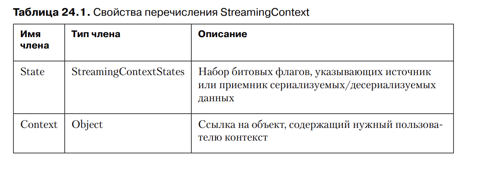
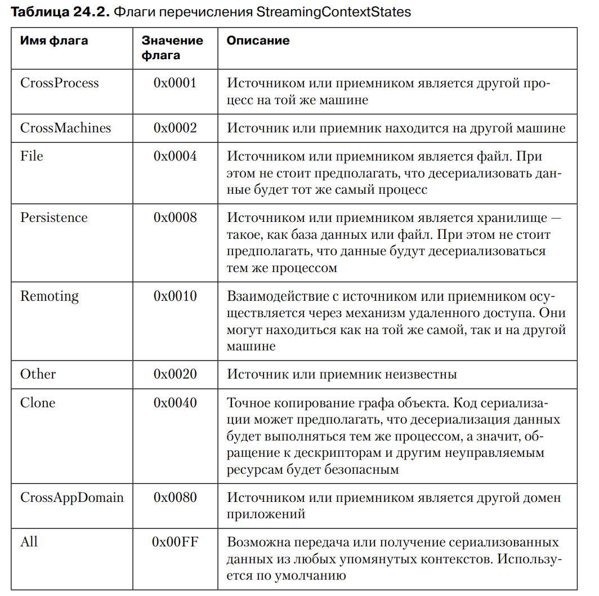

# Глава 24. Сериализация

Сериализация - процесс преобразования объекта или графа связанных объектов в поток байтов. 
Соответственно, обратное преобразование называется десериализацией.

Несколько примеров применения этого механизма:

1. Состояния приложения (граф объекта) можно легко сохранить в файле на диске или в базе 
данных и восстановить при последующем запуске приложения. ASP.NET сохраняет и восстанавливает
состояния сеанса путем сериализации и десериализации.

2. Набор объектов можно скопировать в буфер обмена и вставить в то же или в другое приложение.
Этот подход используется в приложения Window Forms и Windows Presentation Foundation (WPF)

3. Можно клонировать набор объектов и сохранить как "резервную копию", пока пользователь работает
с "основным" набором объектов

4. Набор объектов можно легко передать по сети в процесс, запущенный на другой машине. Механизм 
удаленного взаимодействия платформы .NET сериализует и десериализует объекты, продвигаемые 
по значению. Эта же технология используется при передаче объектов через границы домена.

После сериализации объектов в поток байтов в памяти появляется возможность дополнительной
обработки данных - например, шифрования или сжатия

Разработчикам приходится решать проблемы взаимодействия протоколов, несовпадения типов данных
клиента и сервера (например, разный порядок следования байтов), обработки ошибок, ссылок одних
объектов на другие, параметров in и out, массивов структур - и этот список можно продолжать 
бесконечно.

Эти сложные проблемы уже решены в .NET. Разработчик может использовать объекты до сериализации
и после десериализации, а всю работу о том, что происходит между этими двумя процедурами на себя
берет .NET.

В этой главе рассказывается, как сервис сериализации реализован в .NET. Эти процедуры 
определены практически для всех типов данных, а следовательно, вам не придется предпринимать 
дополнительных усилий, чтобы сделать свои типы сериализуемыми. Впрочем существуют типы, для которых
подобная предварительная подготовка необходима. К счастью, механизм сериализации .NET поддерживает
расширение, и мы детально рассмотрим данный процесс, позволяющий выполнить различные операции 
при сериализации и десериализации объектов. К примеру, покажется, как сериализовав одну версию
объекта в файл на диске, десериализовать его потом в другую версию.

### ПРИМЕЧАНИЕ

В этой главе в основном рассматриваются технологии сериализации в среде CLR, которая хорошо 
распознает типы данных CLR, и умеет сериализовать поля объектов, помеченных как public, 
protected, internal и даже private, превращая их в сжатый двоичный поток и тем самым повышая
производительность. Для сериализации типов данных CLR в поток XML требуется класс
System.Runtime.Serialization.NetDataContractSerializer. Платформа .NET предлагает и другие
технологии сериализации, для взаимодействия между CLR-совместимыми и CLR-несовместимыми типами
данных. В них используются классы System.Xml.Serialization.XmlSerializer и 
System.Runtime.Serialization.DataContractSerializer

## Практический пример сериализации/десериализации

Это очень просто! Метод SerializeToMemory создает объект System.IO.MemoryStream. Этот объект
определяет, куда следует поместить сериализованный блок байтов. Затем метод конструирует 
объект BinaryFormatter (расположенный в пространстве имен System.Runtime.Serialization.Formatters.Binary).
Модулем форматирования (formatter) называется тип (он реализует интерфейс
System.Runtime.Serialization.IFormatter), умеющий сериализовать и десериализовать граф объектов.
В библиотеку FCL включены два модуля форматирования: BinaryFormatter (используется в 
примере) и SoapFormatter (находяющийся в пространстве System.Runtime.Serialization.Formatters.Soap)
и реализованный в сборке System.Runtime.Serialization.Formatter.Soap.dll)

### ПРИМЕЧАНИЕ

Начиная с версии 3.5, в .NET Framework класс SoapFormatter считается устаревшим
и не рекомендуется к использованию. Однако его имеет смысл применять при отладке
кода сериализации, так как он создает доступный для чтения текст в формате XML. 
Если в выходном коде вы хотите воспользоваться механизмами XML-сериализации
и XML-десериализации, обратитесь к классам XmlSerializer и DataContractSerializer.

Для сериализации графа объектов достаточно вызвать метод Serialize модуля 
форматирования и передать ему, во-первых, ссылку на объект потока ввода-вывода, во-вторых, 
ссылку на сериализуемый граф. Поток ввода-вывода указывает, 
куда следует поместить сериализуемые байты. Его роль может играть объект 
любого типа, производного от абстрактного базового класса System.IO.Stream. 
Это означает, что граф может быть сериализован в тип MemoryStream, FileStream, 
NetworkStream и т. п.

Во втором параметре метода Serialize является ссылка на объект любого типа: 
Int32, String, DateTime, Exception, List<String>, Dictionary<Int32, DateTime>
и т. п. Объект, на который ссылается параметр objectGraph, может, в свою очередь, 
содержать ссылки на другие объекты. К примеру, параметр objectGraph быть ссылкой на 
коллекцию объектов, которые, в свою очередь, могут ссылаться на другие 
объекты. Метод Serialize сериализует в поток все объекты графа

Для отслеживания состояния экземплярных полей в типе каждого объекта в процессе сериализации метод 
Serialize использует отражение. Если какие-то из полей ссылаются на другие 
объекты, метод сериализует и их.

### ПРИМЕЧАНИЕ

Создание глубокой копии объекта:

```private static Object DeepClone(Object original) 
{
	// Создание временного потока в памяти
	using (MemoryStream stream = new MemoryStream()) 
	{
		// Создания модуля форматирования для сериализации
		BinaryFormatter formatter = new BinaryFormatter();

		// Эта строка описывается в разделе "Контексты потока ввода-вывода"
		formatter.Context = new StreamingContext(StreamingContextStates.Clone);

		// Сериализация графа объекта в поток в памяти
		formatter.Serialize(stream, original);

		// Возвращение к началу потока в памяти перед десериализацей
		stream.Position = 0;

		// Десериализация графа в новый набор объектов и возвращение
		// корня графа (детальной копии) вызывающему методу
		return formatter.Deserialize(stream);
	}
}```


Хотелось бы упомянуть о возможности и полезности сериализации 
набора графов объектов в единый поток. Например, пусть у нас есть два определения классов:

```[Serializable] internal sealed class Customer { /* ... */ }
[Serializable] internal sealed class Order { /* ... */ }```

Тогда в основном классе нашего приложения можно определить следующие 
статические поля:

```private static List<Customer> s_customers = new List<Customer>();
private static List<Order> s_pendingOrders = new List<Order>();
private static List<Order> s_processedOrders = new List<Order>();```

Теперь при помощи показанного далее метода можно сериализовать состояние 
нашего приложения в единый поток:

```private static void SaveApplicationState(Stream stream) {
	// Конструирование модуля форматирования для сериализации
	BinaryFormatter formatter = new BinaryFormatter();

	// Сериализация всего состояния приложения
	formatter.Serialize(stream, s_customers);
	formatter.Serialize(stream, s_pendingOrders);
	formatter.Serialize(stream, s_processedOrders);
}```

Метод, используемый для восстановления состояния приложения, выглядит 
примерно так:

```private static void RestoreApplicationState(Stream stream) {
	// Конструирование модуля форматирования сериализации
	BinaryFormatter formatter = new BinaryFormatter();
	// Десериализация состояния приложения (выполняется в том же
	// порядке, что и сериализация)
	s_customers = (List<Customer>) formatter.Deserialize(stream);
	s_pendingOrders = (List<Order>) formatter.Deserialize(stream);
	s_processedOrders = (List<Order>) formatter.Deserialize(stream);
}```

Второй тонкий момент, на который хотелось бы указать, связан со сборками. При 
сериализации объекта в поток записываются полное имя типа и определяющая его 
сборка. По умолчанию BinaryFormatter выдает полный идентификатор сборки, 
в который входит ее полное имя (без расширения), номер версии, язык, региональные 
параметры и открытый ключ. Десериализуя объект, модуль форматирования 
берет идентификатор сборки и обеспечивает ее загрузку в выполняющийся домен 
при помощи метода Load класса System.Reflection.Assembly.

После загрузки сборки модуль форматирования ищет в нем тип, совпадающий 
с типом десериализованного объекта. Если сборка не содержит такого типа, генерируется 
исключение, и дальнейшая десериализация объектов не выполняется. При 
обнаружении же нужного типа создается его экземпляр, и поля этого экземпляра 
инициализируются значениями, содержащимися в потоке. В случаях, когда поля 
типа не полностью совпадают с именами полей, считанными из потока, генерируется 
исключение SerializationException и дальнейшая десериализация объектов 
приостанавливается

## Сериализуемые типы

В процессе проектирования типа разработчик должен принять сознательное решение, 
разрешать или нет сериализацию экземпляров типа. По умолчанию сериализация не допускается. 
К примеру, следующий код не работает ожидаемым образом:

```internal struct Point { public Int32 x, y; }

private static void OptInSerialization() {
	Point pt = new Point { x = 1, y = 2 };
	using (var stream = new MemoryStream()) {
		new BinaryFormatter().Serialize(stream, pt); // исключение SerializationException
	}
}```

Дело в том, что разработчик типа Point не 
указал в явном виде, что объекты данного типа можно сериализовать. Решить проблему 
можно при помощи настраиваемого атрибута System.SerializableAttribute

### ПРИМЕЧАНИЕ

При сериализации графа объектов некоторые типы могут оказаться сериализуемыми, а 
некоторые — нет. По причинам, связанным с производительностью, модуль
форматирования перед сериализацией не проверяет возможность этой операции
для всех объектов. А значит, может возникнуть ситуация, когда некоторые объекты
окажутся сериализованными в поток до появления исключения SerializationException. 
В результате в потоке ввода-вывода оказываются поврежденные данные. Желательно, 
чтобы код приложения умел корректно восстанавливаться после такой ситуации. 
Этого можно добиться, например, сериализуя объекты сначала в MemoryStream. 
Если процедура для всех объектов пройдет успешно, байты из MemoryStream можно
скопировать в любой другой поток ввода-вывода (то есть в файл или в сеть).

Настраиваемый атрибут SerializableAttribute может применяться только 
к ссылочным типам (классам), значимым типам (структурам), перечислимым 
типам (перечислениям) и делегатам (перечислимые типы и делегаты
всегда сериализуемы, поэтому к ним не нужно явно применять атрибут 
SerializableAttribute). Данный атрибут не наследуется производными типами. 

К производным типам нужно отдеально применять атрибут. 
А вот когда требуется определить тип, производный от базового и не имеющий атрибута 
SerializableAttribute - уже не столь тривиальна, однако сделано намерено; если базовый 
тип не допускает сериализации своих экземпляров, его поля нельзя будет подвергнуть этой
процедуре, ведь базоывй объект фактически является частью производного. Именно поэтому классу
Object назначен этот атрибут.

### ПРИМЕЧАНИЕ

В общем случае большинство типов лучше делать сериализуемыми. Хотя бы потому,
что это дает пользователям большую гибкость. Однако следует учитывать, что при
сериализации читаются все поля объекта вне зависимости от того, с каким модификатором 
они были объявлены — public, protected, internal или private. Поэтому если
тип содержит конфиденциальные или защищенные данные (например, пароли), вряд
ли стоит делать его сериализуемым.
Если вы работаете с типом, не предназначенным для сериализации, а его исходный
код недоступен, не все потеряно. Чуть позже я расскажу, как организовать сериализацию 
такого типа.

## Управление сериализацией и десериализацией

После назначения типу настраиваемого атрибута SerializableAttribute все экземпляры его 
полей (открытые, закрытые, защищенные и т. п.) становятся сериализуемыми. Впрочем, в 
типе можно указать некоторые экземпляры как не подлежащие сериализации. В общем случае 
это делается по двум причинам:

1. ‰ Поле содержит информацию, становящуюся недействительной после десериализации. 
Например, сюда относятся объекты, содержащие дескрипторы объектов ядра Windows 
(таких, как файлы, процессы, потоки, мьютексы, события, 
семафоры и т. п.). Их десериализация в другой процесс или на другую машину 
бессмысленна, так как дескрипторы ядра Windows привязаны к конкретному 
процессу.

2. Поля содержат легко обновляемую информацию. В этом случае сделав их не подлежащими 
сериализации, вы уменьшите объем передаваемых данных, а значит, 
повысите производительность.

Используется атрибут System.NonSerializedAttribute.  Его назначают только полям типа, 
но действие атрибута распространяется на поля и при наследовании другим типом. Конечно, 
в пределах типа он может быть назначен целому набору полей.

Допустим у нас есть класс:

```[Serializable]
internal class Circle 
{
	private Double m_radius;

	[NonSerialized]
	private Double m_area;
	
	public Circle(Double radius) 
	{
		m_radius = radius;
		m_area = Math.PI * m_radius * m_radius;
	}
}```

При сериализации объекта в поток ввода-вывода записывается только значение поля m_radius.
Но при десериализации потока обратно в Circle возникает проблема, после m_area станет равным 
0, а не значению которое нам нужно.

Следующий фрагмент кода показывает, как решить эту проблему:

```[Serializable]
internal class Circle 
{
	private Double m_radius;

	[NonSerialized]
	private Double m_area;

	public Circle(Double radius) 
	{
		m_radius = radius;
		m_area = Math.PI * m_radius * m_radius;
	}

	[OnDeserialized]
	private void OnDeserialized(StreamingContext context) 
	{
		m_area = Math.PI * m_radius * m_radius;
	}
}```

Теперь объект Circle снабжен методом с настраиваемым атрибутом 
System.Runtime.Serialization.OnDeserializedAttribute. При десериализации экземпляра 
типа модуль форматирования проверяет наличие в типе метода с данным 
атрибутом. При дальнейшем вызове метода все сериализуемые поля получат корректные 
значения и к тому же станут доступными для дополнительных операций, 
без которых невозможна полная десериализация объекта.

Также в пространстве имен System.Runtime.Serialization определены также настраиваемые
атрибуты OnSerializingAttribute, OnSerializedAttribute и OnDeserializingAttribute, применив
которые к методам нашего типа мы получаем дополнительный контроль над сериализацией и 
десериализацией.

1. OnSerializingAttribute - модификация состояния перед сериализацией

2. OnSerializedAttribute - восстановление любого состояния после сериализации

3. OnDeserializingAttribute - присвоение полям значений по умолчанию в новой версии типа

4. OnDeserializedAttribute - инициализация временного состояния полей

### ПРИМЕЧАНИЕ

Следует учитывать, что при десериализации, обнаружив тип с помеченным атрибутом 
OnDeserialized методом, модуль форматирования добавляет ссылку на этот
объект во внутренний список. Этот список просматривается в обратном порядке
после десериализации всех объектов, и модуль форматирования вызывает метод
с атрибутом OnDeserialized для каждого объекта. При этом происходит корректное
присвоение значения всем сериализуемым полям и предоставляется доступ ко всем
необходимым для полной десериализации объекта операциям. Обратный порядок
вызова методов обеспечивает сначала десериализацию внутренних объектов, а уж
затем десериализуются включающие их в себя внешние объекты.


Если сериализовать экземпляр типа, добавить к нему новое поле и попытаться 
десериализовать не содержащий этого поля объект, модуль форматирования выдаст 
исключение SerializationException с сообщением о том, что данные в десериализуемом 
потоке содержат неверное количество членов. Подобная проблема часто 
возникает при изменении версий, так как при переходе от старой версии к типу 
добавляются новые поля. К счастью, можно воспользоваться атрибутом System.
Runtime.Serialization.OptionalFieldAttribute.
Атрибут OptionalFieldAttribute назначается каждому новому полю, добавляемому к типу. 
Встретив поле с таким атрибутом, модуль форматирования не 
генерирует исключение SerializationException, даже если данные в потоке не 
содержат такого поля.

## Сериализация экземпляров типа

В этом разделе подробно рассматривается тема сериализации полей объекта. Эта 
тема поможет вам понять нетривиальные приемы сериализации и десериализации, 
которым посвящен остаток данной главы.

Для облегчения работы модуля форматирования в FCL включен тип 
FormatterServices из пространства имен System.Runtime.Serialization. Он 
обладает только статическими методами и не допускает создания экземпляров. Вот 
каким образом модуль форматирования автоматически сериализует объект, типу 
которого назначен атрибут SerializableAttribute:

1. Модуль форматирования вызывает метод GetSerializableMembers класса 
FormatterServices:

```public static MemberInfo[] GetSerializableMembers(Type type, StreamingContext context);```

Для получения открытых и закрытых экземплярных полей (исключая поля 
с атрибутом NonSerializedAttribute) этот метод использует отражения. Он 
возвращает массив объектов MemberInfo — по одному объекту на каждое сериализуемое 
экземплярное поле.

2. Полученный массив объектов System.Reflection.MemberInfo передается статическому методу 
GetObjectData класса FormatterServices:

```public static Object[] GetObjectData(Object obj, MemberInfo[] members);```

Этот метод возвращает массив Object, в котором каждый элемент определяет 
значение поля сериализованного объекта. Массивы Object и MemberInfo параллельны. 
То есть нулевой элемент массива Object представляет собой значение 
члена, фигурирующего в массиве MemberInfo под нулевым индексом.

3. Модуль форматирования записывает в поток идентификатор сборки и полное 
имя типа.

4. Модуль форматирования пересчитывает элементы двух массивов, записывая 
в поток ввода-вывода имя каждого члена и его значение

А вот так выглядит процедура автоматической десериализации объектов, тип которого помечен
атрибутом SerializableAttribute:

1. Модуль форматирования читает из потока ввода-вывода идентификатор сборки и полное имя типа. 
Если сборка еще не загружена в домен, он загружает ее 
(как описано ранее). При невозможности загрузки появляется исключение 
SerializationException, и десериализация объекта останавливается. Если же 
сборка успешно загружена, модуль форматирования передает статическому 
методу GetTypeFromAssembly класса FormatterServices ее идентификатор 
и полное имя типа:

```public static Type GetTypeFromAssembly(Assembly assem, String name);```

Метод возвращает объект System.Type, содержащий информацию о типе десериализованного объекта

2. Модуль форматирования вызывает статический метод GetUninitializedObject
класса FormatterServices:

```public static Object GetUninitializedObject(Type type);```

Этот метод выделяет память под новый объект, но не вызывает его конструктор. При этом все 
байты объекта инициализируются значением null или 0.

3. Тем же способом, что и раньше, модуль форматирования создает и инициализирует массив 
MemberInfo, вызывая метод GetSerializableMembers класса 
FormatterServices. Данный метод возвращает набор полей, которые были 
сериализованы и теперь нуждаются в десериализации

4. Из содержащихся в потоке ввода-вывода данных модуль форматирования создает и 
инициализирует массив

5. Ссылки на только что размещенный в памяти объект, массив MemberInfo, и параллельный 
ему массив Object со значениями полей передаются статическому 
методу PopulateObjectMembers класса FormatterServices:

```
public static Object PopulateObjectMembers(Object obj, MemberInfo[] members, Object[] data);
```

Этот метод перебирает элементы массивов, инициализируя каждое поле 
соответствующим значением. В результате объект оказывается полностью десериализованным.

### Управление сериализованными и десериализованными данными

Как уже упоминалось в этой главе, управлять процессами сериализации и десериализации 
лучше всего при помощи атрибутов OnSerializing, OnSerialized, 
OnDeserializing, OnDeserialized, NonSerialized и OptionalField. Однако иногда 
встречаются сценарии, для которых данных атрибутов недостаточно. Кроме того, 
работа модулей форматирования основана на отражении, а это — не быстрый процесс, 
значительно замедляющий сериализацию и десериализацию объектов. Чтобы 
получить полный контроль над данными процедурами и исключить отражение, тип 
может реализовать интерфейс System.Runtime.Serialization.ISerializable, 
определяемый следующим образом:

```public interface ISerializable {
	 void GetObjectData(SerializationInfo info, StreamingContext context);
}```

### ВНИМАНИЕ

Основной проблемой интерфейса ISerializable является тот факт, что его должны реализовывать 
и все производные типы, гарантированно вызывая метод GetObjectData
базового класса и специальный конструктор. Кроме того, реализацию данного интерфейса типом 
нельзя отменить, потому что это приведет к потере совместимости с
производными типами. Впрочем, для изолированных типов реализация интерфейса
ISerializable всегда происходит без проблем. Кроме того, избежать потенциальных
неприятностей, связанных с данным интерфейсом, можно при помощи описанных
ранее настраиваемых атрибутов.

### ВНИМАНИЕ

Интерфейс ISerializable и специальный конструктор предназначены для модуля
форматирования. Вызов метода GetObjectData другим кодом потенциально может
привести к возвращению конфиденциальной информации. Другой код может при этом
создать объект, передающий поврежденные данные. Поэтому методу GetObjectData
и специальному конструктору рекомендуется назначить следующий атрибут:

```[SecurityPermissionAttribute(SecurityAction.Demand, SerializationFormatter = true)]```

При сериализации графа модуль форматирования просматривает каждый объект. 
Если тип объекта реализует интерфейс ISerializable, модуль форматирования 
игнорирует все пользовательские атрибуты и конструирует новый объект System.
Runtime.Serialization.SerializationInfo, содержащий реальный набор всех 
подлежащих сериализации значений объекта.


Показанный в книге код демонстрирует, каким образом тип Dictionary<TKey, TValue> реализует интерфейсы
ISerializable и IDeserializationCallback, добиваясь контроля над сериализацией и десериализацией
своих объектов. Я постараюсь расписать, что он делает:

В качестве поля есть SerializationInfo
Когда мы сериализуем объект с помощью метода AddValue типа SerializationInfo добавляются:
Version, Comparer, HashSize, KeyValuePairs. Каждый метод AddValue принимает в качестве параметра
имя типа String и набор данных. Обычно эти данные принадлежат к простым значимым типам, таким
как Boolean, Char, Byte, SByte, Int16, UInt16 Int32, UInt32, Int64, UInt64, Single, Double,
Decimal, DateTime. Впрочем метод AddValue можно передать ссылку на тип Object. После того
как метод GetObjectData добавить всю информацию для сериализации информацию, управление 
возвращается методу форматированияю.

 

На этом этапе модуль форматирования берет все добавленные к объекту 
SerializationInfo значения и сериализует их в поток ввода-вывода. Обратите 
внимание, что методу GetObjectData передается еще один параметр: ссылка на 
объект System.Runtime.Serialization.StreamingContext. Этот параметр игнорируется методом 
GetObjectData большинства типов, поэтому здесь мы на нем 
останавливаться не станем, а рассмотрим его отдельно ближе к концу главы.

При десериализации Version, Comparer, HashSize, KeyValuePairs достаются из этого поля.
Извлекая объект из потока ввода-вывода, модуль форматирования выделяет для него место в памяти 
(вызывая статический метод GetUninitializedObject типа System.Runtime.
Serialize.FormatterServices). Изначально всем полям объекта присваивается 
значение 0 или null. Затем модуль форматирования проверяет, реализует ли тип 
интерфейс ISerializable. В случае положительного результата проверки модуль 
пытается вызвать специальный конструктор, параметры которого идентичны параметрам 
метода GetObjectData. Для классов, помеченных модификатором sealed, этот конструктор 
рекомендуется объявлять с модификатором private. Это предохранит код от случайного 
вызова и повысит уровень безопасности. Также конструктор можно пометить модификатором 
protected, предоставив доступ к нему только производным классам. 
Впрочем, модули форматирования могут вызывать его вне зависимости от того, 
каким именно способом был объявлен конструктор

### Определение типа, реализующего интерфейс ISerializable, не реализуемый базовым классом

Как уже упоминалось, интерфейс ISerializable является крайне мощным инструментом, 
позволяющим типу полностью управлять сериализацией и десериализацией 
своих экземпляров. Однако за эту мощь приходится платить ответственностью 
типа за сериализацию еще и всех полей базового типа. Если базовый тип реализует 
также интерфейс ISerializable, нет никаких проблем — достаточно вызвать метод 
GetObjectData базового типа.

Однако иногда требуется определить тип, управляющий сериализацией, при 
условии, что его базовый тип не реализует интерфейс ISerializable. В этом случае 
производный класс должен вручную сериализовать поля базового типа, добавив 
их значения в коллекцию SerializationInfo. Затем в специальном конструкторе 
нужно будет извлечь эти значения и задать поля базового класса. В случае когда 
поля базового класса помечены модификатором public или protected, это несложно, 
а вот для закрытых полей задача может стать даже вообще неразрешимой

Следующий код показывает, как правильно реализовать метод GetObjectData
интерфейса ISerializable и его конструктор, обеспечивающий сериализацию 
полей базового типа:

```
[Serializable]
internal class Base {
	protected String m_name = "Jeff";
	public Base() { /* Наделяем тип способностью создавать экземпляры */ }
}

[Serializable]
internal class Derived : Base, ISerializable 
{
	private DateTime m_date = DateTime.Now;

	public Derived() { /* Наделяем тип способностью создавать экземпляры */ }

	// Если конструктор не существует, выдается SerializationException.
	// Если класс не запечатан, конструктор должен быть защищенным.
	[SecurityPermissionAttribute(SecurityAction.Demand, SerializationFormatter = true)]
	private Derived(SerializationInfo info, StreamingContext context) 
	{
		// Получение набора сериализуемых членов для нашего и базовых классов
		Type baseType = this.GetType().BaseType;
		MemberInfo[] mi = FormatterServices.GetSerializableMembers(baseType, context);

		// Десериализация полей базового класса из объекта данных
		for (Int32 i = 0; i < mi.Length; i++) 
		{
			// Получение поля и присвоение ему десериализованного значения
			FieldInfo fi = (FieldInfo)mi[i];
			fi.SetValue(this, info.GetValue(
			baseType.FullName + "+" + fi.Name, fi.FieldType));
		}

		// Десериализация значений, сериализованных для этого класса
		m_date = info.GetDateTime("Date");
	}

	[SecurityPermissionAttribute(
	SecurityAction.Demand, SerializationFormatter = true)]
	public virtual void GetObjectData(SerializationInfo info, StreamingContext context) 
	{
		// Сериализация нужных значений для этого класса
		info.AddValue("Date", m_date);

		// Получение набора сериализуемых членов для нашего и базовых классов
		Type baseType = this.GetType().BaseType;
		MemberInfo[] mi = FormatterServices.GetSerializableMembers(
		baseType, context);

		// Сериализация полей базового класса в объект данных
		for (Int32 i = 0; i < mi.Length; i++) 
		{
			// Полное имя базового типа ставим в префикс имени поля
			info.AddValue(baseType.FullName + "+" + mi[i].Name,
			((FieldInfo)mi[i]).GetValue(this));
		}
	}

	public override String ToString() 
	{
		return String.Format("Name={0}, Date={1}", m_name, m_date);
	}
}
```

В этом коде присутствует базовый класс Base, помеченный только настраиваемым атрибутом 
SerializableAttribute. Производным от него является 
класс Derived, также помеченный этим атрибутом и реализующий интерфейс 
ISerializable. Ситуацию усугубляет тот факт, что оба класса определяют поле типа 
String с именем m_name. При вызове метода AddValue класса SerializationInfo
нельзя добавлять значения с одним и тем же именем. Это ограничение обходится 
путем присвоения каждому полю нового имени с префиксом из имени класса. К 
примеру, когда метод GetObjectData вызывает метод AddValue для сериализации 
поля m_name класса Base, имя значения записывается в форме "Base+m_name"

### Контексты потока ввода-вывода

Сериализовать объект можно куда угодно: в тот же самый процесс, в другой процесс на этой же 
машине. в другой процесс на другой машине и т.п. Бывают ситуации, когда объект нужно заранее
уведомить, куда он будет десериализован, так как это влияет на его состояние. Например, объект,
являющийся оболочкой для Windows-семафора, может инициировать сериализацию дескриптора при 
условии, что десериализация произойдет в том же процессе - ведь дескрипторы ядра действительны
только в пределах одного процесса. При этом если десериализации будет произведена в другой процесс
на этой же машине, объект сможет сериализовать строковое имя семафора. Если же вдруг окажется,
что десериализация ожидается на другую машину, появится исключение, так как семаформы 
действительны только в пределах одной машины.

Ряд упомянутых в данной главе методов в качестве параметра принимают структуру 
StreamingContext. Это простая структура значимого типа, имеющая всего два открытых, 
предназначенных только для чтения свойства.



Получивший структуру StreamingContext метод может исследовать битовые 
флаги свойства State и определить источник или приемник сериализуемых/десериализуемых 
объектов. Возможные значения флагов перечислены в таблице:



Теперь, когда вы знаете, как получить информацию, поговорим о том, как ее 
задать. В интерфейсе IFormatter (реализуемом как типом BinaryFormatter, так 
и типом SoapFormatter) определено доступное для чтения и записи свойство типа 
StreamingContext с именем Context. В процессе конструирования модуль форматирования 
инициализирует свойство Context, присваивая StreamingContextStates
значение All, а ссылке на дополнительный объект состояния — значение null.

После создания модуля форматирования можно создать структуру Streaming-Context, 
используя любые битовые флаги StreamingContextStates, с возможностью передачи ссылки 
на объект, содержащий дополнительную контекстную информацию. После 
чего остается присвоить свойству Context новый объект 
StreamingContext до вызова метода Serialize или Deserialize. Показанный 
ранее метод DeepClone демонстрирует, как сообщить модулю форматирования, 
что сериализация/десериализация графа объектов выполняется исключительно 
с целью клонирования всех объектов.

## Сериализация в другой тип и десериализация в другой объект

Инфраструктуру сериализации в .NET обладает достаточно широкими возможностями. В частности, 
она позволяет разработчикам создавать типы, допускающие сериализацию и десериализацию 
в другой тип или объект. Несколько примеров и ситуаций, когда это может быть нужно:

1. Некоторые типы (например, System.DBNull и System.Reflection.Missing) 
допускают существование в домене приложений только одного экземпляра. 
Их часто называют одноэлементными (singleton). Если у вас имеется ссылка 
на DBNull, ее сериализация и десериализация не приведет к созданию в домене 
нового объекта. Возвращаемая после десериализации ссылка должна указывать 
на уже существующий в домене объект DBNull

2. Некоторые типы (например, System.Type, System.Reflection.Assembly и другие 
связанные с отражениями типы, такие как MemberInfo) допускают существование 
всего одного экземпляра на тип, сборку, член и т. п. Представьте массив ссылок 
на объекты MemberInfo. Допустима ситуация, когда пять ссылок указывают на 
один объект. Это состояние должно сохраняться и после сериализации и десериализации. 
Более того, элементы должны ссылаться на объект MemberInfo, 
существующий в домене для определенного члена. Такой подход полезен также 
для последовательного опроса объектов подключения к базе данных и любых 
других типов объектов.

3. Для объектов, контролируемых удаленно, CLR сериализует информацию о серверном объекте 
таким образом, что при десериализации на клиенте CLR создает 
объект, являющийся представителем (proxy) сервера на стороне клиента. Тип 
представителя отличается от типа серверного объекта, но для клиентского кода 
эта ситуация прозрачна. Если клиент вызывает для объекта-представителя экземплярные методы, 
код представителя переправляет вызов на сервер, который 
в действительности и обрабатывает запрос.

## Суррогаты сериализации

До этого момента мы обсуждали способы изменения реализации типов, позволяющие управлять 
сериализацией и десериализацией их экземпляров. Однако существует возможность переопределить
поведение этих процессов при помощи кода, не принадлежащего реализации типа. Для чего это может 
быть нужно?

1. Разработчик может сериализовать типы, для которых возможность сериализации не учтена при 
исходном проектировании

2. Возможность отображения между разными версиями одного типа

Чтобы этот механизм заработал, нужно определить "суррогатный тип", который возьмет на себя работу
по сериализации и десериализации существующего типа. Затем слудет зарегестрировать экземпляр
суррогатного типа, сообщив модулю форматирования, за действия какого существующего типа он 
будет отвечать. В результате при попытке сериализовать или десериализовать экземпляр существующего
типа модуль форматирования будет вызывать методы, определенные суррогатным объектом. Следующий
пример показывает, как все это работает.

Тип суррогата сериализации должен реализовать интерфейс System.Runtime.Serialization.ISerializationSurrogate,
определенный в FCL следующим образом:

```
public interface ISerializationSurrogate 
{
	void GetObjectData(Object obj, SerializationInfo info,
	StreamingContext context);
	Object SetObjectData(Object obj, SerializationInfo info,
	StreamingContext context, ISurrogateSelector selector);
}
```

Теперь посмотрим на пример использования этого интерфейса. Предположим, 
программа содержит объекты DateTime, значения которых привязаны к компьютеру 
пользователя. Каким образом сериализовать эти объекты в поток ввода-вывода, 
указав их значения, как всемирное время? Ведь только при таком подходе вы можете 
перенаправить поток на машину, расположенную на другом конце планеты, 
сохранив корректные значения даты и времени. Так как вы не можете менять тип 
DateTime, представленный в FCL, остается определить собственный суррогатный 
класс, управляющий сериализацией и десериализацией объектов DateTime. Вот 
как он выглядит:

```
internal sealed class UniversalToLocalTimeSerializationSurrogate : ISerializationSurrogate 
{
	public void GetObjectData(Object obj, SerializationInfo info, StreamingContext context) 
	{
		// Переход от локального к мировому времени
		info.AddValue("Date", ((DateTime)obj).ToUniversalTime().ToString("u"));
	}

	public Object SetObjectData(Object obj, 
		SerializationInfo info, 
		StreamingContext context, 
		ISurrogateSelector selector)
	{
		// Переход от мирового времени к локальному
		return DateTime.ParseExact(info.GetString("Date"), "u", null).ToLocalTime();
	}
}
```

Здесь метод GetObjectData работает почти как одноименный метод интерфейса 
ISerializable. Отличается он всего одним параметром: ссылкой на «реальный» объект, 
который требуется сериализовать. В показанном варианте метода GetObjectData
данный объект приводится к типу DateTime, его значение преобразуется из локального 
в универсальное время, а полученная в итоге строка (отформатированная 
с использованием универсального шаблона полной даты/времени) добавляется 
в коллекцию SerializationInfo.

Для десериализации объекта DateTime вызывается метод SetObjectData. Ему 
передается ссылка на объект SerializationInfo. Метод извлекает из коллекции 
строковые данные, разбирает их как строку в формате универсальной полной 
даты/времени и преобразует полученный объект DateTime в формат локального 
машинного времени.

Первый параметр метода SetObjectData, объект Object, выглядит немного странно. 
Непосредственно перед вызовом метода модуль форматирования выделяет место 
(через статический метод GetUninitializedObject класса FormatterServices) под 
экземпляр типа, для которого предназначается суррогат. Все поля этого экземпляра 
имеют значение 0 или null, и для объекта не вызывается никаких конструкторов. 
Метод SetObjectData может просто инициализировать его поля, используя значения 
из переданного методу объекта SerializationInfo, а затем вернуть значение null. 
В качестве альтернативы метод SetObjectData может создать совсем другой объект 
или даже другой объектный тип и вернуть ссылку на него. В этом случае модуль 
форматирования проигнорирует любые изменения, которые могли произойти 
с объектом, переданным им в метод SetObjectData.

В моем примере класс UniversalToLocalTimeSerializationSurrogate действует 
как суррогат для значимого типа DateTime. И поэтому параметр obj ссылается на 
упакованный экземпляр типа DateTime. Менять поля в большинстве значимых 
типов нельзя (так как они предполагаются неизменными), поэтому мой метод 
SetObjectData игнорирует параметр obj и возвращает новый объект DateTime
с нужным значением.

Как же при сериализации/десериализации объекта DateTime модуль форматирования узнает 
о необходимости использования типа ISerializationSurrogate? Тестовый код тестирует 
класс UniversalToLocalTimeSerializationSurrogate.


После выполнения четвертого шага модуль форматирования готов к работе 
с суррогатными типами. При вызове метода Serialize тип каждого объекта ищется 
в наборе, поддерживаемом объектом SurrogateSelector. При обнаружении соответствия 
вызывается метод GetObjectData класса ISerializationSurrogate, чтобы 
получить информацию для записи в поток ввода-вывода

При вызове метода Deserialize тип подлежащего десериализации объекта 
также ищется в объекте SurrogateSelector, и при обнаружении соответствия вызывается 
метод SetObjectData класса ISerializationSurrogate, задающий поля десериализуемого объекта

Объект SurrogateSelector управляет закрытой хеш-таблицей. При вызове метода AddSurrogate 
значения Type и StreamingContext формируют ключ, 
а объект ISerializationSurrogate используется как значение. Если ключ для 
рассматриваемой комбинации Type/StreamingContext уже существует, метод 
AddSurrogate генерирует исключение ArgumentException. Присутствие в ключе 
объекта StreamingContext позволяет зарегистрировать два объекта суррогатного 
типа: один умеет сериализовать в файл объект DateTime, второй — сериализовать/
десериализовать объект DateTime в другой процесс.

### ПРИМЕЧАНИЕ

В классе BinaryFormatter существует ошибка, из-за которой суррогат не может
сериализовать ссылающиеся друг на друга объекты. Для ее устранения следует
передать ссылку на объект ISerializationSurrogate статическому методу GetSurrogateForCyclicalReference 
класса FormatterServices. Этот метод возвращает объект
ISerializationSurrogate, который затем можно передать методу AddSurrogate класса
SurrogateSelector. Однако при работе с методом GetSurrogateForCyclicalReference
метод SetObjectData вашего суррогата должен менять значение внутри объекта,
на который ссылается параметр obj, и в конце концов возвращать вызывающему
методу значение null или obj. В прилагаемом к книге коде (он доступен для загрузки) д
емонстрируется, как отредактировать класс UniversalToLocalTimeSeriali
zationSurrogate и метод SerializationSurrogateDemo, чтобы обеспечить поддержку
циклических ссылок

### Цепочка селекторов суррогатов

Несколько объектов SurrogateSelector можно связать в цепочку. К примеру, у вас 
может быть объект SurrogateSelector с набором суррогатов сериализации, предназначенных 
для сериализации типов в представители с целью передачи по каналу 
связи или между доменами приложений. Может существовать и специальный объект 
SurrogateSelector с набором суррогатов сериализации, предназначенных для 
преобразования типов версии 1 в типы версии 2.

Чтобы модуль форматирования смог использовать все эти объекты, их нужно соединить в 
цепочку. Тип SurrogateSelector реализует интерфейс ISurrogateSelector, 
определяющий три метода. Все они связаны с созданием цепочек. Вот определение 
интерфейса ISurrogateSelector:

```
public interface ISurrogateSelector 
{
	void ChainSelector(ISurrogateSelector selector);
	ISurrogateSelector GetNextSelector();
	ISerializationSurrogate GetSurrogate(Type type, StreamingContext context, out ISurrogateSelector selector);
}
```

Метод ChainSelector вставляет объект ISurrogateSelector после того объекта 
ISurrogateSelector, с которым ведется работа (на него указывает ключевое 
слово this). Метод GetNextSelector возвращает ссылку на следующий объект 
ISurrogateSelector в цепочке, или значение null, если цепочка закончилась.

Метод GetSurrogate ищет пару Type/StreamingContext в объекте ISurrogateSelector, 
идентифицируемом ключевым словом this. Если пара не обнаруживается, 
рассматривается следующий объект ISurrogateSelector и т. д. В случае же обнаружения 
пары метод GetSurrogate возвращает объект ISerializationSurrogate, 
выполняющий сериализацию/десериализацию просматриваемого типа. Кроме того, 
возвращается содержащий пару объект ISurrogateSelector; но необходимости 
в этом обычно нет, и данный результат работы метода игнорируется. Если ни один 
из объектов ISurrogateSelector в цепочке не имеет совпадения для пары Type/StreamingContext, 
метод GetSurrogate возвращает значение null

### ПРИМЕЧАНИЕ

В FCL определен интерфейс ISurrogateSelector и реализующий его тип SurrogateSelector. 
При этом практически никто и никогда не определяет собственных типов,
реализующих этот интерфейс. Ведь единственной причиной его создания может
быть разве что повышенная гибкость при отображении между типами — например,
если возникает необходимость сериализовать все типы, наследующие от определенного базового 
класса определенным образом. Превосходным образчиком такого
класса является System.Runtime.Remoting.Messaging.RemotingSurrogateSelector. 
Сериализуя объекты для удаленной передачи, CLR форматирует их методом
RemotingSurrogateSelector. Этот суррогатный селектор сериализует все производные
от System.MarshalByRefObject объекты таким образом, что десериализация приводит
к созданию объектов-представителей на стороне клиента.

## Переопределение сборки и/или типа при десериализации объекта

В процессе сериализации объекта модули форматирования выводят в поток полное 
имя типа и полное имя определяющей этот тип сборки. При десериализации эта 
информация позволяет им точно узнать тип конструируемого и инициализируемого объекта. 
При обсуждении интерфейса ISerializationSurrogate я продемонстрировал механизм, 
позволяющий производить сериализацию и десериализацию 
определенного типа. Тип, реализующий интерфейс ISerializationSurrogate, 
привязан к определенному типу в определенной сборке.

Однако бывают ситуации, когда указанный механизм оказывается недостаточно 
гибким. Вот ситуации, в которых может оказаться полезным десериализация объекта в другой тип:

1. Перемещение реализации типа из одной сборки в другую. Например, номер 
версии сборки меняется, и новая сборка начинает отличаться от исходной.

2. Объект с сервера сериализуется в поток, отправляемый на сторону клиента. При 
обработке потока клиент может десериализовать объект в совершенно другой 
тип, код которого «знает», как удаленным методом обратиться к объектам на 
сервере.

3. Разработчик создает новую версию типа и именно в нее требуется десериализовать 
все ранее сериализованные объекты

Десериализация объектов в другой тип легко выполняется при помощи класса 
System.Runtime.Serialization.SerializationBinder. Достаточно определить 
тип, производный от абстрактного типа SerializationBinder. В показанном далее 
коде предполагается, что версия 1.0.0.0 сборки определяет класс с именем Ver1. 
И эта новая версия определяет класс Ver1ToVer2SerializationBinder и класс 
с именем Ver2:

```
internal sealed class Ver1ToVer2SerializationBinder : SerializationBinder 
{
	public override Type BindToType(String assemblyName, String typeName) 
	{
		// Десериализация объекта Ver1 из версии 1.0.0.0 в объект Ver2

		// Вычисление имени сборки, определяющей тип Ver1
		AssemblyName assemVer1 = Assembly.GetExecutingAssembly().GetName();
		assemVer1.Version = new Version(1, 0, 0, 0);

		// При десериализации объекта Ver1 версии v1.0.0.0 превращаем его в Ver2
		if (assemblyName == assemVer1.ToString() && typeName == "Ver1")
			return typeof(Ver2);

		// В противном случае возвращаем запрошенный тип
		return Type.GetType(String.Format("{0}, {1}", typeName, assemblyName));
	}
}
```

После создания модуля форматирования нужно создать экземпляр Ver1ToVer2SerializationBinder и 
присвоить открытому для чтения и записи свойству 
Binder ссылку на объект привязки. После этого можно вызывать метод Deserialize. 
В процессе десериализации модуль форматирования обнаружит привязку и для 
каждого обрабатываемого объекта вызовет метод BindToType, передавая ему имя
сборки и тип, которые требуется десериализовать. На этой стадии метод BindToType
решает, какой тип следует сконструировать, и возвращает этот тип.

### ПРИМЕЧАНИЕ

Класс SerializationBinder позволяет также в процессе сериализации менять информацию о 
сборке/типе путем переопределения метода BindToName. Данный метод выглядит следующим образом:

```
public virtual void BindToName(Type serializedType, 
	out string assemblyName, 
	out string typeName)
```

Во время сериализации модуль форматирования вызывает данный метод, передавая тип, 
который он собирается сериализовать. После этого вы можете передать
(при помощи двух параметров out) сборку и тип, которые хотите сериализовать вы. 
Если же в параметрах передаются null и null (именно это происходит в заданной по
умолчанию реализации), тип и сборка остаются без изменений.