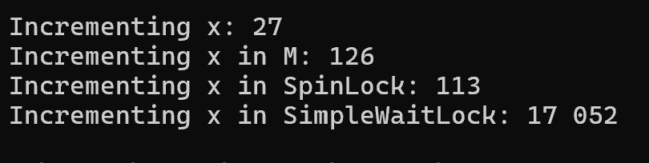

# Глава 29. Примитивные конструкции синхронизации потоков

Когда поток из пула блокируется, пул порождает дополнительные потоки исполнения; 
при этом приходится тратить соответствующие ресурсы (времени и памяти) на создание, 
планирование и удаление потоков. Многие разработчики, обнаружив в программе 
простаивающие потоки, считают, что дополнительные потоки уж точно будут делать 
что-нибудь полезное. Однако при разработке масштабируемого и быстродействующего приложения 
нужно стараться избегать блокировки потоков, только в этом случае 
их можно будет снова и снова использовать для решения других задач.

Теперь пришло время обсудить вопросы синхронизации потоков. Синхронизация позволяет 
предотвратить повреждение общих данных при **одновременном**
доступе к этим данным разных потоков. Слово «одновременно» выделено не зря, 
ведь синхронизация потоков целиком и полностью базируется на контроле времени. Если 
доступ к неким данным со стороны двух потоков осуществляется таким 
образом, что потоки никак не могут помешать друг другу, синхронизации не требуется. 

В главе 28 было показано, как разные секции асинхронной функции могут 
выполняться разными потоками. Теоретически возможно, что два потока будут 
работать с одними и теми же данными. Однако асинхронные функции реализованы 
таким образом, что два потока не будут одновременно работать с одними данными, 
поэтому при обращении кода к данным, содержащимся в асинхронной функции, 
синхронизация потоков не нужна.

Синхронизация потоков влечет за собой много проблем:

1. Программировать код синхронизации утомительно и при это легко допустить ошибку. В коде 
следует выделить все данные, которые потенциально могут обрабатываться различными потокам в одно
и то же время. Затем все эти данные заключается в другой код, обеспечивающий их блокировку и
разблокирование. Блокирование гарантирует, что доступ к ресурсу в каждый момент времени сможет
получить только один поток. Однако достаточно при программировании забыть заблокировать хотя бы
один фрагмент кода, и ваши данные будут повреждены.

К тому же нет способа проверить, правильно ли работает 
блокирующий код. Остается только запустить приложение, провести многочисленные 
нагрузочные испытания и надеяться, что все пройдет благополучно. При этом 
тестирование желательно осуществлять на машине с максимально возможным количеством процессоров, 
так как это повышает шансы выявить ситуацию, когда два 
и более потока попытаются получить одновременный доступ к ресурсу — а значит, 
повысит шансы на выявление проблемы.

2. Второй проблемой блокирования является снижение производительности. 
Установление и снятие блокировки требуют времени, так как для этого вызываются 
дополнительные методы, причем процессоры должны координировать совместную 
работу, определяя, который из потоков нужно блокировать первым. Подобное 
взаимодействие процессоров не может не сказываться на производительности. 

К примеру, рассмотрим код, добавляющий узел в начало связанного списка:

```
// Этот класс используется классом LinkedList
public class Node {
 internal Node m_next;
 // Остальные члены не показаны
}
public sealed class LinkedList {
 private Node m_head;

 public void Add(Node newNode) 
 {
	// Эти две строки реализуют быстрое присваивание ссылок
	newNode.m_next = m_head;
	m_head = newNode;
 }
}
```

Метод Add просто очень быстро присваивает ссылки. И если мы хотим сделать 
вызов этого метода безопасным, дав возможность разным потокам одновременно 
вызывать его без риска повредить связанный список, следует добавить к методу 
Add код установления и снятия блокировки:

```
public sealed class LinkedList {
 private SomeKindOfLock m_lock = new SomeKindOfLock();
 private Node m_head;
 public void Add(Node newNode) {
	m_lock.Acquire();
	// Эти две строки выполняют быстрое присваивание ссылок
	newNode.m_next = m_head;
	m_head = newNode;
	m_lock.Release();
 }
}
```

Теперь метод Add стал безопасным в отношении потоков, но скорость его выполнения 
серьезно упала.

3. В каждый момент времени допускается доступ к ресурсам только одного потока. Собственно, для
этого и было придумано блокирование, но к сожалению, подобное поведение приводит к созданию 
дополнительных потоков. То есть если поток пула пытается получить доступ к запертому ресурсу
и не получает его, скорее всего, пул создаст еще один поток для сохранения загрузки процессора.
Создание потока - плохая идея. Но хуже всего то, что после разбловирования старый поток вернется
в пул вместе с новым и количество потоков превысит количество процессоров, а значит увеличится
частота переключений контекста.

Синхронизация потоков несет много плохих последствий, поэтому стоит проектировать систему так,
чтобы она применялась как можно реже. Стоит избегать обших данных: статических полей, например.
Когда поток конструирует новый объект оператором new, оператор возвращает ссылку на этот 
объект. Причем в этот момент ссылка имеется только у создающего объект потока, 
для других потоков он недоступен. Если не передавать эту ссылку другому потоку, 
который может использовать объект одновременно с потоком, создавшим объект, 
необходимость в синхронизации отпадает

Старайтесь по возможности работать со значимыми типами, потому что они 
всегда копируются, и каждый поток в итоге работает с собственной копией. Ну и, 
наконец, нет ничего страшного в одновременном доступе разных потоков к общим 
данным, если эти данные предназначены только для чтения.

**К примеру**, многие приложения в процессе инициализации создают структуры данных. 
После инициализации приложение может создать столько потоков, сколько считает необходимым; 
и если все эти потоки решат получить доступ к этим данным, они смогут сделать это 
одновременно, не прибегая ни к блокированию, ни к разблокированию. Примером 
такого поведения служит тип String. Созданные строки неизменны, поэтому одновременный 
доступ к ним можно предоставить произвольному количеству потоков, 
не опасаясь повреждения данных.

## Библиотеки классов и безопасность потоков

Библиотека FCL разработки Microsoft гарантирует безопасность 
в отношении потоков всех статических методов. Это означает, что одновременный 
вызов статического метода двумя потоками не приводит к повреждению данных. 

Механизм защиты реализован внутри FCL, поскольку нет способа обеспечить 
блокирование сборок различных производителей, спорящих за доступ к ресурсу. 

Класс Console содержит статическое поле, по которому многие из его методов 
устанавливают и снимают блокировку, гарантируя, что в каждый момент времени 
доступ к консоли будет только у одного потока.

Кстати, создание метода, безопасного в отношении потоков, не означает, что 
внутренне он реализует блокирование в рамках синхронизации потоков. Просто этот 
метод предотвращает повреждение данных при попытке одновременного доступа 
к ним со стороны нескольких потоков. Класс System.Math обладает статическим 
методом Max, который реализован следующим образом:

```
public static Int32 Max(Int32 val1, Int32 val2) {
	return (val1 < val2) ? val2 : val1;
}
```

Так как тип Int32 относится к значимым, два значения этого типа при 
передаче в переменную Max копируются, а значит, разные потоки могут одновременно 
обращаться к данной переменной. При этом каждый поток будет работать 
с собственными данными, изолированными от всех прочих потоков.

В то же время FCL не гарантирует безопасности в отношении потоков экземплярным методам, 
так как введение в них блокирующего кода слишком сильно 
сказывается на производительности. Более того, если каждый экземплярный метод 
начнет выполнять блокирование и разблокирование, все закончится тем, что в приложении 
в каждый момент времени будет исполняться только один поток, что еще 
больше снизит производительность. 

Если потом поток предоставит ссылку на объект (поместив ее 
в статическое поле, передав ее в качестве аргумента состояния методу ThreadPool.
QueueUserWorkItem или объекту Task и т. п.), то тут синхронизация уже понадобится, 
если разные потоки попытаются одновременно получить доступ к данным 
не только для чтения.

**Написание своих библиотек**

Собственные библиотеки классов рекомендуется строить по этому паттерну — то есть 
все статические методы следует сделать безопасными в отношении 
потоков, а экземплярные методы — нет. Впрочем, следует оговорить, что если целью 
экземплярного метода является координирование потоков, его тоже следует 
сделать безопасным в отношении потоков.

**К примеру**, один поток может отменять 
операцию, вызывая метод Cancel класса CancellationTokenSource, а другой поток, 
делая запрос к соответствующему свойству IsCancellationRequested объекта 
CancellationToken, может обнаружить, что отмена на самом деле не нужна. Внутри 
этих экземплярных методов содержится специальный код синхронизации потоков, 
гарантирующий их скоординированную работу (Поле, к которому осуществляют доступ оба члена, 
помечается ключевым словом volatile, о котором мы поговорим чуть позже)

## Примитивные конструкции пользовательского режима и режима ядра

Под «примитивными» я подразумеваю простейшие конструкции, которые 
доступны в коде. Они бывают двух видов: пользовательского режима и режима ядра.

По возможности нужно задействовать первые, так как они значительно быстрее 
вторых и используют для координации потоков специальные директивы процессора. 
То есть координация имеет место уже на аппаратном уровне (и именно это 
обеспечивает быстродействие). Однако одновременно это означает, что блокировка 
потоков на уровне примитивной конструкции пользовательского режима ОС
Windows просто не распознается. А так как заблокированным 
таким способом поток пула не считается таковым, пул не создает дополнительных 
потоков для восполнения загрузки процессора. Кроме того, блокировка происходит 
на очень короткое время.

Звучит заманчиво, не правда ли? Более того, все действительно так, именно 
поэтому я рекомендую использовать эти конструкции как можно чаще. 

Впрочем, они не идеальны. Только ядро ОС Windows может остановить 
выполнение потока, чтобы он перестал впустую расходовать ресурсы процессора. 
Запущенный в пользовательском режиме поток может быть прерван операционной 
системой, но довольно быстро снова будет готов к работе. В итоге поток, который 
пытается, но не может получить некоторый ресурс, начинает циклически существовать 
в пользовательском режиме. Потенциально это является пустым расходованием 
времени процессора, которое лучше было бы потратить с пользой — или просто 
разрешить процессору простаивать для экономии энергии

Это заставляет нас перейти к примитивным конструкциям режима ядра. Они 
предоставляются самой операционной системой Windows и требуют от потоков 
приложения вызова функций, реализованных в ядре. Переход потока между пользовательским 
режимом и режимом ядра требует значительных затрат ресурсов, 
поэтому конструкций режима ядра крайне желательно избегать.

Однако и у них есть свои достоинства. Если один поток использует конструкцию режима ядра для 
получения доступа к ресурсу, с которым уже работает другой поток, Windows блокирует 
его, чтобы не тратить понапрасну время процессора. А затем, когда ресурс 
становится доступным, блокировка снимается, и поток получает доступ к ресурсу.

Если поток, использующий в данный момент конструкцию, не освободит ее, 
ожидающий конструкции поток может оказаться заблокированным навсегда. В этом 
случае в пользовательском режиме поток бесконечно исполняется процессором; 
этот вариант блокировки называется активной (живой) блокировкой (livelock),
или зависанием. В режиме ядра поток блокируется навсегда, этот тип блокировки 
называется взаимной (мертвой) блокировкой (deadlock). Обе ситуации по-своему 
плохи, но если выбирать из двух зол, второй вариант видится более предпочтительным, 
потому что в первом случае впустую расходуются как время процессора, 
так и память (стек потока и т. п.), а во втором случае расходуется только память.

В идеальном мире у нас были бы конструкции, сочетающие лучшие особенности 
обоих типов: быстро работающие и не блокирующиеся (как конструкции пользовательского режима) 
в условиях отсутствия конкуренции. А если конструкции начинали бы соперничать друг другом, 
их блокировало бы ядро операционной системы. 
Описанные конструкции даже существуют в природе, я называю их гибридными
(hybrid constructs), и мы рассмотрим их в следующей главе. Именно гибридные 
конструкции обычно используются в приложениях, так как в большинстве приложений несколько 
потоков крайне редко пытаются одновременно получить доступ 
к одним и тем же данным. Гибридные конструкции основное время поддерживают 
быструю работу приложения и периодически замедляются, блокируя поток. Однако это замедление 
в тот момент не имеет особого значения, потому что поток все 
равно будет заблокирован.

Многие из конструкций синхронизации потоков в CLR являются всего лишь 
объектно-ориентированными оболочками классов, построенных на базе конструкций 
синхронизации потоков Win32. В конце концов, CLR-потоки являются потоками 
операционной системы Windows, которая планирует и контролирует их синхронизацию. 
Конструкции синхронизации существуют с 1992 года и о них написано 
множество книг, поэтому в этой главе я ограничусь лишь кратким обзором.

## Конструкции пользовательского режима

CLR гарантирует атомарность чтения и записи следующих типов данных: Boolean, 
Char, (S)Byte, (U)Int16, (U)Int32, (U)IntPtr, Single и ссылочных типов. Это означает, 
что все байты переменной читаются или записываются одновременно. Предположим, 
имеется следующий класс:

```
internal static class SomeType {
	public static Int32 x = 0;
}
```

Если какой-то поток выполняет следующую строку кода, то переменная x сразу 
(атомарно) изменяется с 0x00000000 до 0x01234567:

```SomeType.x = 0x01234567;```

При этом посторонние потоки не увидят переменную в промежуточном состоянии. 
К примеру, другой поток не может запросить свойство SomeType.x и получить значение 
0x01230000. 

Предположим, что поле x класса SomeType относится 
к типу Int64. Если поток выполнит следующую строку кода, то другой поток сможет 
сделать запрос переменной x и получить значение 0x0123456700000000 или 
0x0000000089abcdef, так как операции чтения и записи не являются атомарными:

```
SomeType.x = 0x0123456789abcdef;
```

Это пример так называемого **прерванного чтения (torn read)**

Хотя атомарный доступ к переменной гарантирует, что чтение и запись осуществляются 
одновременно, из-за работы компилятора и оптимизации процессора 
вы не можете знать, когда именно произойдет чтение или запись. Примитивные 
конструкции пользовательского режима, рассмотренные в этом разделе, управляют 
временем выполнения этих атомарных операций. Кроме того, они обеспечивают 
атомарность и управление временем выполнения для переменных типов данных 
U(Int64) и Double.

**Примитивные конструкций синхронизации потоков пользовательского режима 
делятся на два типа:**

1. **Volatile-конструкции** выполняют для переменной, содержащей данные простого 
типа, атомарную операцию чтения или записи.

2. ‰**Interlocked-конструкции** выполняют для переменной, содержащей данные простого типа, 
атомарную операцию чтения и записи.

Конструкции обоих типов требуют передачи ссылки (адреса в памяти) на переменную, 
принадлежащую к простому типу данных

## Volatile-конструкции

Компилятор C# преобразует конструкции языка C# в команды промежуточного языка 
(Intermediate Language, IL), которые, в свою очередь, 
JIT-компилятор превращает в машинные директивы, обрабатываемые уже непосредственно 
процессором. При этом компилятор C#, JIT-компилятор и даже сам 
процессор могут оптимизировать ваш код. К примеру, после компиляции следующий нелепый 
метод в конечном итоге превратится в ничто:

```
private static void OptimizedAway() {
	// Вычисленная во время компиляции константа равна нулю
	Int32 value = (1 * 100) – (50 * 2); // 0

	// Если значение равно 0, цикл не выполняется
	for (Int32 x = 0; x < value; x++) {
	// Код цикла не нужно компилировать, так как он никогда не выполняется
	Console.WriteLine("Jeff");
	}
}
```

Разработчики очень любят это свойство компиляторов. Обычно код пытаются писать 
максимально осмысленно; он должен быть 
простым для чтения, записи и редактирования. А затем компилятор переводит 
его на язык, понятный компьютеру. И мы хотим, чтобы компиляторы делали это 
максимально хорошо.

В процессе оптимизации кода компилятором C#, JIT-компилятором и процессором 
гарантируется сохранение его назначения. То есть с точки зрения одного 
потока метод делает то, зачем мы его написали, хотя способ реализации может 
отличаться от описанного в исходном коде. 

Однако при переходе к многопоточной конфигурации ситуация может измениться. 

**Вот пример**, в котором в результате оптимизации программа стала работать не так, 
как ожидалось:

```
internal static class StrangeBehavior {
	// Далее вы увидите, что проблема решается объявлением этого поля volatile
	private static Boolean s_stopWorker = false;

	public static void Main() 
	{
		Console.WriteLine("Main: letting worker run for 5 seconds");
		Thread t = new Thread(Worker);
		t.Start();
		Thread.Sleep(5000);
		s_stopWorker = true;
		Console.WriteLine("Main: waiting for worker to stop");
		t.Join();
	}

	private static void Worker(Object o) 
	{
		Int32 x = 0;
		while (!s_stopWorker) x++;
		Console.WriteLine("Worker: stopped when x={0}", x);
	}
}
```

Код выглядит простым, но скрывает потенциальные проблемы из-за возможных оптимизаций. При 
компиляции метода Worker компилятор обнаруживает, что переменная s_stopWorker может принимать
значение true или false, но внутри метода это значение никогда не меняется. Поэтому 
компилятор может создать код, заранее проверяющий состояние переменной s_stopWorker. Если
она имеет значение true, выводится результата "Worker: stopped when x=0". В противном случае
компилятор создает код, входящий в бесконечный цикл и бесконечно увеличивающий x. При этом
оптимизация заставляет код работать крайне быстро, так как проверка переменной s_stopWorker
осуществляется один раз перед циклом.

Если вы хотите посмотреть, как это работает, поместите код в файл с расширением.cs и 
скомпилируйте его с ключами platform:x86 и /optimize+ компилятора C#. 
Запустите полученный исполняемый файл и вы убедитесь, что программа работает 
бесконечно. Обратите внимание, что вам нужен JIT-компилятор для платформы 
x86, который совершеннее компиляторов x64 и IA64, а значит, обеспечивает более 
полную оптимизацию.

 Остальные JIT-компиляторы не выполняют оптимизацию 
столь тщательно, поэтому после их работы программа успешно завершится. Это 
подчеркивает еще один интересный аспект: итоговое поведение вашей программы 
зависит от множества факторов, в частности от выбранной версии компилятора и используемых 
ключей, от выбранного JIT-компилятора, от процессора, который будет 
выполнять код. Кроме того, программа не станет работать бесконечно, если запустить 
ее в отладчике, так как отладчик заставляет JIT-компилятор ограничиться неоптимизированным 
кодом, который проще поддается выполнению в пошаговом режиме.

**Рассмотрим другой пример,** в котором пара потоков осуществляет доступ к двум полям:

```
internal sealed class ThreadsSharingData {
	private Int32 m_flag = 0;
	private Int32 m_value = 0;

	// Этот метод исполняется одним потоком
	public void Thread1() 
	{
		// ПРИМЕЧАНИЕ. Они могут выполняться в обратном порядке
		m_value = 5;
		m_flag = 1;
	}

	// Этот метод исполняется другим потоком
	public void Thread2() 
	{
		// ПРИМЕЧАНИЕ. Поле m_value может быть прочитано раньше, чем m_flag
		if (m_flag == 1)
			Console.WriteLine(m_value);
	}
}
```

В данном случае проблема в том, что компиляторы и процессор могут оттранслировать код 
таким образом, что две строки в методе Thread1 поменяются местами. 
Разумеется, это не изменит предназначения метода. Метод должен получить значение 5 в
переменной m_value и значение 1 в переменной m_flag. С точки зрения 
однопоточного приложения порядок выполнения строк кода не имеет значения. 
Если же поменять указанные строки местами, другой поток, выполняющий метод 
Thread2, может обнаружить, что переменная m_flag имеет значение 1, и выведет 
значение 0.

**Рассмотрим этот код с другой точки зрения**. Предположим, что код метода 
Thread1 выполняется так, как предусмотрено программой (то есть так, как он написан). 
Обрабатывая код метода Thread2, компилятор должен сгенерировать код, 
читающий значения переменных m_flag и m_value из оперативной памяти в регистры процессора. 
И возможно, что память первой выдаст значение переменной 
m_value, равное 0. Затем может выполниться метод Thread1, меняющий значение 
переменной m_value на 5, а переменной m_flag — на 1. Но регистр процессора метода Thread2 
не видит, что значение переменной m_value было изменено другим 
потоком на 5. После этого из оперативной памяти в регистре процессора может 
быть считано значение переменной m_flag, ставшее равным 1. В результате метод 
Thread2 снова выведет значение 0.

Все эти крайне неприятные события, скорее всего, приведут к проблемам в окончательной, 
а не в отладочной версии программы. В результате задача выявления 
проблемы и исправления кода становится нетривиальной. Поэтому сейчас давайте 
поговорим о том, как исправить код.

Класс System.Threading.Volatile содержит два статических метода, которые 
выглядят следующим образом (есть перегруженные версии для T):

```
public sealed class Volatile {
	 public static void Write(ref Int32 location, Int32 value);
	 public static Int32 Read(ref Int32 location);
}
```

Это специальные методы, отключающие оптимизации, обычно выполняемые 
компилятором C#, JIT-компилятором и собственно процессором. Вот как они 
работают:

1. Метод Volatile.Write заставляет записать значение в параметр location непосредственно 
в момент обращения. Более ранние загрузки и сохранения программы должны происходить до 
вызова этого метода

2. Метод Volatile.Read заставляет считать значение параметра address непосредственно в 
момент обращения. Более поздние загрузки и сохранения программы 
должны происходить после вызова этого метода.

### ВНИМАНИЕ

Чтобы не запутаться, приведу простое правило: при взаимодействии потоков друг
с другом через общую память записывайте последнее значение методом Volatile.
Write, а первое значение читайте методом Volatile.Read.

Теперь при помощи указанных методов можно исправить класс ThreadsSharingData:

```
internal sealed class ThreadsSharingData {
	private Int32 m_flag = 0;
	private Int32 m_value = 0;

	// Этот метод выполняется одним потоком
	public void Thread1() 
	{
		// ПРИМЕЧАНИЕ. 5 нужно записать в m_value до записи 1 в m_flag
		m_value = 5;
		Volatile.Write(ref m_flag, 1);
	}

	// Этот метод выполняется вторым потоком
	public void Thread2() 
	{
		// ПРИМЕЧАНИЕ. Поле m_value должно быть прочитано после m_flag
		if (Volatile.Read(ref m_flag) == 1)
			Console.WriteLine(m_value);
	}
}
```

Обращаю ваше внимание на четкое соблюдение правил. Метод Thread1 записывает два 
значения в поля, к которым имеют доступ несколько потоков. Последнее 
значение, которое мы хотим записать (присвоение переменной m_flag значения 1),
записывается методом Volatile.Write. Метод Thread2 читает оба значения из полей 
общего доступа, причем чтение первого из них (m_flag) выполняется методом 
Volatile.Read.

**Но что же здесь происходит на самом деле?**

Для метеода Thread1 вызов метода Volatile.Write
гарантирует, что все запись в переменные будут завершены до запись значения 1 в m_flag.
Так как операция m_value = 5 расположена до вызова метода Volatile.Write, она сначала 
должна завершиться. Более того, значение скольких бы переменных ни редактировались до вызова
метода Volatile.Write, все эти операции следует завершить до записи значения 1 в переменную 
m_flag. При этом все операции можно оптимизировать, выполняя их в любом порядке; главное, 
чтобы все они закончились до вызова метода Volatile.Write

Вызов метода Volatile.Read для метода Thread2 гарантирует, что значения 
всех переменных будут прочитаны после значения переменной m_flag. Так как 
чтение переменной m_value происходит после вызова метода Volatile.Read, оно 
должно осуществляться только после чтения значения переменной m_flag. То же 
самое касается чтения всех остальных переменных, расположенных после вызова 
метода Volatile.Read. При этом операции чтения после метода Volatile.Read
можно оптимизировать, выполняя их в любом порядке; просто чтение станет невозможным 
до вызова метода Volatile.Read.

#### Поддержка полей Volatile в C#

Как гарантировать, что программисты будут корректно вызывать методы Volatile.
Read и Volatile.Write? Сложно продумать все, в частности представить, что 
именно могут делать с общими данными другие потоки в фоновом режиме. Для 
упрощения ситуации в C# было введено ключевое слово volatile.

JIT-компилятор гарантирует, что доступ к полям, помеченным данным 
ключевым словом, будет происходить в режиме волатильного чтения или записи, 
поэтому в явном виде вызывать статические методы Read и Write класса Volatile 
больше не требуется. Более того, ключевое слово volatile запрещает компилятору 
C# и JIT-компилятору кэшировать содержимое поля в регистры процессора. 
Это гарантирует, что при всех операциях чтения и записи манипуляции будут 
производиться непосредственно с памятью

Ключевое слово volatile позволяет переписать класс ThreadsSharingData
следующим образом:

```
internal sealed class ThreadsSharingData {
	private volatile Int32 m_flag = 0;
	private Int32 m_value = 0;

	// Этот метод исполняется одним потоком
	public void Thread1() 
	{
		// ПРИМЕЧАНИЕ. Значение 5 должно быть записано в m_value
		// перед записью 1 в m_flag
		m_value = 5;
		m_flag = 1;
	}

	// Этот метод исполняется другим потоком
	public void Thread2() 
	{
		// ПРИМЕЧАНИЕ. Поле m_value должно быть прочитано после m_flag
		if (m_flag == 1)
			Console.WriteLine(m_value);
	}
}
```

**Некоторые разработчики (в том числе я) не любят ключевое слово volatile
и считают, что не стоило вводить его в C#.**

Мы считаем, что большинству алгоритмов не нужен одновременный доступ на чтение и запись 
поля со стороны нескольких потоков. А в большинстве оставшихся алгоритмов можно ограничиться 
обычным доступом к полю, повышающему производительность. А доступ к полю, 
помеченному как volatile, требуется крайне редко. К примеру, сложно объяснить, 
как применить операцию волатильного чтения к такому вот алгоритму:

```
m_amount = m_amount + m_amount; // Предполагается, что поле m_amount
								// определено как volatile
```

Обычно целое число может быть удвоено простым сдвигом всех битов на единицу 
влево, и многие компиляторы могут обработать такой код и выполнить указанную 
оптимизацию. Но если пометить поле m_amount ключевым словом volatile, оптимизация 
станет невозможной. Компилятору придется создать код, читающий 
переменную m_amount из регистра, затем читающий ее еще раз из другого регистра, 
складывающий два значения и записывающий результат обратно в поле m_amount. 
Неоптимизированный код определенно занимает больше места и медленней работает; 
вряд ли было бы уместно помещать такой кода внутрь цикла.

К тому же C# не поддерживает передачу волатильного поля по ссылке в метод. 
К примеру, если принадлежащее типу Int32 волатильное поле m_amount попытается 
вызвать метод Int32.TryParse, компилятор сгенерирует предупреждение:

```
Boolean success = Int32.TryParse("123", out m_amount);
// Эта строка приводит к сообщению от компилятора:
// CS0420: ссылка на волатильное поле не будет трактоваться как волатильная
```

Наконец, поля volatile несовместимы со спецификацией CLS, потому что они 
не поддерживаются многими языками (включая Visual Basic).

## Interlocked-конструкции

Как мы выяснили, метод Read класса Volatile выполняет атомарную операцию 
чтения, а метод Write этого же класса осуществляет атомарную операцию записи. То 
есть каждый метод выполняет либо атомарное чтение, либо атомарную запись.

В этом разделе мы поговорим о статических методах класса System.Threading.Interlocked. 
Каждый из этих методов выполняет как атомарное чтение, так и атомарную запись. 

Кроме того, все методы класса Interlocked ставят барьер в памяти, то есть любая 
запись переменной перед вызовом метода класса Interlocked выполняется до этого 
метода, а все чтения переменных после вызова метода выполняются после него.

Статические методы, работающие с переменными типа Int32, безоговорочно 
относятся к наиболее часто используемым. Продемонстрируем их:

```
public static class Interlocked {
	// Возвращает (++location)
	public static Int32 Increment(ref Int32 location);

	// Возвращает (--location)
	public static Int32 Decrement(ref Int32 location);

	// Возвращает (location += value)
	// ПРИМЕЧАНИЕ. Значение может быть отрицательным,
	// что позволяет выполнить вычитание
	public static Int32 Add(ref Int32 location, Int32 value);

	// Int32 old = location; location = value; возвращает old;
	public static Int32 Exchange(ref Int32 location, Int32 value);
	// Int32 old = location1;
	// если (location1 == comparand) location = value;
	// возвращает old;
	public static Int32 CompareExchange(ref Int32 location, Int32 value, Int32 comparand);
	...
}
```

Существуют и перегруженные версии этих методов, работающие со значениями типа Int64. 
Кроме того, в классе Interlocked существуют методы Exchange
и CompareExchange, принимающие параметры Object, IntPtr, Single и Double. 
Есть и обобщенная версия, в которой обобщенный тип ограничен типом class.

Рассмотрим **пример 1**, где идут запросы к различным веб-серверам. Это короткий код, не 
блокирующий никаких потоков, автоматически масштабируемый с использованием пула потока.

Асинхронно выполняются все запросы. Сначала вызывается метод AboutToBegin класса 
AsyncCoordinator, которому передается количество запланированных запросов. Затем происходит 
инициирование запроса вызовом метода GetByteArrayAsync класса HttpClient. Данный метод 
возвращает Task, запуская задачу на свободном потоке из пула. После завершения всех запросов
вызывается метод AllBegun класса AsyncCoordinator, которому передается имя метода, 
который следует запустить после выполнения всех операций (AllDone), а во-вторых, продолжительность
тайм-аута. После ответа каждого сервера различные потоки пула будут вызывать метод 
ComputeResult класса MultiWebRequests. После сохранения каждого результата вызывается метод 
JustEnded класса AsyncCoordinator, позволяющий объекту AsyncCoordinator
узнать о завершении операции.

После завершения всех операций объект AsyncCoordinator вызывает метод 
AllDone для обработки результатов, полученных со всех веб-серверов.

Этот метод 
будет выполняться потоком пула, последним получившим ответ с сервера. В случае 
завершения времени ожидания или отмены операции метод AllDone будет вызван 
либо потоком пула, уведомляющим объект AsyncCoordinator о том, что время 
закончилось, либо потоком, вызвавшим метод Cancel. Существует также вероятность, 
что поток, выполняющий запрос к серверу, сам вызовет метод AllDone, если 
последний запрос завершится до вызова метода AllBegin.


Имейте в виду, что в данном случае имеет место ситуация гонки, так как возможно 
одновременное завершение всех запросов к серверам, вызов метода AllBegun, 
завершение времени ожидания и вызов метода Cancel. Если такое произойдет, объект 
AsyncCoordinator выберет победителя, гарантируя, что метод AllDone будет 
вызван не более одного раза. Победитель указывается передачей в метод AllDone
аргумента состояния, роль которого может играть одно из символических имен, 
определенных в типе CoordinationStatus:

```internal enum CoordinationStatus { AllDone, Timeout, Cancel };```

Класс AsyncCoordinator содержит всю логику координации потоков. Во всех случаях он 
использует методы Interlocked, гарантируя быстрое выполнение кода и отсутствие блокировки 
потоков.

Самым важным в этом классе является поле m_opCount. В нем отслеживается количество 
асинхронных операций, ожидающих выполнения. Перед началом каждой такой операции вызывается 
метода AboutToBegin. Он вызывает метод Interlocked.Add, чтобы атомарно добавить к полю 
m_opCount переданное в нем число. Операция суммирования должна осуществляться атомарно,
так как веб-серверы могут отвечать потокам пула в процессе начала дополнительных операций.
При каждом ответе сервера вызывается метод JustEnded. Он вызывает метод Interlocked.Decrement
и атомарно вычитает из переменной m_opCount единицу. Поток присвоивший переменной m_opCount 
значение 0, вызывает метод ReportStatus.

### ПРИМЕЧАНИЕ

Полю m_opCount присваивается начальное значение 1 (не 0); это крайне важно, так
как гарантирует, что метод AllDone не будет вызван во время запроса к серверу потоком, 
исполняющим метод конструктора. До вызова конструктором метода AllBegun
переменная m_opCount не может получить значение 0. Вызванный же конструктором
метод AllBegun, в свою очередь, вызывает метод JustEnded, который последовательно
уменьшает значение переменной m_opCount на 1 и фактически отменяет эффект
присвоения ей начального значения 1. В результате переменная m_opCount может
достичь значения 0, но только после того как мы получим информацию об отправке
всех запросов к веб-серверам.

Метод ReportStatus выполняет функцию арбитра в гонке, которая может возникнуть между 
завершающимися операциями, истечением времени ожидания 
и вызовом метода Cancel. Он должен убедиться, что только одно из условий рассматривается 
в качестве победителя, и метод m_callback будет вызван всего один 
раз. Арбитраж осуществляется передачей методу Interlocked.Exchange ссылки на 
поле m_statusReported. Это поле рассматривается как переменная типа Boolean; 
но на самом деле подобное невозможно, так как методы класса Interlocked не принимают 
переменных типа Boolean. Поэтому мы используем переменную типа Int32,
значение 0 которой является эквивалентом false, а значение 1 — эквивалентом true.

Внутри метода ReportStatus вызов метода Interlocked.Exchange меняет 
значение переменной m_statusReported на 1. Но только первый проделавший это 
поток увидит, как метод Interlocked.Exchange возвращает значение 0, и только 
он активизирует метод обратного вызова. Все остальные потоки, вызвавшие метод 
Interlocked.Exchange, получат значение 1, по сути, уведомляющее их, что метод 
обратного вызова уже активизирован и больше этого делать не нужно.

## Реализация простой циклической блокировки

Interlocked-методы прекрасно работают, но в основном со значениями типа Int32. 
А что делать, если возникла необходимость атомарного манипулирования набором 
полей объекта? Нам потребуется предотвратить проникновение всех потоков кроме 
одного в область кода, управляющую полями. Interlocked-методы позволяют выполнить 
блокирование в рамках синхронизации потоков:

```
internal struct SimpleSpinLock {
	private Int32 m_ResourceInUse; // 0=false (по умолчанию), 1=true
	
	public void Enter() {
	while (true) 
	{ 
		// Всегда указывать, что ресурс используется.
		// Если поток переводит его из свободного состояния,
		// вернуть управление
		if (Interlocked.Exchange(ref m_ResourceInUse, 1) == 0) return;
			// Здесь что-то происходит...
		}
	} 

	public void Leave() {
		// Помечаем ресурс, как свободный
		Volatile.Write(ref m_ResourceInUse, 0);
	}
}
```

А вот класс, демонстрирующий использование метода SimpleSpinLock:

```
public sealed class SomeResource {
	private SimpleSpinLock m_sl = new SimpleSpinLock();
	
	public void AccessResource() 
	{
		m_sl.Enter();

		// Доступ к ресурсу в каждый момент времени имеет только один поток...
		m_sl.Leave();
	}
}

```

Реализация метода SimpleSpinLock очень проста. Если два потока одновременно 
вызывают метод Enter, метод Interlocked.Exchange гарантирует, что один поток 
изменит значение переменной m_resourceInUse с 0 на 1. Когда он видит, что переменная 
m_resourceInUse равна 0, он заставляет метод Enter возвратить управление, 
чтобы продолжить выполнение кода метода AccessResource. Второй поток тоже 
попытается заменить значение переменной m_resourceInUse на 1. Но этот поток 
увидит, что переменная уже не равна 0, и зациклится, начав непрерывно вызывать 
метод Exchange до тех пор, пока первый поток не вызовет метод Leave.

После того как первый поток завершит манипуляции полями объекта 
SomeResource, он вызовет метод Leave, который, в свою очередь, вызовет метод 
Volatile.Write и вернет переменной m_resourceInUse значение 0. Это заставит 
зациклившийся поток поменять значение переменной m_resourceInUse с 0 на 1 и, 
наконец, получить управление от метода Enter, предоставляя последнему доступ 
к полям объекта SomeResource.

Вот и все. Это очень простая реализация блокирования в рамках синхронизации 
потоков. Правда, ее серьезный потенциальный недостаток состоит в том, что при 
наличии конкуренции за право на блокирование потоки вынуждены ожидать блокирования в цикле, 
и это зацикливание приводит к пустому расходованию бесценного 
процессорного времени. Соответственно, блокирование с зацикливанием имеет 
смысл использовать только для защиты очень быстро выполняемых областей кода.

Блокирование с зацикливанием обычно не применяется на машинах с одним 
процессором, так как зацикливание другого потока-претендента помешает быстрому снятию 
блокировки. Ситуация осложняется, если поток, удерживающий 
блокировку, имеет более низкий приоритет, чем поток, претендующий на ее 
получение. Низкоприоритетный поток может вообще не получить шансов на выполнение, 
то есть просто зависнуть. Windows иногда на короткое время динамически повышает 
приоритет потоков. Для потоков, использующих блокирование 
с зацикливанием, данный режим следует отключить. Это делается при помощи 
свойств PriorityBoostEnabled классов System.Diagnostics.Process и System.
Diagnostics.ProcessThread. Блокирование с зацикливанием на гиперпотоковых 
машинах также связано с проблемами. Для их решения код блокирования с зацикливанием 
часто наделяется дополнительной логикой. Однако я не хотел бы 
вдаваться в детали, так как эта логика довольно быстро меняется. Могу сказать 
только, что FCL поставляется вместе со структурой System.Threading.SpinWait, 
которая заключает в себя всю необходимую логику.

### Задержка в обработке потока

Хитрость состоит в том, чтобы иметь поток, умеющий заставить ресурс на время 
приостановить исполнение этого потока, чтобы другой поток, обладающий в данный
момент ресурсом, завершился и освободил место. Для этого структура SpinWait
вызывает методы Sleep, Yield и SpinWait класса Thread. Коротко опишем данные 
методы.

Поток может сообщить системе, что в течение некоторого времени его не нужно 
планировать на исполнение. Эта задача решается статическим методом Sleep:

```
public static void Sleep(Int32 millisecondsTimeout);
public static void Sleep(TimeSpan timeout);
```

Поток заставляет метод приостановить работу на указанное время. Вызов метода 
Sleep позволяет потоку добровольно убрать напоминание о времени своего исполнения. 
Система забирает поток у планировщика примерно на указанное время. То 
есть если вы говорите системе, что метод хочет приостановить работу на 100 мс, он 
будет приостановлен примерно на это время, но возможно пробудет в состоянии 
покоя на несколько секунд меньше или больше. Не забывайте, что Windows не 
является операционной системой реального времени. Поток, скорее всего, пробудится в 
указанное время, но по большому счету время его пробуждения зависит 
от остальных происходящих в системе процессов.

Можно передать параметру millisecondsTimeout метода Sleep значение 
System.Threading.Timeout.Infinite (определенное как –1). В результате поток 
окажется заблокированным на неограниченное время. При этом он будет существовать, 
и вы в любой момент сможете восстановить его стек и ядро. Передача 
в метод Sleep значения 0 сообщит системе, что вызывающий поток освобождает 
ее от его исполнения и заставляет запланировать другой поток. 
Впрочем, система при отсутствии доступных для планирования потоков такого же или более 
высокого приоритета может снова запланировать исполнение потока, только что 
вызвавшего метод Sleep.

Поток может также попросить Windows запланировать для текущего процессора 
другой поток, вызвав метод Yield класса Thread:

```
public static Boolean Yield();
```

При наличии другого потока, готового работать на данном процессоре, метод 
возвращает значение true, время жизни вызвавшего его потока считается завершенным, 
а в течение одного такта используется другой выбранный поток. После 
этого вызвавший метод Yield поток снова попадает в расписание и начинает работать 
в течение следующего такта. При отсутствии потоков, на которые можно 
переключиться, метод Yield возвращает значение false, и вызвавший его поток 
продолжает исполняться.

Метод Yield дает шанс исполнить ожидающие своего процессорного времени 
потоки равного или более низкого приоритета. Поток вызывает данный метод, если 
ему требуется ресурс, которым в настоящее время владеет другой поток. Он рассчитывает 
на то, что Windows поставит обладающий ресурсом в данный момент 
поток в очередь планировщика, освободив тем самым доступ. В результате, когда 
вызвавший метод Yield поток снова начнет исполняться, доступ к ресурсу может 
получить уже он.
Существует выбор между вызовом методов Thread.Sleep(0) и Thread.Sleep(1). 
В первом случае потокам с низким приоритетом не дают исполняться, в то время 
как метод Thread.Sleep(1) включает принудительное переключение контекста, 
и Windows погружает поток в спящее состояние более чем на 1 мс, что обусловлено 
разрешением внутреннего системного таймера.

На гиперпотоковых процессорах в каждый момент времени может выполняться 
только один поток. И когда на таких процессорах поток входит в состояние зацикливания, 
нужно принудительно остановить текущий поток, позволив исполняться 
другому. Поток может остановиться сам, дав гиперпотоковому процессору возможность 
переключиться на другие потоки, вызывая метод SpinWait класса Thread:

```public static void SpinWait(Int32 iterations);```

Вызывая этот метод, вы фактически выполняете специальную инструкцию 
процессора. Она не заставляет Windows делать какую-либо работу (операционная 
система уверена, что она уже запланировала для процессора два потока). В случае 
если гиперпотоковый процессор не используется, эта специальная инструкция 
просто игнорируется.

### ПРИМЕЧАНИЕ

Чтобы лучше познакомиться с данными методами, почитайте про их Win32-
эквиваленты: Sleep, SwitchToThread и YieldProcessor. Дополнительные сведения
о настройке разрешения системного таймера вы получите при знакомстве с Win32-функциями 
timeBeginPeriod и timeEndPeriod.

В FCL существует структура System.Threading.SpinLock, сходная с показанным ранее классом 
SimpleSpinLock. Она отличается использованием структуры SpinWait с целью повышения 
производительности. Структура SpinLock поддерживает время ожидания. 

Интересно отметить,
что обе структуры - SimpleSpinLock Рихтера и SpinLock из FCL - относятся к значимым типам.
То есть они являются облегченными объектами, требующими минимальных затрат памяти. Перечислением
SpinLock имеет смысл пользоваться, если вам нужно, к примеру, связать блокировку с каждым
элементом коллекции. Но при этом нужно следить за тем, чтобы экземпляры SpinLock никуда 
не передавались, потому что они при этом компируются, из-за чего вся синхронизация теряется.
И хотя вы можете определять экземплярные поля SpinLock, не помечайте их как предназначенные 
только для чтения, поскольку при манипуляциях с блокировкой их внутреннее значение должно 
меняться.

### Универсальные Interlocked-паттерн

В классе Interlocked были бы полезные методы Multiple, Divide, Minimum, Maximum, And, Or, Xor
и многие другие. Однако вместо этих методов можно использовать хорошо известный шаблон, 
позволяющий методом Interlocked.CompareExchange атомарно выполнять любые операции со 
значением типа Int32. А так как существуют перегруженные версии этого метод для типов 
Int64, Single, Double, Object и RefType, шаблон может работать и со всеми этими типами.

**ПРИМЕР 2** показывает создание на основе шаблона атомарного метода Maximum.

Давайте разберемся что тут происходит. В момент, когда метод начинает выполняться, переменная
currentVal инициализируется значением параметра target. Затем внутри цикла то же самое 
начальное значение получает переменная startVal. При помощи последней переменной вы можете 
выполнять любые нужные вам операции. Они могут быть крайне сложными и состоять из тысяч строк
кода. Но в итоге должен быть сформирован результат, который помещается в переменную 
desiredVal. В моем примере просто сравниваются переменные startVal и value.

Пока операция выполняется, значение target может быть изменено другим потоком. Это маловероятно,
но теоретически возможно. Если это произойдет, значением desiredVal окажется основанным на 
старом значении переменной startVal, а не на текущем значении target, а следовательно мы не
должны менять этот параметр. Гарантировать, что значение параметра target поменяется 
на значение переменной desiredVal при условии, что никакой другой поток не поменяет 
его за спиной нашего потока, можно с помощью метода Interlocked.CompareExchange. Он проверяет,
совпадает ли значение параметра target со значением переменной startVal (а именно его мы 
предполагаем у параметра target перед началом выполнения операции). Если значение параметра
target не поменялось, метод CompareExchange заменяет его новым значением перменной 
desiredVal. Если же изменения произошли, метод CompareExchange не трогает параметр target.

Метод CompareExchange возвращает значение параметра target на момент своего вызова, которое
мы помещаем в переменную currentVal. Затем переменная startVal сравнивается с новым знанием
переменной currentVal.  В случае совпадения поток не меняет параметр target за нашей спиной,
этот параметр содержит значение переменной desiredVal, цикл while прекращает свою работа, и 
метод возвращает управление. Если же значения не совпадают, значит, другой поток поменял 
значения переменной desiredVal, цикл переходит к следующей итерации и пробует снова выполнить
операцию на этот раз с новым значением переменной currentVal, отражающей изменения, внесенные
постронним потоком.

Рихтер часто использовал данные шаблон, и даже создал инкапсулировавший его обобщенный метод 
Morph (очевидно, что из за метода обратного вызова morther метод Morth хуже в плане 
производительности. Чтобы исправить ситуацию, сделайте код подставляемым (inline), как в 
примере Maximum):

```
delegate Int32 Morpher<TResult, TArgument>(
	Int32 startValue, TArgument argument,
	out TResult morphResult);

static TResult Morph<TResult, TArgument>(
	 ref Int32 target, TArgument argument,
	 Morpher<TResult, TArgument> morpher) 
{
	TResult morphResult;
	Int32 currentVal = target, startVal, desiredVal;

	do 
	{
		startVal = currentVal;
		desiredVal = morpher(startVal, argument, out morphResult);
		currentVal = Interlocked.CompareExchange(ref target, desiredVal, startVal);
	} 
	while (startVal != currentVal);

	return morphResult;
}
```

## Конструкции режима ядра

Они работают намного медленнее пользовательского режима, так как требуют координации со стороны
ОС. Кроме того, каждый вызов метода для объекта ядра заставляет вызывающий поток перейти 
из управляемого в машинный код, затем в код режима ядра, после чего возвращается назад. 
Такие переходы требуют много процессорного времени и их частое выполнение снижает производительность
приложения.
Впрочем, у конструкций режима ядра есть и свои преимущества перед конструкциями пользовательского
режима:

1. Если конструкция режима ядра выявляет конкуренцию за ресурс, Windows 
блокирует проигравший поток, останавливая зацикливание, которое ведет к напрасному 
расходованию ресурсов процессора.
‰
2. Конструкции режима ядра могут осуществлять взаимную синхронизацию неуправляемых и 
управляемых потоков.
‰ 
3. Конструкции режима ядра умеют синхронизировать потоки различных процессов, запущенных 
на одной машине.
‰ 
4. Конструкции режима ядра можно наделить атрибутами безопасности, ограничивая 
несанкционированный доступ к ним.
‰ 
5. Поток можно заблокировать, пока не станут доступны все конструкции режима 
ядра или пока не станет доступна хотя бы одна такая конструкция.
‰ 
6. Поток можно заблокировать конструкцией режима ядра, указав время ожидания; 
если за указанное время поток не получит доступа к нужному ему ресурсу, он 
будет разблокирован и сможет выполнять другие задания.

К примитивным конструкциям синхронизации потоков в режиме ядра относятся **события (events)** и 
**семафоры (semaphores)**. На их основе строятся 
более сложные конструкции аналогичного назначения, например **мьютексы (mutex)**.

В пространстве имен System.Threading существует абстрактный базовый класс 
WaitHandle. Он играет роль оболочки для дескриптора ядра Windows. В FCL имеется 
несколько производных от него классов. Все они определены в пространстве 
имен System.Threading и реализуются библиотекой MSCorLib.dll. Исключением 
является класс Semaphore, реализованный в библиотеке System.dll. Вот как выглядит 
иерархия этих классов:

```
WaitHandle
	EventWaitHandle
		AutoResetEvent
		ManualResetEvent
	Semaphore
	Mutex
```

В базовом классе WaitHandle имеется поле SafeWaitHandle, содержащее дескриптор ядра Win32.

Это поле инициализируется в момент создания класса, производного от WaitHandle. 
Кроме того, класс WaitHandle предоставляет открытые 
методы, которые наследуются всеми производными классами. Каждый из вызываемых 
конструкциями режима ядра методов обеспечивает полную защиту памяти. 
Вот наиболее интересные открытые методы класса WaitHandle (перегруженные 
версии некоторых методов не показаны):


Здесь следует сделать несколько замечаний:

1. Метод WaitOne класса WaitHandle блокирует текущий поток до активизации 
объектом ядра. Он вызывает Win32-функцию WaitForSingleObjectEx. Значение 
true возвращается, если объект был активизирован. Если же время ожидания 
истекло, возвращается значение false.
‰ 
2. Статический метод WaitAll класса WaitHandle заставляет вызывающий поток 
ждать активизации всех объектов ядра, указанных в массиве WaitHandle[]. 
Если все объекты были активизированы, возвращается значение true, в случае 
же истечения времени ожидания возвращается значение false. Данный метод 
вызывает Win32-функцию WaitForMultipleObjectsEx, передавая параметру 
WaitAll значение TRUE.
‰ 
3. Статический метод WaitAny класса WaitHandle заставляет вызывающий 
поток ждать активизации любого из объектов ядра, указанных в массиве 
WaitHandle[]. Возвращенное значение типа Int32 является индексом активизированного 
элемента массива. Если в процессе ожидания сигнала не 
поступило, возвращается значение WaitHandle.WaitTimeout. Данный метод 
вызывает Win32-функцию WaitForMultipleObjectsEx, передавая параметру 
bWaitAll значение FALSE.
‰ 
4. Метод Dispose закрывает дескриптор объекта ядра. Во внутренней реализации 
эти методы вызывают функцию Win32 CloseHandle. Вызывать Dispose в коде 
можно только в том случае, если вы абсолютно уверены, что объект ядра не 
используется другими потоками. Это обстоятельство сильно затрудняет написание и 
тестирование кода, поэтому я настоятельно не рекомендую вызывать 
Dispose; просто позвольте уборщику мусора выполнить свою работу. Он сможет 
определить, когда объект не используется, и уничтожит его.

### ПРИМЕЧАНИЕ

В некоторых случаях при блокировке потока из однопоточного отделения (apartment)
возможно пробуждение потока для обработки сообщений. Например, заблокированный поток 
может проснуться для обработки Windows-сообщения, отправленного
другим потоком. Это делается для совместимости с моделью COM. Для большинства приложений 
это не проблема. Но если ваш код в процессе обработки сообщения запрет другой поток, 
может случиться взаимная блокировка. Как вы увидите
в главе 30, все гибридные блокировки тоже могут вызывать данные методы, так что
вышесказанное верно и для них.

В прототипе версий WaitOne, WaitAll и SignalAndWait, не принимающих параметр timeout, 
должно быть указано возвращаемое значение void, а не Boolean. 
В противном случае методы бы всегда возвращали значение true из-за предполагаемого 
бесконечного времени ожидания (System.Threading.Timeout.Infinite). 
Так что при вызове любого из этих методов нет нужды проверять возвращаемое 
им значение.

Как уже упоминалось, классы AutoResetEvent, ManualResetEvent, Semaphore
и Mutex являются производными от класса WaitHandle, то есть наследуют методы 
этого класса и их поведение. Впрочем, эти классы обладают и собственными методами, 
о которых мы сейчас и поговорим.

Во-первых, конструкторы всех этих классов вызывают Win32-функцию 
CreateEvent (передавая в параметре bManualReset значение FALSE), CreateEvent
(передавая в параметре bManualReset значение TRUE), CreateSemaphore или 
CreateMutex. Значение дескриптора, возвращаемого при таких вызовах, сохраняется 
в закрытом поле SafeWaitHandle, определенном в базовом классе WaitHandle.

Во-вторых, классы EventWaitHandle, Semaphore и Mutex предлагают статические 
методы OpenExisting, вызывающие Win32-функцию OpenEvent, OpenSemaphore
или OpenMutex, передавая ей аргумент типа String с именем существующего ядра. 
Значение дескриптора, возвращаемого при таких вызовах, сохраняется во вновь 
созданном объекте, возвращаемым методом OpenExisting. При отсутствии ядра 
с указанным именем генерируется исключение WaitHandleCannotBeOpenedException.

Конструкции режима ядра часто используются для создания приложений, которые в любой 
момент времени могут существовать только в одном экземпляре. 
Примерами таких приложений являются Microsoft Office Outlook, Windows Live 
Messenger, Windows Media Player Windows Media Center. Вот как реализовать такое 
приложение:


В этом фрагменте кода используется класс Semaphore, но с таким же успехом 
можно было воспользоваться классом EventWaitHandle или Mutex, так как предлагаемое 
объектом поведение не требует синхронизации потока. Однако я использую 
преимущество такого поведения при создании объектов ядра. Давайте посмотрим, 
как работает показанный код. Представим, что две копии процесса запустились 
одновременно. Каждому процессу соответствует его собственный поток, и оба потока 
попытаются создать объект Semaphore с одним и тем же именем (в моем примере 
SomeUniqueStringIdentifyingMyApp). Ядро Windows гарантирует создание 
объекта ядра с указанным именем только одним потоком; переменной createdNew
этого потока будет присвоено значение true.

В случае со вторым потоком Windows обнаруживает, что объект ядра с указанным 
именем уже существует; соответственно, потоку не позволяется создать еще один 
объект. Впрочем, продолжив работу, этот поток может получить доступ к тому же 
объекту ядра, что и поток первого процесса. Таким способом потоки из различных 
процессов взаимодействуют друг с другом через единое ядро. Но в данном случае 
поток второго процесса видит, что его переменной createdNew присвоено значение 
false. Таким образом он узнает о том, что первая копия процесса запущена, поэтому 
вторая копия немедленно завершает свою работу.

### События

События (events) представляют собой переменные типа Boolean, находящиеся 
под управлением ядра. Ожидающий события поток блокируется, если оно имеет 
значение false, и освобождается в случае значения true. Существует два вида событий. 

Когда событие с автосбросом имеет значение true, оно освобождает всего 
один заблокированный поток, так как после освобождения первого потока ядро 
автоматически возвращает событию значение false. Если же значение true имеет 
событие с ручным сбросом, оно освобождает все ожидающие этого потоки, так как 
в данном случае ядро не присваивает ему значение false автоматически, в коде это 
должно быть сделано в явном виде. Вот как выглядят классы, связанные с событиями:


```
public class EventWaitHandle : WaitHandle 
{
	public Boolean Set(); // Boolean присваивается true;
						// всегда возвращает true

	public Boolean Reset(); // Boolean присваивается false;
							// всегда возвращает true
}

public sealed class AutoResetEvent : EventWaitHandle 
{
	public AutoResetEvent(Boolean initialState);
}

public sealed class ManualResetEvent : EventWaitHandle 
{
	public ManualResetEvent(Boolean initialState);
}
```

С помощью события с автосбросом можно легко реализовать блокировку 
в рамках синхронизации потоков, поведение которого сходно с поведением ранее 
показанного класса SimpleSpinLock:

```
internal sealed class SimpleWaitLock : IDisposable { 
	private readonly AutoResetEvent m_available; 

	public SimpleWaitLock() 
	{ 
		m_available = new AutoResetEvent(true); // Изначально свободен
	} 

	public void Enter() { 
		// Блокирование на уровне ядра до освобождения ресурса
		m_available.WaitOne(); 
	}
	
	public void Leave() 
	{ 
		// Позволяем другому потоку обратиться к ресурсу
		m_available.Set(); 
	} 

	public void Dispose() { m_available.Dispose(); } 
}
```

Класс SimpleWaitLock применяется так же, как используется класс SimpleSpinLock. Более того,
внешне он ведет себя совершенно так же; а вот производительность двух вариантов блокировки 
отличается кардинальным образом. При отсуствтии конкуренции за блокировку класс 
SimpleWaitLock работает намного медленнее класса SimpleSpinLock, поскольку каждый вызова его
методов Enter и Leave заставляет поток совершить переход из управляемого кода в ядро и 
обратно. Тем не менее при наличии конкуренции проигравший поток блокируется ядром 
и не зацикливается, не давая впустую тратить ресурсы процессора. Имейте в виду, 
что переходами из управляемого кода в ядро и обратно сопровождается также создание 
объекта AutoResetEvent и вызов для него метода Dispose, что отрицательно 
сказывается на производительности. Впрочем, эти вызовы совершаются редко, так 
что не стоит слишком сильно беспокоиться по этому поводу

Чтобы продемонстрировать разницу в производительности, напишем **ПРИМЕР 3**



Как видно использование режима ядра очень замедляет программу по сравнению с конструкциями
пользовательского режима.

Поэтому если можете избежать синхронизации потоков, избегайте ее. Если без нее 
не обойтись, задействуйте конструкции пользовательского режима. Конструкции режима 
ядра следует использовать лишь в самом крайнем случае.

### Семафоры

Семафоры (semaphores) также представляют собой обычные переменные типа Int32, 
управляемые ядром. Ожидающий семафора поток блокируется при значении 0 
и освобождается при значениях больше 0. При снятии блокировки с ожидающего 
семафора потока ядро автоматически вычитает единицу из счетчика. С семафорами 
связано максимальное значение типа Int32, которое ни при каких обстоятельствах 
не могут превысить текущие показания счетчика. Вот как выглядит класс **Semaphore**:

```
public sealed class Semaphore : WaitHandle {
	public Semaphore(Int32 initialCount, Int32 maximumCount);

	public Int32 Release(); // Вызывает Release(1);
							// возвращает предыдущее значение счетчика

	public Int32 Release(Int32 releaseCount); // Возвращает предыдущее
											  // значение счетчика
}
```

**Подытожим, каким образом ведут себя эти три примитива режима ядра:**

1. При наличии нескольких потоков в режиме ожидания событие с автосбросом 
освобождает только один из них.

‰2. Событие с ручным сбросом снимает блокировку со всех ожидающих его потоков.

‰3. При наличии нескольких потоков, ожидающих семафора, его появление снимает 
блокировку с потоков releaseCount (здесь releaseCount — это аргумент, переданный 
методу Release класса Semaphore).

То есть получается, что событие с автосбросом эквивалентно семафору, максимальное 
значение счетчика которого равно единице. Разница между ними 
состоит в том, что метод Set для события с автосбросом можно вызвать много 
раз, но каждый раз освобождаться будет всего один поток, в то время как многократный 
вызов метода Release каждый раз увеличивает на единицу внутренний 
счетчик семафора, давая возможность снять блокировку с большего количества 
потоков. Однако следует помнить, что при вызове метода Release для семафора, 
показание счетчика которого уже равно максимальному, генерируется исключение 
SemaphoreFullException.

При помощи семафоров можно повторно реализовать класс SimpleWaitLock
таким образом, что нескольким потокам будет предоставляться одновременный 
доступ к ресурсу (что безопасно только при условии, что все потоки используют 
ресурс в режиме только для чтения). **ПРИМЕР 4**

### Мьютексы

ьютекс (mutex) предоставляет взаимно исключающую блокировку. Он функционирует 
аналогично объекту AutoResetEvent (или объекту Semaphore со значением 
счетчика 1), так как все три конструкции за один раз освобождают всего один ожидающий 
поток. Вот как выглядит класс Mutex:

```
public sealed class Mutex : WaitHandle 
{
	public Mutex();

	public void ReleaseMutex();
}
```

Мьютексы снабжены дополнительной логикой, что делает их более сложными 
по сравнению с другими конструкциями. Во-первых, объекты Mutex сохраняют 
информацию о том, какие потоки ими владеют. Для этого они запрашивают идентификатор 
потока (Int32). Если поток вызывает метод ReleaseMutex, объект Mutex
сначала убеждается, что это именно владеющий им поток. Если это не так, состояние 
объекта Mutex не меняется, а метод ReleaseMutex генерирует исключение System.
ApplicationException. Если владеющий объектом Mutex поток по какой-то причине завершается, 
пробуждается другой поток, ожидающий мьютекса, и генерирует 
исключение System.Threading.AbandonedMutexException. Обычно это исключение 
остается необработанным, что приводит к завершению всего процесса. И это хорошо, ведь 
новый поток получает объект Mutex, старый владелец которого вполне 
мог быть финализирован перед завершением обновления защищаемых мьютексом 
данных. Если новый поток перехватит исключение AbandonedMutexException, он 
может попытаться получить доступ к поврежденным данным, что приведет к непредсказуемым 
результатам и проблемам безопасности.

Кроме того, объекты Mutex управляют рекурсивным счетчиком, указывающим, 
сколько раз поток-владелец уже владел объектом. Если поток владеет мьютексом 
в настоящий момент и ожидает его еще раз, рекурсивный счетчик увеличивается на 
единицу, и потоку разрешается продолжить выполнение. При вызове потоком метода
ReleaseMutex рекурсивный счетчик уменьшается на единицу. И только после того, 
как его значение достигнет 0, владельцем мьютекса может стать другой поток.

Большинство пользователей не в восторге от этой дополнительной логики. Проблема 
в том, что эти «возможности» имеют свою цену. Объекту Mutex требуется 
дополнительная память для хранения идентификатора потока и рекурсивного 
счетчика. И главное, код объекта Mutex должен управлять этой информацией, что 
тормозит блокировку. Если приложению понадобятся эти дополнительные возможности, 
его код сможет реализовать их самостоятельно, не встраивая в объект Mutex. 
Поэтому многие разработчики стараются обходиться без мьютексов.

Обычно рекурсивное блокирование имеет место, если запертый метод вызывает 
другой метод, также требующий блокирования. Это демонстрирует следующий 
код:

```
internal class SomeClass : IDisposable {
	private readonly Mutex m_lock = new Mutex();

	public void Method1() 
	{
		m_lock.WaitOne();
		// Делаем что-то...
		Method2(); // Метод Method2, рекурсивно получающий право на блокировку
		m_lock.ReleaseMutex();
	}

	public void Method2() 
	{
		m_lock.WaitOne();
		// Делаем что-то...
		m_lock.ReleaseMutex();
	}

	public void Dispose() { m_lock.Dispose(); }
}
```

В приведенном фрагменте код, использующий объект SomeClass, может вызвать метод Method1, 
получающий объект Mutex. Этот код выполняет какую-то 
безопасную в отношении потоков операцию, а затем вызывает метод Method2, также 
выполняющий какую-то безопасную в отношении потоков операцию. Благодаря 
поддержке рекурсии объектом Mutex поток сначала дважды блокируется, а потом 
дважды разблокируется, и только после этого мьютекс может перейти к новому потоку. 
сли бы класс SomeClass использовал вместо мьютекса объект AutoResetEvent, 
при вызове метода WaitOne поток был бы заблокирован.

Рекурсивное блокирование можно легко организовать при помощи объекта 
AutoResetEvent:

```
internal sealed class RecursiveAutoResetEvent : IDisposable 
{
	private AutoResetEvent m_lock = new AutoResetEvent(true);
	private Int32 m_owningThreadId = 0;
	private Int32 m_recursionCount = 0;

	public void Enter() 
	{
		// Получаем идентификатор вызывающего потока
		Int32 currentThreadId = Thread.CurrentThread.ManagedThreadId;
		
		// Если вызывающий поток блокируется,
		// увеличиваем рекурсивный счетчик
		if (m_owningThreadId == currentThreadId) 
		{
			m_recursionCount++;
			return;
		}

		// Вызывающий поток не имеет блокировки, ожидаем
		m_lock.WaitOne();

		// Теперь вызывающий поток блокируется, инициализируем
		// идентификатор этого потока и рекурсивный счетчик
		m_owningThreadId = currentThreadId;
		m_recursionCount = 1;
	}

	public void Leave() 
	{
		// Если вызывающий поток не является владельцем блокировки,
		// произошла ошибка

		if (m_owningThreadId != Thread.CurrentThread.ManagedThreadId)
			throw new InvalidOperationException();

		// Вычитаем единицу из рекурсивного счетчика
		if (--m_recursionCount == 0) 
		{
			// Если рекурсивный счетчик равен 0,
			// ни один поток не владеет блокировкой
			m_owningThreadId = 0;
			m_lock.Set(); // Пробуждаем один ожидающий поток (если такие есть)
		}
	}

	public void Dispose() { m_lock.Dispose(); }
}
```

Хотя поведение класса RecursiveAutoResetEvent идентично классу Mutex, объект 
RecursiveAutoResetEvent при попытке потока получить право на рекурсивное 
блокирование будет иметь значительно лучшую производительность, так как процедуры 
отслеживания потока-владельца и рекурсии теперь находятся в управляемом 
коде. Поток осуществляет переход в ядро Windows только при первом получении 
объекта AutoResetEvent или при окончательной передаче его другому потоку.


Третья проблема состоит в том, что при блокировании в каждый момент времени допускается доступ к ресурсам только одного потока. Собственно, для этого 
и было придумано блокирование, но, к сожалению, подобное поведение приводит 
к созданию дополнительных потоков. 
То есть если поток пула пытается получить 
доступ к запертому ресурсу и не получает его, скорее всего, пул создаст еще один 
поток для сохранения загрузки процессора
ПОЧЕМУ?????


В то же время FCL не гарантирует безопасности в отношении потоков экземплярным методам, так как введение в них блокирующего кода слишком сильно 
сказывается на производительности. Более того, если каждый экземплярный метод 
начнет выполнять блокирование и разблокирование, все закончится тем, что в приложении в каждый момент времени будет исполняться только один поток, что еще 
больше снизит производительность.


Собственные библиотеки классов рекомендуется строить по этому паттерну — то есть все статические методы следует сделать безопасными в отношении 
потоков, а экземплярные методы — нет. Впрочем, следует оговорить, что если целью экземплярного метода является координирование потоков, его тоже следует 
сделать безопасным в отношении потоков.


ПРИМИТИВНЫЕ КОНСТРУКЦИИ ПОЛЬЗОВАТЕЛЬСКОГО И РЕЖИМА ЯДРА

Первые - значительно быстрее и используют для координации потоков специальные директивы процессора (на  аппаратном уровне синхронизация, и это быстрее). Windows не распознает эти блокировки и не создает новых потоков.
Но есть проблема: только Windows может оставновить выполнение потока, и поток, которые пытается, но не может получить некоторый ресурс, начинает циклически существовать в пользовательском режиме. 

Режим ядра - предоставляются ОС и требуют от потоков вызова функций, реализованных в ядре. Однако переход из пользовательского режима в режим ядра очень ресурсозатратный (из-за переключения контекста с переносом стека и регистров), поэтому таких операций следует избегать.
Однако их плюс в том, что поток, который не может получить ресурс, ОС блокирует его, чтобы не тратить время процессора. Затем, когда ресурс доступен, блокировка снимается, и поток получает доступ к ресурсу.


Если ресурс никогда не станет свободным:
- в пользовательском режиме: живая (активная) блокировка (livelock, зависание).
- в режиме ядра: взаимная (мертвая) блокировка (deadlock).
Но в режиме ядра, хотя бы поток понапрасну не работает, мы занимаем лишь память (стек потока и тд), а в user режиме и память и время процессора.


В идеальном мире у нас были бы конструкции, сочетающие лучшие особенности обоих типов: быстро работающие и не блокирующиеся (как конструкции пользовательского режима) в условиях отсутствия конкуренции. А если конструкции начинали бы соперничать друг с другом, их блокировало бы ядро ОС. Описанные конструкции существуют и их называют гибридными.


КОНСТРУКЦИИ ПОЛЬЗОВАТЕЛЬСКОГО РЕЖИМА

У нас есть гарантия атомарного присваивания переменной. Но это работает лишь для: : Boolean, Char, (S)Byte, (U)Int16, (U)Int32, (U)IntPtr, Single и ссылочных типов. Поэтому тип Int64 не имеет свойства атомарности записи. 
Это называется **прерванное чтение** (torn read).


Примитивные конструкции синхронизации потоков пользовательского режима делятся на два типа:

1. **Volatile**-конструкции выполняют для переменной, содержащей данные простого типа, атомарную операцию чтения **или** записи.

2. **Interlocked**-конструкции выполняют для переменной, содержащей данные простого типа, атомарную операцию чтения **и** записи.

1. Volatile-конструкции

Есть некоторые оказии, связанные с оптимизацией компилятора, из-за которых наш код может работать не так, как мы ожидали. Поэтому работа финальной версии будет зависеть от множества факторов: выбранной версии компилятора и используемых ключей, выбранного JIT-компилятора, от процессора.

Класс System.Threading.Volatile содержит два статических метода Write(ref Int32 location, Int32 value) и Read(ref Int32 location), которые отключают оптимизации, обычно выполняемые компилятором C#, JIT-компиляторов и собственно процессором.

1. Метод Write заставляет записать значение в параметр location непосредственно в момент обращения. Более ранние загрузки и сохранение программы должны происходить до вызова этого метода

2. Read заставляет считать значение параметра location непосредственно в момент обращения. Более поздние загрузки и сохранения программы должны происходить после вызова этого метода.

Это сообщает компилятору и среде выполнения, что надо каждый раз читать или записывать непосредственно в память, а не читать из кэша.
Это важно, чтобы каждый поток видел актуальное состояние переменной (предотвращает ситуацию, когда поток видит устаревшее значение из кэша процессора). 
Очень полезно использовать для: флагов синхронизации, индикаторов завершения, поскольку остальные потоки это увидят.

Но есть ограничения: 
1. Не поддерживает атомарность операций для инкрементов и декрементов
2. Ограниченность поддержки типов: лишь bool, int, float, double, и ссылки на объекты
3. Поддержка лишь атомарной записи чтения или атомарной операции записи

2. Interlocked-конструкции

Каждый из методов из System.Threading.Interlocked поддерживает как атомарное чтение, так и атомарную запись. Кроме того, все методы класса Interlocked ставят барьер в памяти, то есть любая запись переменной перед вызовом метода класса Interlocked выполняется до этого метода, а все чтения переменных после вызова метода выполняются после него.

**Методы с Int32:** Increment (+=1), Decrement (-=1), Add (+= value), 
Exchange(ref Int32 location, Int32 value): Int32 old = location; location = value; возвращает old, 

CompareExchange(ref Int32 location, Int32 value, Int32 comparand): Int32 old = location; если (location == comparand) location = value; возвращает old

Реализация простой циклической блокировки

Interlocked работают в основном с Int32. Но нам нужно атомарное манипулирование набором полей объекта, предотвращение проникновения всех поновов кроме одного в область код, управляющую полями. Interlocked-методы позволяют выполнить блокирование в рамках синхронизации потоков.
Реализация SimpleSpinLock очень проста. Если два потока одновременно вызываются метод Enter, метод Interlocked.Exchange гарантирует, что один поток изменить значение переменной m_resourceInUse с 0 на 1. Когда он видит, что переменная m_resourceInUser равна 0, он заставляет метод Enter возвратить управление, чтобы продолжить выполнение кода метода AccessResource. Второй поток тоже попытается заменить значение m_resourseInUse на 1. Но этот поток увидит, что переменная уже на равна 0, и зациклится, начав непрервно вызывать метод Exchange до тех пор, пока пкрвый поток не вызовет метод Leave.
Очень простой метод, однако зацикливание потока это плохо.

Ситуация осложняется, если поток, удерживающий блокировку, имеет более низкий приоритет, чем поток, претендующий на ее получение. Низкоприоритетный поток может вообще не получить шансов на выполнение, то есть просто зависнуть. Windows иногда повышает динамически приоритет потоков. Для потоков, использующих блокирование с зацикливанием, данный режим следует отключить с помощью свойств PriorityBoostEnabled классов System.Diagnostincs.Process и System.Diagnostics.ProcessThread. Блокирование с зацикливанием на гиперпотоковых машинах тоже связано с проблемами.

Могу сказать только, что FCL поставляется вместе со структурой System.Threading.SpinWait, которая заключает в себя всю необходимую логику.

Задержка в обработке потока

Хитрость состоит в том, чтобы иметь поток, умеющий заставить ресурс на время приостановить исполнение этого потока, чтобы другой поток, обладающий в данный момент ресурсом, завершился и освободил место. Для этого структура SpinWait вызывает методы Sleep, Yield и SpinWait класса Thread.

Поток может сообщить системе, что в течении некоторого времени его не нужно планировать на исполнение.
Также поток может попросить Windows запланировать для текущего процессора другой поток, вызвав метод Yield. Он дает шанс исполнить ожидающие своего процессорного времени потоки равного или более низкого приоритета. Поток вызывает данный метод, если ему требуется ресурс, которым в настоящее время владеет другой поток. Он рассчитывает на то, что Windows поставит обладающий ресурсом в данный момент поток в очередь планироващика, освободив тем самым доступ. В результате, когда вызвавший метод Yield поток снова начнет исполняться, доступ к ресурсу может получить он же сам.

На гиперпотоковых процессорах в каждый момент времени может выполняться только один поток. И когда на таких процессорах поток входит в состояние зацикливания, нужно принудительно остановить текущий поток, позволив исполняться другому потоку. Поток может остановиться сам, дав гиперпотоковому процессору возможность переключиться на другие потоки, вызывая метод SpinWait класса Thread.

Вызывая этот метод, вы фактически выполняете спеециальную инструкцию процессора. Она зставляет Windows делать какую то работу (ОС уверена, что она уже запланировала для процессора два потока). В случае если гиперпотоковый процессор не используется, эта специальная инструкция просто игнорируется.

УНИВЕРСАЛЬНЫЙ INTERLOCKED-паттерн

С помощью CompareExchange можно реализовать методы Multiple, Divide, Minimum, Maximum, And, Or И тд.


КОНСТРУКЦИИ РЕЖИМА ЯДРА

Конструкции режима ядра заставляют вызыающий поток из управляемого кода перейти в машинный, затем в код режима ядра, после чего вощвращается назад. Это медленнно.

Но зато проигравший за ресурс поток не зацикливается.
Такие конструкции могут синхронизировать потоки управляемых и неуправляемых потоков, синхронизировать потоки различных процессов.

К примитивным конструкциям режима ядра относятся **события, семафоры**. На их основе строятся более сложные конструкции аналогичного назначения, **мьютексы**

СОБЫТИЯ

События представляют собой переменные типа Boolean, находящиеся под управлением ядра. Ожидающий события поток блокируется, если оно имеет значение false, и освобождается в случае значения true.

Два типа событий:
Когда событие с автосбросом имеет значение true, оно освобождает всего один заблокированный поток, так как после освобождения первого поткоа ядро автоматически возвращает событию значение false.
Если же значение true имеет событие с ручным сбросом, оно освобождает все ожидающие этого потоки, так как в данном случае ядро не присваивает ему значение false автоматически, в коде это должно быть сделано в явном виде.

С помощью события с автосборосом можно легко реализовать блокировку в рамках синхронизации потоков, поведение которого сходно с поведением ранее показанного класса SimpleSpinLock.
Они работают абсолютно одинаково, однако с конструкцией режима ядра все работает в 50 раз медленнее, посколько приходится перейти из управляемого кода в режим ядра и обратно. Но зато поток не зацикливается. Переход в режим ядра и обратно сопровождается также создание объекта AutoResetEvent и вызов для него метода Dispose.

СЕМАФОРЫ

Обычные переменные типа Int32, управляемые ядром. Ожидающий семафора поток блокируется при значении 0 и освобождается при значении больше 0. При снятии блокировки с ожидающего семафора потока ядро автоматически вычитает единицу из счетчика. 

**Подытожим, каким образом ведут себя эти три примитива режима ядра:**

1. При наличии нескольких потоков в режиме ожидания событие с автосбросом освобождает только один из них 

2. Событие с ручным сбросом снимает блокировку со всех ожидающих его потоков.

3. При наличии нескольких потоков, ожидающих семафора, его появление снимает блокировку с потоков releaseCount (злесь releaseCount - это аргумент. переданный методу Release класса Semaphore).

То есть получается, что событие с автосбросом эквивалентно семафору, максимальное значение счетчика которого равно единице. 
Разница между ними заключается в том, что метод Set для события с автосбросом можно вызвать много раз, но каждый раз будет освобождаться только один поток. В то время как многократный вызов класса Release каждый раз увеличивает внутренний счетчик семафора, давая возможность снять блокировку с большего количества потоков.


МЬЮТЕКСЫ

Мьютекс (mutex) предоставляет взаимно исключающую блокировку. Он функционирует аналогично объекту AutoResetEvent (или объекту Semaphore со значением счетчика 1), так как все три конструкции за один раз освобождают всего один ожидающий поток.

Мьютексы более сложны:
1. Они сохраняют информацию о том, какие потоки ими владеют. Мьютексы проверяет что вызывает его методы действительно тот поток, который им владеет. Если это не так, состояние объекта мьютекс не меняется, а метод ReleaseMutex генерирует исключение. 

Кроме того, мьютекс хранит информацию, сколько раз поток-владелец уже работал с объектом. Если поток владеет мьютексом в настоящий момент и ожидает его еще раз, рекурсивыный счетчик увеличивается на единицу, и потоку разрешается продолжить выполнение. При вызове потоком метода ReleaseMutex рекурсивный счетчик уменьшается на единицу. И только после того, как его значение достигнет 0, владельцем мьютекса может стать другой поток.


Обычно рекурсивное блокирование имеет место, если запертый метод вызывает другой метод, также требующий блокирования. 

