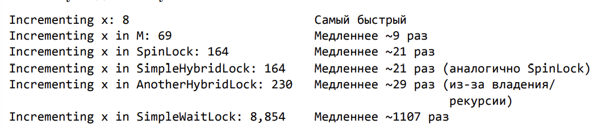

# Глава 30. Гибридные конструкции синхронизации потоков

Комбинация конструкций пользовательского и режима ядра называется гибридными конструкциями
синхронизации потоков.

При отсутствии конкуренации гибридные конструкции дают более высокую производительность, чем 
простейшие конструкции пользовательского режима. 

В них применяются простейшие конструкции режима ядра, что позволяет избежать зацикливания.

## Простая гибридная блокировка

Класс SimpleHybridLock (**Пример 1**). 

Поле AutoResetEvent создается при конструировании объекта SimpleHybridLock, что тоже сильно 
бьет по производительности. Далее в главе рассматривается еще одна гибридная конструкция 
AutoResetEventSlim, которая не создает поля AutoResetEvent до возникновения конкуренции со
стороны потоков, одновременно пытающихся добиться права на блокирование.

Закрывающий поле AutoResetEvent метод Dispose также бьет по производительности.

**Рассмотрим методы Enter и Leave**

Первый вызвавший **метод Enter** поток сделает равным 1 переменную waiters, увидит, что прежде
потоков, ожидающих права на данное блокирование не было, поэтому после вызова методе Enter он
возвращает управление. Здесь важно то, что поток очень быстро блокируется.

Если теперь появится второй поток и вызовет Enter, он увеличиь waiters уже до двух и обнаружит
присутствие уже запертого потока, поэтому он блокируется вызывая метод WaitOne, использующий
поле AutoResetEvent. Вызов WaitOne заставит поток перейти в ядро Windows, и именно эта процедура
приводит к значительному снижению производительности.

Однако этот поток в любом случае должен прекратить работу, поэтому тот факт, что полная остановка
требует лишних временных затрат, не является слишком критичным. В итоге поток блокируется и 
перестает впустую расходовать процессорное время из-за зацикливания.

Теперь перейдем к **методу Leave**. Его вызов потоком сопровождается вызовом метода 
Interlocked.Decrement, вычитающего из поля waiters единицу. Равенство этого поля нулю означает
отсутствие заблокированных потоков внутри вызова метода Enter, поэтому поток, который вызвал
метод Leave, может просто вернуть управление.

Если же обнаруживается отличное от единицы значение поля waiters, значит есть наличие конкуренции
и что, по крайней мере есть один заблокированный поток в ядре. Поток, вызвавший Leave, должен
разбудить один (и только один) из заблокированных потоков. Для этого он вызывает метод
Set объекта AutoResetEvent. Данная операция ведет к снижению производительности, так как потоку
приходится совершать переходы к ядру и обратно.

### ПРИМЕЧАНИЕ

Метод Leave может вызвать любой поток в любой момент времени, потому что метод Enter не
сохраняет информацию о том, какому потоку удалось успешно запереться. Можно добавить для этого 
поле, но это снижается производительность методов Enter и Leave.

Рихтер предпочитает иметь быстродействующее блокирование и корректно использующий его код.
С информацией подобного рода не умеют работать ни события, ни семафоры; это могут делать
только мьютексы.

## Зацикливание, владение потоком и рекурсия

Тк переход в режим ядра крайне не производителен, а потоки остаются запертывам на очень 
короткое время, общую производительность можно повысить, заставив поток перед переходом
в режим ядра на некоторое вермя зациклиться в пользовательском режиме. Если в это время
блокирование, которого ожидает поток станет возможным, перехода в режим ядра не понадобится.

Кроме того, некоторые варианты блокирования налагают ограничение, в соответствие с которым 
получить право на блокировку может только поток, снимающий блокировку. Другие варианты
блокирования допускают рекурсивный захват ресурса потоком. Именно такое поведение 
демонстрирует объект Mutex (при ожидании объекта Mutex поток не зацикливается, потому что код
этого объекта находится в ядре. То есть проверка состояния объекта Mutex возможна
только перехода потока в ядро).

С помощью нетривиальной логики можно реализовать гибридное блокирование, предполагающее 
одновременно зацикливание, владение потоком и рекурсию (**ПРИМЕР 2**)

Рихтер провел тестирование производительности на гибридных конструкциях.



Стоит заметить, что блокировка AnotherHybridLock отнимает в два раза больше времени, чем 
SimpleHybridLock. Это обусловлено дополительной логикой и проверкой ошибок, необходимой
для управления владением поткоом и рекурсией. Как видите, на производительности отрицательно
сказывается любая логика, добавляемая в код блокирования.

## Гибридные конструкции в FCL

859


Начинаю с 880

## Паттерн условной переменной

Предположим, что некий поток выполняет код при соблюдении сложного условия. 
Можно просто организовать зацикливание этого потока с периодической проверкой 
условия. Однако, во-первых, это пустая трата процессорного времени, во-вторых, 
невозможно атомарно проверить несколько переменных, входящих в условие. К счастью, существует 
шаблон программирования, позволяющий потокам эффективно 
синхронизировать свои операции на основе сложного условия. Он называется 
паттерном условной переменной (condition variable pattern), а для его применения 
можно воспользоваться следующими методами класса Monitor.

**Показано в ПРИМЕРЕ 9**

В этом коде поток, выполняющий метод Thread1, входит в код взаимоисключающей блокировки 
и осуществляет проверку условия. Если 
условие не соблюдается, поток не зацикливается на проверке, так как это было бы 
напрасной тратой процессорного времени, а вызывает метод Wait. Данный метод 
снимает блокировку, чтобы ее мог получить другой поток, и приостанавливает 
вызывающий поток.

Метод Thread2 содержит код, выполняющийся вторым потоком. Он вызывает метод Enter для блокировки,
обрабатывает какие-то данные, меняя при этом состояние условия, после чего вызывает метод Pulse(All),
разблокирующий поток после вызова метода Wait. Метод Pulse разбловирует поток, ожидающий дольше всех,
(если такие имеются), в то время как метод PulseAll разблокирует все ожидающие потоки (если такие есть).
Однако ни один из этих потоков пока не просыпается.

Поток, выполняющий метод Thread2, должен вызвать метод Monitor.Exit, давая шанс другому потоку выполнить 
блокировку. Кроме того, в результате выполнения метода PulseAll потоки разблокируются не одновременно. После
освобождения потока, вызвавшего метод Wait, он становится владельцем не одновременно. После освобождения
потока, вызвавшего метод Wait, он становится владельцем блокировки, а так как это взаимоисключающее
блокирование, в каждый момент времени им может владеть только один поток. Другие потоки имеют шанс
получить право на блокировку только после того, как текущий владелец вызовет метод Wait или Exit.

Проснувшись, поток, выполняющий метод Thread1, снова проверяет условие в цикле. Если оно все еще не 
соблюдено, он опять вызывает метод Wait. В противном случае он обрабатывает данные и, в конце концов, 
вызывает метод Exit, снимая блокировку и давая доступ другим потокам возможность получить ее. Таким 
образом данный паттерн позволяет проверить несоклько формирующих сложные условие переменных
при помощи простой логики синхронизации (всего одной блокировки), а несколько ожидающих потоков
могут разблокироваться без нарушения какой-либо логики, хоят при этом возможна напрасная трата процессорного
времени.

**Пример** безопасной в отношении потоков очереди, которая заставляет несколько потоков встаивать элементы
в очередь и удалять их. Обратите внимание, что потоки, пытающиеся удалить элемент из очереди, блокируются 
до момента, пока элемент не становится доступным для обработки.

```
internal sealed class SynchronizedQueue<T> {
	private readonly Object m_lock = new Object();
	private readonly Queue<T> m_queue = new Queue<T>();

	public void Enqueue(T item) {
		Monitor.Enter(m_lock);

		// После постановки элемента в очередь пробуждаем
		// один/все ожидающие потоки
		m_queue.Enqueue(item);
		Monitor.PulseAll(m_lock);

		Monitor.Exit(m_lock);
	}

	public T Dequeue() {
		Monitor.Enter(m_lock);

		// Выполняем цикл, пока очередь пуста (условие)
		while (m_queue.Count == 0)
			Monitor.Wait(m_queue);

		// Удаляем элемент из очереди и возвращаем его на обработку
		T item = m_queue.Dequeue();
		Monitor.Exit(m_lock);
		return item;
	}
}
```

## Асинхронная синхронизация

Представьте веб-сайт, к которому клиенты обращаются с запросами. Поступивший запрос начинает обрабатываться
потоком из пула. Пусть клиент хочет безопасным в отношении потоков способом изменить данные на сервере,
поэтому он получает блокировку на чтение-запись для записи. 

Представим, что блокирование длится долго. За это время успевает прийти еще один клиентский запрос, для 
которого пул создает новый поток, пытающийся получить блокировку на чтения-запись для чтения. Запросы
продолжают поступать, пул создает дополнительные потоки, и все эти потоки блокируются. Все свое время сервер
занимается созданием потоков и не может остановиться. Такой сервер вообще не может нормально масштабироваться.

Все становится только хуже, когда поток записи снимает блокировку, и одновременно запускаются все заблокированные
потоки чтения. В результате относительно небольшому количеству процессоров нужно как-то обработать все 
это множество потоков. Winsows попадает в ситуацию постоянного переключения контекста. В результате весь
объем работы выполняется не так быстро, как мог бы.

Многие из проблем, решаемые при помощи описанных в этой главе конструкций, 
намного успешнее решаются средствами класса Task, рассмотренного в главе 27. 

**К примеру,** возьмем класс Barrier: для работы на каждом этапе можно было бы создать группу заданий 
(объектов Task), а после их завершения ничто не мешает нам продолжить работу с дополнительными 
объектами Task. Такое подход имеет целый ряд преимуществ в сравнении с конструкциями, описанными в этой
главе:

1. Задания требуют меньше памяти, чем потоки, кроме того, они намного быстрее 
создаются и уничтожаются

2. Пул потоков автоматически распределяет задания среди доступных процессоров.

3. По мере того как каждое задание завершает свой этап, выполнявший его поток 
возвращается в пул, где может заняться другой работой, если таковая имеется

4. Пул потоков видит все задания сразу и поэтому может лучше планировать их 
выполнение, сокращая количество потоков в процессе, а значит, и количество 
переключений контекста

Блокировки популярны, но при удержании в течение долгого времени они 
создают серьезные проблемы с масштабированием. Было бы очень полезно иметь 
асинхронные конструкции синхронизации, в которых ваш код сообщает о том, что 
он хочет получить блокировку. Если получить ее не удалось, он просто возвращает 
управление для выполнения другой работы (вместо блокирования на неопределенное время). Затем, 
когда блокировка станет доступной, выполнение кода возобновляется, и он может получить доступ к 
ресурсу, защищенному блокировкой. Эта идея появилась у меня в процессе решения серьезных проблем 
масштабируемости у одного из наших клиентов. Затем я продал патентные права Microsoft. В 2009 году 
Патентное управление выдало патент номер 7 603 502.

Класс SemaphoreSlim реализует эту идею в своем методе WaitAsync. Сигнатура 
самой сложной перегруженной версии этого метода выглядит так:

```
public Task<Boolean> WaitAsync(Int32 millisecondsTimeout, CancellationToken cancellationToken);
```

С ней вы можете синхронизировать доступ к ресурсу в асинхронном режиме 
(то есть без блокирования каких-либо потоков)

```
private static async Task AccessResourceViaAsyncSynchronization(SemaphoreSlim asyncLock) 
{ 
	// TODO: Разместите здесь любой код на ваше усмотрение...

	await asyncLock.WaitAsync(); // Запрос монопольного доступа к ресурсу.
	// Когда управление попадает в эту точку, мы знаем, что никакой другой
	// поток не обращается к ресурсу.
	
	// TODO: Работа с ресурсом (в монопольном режиме)...
	
	// Завершив работу с ресурсом, снимаем блокировку, чтобы ресурс
	// стал доступным для других потоков.
	asyncLock.Release(); 
	// TODO: Разместите здесь любой код на ваше усмотрение...
}
```


Метод WaitAsync класса SemaphoreSlim чрезвычайно полезен, но, конечно, он 
реализует семантику семафора. Обычно объект SemaphoreSlim создается со счетчиком 1, 
что обеспечивает взаимоисключающий доступ к защищаемому ресурсу. 
Таким образом, реализуемое поведение сходно с тем, которое достигается при 
использовании Monitor — не считая того, что SemaphoreSlim не предоставляет 
семантики рекурсии и владения потоками (впрочем, это хорошо).

А что делать с семантикой чтения-записи? В .NET входит класс ConcurrentExclusiveSchedulerPair,
который выглядит примерно так:

```
public class ConcurrentExclusiveSchedulerPair { 
	public ConcurrentExclusiveSchedulerPair(); 

	public TaskScheduler ExclusiveScheduler { get; } 
	public TaskScheduler ConcurrentScheduler { get; } 

	// Другие методы не показаны
}
```

Экземпляр этого класса содержит два объекта TaskScheduler, которые совместно реализуют семантику
чтения/записи при планировании задач. Все задания, запланированные с использованием ExclusiveSchesuler, 
выполняются по одному - при отсутствии выполняемых задач, запланированных с использованием
ConcurrentScheduler. И конечно, все задачи, запланированные с использованием ConcurrentScheduler, 
могут выполняться одновременно - при отсутствии выполняемых заданий, запланированных ExclusiveScheduler.

**Пример использования класса ConcurrentExclusiveSchedulerPair представлен ниже:**

```
private static void ConcurrentExclusiveSchedulerDemo() { 
	
	var cesp = new ConcurrentExclusiveSchedulerPair(); 
	var tfExclusive = new TaskFactory(cesp.ExclusiveScheduler); 
	var tfConcurrent = new TaskFactory(cesp.ConcurrentScheduler); 
	for (Int32 operation = 0; operation < 5; operation++) { 
		var exclusive = operation < 2; // Для демонстрации создаются
		// 2 монопольных и 3 параллельных задания

		(exclusive ? tfExclusive : tfConcurrent).StartNew(() => { 
			Console.WriteLine("{0} access", exclusive ? "exclusive" : "concurrent");

			// TODO: Здесь выполняется монопольная запись или параллельное чтение...
		}); 
	} 
}
```

**К сожалению**, .NET не предоставляет асинхронных средств блокировки с семантикой чтения/записи. Впрочем, 
Рихтер создал такой класс, который назвал AsyncOneManyLock.

Он используется по тем же принципам, что и SemaphoreSlim:

```
private static async Task AccessResourceViaAsyncSynchronization(AsyncOneManyLock asyncLock) { 
	// TODO: Здесь выполняется любой код...

	// Передайте OneManyMode.Exclusive или OneManyMode.Shared
	// в зависимости от нужного параллельного доступа
	await asyncLock.AcquireAsync(OneManyMode.Shared); // Запросить общий доступ
	// Когда управление передается в эту точку, потоки, выполняющие
	// запись в ресурс, отсутствуют; другие потоки могут читать данные
	
	// TODO: Чтение из ресурса...
	
	// Завершив работу с ресурсом, снимаем блокировку, чтобы ресурс
	// стал доступным для других потоков.
	asyncLock.Release(); 
	
	// TODO: Здесь выполняется любой код...
}
```

Код реализации **AsyncOneManyLock** представлен в **ПРИМЕРЕ 10**

Этот код вообще не блокирует выполнение потоков, поскольку в его внутренней реализации не используются
конструкции режима ядра. В нем используется класс SpinLock, в реализации которого задействованы конструкции
пользовательского режима. Но этот класс следует использовать только для секций кода, заведомо выполняемых
за короткое и конечное время.

Проанализируйте мой метод WaitAsync, вы увидите, что во время удержания блокировки я ограничиваюсь
незначительными целочисленными вычислениями и сравнениями и, возможно, созданием объекта 
TaskCompletionSource и его добавлением в очередь. Все это не займет много времени, поэтому блокировка
заведомо будет удерживаться в течении очень короткого промежутка.

алогичным образом метод Release ограничивается целочисленными вычислениями, сравнением и, 
возможно, выведением объекта TaskCompletionSourceиз очереди или его созданием. Все это тоже происходит 
очень быстро. Все это позволило мне с уверенностью использовать SpinLock для защиты доступа к Queue. 
Выполнение потоков никогда не блокируется, что способствует написанию масштабируемого, быстрого кода.

## Классы колекций для паралелльного доступа

В FCL существует четыре безопасных в отношении потоков класса коллекций, принадлежающих пространству 
имен System.Collections.Concurrent: **ConcurrentQueue, ConcurrentStack, ConcurrentDictionary и 
ConcurrentBag.** 

Вот как выглядят наиболее часто используемые члены:

```
// Обработка элементов по алгоритму FIFO
public class ConcurrentQueue<T> : IProducerConsumerCollection<T>, IEnumerable<T>, ICollection, IEnumerable 
{
	public ConcurrentQueue();
	public void Enqueue(T item);
	public Boolean TryDequeue(out T result);
	public Int32 Count { get; }
	public IEnumerator<T> GetEnumerator();
}
```

```
// Обработка элементов по алгоритму LIFO
public class ConcurrentStack<T> : IProducerConsumerCollection<T>, IEnumerable<T>, ICollection, IEnumerable 
{
	public ConcurrentStack();
	public void Push(T item);
	public Boolean TryPop(out T result);
	public Int32 Count { get; }
	public IEnumerator<T> GetEnumerator();
}
```

```
// Несортированный набор элементов с возможностью хранения дубликатов
public class ConcurrentBag<T> : IProducerConsumerCollection<T>, IEnumerable<T>, ICollection, IEnumerable 
{
	public ConcurrentBag();
	public void Add(T item);
	public Boolean TryTake(out T result);
	public Int32 Count { get; }
	public IEnumerator<T> GetEnumerator();
}
```

```
// Несортированный набор пар ключ/значение
public class ConcurrentDictionary<TKey, TValue> : IDictionary<TKey, TValue>, 
	ICollection<KeyValuePair<TKey, TValue>>, IEnumerable<KeyValuePair<TKey,TValue>>, IDictionary, 
	ICollection, IEnumerable 
{
	public ConcurrentDictionary();
	public Boolean TryAdd(TKey key, TValue value);
	public Boolean TryGetValue(TKey key, out TValue value);
	public TValue this[TKey key] { get; set; }
	public Boolean TryUpdate(
	TKey key, TValue newValue, TValue comparisonValue);
	public Boolean TryRemove(TKey key, out TValue value);
	public TValue AddOrUpdate(
	TKey key, TValue addValue, Func<TKey, TValue> updateValueFactory);
	public TValue GetOrAdd(TKey key, TValue value);
	public Int32 Count { get; }
	public IEnumerator<KeyValuePair<TKey, TValue>> GetEnumerator();
}
```

Эти классы коллекций являются неблокирующими. При попытке извлечь несуществующий элемент 
поток немедленно возвращает управление, а не блокируется, 
ожидая появления элемента. Именно поэтому такие методы, как TryDequeue, TryPop, 
TryTake и TryGetValue, при получении элемента возвращают значение true, а при 
его невозможности — false.

Хотя эти коллекции являются неблокирующими, это вовсе не означает, что они 
обходятся без синхронизации. Класс ConcurrentDictionary внутренне использует 
класс Monitor, но блокировка удерживается только на короткое время, необходимое для 
работы с элементом коллекции. В то же время классы ConcurrentQueue
и ConcurrentStack для манипулирования коллекцией используют методы Interlocked
и поэтому обходятся вообще без блокирования. Один объект ConcurrentBag внутренне состоит 
из объекта мини-коллекций для каждого потока. При добавлении нового 
элемента методы Interlocked помещают его в мини-коллекцию вызывающего потока. 
При попытке извлечь элемент его наличие опять же проверяется в мини-коллекции 
вызывающего потока. При обнаружении элемента задействуется метод класса 
Interlocked. Если же элемент в рассматриваемой мини-коллекции отсутствует, методы класса 
Monitor извлекают его из мини-коллекции другого потока. Мы говорим, 
что имеет место захват (stealing) элемента у другого потока.

Обратите внимание, что все рассматриваемые классы обладают методом 
GetEnumerator, обычно используемым в инструкции C# foreach, но допустимым 
и в языке LINQ. Для классов ConcurrentStack, ConcurrentQueue и ConcurrentBag
метод GetEnumerator создает снимок содержимого коллекции и возвращает зафиксированные элементы; 
при этом реальное содержимое коллекции уже может 
измениться. Метод GetEnumerator класса ConcurrentDictionary не фиксирует 
содержимое коллекции, а значит, в процессе просмотра словаря его вид может 
поменяться; об этом следует помнить. Свойство Count возвращает количество 
элементов в коллекции на момент запроса. Если другие потоки в это время добавляют элементы в 
коллекцию или извлекают их оттуда, возвращенное значение 
может оказаться неверным.

Классы ConcurrentStack, ConcurrentQueue и ConcurrentBag реализуют интерфейс 
IProducerConsumerCollection, который выглядит следующим образом:

```
public interface IProducerConsumerCollection<T> : IEnumerable<T>,
	ICollection, IEnumerable {
	Boolean TryAdd(T item);
	Boolean TryTake(out T item);
	T[] ToArray();
	void CopyTo(T[] array, Int32 index);
}
```

Любой реализующий данный интерфейс класс может превратиться в блокирующую коллекцию. Поток, 
добавляющий элементы, блокируется, если коллекция уже 
заполнена, а поток, удаляющий элементы, блокируется, если она пуста. Разумеется, 
я по возможности стараюсь избегать таких коллекций, ведь они предназначены 
именно для блокировки потоков. Для преобразования коллекции в блокирующую 
создается класс System.Collections.Concurrent.BlockingCollection, конструктору которого 
передается ссылка на неблокирующую коллекцию. 

**Этот класс выглядит следующим образом (некоторые методы не показаны):**

```
public class BlockingCollection<T> : IEnumerable<T>, ICollection,
 IEnumerable, IDisposable 
{
	public BlockingCollection(IProducerConsumerCollection<T> collection, Int32 boundedCapacity);

	public void Add(T item);

	public Boolean TryAdd(T item, Int32 msTimeout, CancellationToken cancellationToken);

	public void CompleteAdding();
	
	public T Take();
	
	public Boolean TryTake(out T item, Int32 msTimeout, CancellationToken cancellationToken);
	
	public Int32 BoundedCapacity { get; }
	
	public Int32 Count { get; }
	
	public Boolean IsAddingCompleted { get; } // true, если вызван метод
	
	// AddingComplete
	public Boolean IsCompleted { get; } // true, если вызван метод
	// IsAddingComplete и Count==0
	
	public IEnumerable<T> GetConsumingEnumerable(CancellationToken cancellationToken);
	
	public void CopyTo(T[] array, int index);
	
	public T[] ToArray();
	
	public void Dispose();
}
```

При конструировании экземпляра BlockingCollection параметр boundedCapacity показывает 
максимально допустимое количество элементов коллекции. 
Если поток вызывает метод Add для уже заполненной коллекции, он блокируется. 
Впрочем, поток может вызвать метод TryAdd, передав ему время задержки (в миллисекундах) 
и/или объект CancellationToken. В результате поток блокируется 
до добавления элемента, окончания времени ожидания или отмены объекта 
CancellationToken (класс CancellationToken подробно рассматривался в главе 27).

Класс BlockingCollection реализует интерфейс IDisposable. В итоге метод 
Dispose вызывается для внутренней коллекции и удаляет заодно два объекта 
SemaphoreSlim, используемые классом для блокировки потоков-производителей 
и потоков-потребителей.

Завершив добавление элементов в коллекцию, поток-производитель должен 
вызвать метод CompleteAdding. Это даст понять потоку-потребителю, что больше 
элементов не будет и цикл foreach, использующий объект GetConsumingEnumerable, 
завершится.

**В ПРИМЕРЕ 11 показано, как огранизовать сценарий с участием производителя/потребителя и сигналом о завершении**

Если вы попробуете запустить этот код, строчки Producing (производство) 
и Consuming (потребление) могут быть перемешаны, но строка All items have been
consumed (все элементы потреблены) всегда будет замыкать список вывода.

Класс BlockingCollection обладает также статическими методами AddToAny, 
TryAddToAny, TakeFromAny и TryTakeFromAny. Все они принимают в качестве параметров коллекцию 
BlockingCollection<T>[], а кроме того, элемент, время ожидания 
и объект CancellationToken. Методы (Try)AddToAny циклически просматривают 
все коллекции в массиве, пока не обнаруживают коллекцию, способную принять 
новый элемент. Методы (Try)TakeFromAny циклически просматривают все коллекции до обнаружения 
той, из которой можно извлечь элемент.