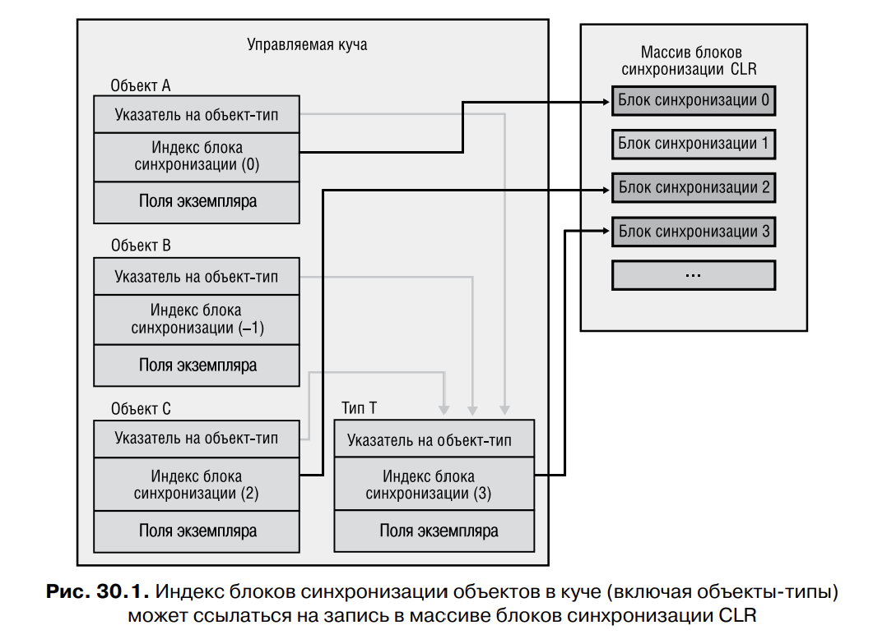
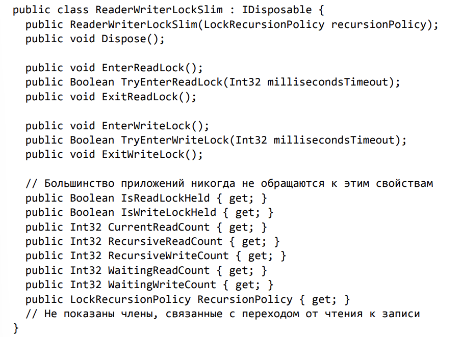

# ����� 30. ��������� ����������� ������������� �������

���������� ����������� ����������������� � ������ ���� ���������� ���������� �������������
������������� �������.

��� ���������� ������������ ��������� ����������� ���� ����� ������� ������������������, ��� 
���������� ����������� ����������������� ������. 

� ��� ����������� ���������� ����������� ������ ����, ��� ��������� �������� ������������.

## ������� ��������� ����������

����� SimpleHybridLock (**������ 1**). 

���� AutoResetEvent ��������� ��� ��������������� ������� SimpleHybridLock, ��� ���� ������ 
���� �� ������������������. ����� � ����� ��������������� ��� ���� ��������� ����������� 
AutoResetEventSlim, ������� �� ������� ���� AutoResetEvent �� ������������� ����������� ��
������� �������, ������������ ���������� �������� ����� �� ������������.

����������� ���� AutoResetEvent ����� Dispose ����� ���� �� ������������������.

**���������� ������ Enter � Leave**

������ ��������� **����� Enter** ����� ������� ������ 1 ���������� waiters, ������, ��� ������
�������, ��������� ����� �� ������ ������������ �� ����, ������� ����� ������ ������ Enter ��
���������� ����������. ����� ����� ��, ��� ����� ����� ������ �����������.

���� ������ �������� ������ ����� � ������� Enter, �� �������� waiters ��� �� ���� � ���������
����������� ��� ��������� ������, ������� �� ����������� ������� ����� WaitOne, ������������
���� AutoResetEvent. ����� WaitOne �������� ����� ������� � ���� Windows, � ������ ��� ���������
�������� � ������������� �������� ������������������.

������ ���� ����� � ����� ������ ������ ���������� ������, ������� ��� ����, ��� ������ ���������
������� ������ ��������� ������, �� �������� ������� ���������. � ����� ����� ����������� � 
��������� ������� ����������� ������������ ����� ��-�� ������������.

������ �������� � **������ Leave**. ��� ����� ������� �������������� ������� ������ 
Interlocked.Decrement, ����������� �� ���� waiters �������. ��������� ����� ���� ���� ��������
���������� ��������������� ������� ������ ������ ������ Enter, ������� �����, ������� ������
����� Leave, ����� ������ ������� ����������.

���� �� �������������� �������� �� ������� �������� ���� waiters, ������ ���� ������� �����������
� ���, �� ������� ���� ���� ���� ��������������� ����� � ����. �����, ��������� Leave, ������
��������� ���� (� ������ ����) �� ��������������� �������. ��� ����� �� �������� �����
Set ������� AutoResetEvent. ������ �������� ����� � �������� ������������������, ��� ��� ������
���������� ��������� �������� � ���� � �������.

### ����������

����� Leave ����� ������� ����� ����� � ����� ������ �������, ������ ��� ����� Enter ��
��������� ���������� � ���, ������ ������ ������� ������� ����������. ����� �������� ��� ����� 
����, �� ��� ��������� ������������������ ������� Enter � Leave.

������ ������������ ����� ����������������� ������������ � ��������� ������������ ��� ���.
� ����������� ��������� ���� �� ����� �������� �� �������, �� ��������; ��� ����� ������
������ ��������.

## ������������, �������� ������� � ��������

�� ������� � ����� ���� ������ �� ��������������, � ������ �������� ���������� �� ����� 
�������� �����, ����� ������������������ ����� ��������, �������� ����� ����� ���������
� ����� ���� �� ��������� ����� ����������� � ���������������� ������. ���� � ��� �����
������������, �������� ������� ����� ������ ���������, �������� � ����� ���� �� �����������.

����� ����, ��������� �������� ������������ �������� �����������, � ������������ � ������� 
�������� ����� �� ���������� ����� ������ �����, ��������� ����������. ������ ��������
������������ ��������� ����������� ������ ������� �������. ������ ����� ��������� 
������������� ������ Mutex (��� �������� ������� Mutex ����� �� �������������, ������ ��� ���
����� ������� ��������� � ����. �� ���� �������� ��������� ������� Mutex ��������
������ �������� ������ � ����).

� ������� ������������� ������ ����� ����������� ��������� ������������, �������������� 
������������ ������������, �������� ������� � �������� (**������ 2**)

������ ������ ������������ ������������������ �� ��������� ������������.


����� ��������, ��� ���������� AnotherHybridLock �������� � ��� ���� ������ �������, ��� 
SimpleHybridLock. ��� ����������� ������������� ������� � ��������� ������, �����������
��� ���������� ��������� ������� � ���������. ��� ������, �� ������������������ ������������
����������� ����� ������, ����������� � ��� ������������.

## ��������� ����������� � FCL

� ��������� ��������� ������������ ������������� ����������� ����� ������� ��������� 
� ������������ ������ ���� ����� �� ����������. � ����������, ���� ����������� ��� � �� 
���������, ���������� �� ���������� ������������ � �������� ������������������ � 
�������������� �������� ������ ��� �������.

### ������ ManualResetEventSlim � SemaphoreSlim

��� ������������� ����� �����, ��� �� ������� ������ ����, ��������� ������ �������������
� ���������������� ������, � ��� �� ���, ��� ��� �� ������� ����������� ������ ����
�� ������������� �����������. �� ������ Wait ��������� �������� ���������� � �������
�������� � ������� CancellationToken. ��� ��� �������� ������ ������:

```
public class ManualResetEventSlim : IDisposable {
	public ManualResetEventSlim(Boolean initialState, Int32 spinCount);
	public void Dispose();
	public void Reset();
	public void Set();
	public Boolean Wait(Int32 millisecondsTimeout, CancellationToken cancellationToken);
	public Boolean IsSet { get; }
	public Int32 SpinCount { get; }
	public WaitHandle WaitHandle { get; }
}
```

```
public class SemaphoreSlim : IDisposable {
	public SemaphoreSlim(Int32 initialCount, Int32 maxCount);
	public void Dispose();
	public Int32 Release(Int32 releaseCount);
	public Boolean Wait(
	Int32 millisecondsTimeout, CancellationToken cancellationToken);
	// ����������� ����� ��� ������������� � async � await (��. ����� 28)
	public Task<Boolean> WaitAsync(Int32 millisecondsTimeout, CancellationToken cancellationToken); 
	public Int32 CurrentCount { get; }
	public WaitHandle AvailableWaitHandle { get; }
}
```

### ����� Monitor � ����� �������������

���� ����� ������������ ����������������� ������������ � �������������, ��������� �������
� ���������. 

��� ������������ ���� ���������, ������ ��� �������� ����� �� ����� ������, ��� �� ���������
���� �������� �����, � ��� �� ��������� ����� �������� JIT-����������, � CLR ���������� 
�� �� ����� ����������. 

������ �������� � ��� ��������.

� ������ �������� � ���� ����� ���� ������� ��������� ������, ���������� **������ 
������������� (sync block)**. ���� ���� �������� ����, ������� �� ���� ����� �������������� 
� ���� ����� ������ AnotherHybridLock. ������, ���� ���� ��� ������� ����, �������������� 
������-���������, �������� �������� � �������� ��������� �������. ����� Monitor ��������
�����������, � ��� ������ ��������� ������ �� ����� ������� ����. ���������� ������
��� ������ ������������ � ����� ������������� ��������� �������

```
public static class Monitor {
	public static void Enter(Object obj);
	public static void Exit(Object obj);
	// ����� ����� ������� ����� ������������ (��������� �����):
	public static Boolean TryEnter(Object obj, Int32 millisecondsTimeout);
	// �������� lockTaken ����� ���������� �������
	public static void Enter(Object obj, ref Boolean lockTaken);
	public static void TryEnter(Object obj, Int32 millisecondsTimeout, ref Boolean lockTaken);
}
```

�������� ������ ������������� � ������� ������� � ���� �������� ���������� ��������������, 
��������� ����������� �������� ������� �� ���������� ���� ������. ������������ CLR ���������
����� ����������� ������� ���������� ��������� ����������������.

�� ����� ������������� CLR ���������� ������ ������ �������������. ��� �������� ������� � ����
� ��� ����������� ��� �������������� ��������� ����. 

**������ ����** - ��������� �� �������-��� - �������� ����� ����� ������� � ������. 

**������ ����** �������� ������ ����� ������������� (sync block index), �� ���� ������ � �������
����� ������.

� ������ ��������������� ������� ����� ������� ������������� �������� �1, 
��� �������� ���������� ������ �� ���� �������������. ����� ��� ������ ������ 
Monitor.Enter CLR ������������ � ������� ��������� ���� ������������� � ����������� 
������ �� ���� �������. �� ���� �������� ������� � ����� ������������� 
���������� ��� ����. ����� Exit ��������� ������� �������, ��������� ����� 
�������������. ���� ����� ������� �� ��������������, ����� ���������� ������� 
�������� �1, ����������, ��� ����� ������������� �������� � ����� ���� ������� 
� ������-������ ������� ���������



������� 30.1 ������������� ����� ����� ��������� ����, �� ��������� ������ 
������������� � ���������� ������� ������ ������������� � CLR. ��������� �� 
������-��� �������� A, B � C ��������� �� ��� T. ��� ������� � �������������� 
���� ���� �������� � ������ � ���� �� ����.

��� ����������� � ����� 4, ������-��� ����� ��������� � ���� � ������� ���� ���������
�������� �������� ����� ���������� ������: �������� ����� ������������� � ���������� 
�� ������-���. �� ���� ���� ������������� ����� ������� � ��������-�����, � ������ �� ����
������� ����� �������� ������� ������ Monitor. ������, ������ ������ �������������
��� ������������� ����� ��������� ���������� ������, ������� �� ����� ������������, ��� ��� 
������������� ������������� ���������� �������� ������ �� ������.

��� �� **������� 3** ������������� �������������� �������� ������� ������������� ������
Monitor.

�� ������ ������ ��� �������� ���������� ������, �� ��� �� ���. �������� � ���, ��� ������
����� ������������� ������� ������� ������ ��������� � �������� �������. � ��� ��� ��� 
�����������:

```
public static void SomeMethod() {
	var t = new Transaction();

	Monitor.Enter(t); // ���� ����� �������� �������� ���������� �������

	// ���������� ����� ���� ������� ����� LastTransaction
	// ����������. ����� ���� ������������ �� ������
	// ������� SomeMethod ������ Monitor.Exit!
	ThreadPool.QueueUserWorkItem(o => Console.WriteLine(t.LastTransaction));

	// ����� ����������� �����-�� ���...
	Monitor.Exit(t);
}
```

� ���� ���� �����, ����������� ����� SomeMethod, �������� ����� Monitor.Enter, ������� ��������
���������� ������� Transaction. ����� ����� ���� ����������� �������� LastTransaction, ��� 
�������� ����� �������� Monitor.Enter, ����� �������� ������ �� �� �� ����� ������������.
� ���������� ����� ���� ����������� ���������������, ���� �����, ����������� �����
SomeMethod, �� ������� ����� Monitor.Exit. ��� ������ ��������� ����� ����������, ��� �����
���� ������������ ������ �������� LastTransaction, �� ������, ����� ��� ����� ������������, 
����� ������. ��� ����� ����� ������, ����� ������ ��� ������ � ��������� ����������. �� ���� 
���� �� ��� �������, ������ ����� ���������, ��� ���� ��� �������� ����������� ��� 
��������������, � ������, �� �� ������� ��������� ��������.

������ ������� ������ ���������� ������������ ������ �������� ������������ (**������ 4**)

���� �� ����� ������ Transaction ���� ������������, ��� �� ������������ � ���������
������� ���������� ���� �� ������� ����������� ���� m_lock.

����� Monitor �� ������ ���� ���������� ��� �����������; ��� ������� �����������, ��� � ���
������ �����������, � ���� ������, ������������ �������� ����������� � ����� ������������
�������. ����� ���������� ������ Monitor ��� ������������ ������� ��� �������������� 
�������:

1. ���� ��� �������-������������� �������� ����������� �� System.MarshalByRefObject, �� 
����� ������ ����� ��������� ����������. ��� �������� ������� ������ Monitor ������ �� ����� 
������������� ����������� �������������, � �� �������������� �� ������.

2. ���� ����� �������� ����� Monitor.Enter � �������� � ���� ������ �� ������-���, ����������� 
���������� �� ��������� � ������, ����� ��������� ���� ��� �� ���� ������� ��������. 
��� ��������� ����������� CLR, ���������� ������������� ��������������� 
�������. ��������� �� ��� ������ ������������������ ������, ������� ����� 
���� �� ����������. ������������� ������ ����������� ������� �� ���������� 
������ �� ������-��� � ������ ������ Monitor.

3. ��� ��� ������ ��������� ��������������, ��� 
������ ��������� ���� ����� �������� ��������� �� ���� � ��� �� ������ String
� ������. ��� �������� ������ �� ���� ������ � ������ ���� Monitor ���������� 
���� ���� ���������� ���� ����� ��������������� ������������������.

4. ��� �������� ������ ����� ������� ������ CLR �� ������� �� �����; ������ �� 
������ ������ ���������� � ������ �����. ��� �������� ������������������, 
� � ������ ��� ������ ���� � �������, ��� ��� ������� ���� String ���������. 
�� � ����, ��� � � ������ ������� ���������, ������ ������ ����� �������������, ������� 
����� ����������. ����� �������, ������ � ��������� ������� 
�������� ������������������ ���� � ������. ��� ��� ���� ����������� CLR, 
��������� � ������������� ���������������� �������. ������� ������������� 
������������� ������� �� ���������� ������ �� ������� ���� String ������� 
������ Monitor

5. ��� ��� ������ ������ Monitor ��������� ��������� ���� Object, �������� 
�� ��������� ���� �������� � ��� ��������. � ���������� ����� ��������� 
����������� ������. ��� ������ ������ ������ Monitor.Enter ����������� 
������ ������, � ������������� ������� ������ �����������.

6. ���������� � ������ �������� [MethodImpl(MethodImplOptions.Synchronized)] ���������� 
JIT-���������� �������� �������� ��� ������ �������� Monitor.Enter � Monitor.Exit. ���� ����� 
�������� ������������, ���� ������� ���������� this, ��� �������� � ������������ ������ 
�������� ����������. � ������ ������������ ������ ���� ���� ������� ���������� ������ �� ������-���, 
��� �������� � ������������� ���������� ������������ �� ��������� 
� ������ ����. ������� ������������ ������ ������� �� �������������.

7. ��� ������ ������������ ����� CLR ��������� ��� 
���� ������-���, ����������, ��� ����� ���� ����� ������ ������� � ������������� ������� 
������� � ��� ����������� �����. � ����� �������� ����� ���� 
���������� �� ��������� � ������ ������� ��������. � �������, ���� ��� 
������������ ���� ������ � ����������� ����, ��� ������ ����������� ��� 
������������� ����� �������� � ��������. � ������ ������ ������������� �� 
����������� �������� ������������� ���� ��� ���� �� ������ �� ��� ����� 
����� ��������� � ��������.


� C# �������� ���������� ��������� � ���� ��������� ����� lock. 

```
private void SomeMethod()
{
	lock(this)
	{

	}
}
```

����������� �������� ������������ ����������:

```
private void SomeMethod()
{
	Boolean lockTaken = false;
	try
	{
		Monitor.Enter(this, ref lockTaken);
	}
	finally
	{
		if(lockTaken) Monitor.Exit(this);
	}
}
```

�� � ���� ���� ��� �������:

1. ������������� C# ������� �������, ��� ����� Monitor.Exit ����� �������� � ����� finally. ��� �������,
��� ��� ����������� ������ ����������� ��� ����������� �� ������������� � ����� try.

**������ ������ �������� � ���� ���.**

���� � ����� try � �������� ��������� ��������� ��������� ����������, ��������� �������� ������������.
� ������ ���������� � ����� finally �������� � ����, ��� � ������������ ���������� ������ �������� 
������ �����. ����� ��������� ���������� ���������, ��� �������� ��� �������� � ������������ �������
� �������������� �������. ��������� JIT-����������� �� ������������ ����������� ��� �������, � ������� 
������� ����� try, ��� ��� ������ ������� ������������������.

� ����� �� �������� ����� ��������� ���, � ���� �� ���������� ������ ������� � ������������� ���������.

2. ������ �������� � ���������� lockTaken � ��������, ������� �������� ������ ��� ����������.

��������, ����� ����� � ���� try � ��� ������� �� ������ ������ Monitor.Enter. ����� ����� 
���������� ���� finally, �� ��� ��� �� ������ ������� ����������. � ���� ��� ������� ���������� lockTaken.
�� ������������� ��������� �������� false, ����������, ��� ���������� ��� �� �����������. ���� ���������
����� Monitor.Enter ������� �������� ����������, ���������� lockTaken ������������� �������� true. 

���� finally �� �������� ���� ���������� ����������, ����� �� �������� ����� Monitor.Exit. ������, 
��������� SpinLock ����� ������������ ������� � ���������� lockTaken.


### ����� ReaderWriterLockSlim

����� ������ ������ ������ ����� ������. ���� ����� ������ �������� ����������������� ����������� 
(��������, SimpleSpinLock, SimpleWaitLock, SimpleHybridLock, AnotherHybridLock, Mutex ��� Monitor), 
�� ��� ������� �������������� ������� ���������� ������� ������ ��������� ������ ���� �� ���, 
� ��������� �����������, ��� ����������� �������� ���������������� � ������� 
������������������ ������ ����������.

�������, � ������ ������� � ������ ������ ��� ������ ������������� � ���������� ��������, � 
������ �������� ������������� ������ � ������. � ��� ������, ������� ����� ������ � ������ 
���������, ��������� ����������� ������. ����������� ReaderWriterLockSlim
�������� ������, ����������� ������ ������ ��������. ���������� �������� 
�������������� ��������� �������:

1. ���� ���� ����� ������������ ������ ������, ��� ��������� ������, ��������� �������, �����������

2. ���� ���� ����� ������ ������, ��� ��������� ������, ��������� �������, ���������� ������, 
����������� ������ ������, ��������� ������� �� ������

3. ����� ���������� ������ ������, ��������������� ������ ������, �������������� ���� 
���� �����, ��������� ������ �� ������, ���� ��� ������, ��������� ������ �� ������. 
��� ���������� ��������������� ������� ���������� 
�������� ��������� ����� ������ ��� ������, �������� ��� �����������.

4. ����� ���������� ���� �������, �������������� ������ ������, �������������� 
�����, ��������� ���������� �� ������. ��� ���������� ��������������� 
������� ���������� ������� ��������� ����� ������ ��� ������, �������� 
��� �����������.

**��� ��� �������� ������ �����:**



**��������� ��� ������������� ���������� ������ �����������:**

```
internal sealed class Transaction : IDisposable {
	private readonly ReaderWriterLockSlim m_lock = new ReaderWriterLockSlim(LockRecursionPolicy.NoRecursion);
	
	private DateTime m_timeOfLastTrans;
	
	public void PerformTransaction() 
	{
		m_lock.EnterWriteLock();
		// ���� ��� ����� ����������� ������ � ������...
		m_timeOfLastTrans = DateTime.Now;
		m_lock.ExitWriteLock();
	}
	
	public DateTime LastTransaction {
		get 
		{
			m_lock.EnterReadLock();
			// ���� ��� ����� ���������� ������ � ������...
			DateTime temp = m_timeOfLastTrans;
			m_lock.ExitReadLock();
			return temp;
		}
	}

	public void Dispose() { m_lock.Dispose(); }
}
```

� ���� ����������� ������ ��� ���������, ������������� ���������� ����������.

1. ������������ ReaderWriterLockSlim ����� �������� ���� LockRecurionsPolicy, ������������ 
��������� �������: ```public enum LockRecursionPolicy { NoRecursion, SupportsRecursion }```

���� SupportsRecursion �������� ��� ������������ ���������� �������� ������� � ����������� ����������.
��� ��� ����������� � ���� �����, ��� ������ ��������� ������ �� ������������������ ������������, ��� ��� 
� ���������� ������ ���������� ������������ ���� LockRecursionPolicy.NoRecursion.

��������� ������� �������� ������� � �������� 
��� ������������ �� ������-������ �������� ������ ������� �������������, ���� 
��� ������������ ����� ����������� ��� ����������� ������, ������������ 
������� ������, � ������������ ��� ������� �� ��� ��������� ������� ��������. 
**�� ����� ���� ��� ���������� ���� ���� ����������� � ���������� � ��������� 
������� ������ ����������� ReaderWriterLockSlim ��������� ���������� ����������������� 
������������ � �������������!**

����� ReaderWriterLockSlim �������� �������������� ������, ����������� �������� ������ ������������ � 
����� ������������ � ��������. � ������ ������ ������� ����� ����, ��� � �������� ������ �������
������� ����� ���������� ������������� �� ��������������. ��������� ������� ��������� ������� ������������������
������������.

### ����������

� FCL ����� ������������ ����������� ReaderWriterLock. ������ ����������� �������� ������ ��������
���� � ���������� ����������� �������. ��� �� ��������� ���������� �� �������� ������� � ������������ 
���������, ��� ������� ����������� ������������. ������ ������ ����� � ���� ����������� ��������� �����
�������� ������, ��� ����� �������� � ��������� ���� "����� � �����������".

### ����� OneManyLock

������ ������ ����������� ����������� ������-������, ���������� �������, ��� ���������� � FCL 
����� ReaderWriterLockSlim. ��� ����������� ���������� OneManyLock, ��� ��� ��� ������������� 
������ � ������ �������� ������, ���� ���������� ��������.  

������ ����� �������� �������� ��������� �������:

```
public sealed class OneManyLock : IDisposable {
	
	public OneManyLock();
	public void Dispose();

	public void Enter(Boolean exclusive);
	public void Leave();
}
```

**��� ��� ��������?**

����� �������� ���� ���� Int32, ��������������� ��� �������� ��������� ������������, 
������ Semaphore, ����������� �������� ������, � ������ AutoResetEvent, ����������� ������� ������. ���� 
������ ��������� �������� � ���� ���� ��������� �����.

1. ������ ���� ������������ ��������� ����������. 
0 �������� Free (��������), 

1 � OwnedByWriter (������ ������������ �������), 

2 � OwnedByReaders (������ ��������� ��������), 

3 � OwnedByReadersAndWriterPending (������ ������������ � ��������� ��������) 

4 � ReservedForWriter (��������������� ��� ������������� ������). ������ �������� �� ������������

2. �������� ����� (����� �� 0 �� 1048575) ������������ ���������� ������� ������ (RR), ���������� 
��� ����������.

3. �������� ����� ������������ ���������� ������� ������ (RW), ��������� 
��������� ����������. ��� ������ ���������� ������ AutoResetEvent.

4. �������� ����� ������������ ���������� ������� ������ (WW), ��������� 
��������� ����������. ��� ������ ���������� ������ Semaphore.

��� ���������� � ������������ ���������������� � ����� ���� ���� Int64, ����� ��������� ���� ����� ��� 
������ ������� ������ Interlocked. � ���������� ������������ ����������� ����� ������ � �������� � ������������
������ ������ ��� ����������� �������.

**��� ��� ���������� ��� ����� ������ � ��� ������������ ����������� �������:**

1.  ���� ������������ ��������, ����������� ��������� �������� OwnedByReaders, ��������� RR = 1,
���������� ����������

2. ���� ��������� ������������ ����� �������� OwnedByReaders (������ ������� 
������), ��������� RR++, ���������� ����������.

3.  � ��������� ������ ��������� RW++, ��������� ����� ������. ����� ����� 
���������, �������� ���� � ������ ������ �������

**��� ��� ���������� ��� ������ ������ �� ���� ���������� ����������� �������:**

1. ��������� RR--

2. ���� RR > 0, ���������� ����������

3. ���� WW > 0, ����������� ��������� �������� ReservedForWriter (��������������� ��� ������ ������), 
��������� WW--, ����������� ���� ��������������� ����� ������, ���������� ����������.

4. ���� RW = 0 � WW = 0, ����������� ��������� �������� Free (��������), ���������� ����������.

**��� ��� ���������� ��� ����� ������ � ��� ���������� � ����������� ��������:**

1.  ���� ������������ ��������, ����������� ��������� �������� OwnedByWriter (������ ������� ������), 
���������� ����������

2. ���� ��������� ���������� ����� ReservedForWriter (��������������� ��� 
������ ������), ����������� ��������� �������� OwnedByWriter (������ ������� ������), 
���������� ����������.

3. ���� ��������� ���������� ����� OwnedByWriter (������ ������� ������), 
��������� WW++, ��������� ����� ������. ����� ����� ���������, �������� 
���� � ������ ������ �������.

4. � ��������� ������ ����������� ��������� �������� OwnedByReadersAndWriterPending 
(�������� ������� ������ � ������), ��������� WW++, ��������� ����� ������. ����� ����� 
���������, �������� ���� � ������ ������ �������

**��� ��� ���������� ��� ������ ���������� ������ � ����������� ��������:**

1. ���� WW = 0 � RW = 0, ����������� ��������� �������� Free (��������), ���������� ����������

2. ���� WW > 0, ����������� ��������� �������� ReservedForWriter (��������������� ��� ������ ������), 
��������� WW--, ����������� ���� ��������������� ����� ������, ���������� ����������

3. ���� WW = 0 � RW > 0, ����������� ��������� �������� Free (��������), ��������� RW = 0, 
���������� ��� ��������������� ������ ������, ���������� ����������

�������� � ��� ���� ��� ������: ���� ������������, ������ ��������.

������ �������� ����� ������� ��������, � ����� ������ ���� ���. ����� ������ �������� ������ � �������� 
Free, �� ����� ������ �� ���� �� ������, ��������� �� ��� ������ �������� � ��������� ����������.
��� ����������� ������������ ����� ����������� � ������ ���������.

��� ����� ��� ���������� � �������� ����������� � ����������� �������, ��������� � �������
"������������� Interlocked-�������" ����� 29. ������ ������� ���������� ����� �������� � ���������� � 
��������� ������� � ���������. ������ ��� ������������ ������� ������������.

**������� ������������������ OneManyLock � ������� ReaderWriterLockSlim � ReaderWriterLock:**

```
���������� x � OneManyLock: 330 � ����������� ������.
���������� x � ReaderWriterLockSlim: 554 � �������� � 1,7 ���� ���������.
���������� x � ReaderWriterLock: 984 � �������� � 3 ���� ���������
```

�����������, ������������������ ������������ �� ������-������ ������� ���� ��-�� ����, ��� ������ 
����� ����� ���������, ��� �� ����������������� ������������. �� ����� ������� ����� � � ���, ��� 
������������ �� ������-������ ��������� ������������� ���������� ���������� �������� �������.

### ����� CountdownEvent

System.Threading.CountdownEvent ��������� �� ������ ������� ManualResetEventSlim � ��������� ����� �� 
���������� ���������� ��������� �������� 0. ��������� ���� ����������� ������������ �������������� 
��������� �������� (������������ ������, ���� �������� �������� ����� 0).

��� ��� �������� ������ �����:

```
public class CountdownEvent : IDisposable {

	public CountdownEvent(Int32 initialCount);
	public void Dispose();
	public void Reset(Int32 count); // ����������� CurrentCount
								    // �������� count

	public void AddCount(Int32 signalCount); // ���������� CurrentCount
											 // �� signalCount
	public Boolean TryAddCount(Int32 signalCount); // ���������� CurrentCount
												   // �� signalCount

	public Boolean Signal(Int32 signalCount); // ���������� CurrentCount
											  // �� signameCount
	
	public Boolean Wait(Int32 millisecondsTimeout, CancellationToken cancellationToken);

	public Int32 CurrentCount { get; }
	public Boolean IsSet { get; } // true, ���� CurrentCount ����� 0
	
	public WaitHandle WaitHandle { get; }
}
```

����������� ���������� CurrentCount ������ CountdownEvent ������� �������� ��� �� ����� ���� ��������.
���� �������� CurrentCount ����� 0, ����� AddCount ���������� ���������� InvalidOperationException, � ����� 
TryAddCount ������ ���������� �������� false.

### ����� Barrier

System.Threading.Barrier ���� ������� ��� ������� ���������� ����� ����������� ��������.

��� ��������� �������� ���������� ������������� �������, ����������� ������������� ����������� ���
���� ��� ���������.

**� �������,** ����� CLR ����������� ��������� ������ �������� ������, ��� �������� ������� ���� �����
���������� ��� ������� ����. ��� ������ �������� ����� ��������� ����� ����������, ������������ �������
������� � ����. �������� ���� ������ ������, ����� ������ ������������ � ��������� ���������� ������ 
���������. ����� ��� ������ ������� �������, ��� ������ ������������ ���������� � ������ ��������� ������
����. �����, ����������� ������� ����, ������� �������������, ����� �� �������� ���������� ���������
�������. ����� ��� ������ ������������ ������� ����� ���� ������� ����������, ���������� ������ ������
�� ����� �������������� ������ ��������. � ������ ����� ��������� ���� ������� ������������ ��������
������ ��������� ���������� � ���������� ����������� ������������ ����� ����������.

������ �������� ����� ����������� ��� ������ ������ Barrier, ������� �������� ��������� �������:

```
public class Barrier : IDisposable {
	public Barrier(Int32 participantCount, Action<Barrier> postPhaseAction);
	public void Dispose();
	public Int64 AddParticipants(Int32 participantCount); // ����������
														  // ����������

	public void RemoveParticipants(Int32 participantCount); // ��������
															// ����������
	
	public Boolean SignalAndWait(Int32 millisecondsTimeout, CancellationToken cancellationToken);
	
	public Int64 CurrentPhaseNumber { get; } // ���������� ���� ��������
											 // (������� � 0)
	
	public Int32 ParticipantCount { get; } // ���������� ����������
	
	public Int32 ParticipantsRemaining { get; } // ����� �������, �����������
												// ��� ������ SignalAndWait
}
```

��� ��������������� ������ Barrier ����������� ���������� �������, ������� ����� ��������� ������� � ������. 
����� ����� �������� ������������ �������� Action<Barrier>, ������������ �� ���, ������� ����� ������
����� ���������� ����� ��������� ��������� ����. ����������� ��������� ������ � ������ Barrier � �������
�� ������ ����� ��� ������ ������� AddParticipant � RemoveParticipant, �� �� �������� ��� �������� 
������ �����. ����������� ��� ����� ������ ����� ������ ������� ����� SignalAndWait, ������� �������� 
����� Barrier ������������� ������ ����� (� ������� ����������� ManualResetEventSlim). ����� ������
������ SignalAndWait ����� ����������� ������ Barrier �������� �������� (� ������� ����������
������������� � ������ SignalAndWait ������) � ������� ���������� �� ���� �������, ����� �� ����������� 
������� � ��������� ����.

### ������ �� ��������� ������������

**������ ����������� �������� ����, ������������ ������.**

�������� ���������� ���������� ��� �������� IO, ����������� ������ �� ������ ������ � ������� ���, �����
��������� ������������� ������� ������� � ������ �� ������� ���������� �������. ���� ��� ����������,
����������� ������ ������� Volatile � Interlocked, ��� ��� ��� �������� ������ � �� ��������� ������. 

� ���������, ��� �������� ������ ��� ������ � �������� ������. �������, ���� � ��������� ������ �� ������
��������� ���������� ������� ��������, ��������� � ���������� �����.

**��� �������� �������, �� ������� ���������� ����������� ������:**

1. **��������� ������ ����������������**. �������� �����, �� ��������� ��������� � �������������������, 
�� ��������� ����������� ������ ��� ���������������, �� �������� � ������� ��������� ������. 
����������� ������� C# ������������� ���������� ������ ���������������� ��� ������������� 
������������ �������

2. **����� ����� ������������ ����������.** ��������� ������ ������������ ��� 
������� ���������� �����. ������ ������ ������ ���� � �������� ����� 
����������. ��� ���������� �� ���� ��� ������ ������ ����������, � ������� 
����������. ������ �������� �������� ����� ��� ������ ������������ ���������� ����������. 
Windows �������, ����� ����������� ������ � ���������� 
���������� ����������� ������ ���������� �� �����. ������� ������������ 
���������� ������ ���, ����������� GUI-����� �� ���������� �����-�� ������ ��������. 
� ������ ����� ����� ������ ����� ��������� ���� � �������� ����������. ����������, ����������
GUI-������ ����������� ���������� � ������ ������ ������������.

����� �������� ���������� �������, �� ����� �������� ��������� �� � ����������� ����������. 
**� �������,** �� ����� ��������� �����, ����������� ����������, �����, ����������� ����������, �����,
�������������� ������������ ���������� ������� � ��. ������ ��� �������� ������ ����������, ��� ����� 
�� ���� ��������� ������ ��������. ������ ������ �������� ������� ������ ��������, ����� ������������ ��
������ ����� ���������. ����������� ��� ��� ������ ������� �� �������� ������ �������. ����� �� ���� ����� 
������ � �������� ����������, ����� ������� � �������� ����������, ����� �������� ���������� ����������
�������� � ��.

���� �� ������ ����������� ������, ��� ������������� ������� �� ������ ������� ��� ��������� �����������
����������� ������ ����. ��� ���������� ���������� ���������� ����� ����� �������� ��� ����������� �����
Monitor � �������� �����. � �������� ������������ ����� ���������� � ������������ �� ������-������. �
����� ������ ��� ������������ �������� ��������� ������ Monitor, �� ��� ��������� ������������ �����������
���������� ������� ������, ��� �������� ����� ������������������ � ������������ ����������� ���������� 
�������.

����� ���������� �������� ����������� ���������� (�������� ���������� ������-������), ��� ��� ��� 
�������� ������� ������������������. �������, ����� Monitor, �������� �� ���� �������������, ����������
������� ������������������. 

����� ����, ���������� �� ������� ���������� � ���� finally, ��� ��� ���� 
� ����� ��������� ���������� � ����� �� ��� ��������� ����������� ������������������. ����� ����, ������
���������� ��� ��������� ��������� �������� � ��������, ����� ������ ������� ���������� �������� �
������������� �������, ��-�� ���� ��������� ������ ���������� ���������� ��������������� � ��������� 
����� � ������� ������������.

�, ����������, ���� ��� ��� ���-���� ���������� ����������, �� �� ������ 
���������� �� ������� �����, ��� ��� � ���������� ���������� ����������� ������������ �������. 
����� ����� �������� ������� ������ � �������� ���������, ����������� �������� ����������� ����������� ����������.

�� �, �������, ��� �������������� �������� ����� ������������ ������� (� ������� �� �������� � ����� 27), 
����� �������� ��� �������������� ����������� 
�������������. � ���������, ��� ��������, ��� � ������ �������� ����� ������� 
���� ��� ��������� ������ �������, ������� �������� ����������� ���������� 
���� ������� ��� ���������� ����� ��������. ��� ������� �����, ��� ����������� 
�����, ������ ���������� ��������. ��� �������� �����-������ ������� �������� 
��������� ������ XxxAsync, ������� ���������� ��� ��� ���������� ���������� 
����� ���������� �������� �����-������ (������ �������, ����������� �� ���������� ��������).


## ���������� � ������� ���������

� ���� ���������, ���� ����� �������� �������� ��������������� ������� �� ��� ���, ���� �� �� �����������
���������� - ������ ��� �������� ���������� �������������� (lazy initialization). ��� ������� ������
������� �� ���������, ��� �������� ����� � ������.

�������� ����� ���������� ��� ������������� ������� ������� ����������� ��������. ����� � ���������� � ���
�������� ����� ���� ������, ����������� ���������� ���������� ������� ������������� �������.

�������� ������ ������ � ������� � ����������� ����� CLR ��������� ������������ ������������ � �������
���������.

���, ��������������� ���������� ������ ������� ����������� � **������� 5**.

������� ���������� � ������� ��������� ������� � ���, ��� ��� ������ ������ GetSingleton ������
����������� ���� value, ����� ��������, ������ �� ������. 

���� �����, ��������� GetSingleton, �� ������������ �������, �� ��������� � ������������ � ������
������������� �������, ����������, ��� ��������� ������� ����� ���������� ������ ���� �����. �� ���� 
�������� ������������������ ����������� ������ ����� ������� ������� � ��������������� �������.

**������ ���� ������� �� �������� � Java?**

� ������ ������ GetSingleton ����������� ������ Java ��������� �������� value � ������� ���������� � ��� 
���������� ������ ����������� if (��� �� ��������������, ��� value, ��� ��� null, �� ��� ��� �� �������
������ �����) �������������� �������� � ����� ��������. � ����� ����������� ������ 
�������� ������ �������� �������� true, � ��� ��������, ��� � �������� ������� Singleton ����������
������� ��� ������. 

� CLR ����� ������ ������ ������������ �������� ��������� ��������������� ������� �� ������ � ������:
��� ������ � ���������� ������ ����������� �� ����� �������, � ����� ������ ���������� ����� �������� ������
����� �������. ��� ������ GetSingleton ��� ��������, ��� ��������� ������ ���� value ������ ����
����������� ����� ������ ������ Monitor.Enter.

**� �������� ������ ������ �������� ���� ������ ��������� � ��������.**

������ ������ GetSingleton ���������� ����� Volatile.Write. �����������, ��� ������ ���������� if 
�������� ��������� ������ ����:

```value = new Singleton();```

����� �������, ��� ���������� ������� ���, ���������� ������ ��� ������ Singleton, ������� �����������
��� ������������� ����� ������� ������� � �������� ������ �� ���� ���� value, ����� ��� �������� 
������� ������ ������ - ��� ���������� **�����������**.

������ ���������� ����� �������� ������ ��� ������ Singleton, ��������� ������ ���������� value (��������
����������) � ������ ����� ����� �������� �����������. 

���� � ��������� ��������� ����� ���� �����, �������� ��������� ����������� �������� �� ����� ��������.
�� ��� ����������, ���� ����� ���������� ������ � ���� value, �� �� ������ ������������ ������ �����
������� ����� GetSingleton? ���� ����� ���������, ��� �������� ���� value ������� �� null � ������ 
������������ �������� Singleton, ���� ��� ����������� ��� �� �������� ������! �������� ������ ������
������ ���������, �������� ��-�� ����, ��� ����� �� ��������� ��������.

**��� �������� ������ ����� ������ Interlocked.Exchange**. �� �����������, ��� ������ �� ���������� temp
����� ������������ � ���� value ������ ����� ����, ��� ����������� �������� ���� ������. ��������������
�������� ������� �������� �������� **������� ���� value �������� ������ volatile**. ������ � �����
����������� (������������) ���� value �������� ������ ����� ���������� ������������. � ���������, �� �� 
����� ��������� �� ���� ���������� ������ ������������ ����, � ��� ��� ������� ������������� � ���� ���, 
���� �� ����� ���� �� �������� ������������������ ��� ������ ����������� � ���������� �����.

� ����� ������ �������, ������������ ���������� ���������� � ������� ��������� ������� ����, ��� ���������
��. � ����������� ������� ��� ������ ������� ������������������. 

��� ������� ����� ������� ������ ������ Singleton � ����������� ���������� ������ ����������, �� ��� 
������������ � ������� ���������:

```
internal sealed class Singleton {
	private static Singleton s_value = new Singleton();
	
	// �������� ����������� �� ���� ���� ��� ������� ������
	// ��������� ����������
	private Singleton() 
	{
		// ��� ������������� ������� Singleton
	}

	// �������� ����������� �����, ������������ ������ Singleton
	// (� ��������� ���, ���� ��� �����)
	public static Singleton GetSingleton() { return s_value; }
}
```

��� ��� CLR ������������� �������� ����������� ��� ������ ������� �������� ������ � ����� ����� ������, ���
������ ������� ������ � ������ GetSingleton ������ Singleton ������������� ��������� ��������� �������. 
����� ����, ����� CLR ����������� ������������ � ��������� ������� ��� ������ ������������ ������.
����������� ������ ������� �������� ����� ������������ ���� ��� ������ ������� � ������ ����� ������. �� 
���� ���� � ���� Singleton ���������� ������ ����������� �����, ������ �� ������� ������� � ������ �� ���
�������� � ��������� ������� Singleton. ��������� ������������ ������� ������ �������� ��� ������
��������� �������.

**���������� ������ ������ �������� Singleton � ������� 6.**

� ���� ������� ����� ��������� ��� ������� � ������, �� Interlocked.Exchange ����������� ���������� � ����
value ������ ����� ������.

**� ����� ���� ���� ����� �����������:**

1. �� ����� ������ ��������

2. � ��� ������� �� ����������� ������. ���� ����� ����� �� ���� ����������� �� ������� Monitor
��� �� ����� ������ ����������� ������������� ������ ������ ����, ��� ��������� ��� ���� �����, ����� 
��������� ���������. ���������� � ���������������� �������������� ������, � ��� ���������� ��������
����������� � ������������� ������ ������. � ������� CompareExchange ������ ������� �� ����������. 
����������, ������ ������� ����� ������������ ������ ��� ���������� �������� �������� � ������������.

� FCL ���������� ��� ����, ����������� ��������� � ������ ������� ������� ����������������. ��� ��� ��������
���������� ����� System.Lazy:

```
public class Lazy<T> {
	public Lazy(Func<T> valueFactory, LazyThreadSafetyMode mode);

	public Boolean IsValueCreated { get; }

	public T Value { get; }
}
```

**������ ������ � ��� ������� � ������� 7**

��� �������������� ��������� ������ Lazy � ������� ��� ���� �� ������ LazyThreadSafetyMode. ��� ��� 
�������� � ��� �������� ������ �����:

```
public enum LazyThreadSafetyMode {
	None, // ������������ � ��������� ������� ��
		  // �������������� (������ ��� GUI-����������)
	ExecutionAndPublication, // ������������ ���������� � ������� ���������
	PublicationOnly, // ������������ ����� Interlocked.CompareExchange
}
```

� ��������� ��������� � ������������� �� ������ ����������� ������������� � �������� ���������� ������
Lazy. ������ ����� ����� ��������������� ������������ �������� ������ **System.Threading.LazyInitializer**.

��� ��� �� ��������:

```
public static class LazyInitializer {
	// ��� ��� ������ ���������� Interlocked.CompareExchange
	public static T EnsureInitialized<T>(ref T target) where T: class;
	public static T EnsureInitialized<T>(ref T target, Func<T> valueFactory) where T: class;

	// ��� ��� ������ �������� syncLock � ������ Enter � Exit ������ Monitor
	public static T EnsureInitialized<T>(ref T target, ref Boolean initialized, ref Object syncLock);
	public static T EnsureInitialized<T>(ref T target, ref Boolean initialized, ref Object syncLock, Func<T> valueFactory);
}
```

����������� ���� ������� ������ ������������� � ��������� syncLock ������ EnsureInitialized ���������
����� ����������� �������� ����� ��������� ����� � ������� �������������.

**������ ������������� ������ �� ������� ������ ����������� � ������� 8**

## ������� �������� ����������

�����������, ��� ����� ����� ��������� ��� ��� ���������� �������� �������. 
����� ������ ������������ ������������ ����� ������ � ������������� ��������� 
�������. ������, ��-������, ��� ������ ����� ������������� �������, ��-������, 
���������� �������� ��������� ��������� ����������, �������� � �������. � �������, 
���������� ������ ����������������, ����������� ������� ���������� 
���������������� ���� �������� �� ������ �������� �������. �� ���������� 
��������� �������� ���������� (condition variable pattern), � ��� ��� ���������� 
����� ��������������� ���������� �������� ������ Monitor:

```
public static class Monitor {
	public static Boolean Wait(Object obj);
	public static Boolean Wait(Object obj, Int32 millisecondsTimeout);

	public static void Pulse(Object obj);
	public static void PulseAll(Object obj);
}
```

**��� �������� ���� ������� �������� � ������� 9**

����������� �� ������� 9