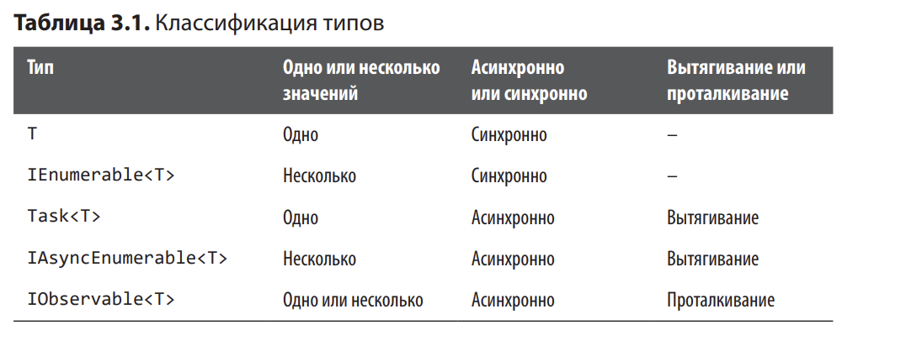

# Глава 3. Асинхронные потоки

*Асинхронные потоки* — механизм асинхронного получения нескольких 
элементов данных. Они строятся на основе асинхронных перечисляемых объектов (IAsyncEnumerable<T>).

*Асинхронный перечисляемый объект* представляет собой асинхронную версию перечисляемого объекта 
(enumerable); т. е. он может производить элементы по требованию для 
потребителя, и каждый элемент может быть произведен асинхронно

# Асинхронные потоки и Task<T>

Task<T> достаточно только для асинхронной обработки одного значения данных. ОДнак задача Task<T> не может
предостаить своим потребителям более одного знчения T.

Асинхронные потоки похожи на перечисляемые объекты. IAsyncEnumerator<T> может предоставить любое количество
значения T по одному за раз. Как и IEnumerator<T>, IAsyncEnumerator<T> может иметь неограниченную длину

# Асинхронные потоки и IEnumerable<T>

IAsyncEnumerable<T> является аналогом IEnumerable<T>. Оба позволяют потребителям получать элементы по одному
за раз. В имени же скрыто принципиальное различие: один интерфейс асинхронен, а другое нет.

Когда ваш код перебирает IEnumerable<T>, он блокирует каждый блокирует элемент из перечисляемого объекта. 
Если IEnumerable<T> представляет некоторую операцию, связанную с IO, то код потребитель блокируется.

IAsyncEnumerable<T> работает точно так же, как IEnumerable<T>, не считая того, что он асинхронно получает
каждый следующий элемент

# Асинхронные потоки и Task<IEnumerable<T>>

Task<IEnumerable<T>> могут асинхронно вернуть перечисляемый объект, но коллекция должна быть заполнена до 
возвращения и этот результат обрабатываться будет синхронно.

Принципиально ограничение типа Task<IEnumerable<T>> заключается в том, что он не может возвращать элементы
по мере получения; если возвращается коллекция, он должен загрузить все свои элементы в память, заполнить
коллекцию, а затем вернуть всю коллекцию сразу.

Даже если возвращается запрос LINQ, он может асинхронно построить этот запрос, 
но после возвращения запроса получение элементов из него будет происходить синхронно.

# Асинхронные потоки и IObservable<T>

Наблюдаемые объекты являются истинным воплощением асинхронных 
потоков; они генерируют свои уведомления по одному с полноценной 
поддержкой асинхронного генерирования (без блокирования). Но паттерн потребления 
объектов для IObservable<T> полностью отличен от IAsyncEnumerable<T>.

Чтобы потреблять IObservable<T>, код должен определить LINQ подобный запрос, через
который будут проходить наблюдаемые уведомления, после чего подписаться на 
наблюдаемый объект для запуска потока. При работе с наблюдаемыми объектами код 
сначала определяет, как будет реагировать на входящие уведомления, а затем включает
их (отсюда и реактивность в названии). С другой стороны потребления IAsyncEnumerable<T> 
очень похоже на потребление IEnumerable<T> кроме асинхронности.

Также возникает проблема обратного давления: все уведомления в System.Reactive 
синхронны, поэтому сразу же после того, как уведомление одного 
элемента отправляется подписчикам, наблюдаемый объект продолжает 
выполнение и получает следующий элемент для публикации, возможно — 
с повторным вызовом API.

Если потребляющий код использует поток асинхронно (т.е. с выполнением некоторого
асинхронного действия для каждого уведомеления при его поступлении), то наблюдаемый обхект
опередит потребляющий код.

Удобно считать, что IObservable<T> работает по принципу проталкивания (push), а IAsyncEnumerable<T>
- по принципу вытягивания (pull). Наблюдаемый поток проталкивает уведомления коду, но асинхронный поток 
пассивно позволяет коду (асинхронно) вытягивать данные. Только когда потребляющий код запросит следующий
элемент, наблюдаемый поток возобновит выполнение.

# Итоги

**Рассмотрим теоретический пример**

Многие API получают параметры offset и limit для создания страничной организации 
результатов. Мы хотим определить метод, который получает результаты от API 
с поддержкой страничной организации, и метод должен обрабатывать страницы, чтобы этим
не приходилось заниматься нашим высокоуровенвым методам.

Если метод возвращает Task<T>, вы ограничиваетесь возвращением только одного T. Это нормально
для одного вызова API, результатом которого является T, но он будет плохо работать в качестве типа,
если вы хотите, чтобы метод вызывал API несоклько раз.

Если метод возвращает IEnumerable<T>, можно создать цикл, который перебирает результаты API 
по страницам, вызывая его несколько раз. Каждый раз, когда метод обращения с вызовом к API,
он использует yield return с результатом этой страницы. Дальнейшие вызовы API необходимы
только в том случае, если перечислением продолжается. К сожалению, методы, возвращающие IEnumerable<T>,
не могут быть асинхронными, так как все вызовы API вынуждены быть синхронными.

Если метод возвращает Task<List<T>>, можно создать цикл, который по странциам перебирает результаты
API и вызывает API синхронно. Тем не менее код не может возвращать каждый элемент при получении ответа;
ему придется построить все результаты и вернуть их одновременно.

Если ваш метод возаращает IObservable<T>, вы сможете использовать System.Reactive для реализации
наблюдаемого потока, который начинает запросы при подписке и публикует каждый элемент при получении.
Абстракция работает по принципу выталкивания; для потребляющего кода все выглядит так, словно API
проталкивается им, что несколько затрудняет обработку. IObservable<T> будет лучше подходить для таких
сценариев, как получение и реакция на сообщения WebSocker/SignalR.

Если ваш метод возвращает IAsyncEnumerable<T>, можно создать естественный цикл, использующий как 
await, так и yield return для создания настоящего асинхронного потока на базе вытягивания. 
IAsyncEnumerable<T> отлично подходит для таких сценариев.



# 3.1. Создание асинхронных потоков

## Задача

Нужно вернуть несколько значений, при этом каждое значение может потребовать некоторой асинхронной работы.

Задача можно решить одним из двух путей:

1. Есть несколько значений, которые требуется вернуть (например, IEnumerable<T>), а затем выполнить
некоторую асинхронную работу.

2. Есть одно асинхронно значение (как Task<T>) после которого добавляются другие возвращаемые значения

## Решение

Этот простой пример показывает, как await может использоваться в сочетании с yield return для создания
асинхронного потока.

```
async IAsyncEnumerable<int> GetValuesAsync()
{
	await Task.Delay(1000); // Асинхронная работа
	yield return 10;
	await Task.Delay(1000); // Другая асинхронная работа
	yield return 13;
}
```

Другая более реалистичная задача: асинхронно перебираются результаты API, использующего параметры
для страничной организации результатов:

```
async IAsyncEnumerable<string> GetValuesAsync(HttpClient client)
{
	int offset = 0;
	const int limit = 10;
	while (true)
	{
		// Получить текущую страницу результатов и разобрать их.
		string result = await client.GetStringAsync($"https://example.com/api/values?offset={offset}&limit={limit}");
		
		string[] valuesOnThisPage = result.Split('\n');
		
		// Произвести результаты для этой страницы.
		foreach (string value in valuesOnThisPage)
			yield return value;
		
		// Если это последняя страница, работа закончена.
		if (valuesOnThisPage.Length != limit)
			break;

		// В противном случае перейти к следующей странице.
		offset += limit;
	}
}
```

Когда метод GetValuesAsync начинает работу, он выдает асинхронный запрос первой страницы данных, после чего
производит первый элемент. Когда будет запрошен второй элемент, GetValuesAsync выдает его немедленно, 
потому что он содержится на той же первой странице данных. Следующий элемент также находится на этой странице
и т д до 10 элементов. Затем при запросе 11 элементка были произведены все значения в valuesOnThisPage, и
на первой странице элементов уже не осталось.

GetValuesAsync продолжит выполнение своего цикла while, 
перейдет к следующей странице, выполнит асинхронный запрос второй 
страницы данных, получит обратно новую группу значений, после чего 
произведет 11-й элемент

## Пояснение

В более реалистичном примере стоит обратить 
внимание на одну особенность: асинхронная работа нужна не для всех 
результатов. В приведенном примере с длиной страницы 10 только приблизительно 
одному из каждых 10 элементов потребуется асинхронная работа. Если размер страницы равен 20, 
то асинхронная работа потребуется только одному из каждых 20 элементов.

Это обычный паттерн с асинхронными потокам. ДЛя многих потоков большинство операций 
асинхронного перебора на самом деле синхронно; асинхронные потоки только позволяют асинхронно получаить любой
следующий элемент. Асинхронные потоки проектировались с учетом как асинхронного, так и асинхронного кода;
вот почему асинхронные потоки строятся на основе ValueTask<T>. Используя ValueTask<T> во внутренней реализации,
асинхронные потоки максимизируют свою эффективность как при синхронном. так и при асинхронном получении
элементов.


# 3.2. Потребление асинхронных потоков

## Задача

Требуется обработать результаты асинхронного потока, также называемого асинхронным перечисляемым объектом

## Решение

Потребление асинхронной операции осуществляется ключевым словом 
await, а для потребления перечисляемого объекта обычно используется 
foreach. Потребление асинхронного перечисляемого объекта основано 
на объединении этих двух конструкций в await foreach.

```
IAsyncEnumerable<string> GetValuesAsync(HttpClient client);

public async Task ProcessValueAsync(HttpClient client)
{
	await foreach (string value in GetValuesAsync(client))
	{
		Console.WriteLine(value);
	}
}
```

На концептуальном уровне вызывается метод GetValuesAsync, который возвращает IAsyncEnumerable<T>. Цикл
foreach затем создает асинхронный перечислитель на базе асинхронного перечисляемого объекта. Асинхронные
перечислители. не считая того, что операция "получить следующий элемент" может быть асинхронной.

Таким образом, await foreach будет ожидать поступления следующего элемента при завершении асинхронного
перечислителя. Если элемент поступил, то await foreach выполнить свое тело цикла; если асинхронный 
перечислитель завершен, происходит выход из цикл.

Также можно выполнить асинхронную обработку каждого элемента:

```
IAsyncEnumerable<string> GetValuesAsync(HttpClient client);

public async Task ProcessValueAsync(HttpClient client)
{
	await foreach (string value in GetValuesAsync(client))
	{
		await Task.Delay(100); // асинхронная работа
		Console.WriteLine(value);
	}
}
```

В этом случае await foreach не переходит к следующему элементу до завершения тела цикла. Таким образом,
await foreach асинхронно получит первый элемент, после чего асинхронно выполняет тело цикла для первого
элемента, затем асинхронно получает первый элемент, асинхронно выполняет тело цикла для следующего элемента
и т.д.

В await foreach скрыта команда await: к операции "получить следующий элемент" применяется await.
С обычной командой await можно обойти неявно сохраненный контекст с помощью ConfigureAwait(false),
как описано в разделе 2.7. Асинхронные потоки также поддерживают ConfigureAwait(false), которые передаются
скрктым командам await:

```
IAsyncEnumerable<string> GetValuesAsync(HttpClient client);
public async Task ProcessValueAsync(HttpClient client)
{
	await foreach (string value in GetValuesAsync(client).ConfigureAwait(false))
	{
		await Task.Delay(100).ConfigureAwait(false); // асинхронная работа
		Console.WriteLine(value);
	}
}
```

## Пояснение

await foreach — самый логичный способ потребления асинхронных потоков. 
Язык поддерживает ConfigureAwait(false) для предотвращения контекста в await foreach.

Также возможен вариант с передачей маркеров отмены; этот вариант 
чуть сложнее из-за сложности асинхронных потоков (этот вариант рассматривается в рецепте 3.4). 
И хотя возможно и естественно использовать 
await foreach для потребления асинхронных потоков, есть обширная 
библиотека асинхронных операторов LINQ; наиболее популярные из 
них рассматриваются в рецепте 3.3.


# Использование LINQ с асинхронными потоками

## Задача

Требуется обработать асинхронный поток с использованием четко определенных и хорошо протестированных 
операторов

## Решение

IEnumerable<T> поддерживает LINQ to Objects, а IObservable<T> поддерживает LINQ to Events.

Оба типа поддерживают библиотеки методов 
расширения, которые определяют операторы, используемые для построения запросов. 
IAsyncEnumerable<T> также включает поддержку LINQ, 
предоставляемую сообществом .NET в NuGet-пакете System.Linq.Async.

Например, один из самых распространенных вопросов о LINQ заключается в том, 
как использовать оператор Where, если предикат Where является 
асинхронным. Вы хотите отфильтровать последовательность на основании 
некоторого асинхронного условия — например, необходимо провести 
поиск каждого элемента в базе данных или API, чтобы узнать, должен 
ли он быть включен в итоговую последовательность. Where не работает 
с асинхронными условиями, потому что оператор Where требует, чтобы 
его делегат возвращал немедленный синхронный ответ

У асинхронных потоков имеется вспомогательная библиотека, определяющая 
много полезных операций. В следующем примере WhereAwait является правильным решением:

```
IAsyncEnumerable<int> values = SlowRange().WhereAwait(
	 async value =>
	 {
		 // Выполнить некоторую асинхронную работу для определения
		 // того, должен ли элемент быть включен в результат.
		 await Task.Delay(10);
		 return value % 2 == 0;
	 });

await foreach (int result in values)
{
	Console.WriteLine(result);
}

// Производит последовательность, которая замедляется
// в процессе выполнения операции.
async IAsyncEnumerable<int> SlowRange()
{
	for (int i = 0; i != 10; ++i)
	{
		await Task.Delay(i * 100);
		yield return i;
 }
}
```

Операторы LINQ для асинхронных потоков также включают синхронные версии; 
есть смысл применить синхронную операцию Where (Select
и т. д.) для асинхронного потока. Результат все равно представляет собой 
асинхронный поток:

```
IAsyncEnumerable<int> values = SlowRange()
	.Where(value => value % 2 == 0);

await foreach (int result in values)
{
 Console.WriteLine(result);
}
```

Здесь присутствуют все знакомые операторы LINQ: Where, Select, 
SelectMany и даже Join. Многие операторы LINQ теперь могут получать 
асинхронных делегатов (как в приведенном примере с WhereAwait)

## Пояснение

Асинхронные потоки работают по принципу вытягивания, поэтому здесь нет операторов,
связанных со временем (как для наблюдаемых объектов). Throttle и Sample здесь не имеют
смысла, так как элементы вытягиваются из асинхронного потока по требованию.

Методы LINQ для асинхронных потоков также могут принести пользу для обычных перечисляемых
объектов. Оказавшись в этой ситуации, можно вызвать ToAsyncEnumerable() для любого IEnumerable<T>;

тогда вы получите интерфейс асинхронного потока, который можно использовать с WhereAwait, SelectAwait
и другими операторами, который поддерживают асинхронных делегатов.

Необходимо сказать пару слов об именах. Пример в этом рецепте использует WhereAwait как асинхронный
эквивалент Where. При изучении операторов LINQ для асинхронных потоков вы увидите, что одни из них 
оканчиваются суффиксом ASync, а другие Await. Операторы, заканчивающиеся суффиксом Async, возвращает
объект, допускающий ожидание; они представляют обычное значение, а не асинхронную последовательность.

Операторы с суффиксом Await получают асинхронного делегата; Await в имени подразумевает, что они фактически
выполняют await с переданным им делегатом.

Мы уже рассматривали пример суффикса Await в случае с Where и WhereAwait. Суффикс 
Async применяется только к операторам терминации
(termination operators) — операторам, которые извлекают некоторое значение 
или выполняют некоторые вычисления и возвращают асинхронное 
скалярное значение вместо асинхронной последовательности. Пример 
такого оператора — CountAsync, версия Count для асинхронного потока, 
которая может подсчитать количество элементов, соответствующая некоторому предикату:

```
int count = await SlowRange().CountAsync(value => value % 2 == 0)
```

Предикат также может быть асинхронным; в этом случае используется оператор CountAwaitAsync, поскольку
он получает асинхронного делегата (который будет использоваться с await) и производит одно
терминальное значение:

```
int count = await SlowRange().CountAwaitAsync(
	async value =>
	{
	await Task.Delay(10);
	return value % 2 == 0;
	});
```

Операторы, которые могут получить делегатов, существуют в двух именах: с суффиксом Await И без него. Кроме 
того, операторы, возвращающие терминальное значение вместо асинхронного потока, завершаются суффиксом Async.
Если оператор получает асинхронного делегата и возвращает терминальное значение, то имеет оба суффикса.

Операторы LINQ для асинхронных потоков находятся в NuGet-пакете для System.Linq.Async. 
Дополнительные операторы LINQ для асинхронных потоков находятся в NuGet-пакете для 
System.Interactive.Async.

# 3.4. Асинхронные потоки и отмена

## Задача

Требуется механизм отмены асинхронных потоков

## Решение

Не всем асинхронным потокам необходима отмена. Перечисление может быть просто 
остановлено при достижении условия. Если это единственная разновидность "отмены",
реально необходимая в программе, то полноценная отмена не нужна, как показывает следующий пример:

```
await foreach (int result in SlowRange())
{
	Console.WriteLine(result);
	if (result >= 8)
	break;
}

// Производит последовательность, которая замедляется
// в процессе выполнения операции.
async IAsyncEnumerable<int> SlowRange()
{
	for (int i = 0; i != 10; ++i)
	{
		await Task.Delay(i * 100);
		yield return i;
	}
}
```

Часто бывает полезно отменять асинхронные потоки, так как некоторые операторы передают маркеры отмены своим 
потокам-источникам. В этом сценарии следует использовать CancellationToken для остановки await foreach из внешнего кода.

async-метод, возвращающий IAsyncEnumerable<T>, может получать маркер отмены для чего определяется параметр, помеченный
атрибутом EnumeratorCancellation. После этого маркер можно использовать естественным образом, для чего он обысно 
передатеся другим APU, получающим маркеры отмены:

```
using var cts = new CancellationTokenSource(500);
CancellationToken token = cts.Token;
await foreach (int result in SlowRange(token))
{
	Console.WriteLine(result);
}

// Производит последовательность, которая замедляется
// в процессе выполнения операции.
async IAsyncEnumerable<int> SlowRange([EnumeratorCancellation] CancellationToken token = default)
{
	for (int i = 0; i != 10; ++i)
	{
		await Task.Delay(i * 100, token);
		yield return i;
	}
}
```

## Пояснение

В этом примере CancellationToken передается непосредственно методу, возвращающему асинхронный перечислитель. Это 
самый распространенный вариант использования.

Возможны и другие сценарии, в которых код получает асинхронный перечислитель и хочет применить CancellationToken к 
перечислителям, которые он использует. Маркеры отмены используются при запуске нового перечисления для перечисляемого объекта,
поэтому есть смысла использовать CancellationToken Именно таким образом. Сам перечисляемый объект определяется методом
SlowRange, но он не запускается до момента потребления. Бывают даже ситуации, в которых разные маркеры отмены должны
передаваться разным перечислениям перечисляемого объекта.


Вкратце отменяться может не перечисляемый объект, но перечислитель, 
созданный этим перечисляемым объектом. Это нетипичный, но важный 
сценарий использования; именно по этой причине асинхронные потоки 
поддерживают метод расширения WithCancellation, который может использоваться 
для присоединения маркера CancellationToken к конкретной 
итерации асинхронного потока:

```
async Task ConsumeSequence(IAsyncEnumerable<int> items)
{
	using var cts = new CancellationTokenSource(500);
	CancellationToken token = cts.Token;

	await foreach (int result in items.WithCancellation(token))
	{
		Console.WriteLine(result);
	}
}

// Производит последовательность, которая замедляется
// в процессе выполнения операции.
async IAsyncEnumerable<int> SlowRange([EnumeratorCancellation] CancellationToken token = default)
{
	for (int i = 0; i != 10; ++i)
	{
		await Task.Delay(i * 100, token);
		yield return i;
	}
}

await ConsumeSequence(SlowRange());
```

При наличии атрибута EnumeratorCancellation компилятор обеспечит 
передачу маркера из WithCancellation параметру token, помеченному 
EnumeratorCancellation, и запрос отмены теперь заставит await foreach 
выдать исключение OperationCanceledException после того, как он обработает несколько первых элементов

Метод расширения WithCancellation не препятствует ConfigureAwait(false). 
Оба метода расширения могут быть объединены в цепочку:

```
async Task ConsumeSequence(IAsyncEnumerable<int> items)
{
	using var cts = new CancellationTokenSource(500);
	CancellationToken token = cts.Token;
	await foreach (int result in items
		.WithCancellation(token)
		.ConfigureAwait(false))
		{
			Console.WriteLine(result);
		}
}
```