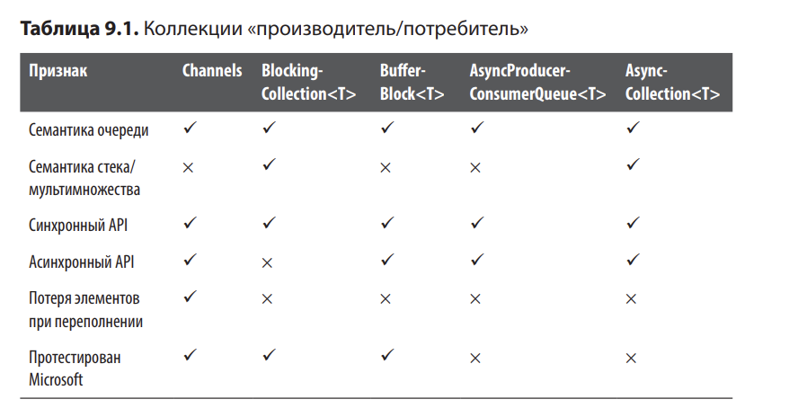
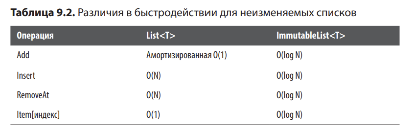
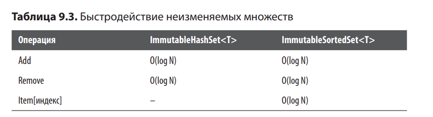
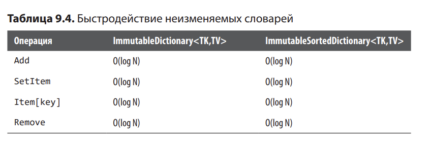

# Коллекции


Неизменяемые коллекции:

Операции, доступные только чтения выполняются с неизменяемым экземпляром напрямую

Операции записи возвращают новый неизменяемый экземпляр вместо изменения существующего.

Потокобезопасные коллекции: перечисление производится со "снимком", применяется сочтения
детализированных блокировок и приемов, не использующих блокировки, потоки блокируются на 
минимальное время либо же не блокируются вовсе. 
Ключевое преимущество: возможность обращаться к коллекциям безопасно из нескольких потоков
при том, что операции будут блокировать код на минимальное время.

Коллекции "производитель/потребитель"



Библиотека Channels находится в пакете System.Threading.Channels, 
BufferBlock<T> — в пакете System.Threading.Tasks.Dataflow, 
а AsyncProducerConsumerQueue<T> и AsyncCollection<T> — в пакете 
Nito.AsyncEx

# 9.1. Неизменяемые стеки и очереди

## Задача

Вам нужна коллекция — стек или очередь, которая изменяется не очень 
часто и к которой можно безопасно обращаться из нескольких потоков.

Например, очередь может использоваться для представления последовательности 
выполняемых операций, а стек — для представления последовательности операций отмены.

## Решение

Используем ImmutableStack из примера.

Неизменяемые коллекции строятся на основе паттерна, в соответствии с которым они возвращают
обновленную коллекцию; ссылка на исходную коллекцию остается без изменений. Это означает,
что если имеется ссылка на конкретный экземпляр неизменяемой коллекции, она никогда не 
изменится.

## Пояснение

Экземпляр никогда не изменяется

Так как экземпляр никогда не изменяется, он потокобезопасен по своей природе

При вызове изменяющего метода для неизменяемой коллекции возвращается новая измененная версия

Неизменяемые коллекции являются потокобезопасными, но ссылки на них потокобезопасными не являются


# 9.2. Неизменяемые списки

## Задача

Нужна структура данных с возможностью индексирования, которая изменяется не слишком часто
и допускает безопасные обращения из нескольких потоков

## Решение

ImuttableList

Во внутренней реализации неизменяемого списка используется двоичное дерево, чтобы
экземпляры неизменямого списка могли максимизировать объем памяти, используемый совместно
с другими экземплярами. В результате для некоторых распространненых операций существуют
различия в быстродействии между ImmutableList и List



## Пояснение

ImmutableList<T> — хорошая структура данных общего назначения, но из-за 
различий в быстродействии вы не сможете бездумно заменить ей все 
List<T>. List<T> часто используется по умолчанию — именно эту структуру 
данных следует использовать, если только у вас нет веских причин для 
выбора другой коллекции

# 9.3. Неизменяемые множества

## Задача

Нужна структура данных, не расчитанная на хранение дубликатов, которая не слишком часто 
изменяется и допускает безопасные обращения из нескольких потоков.

Например, индекс слов из файла может быть хорошим кандидатом для применения множества.

## Решение

ImmutableHashSet, ImmutableSortedSet

Только отсортированное множество допускает индексирование по аналогии со списком.

Несортированные и отсортированные множества обладают сходным быстродействием.




Одно важное примечание по поводу отсортированных множеств: индексирование 
для них выполняется за время O(log N), а не O(1), как у 
ImmutableList<T> (см. рецепт 9.2). Это означает, что в данной ситуации 
действует та же рекомендация: используйте foreach вместо for там, где 
это возможно, с ImmutableSortedSet<T>.

## Пояснение

Неизменяемые множества полезны, но заполнение большого неизменяемого 
множества может быть медленной операцией.

# 9.4. Неизменяемые словари

## Задача

Нужна коллекция "ключ/значение", которая не слишком часто изменяется и допускает безопасные
обращения из нескольких потоков.

Например, в этой коллекции могут храниться данные ссылок в подстановочной таблице; данные
ссылок редко изменяются, но они должны быть доступны для разных потоков.

## Решение

ImmutableDictionary, ImmutableSortedDictionary


Вот такая конструкция юзается:
```sortedDictionary = sortedDictionary.SetItem(10, "Diez");```

Несортированные и отсортированные словари обладают сходным быстродействием, 
но я рекомендую использовать неупорядоченные словари, если только не требуется, 
чтобы элементы были отсортированы.



Несортированные словари могут работать в целом немного 
быстрее. Кроме того, несортированные словари могут использоваться 
с любыми типами ключей, тогда как отсортированные словари требуют 
полной совместимости типов их ключей

## Пояснение

Если исходные ссылочные данные загружаются в начале работы программы, вы сможете 
воспользоваться механизмом построителей для конструирования исходного неизменяемого 
словаря. С другой стороны, если ссылочные данные строятся 
постепенно во время выполнения, вероятно, можно будет воспользоваться 
обычным методом Add неизменяемых словарей.

# 9.5. Потокобезопасные словари

## Задача

Имеется коллекция ключ-значение (например, кэш в памяти), которая должна поддерживаться
в синхронизированном состоянии, даже если несколько потоков выполняют с ней операции
чтения и записи

## Решение

ConcurrentDictionary<TKey, TValue>

```
string newValue = dictionary.AddOrUpdate(0,
	key => "Zero",
	(key, oldValue) => "Zero");
```

Метод AddOrUpdate(TKey key, deledate first, delegate second)

first - вызывается только в том случае, если ключ не существует в словаре
second - вызывается только в том случае, если ключ уже существует.

Чтобы конкурентный словарь работал правильно, может оказаться, что метод AddOrUpdate 
должен вызывать одного (или обоих) делегатов несколько раз. ЭТо значит, что делегаты должны
быть простыми и быстрыми и не иметь побочных эффектов

Есть возможность использовать синтаксис индексирования: 

```
dictionary[0] = "Zero";
```

Синтаксис индексирования обладает меньшими возможностями; он не представляет возможности
обновления значений на основании существующего значения. Впрочем, этот синтаксис проще
и он нормальное работает, если вам уже известно значение, которое требуется сохранить
в словаре.

Чтения переменной: 

```
bool keyExists = dictionary.TryGetValue(0, out string currentValue);
```

Удаление:

```
bool keyExisted = dictionary.TryRemove(0, out string removedValue);
```

## Пояснение

Тип является потокобезопасным, но это не означает атомарность операций. Если несколько
потоков вызывают AddOrUpdate конкуретно, может оказаться, что два потока обнаружат 
отсутствие ключа, а затем оба одновременно выполнят своего делегата, создавшего новое значение

Если выполнения не выполняются постоянно (т.е. операций относительно редка), то, возможно,
ImmutableDictionary<TKey, TValue> будет более подходящим кандидатом


Если некоторые потоки только добавляют элементы, 
а другие только удаляют их, возможно, вам лучше подойдет коллекция 
«производитель/потребитель».


# 9.6. Блокирующие очереди

## Задача

Необходимо создать коммуникационный канал для передачи сообщений или данных между потоками.

Например, один поток может загружать данные, которые отправляются по каналу по мере 
нагрузки; другие потоки на стороне получения получают эти данные и обрабатывают их

## Решение

BlockingCollection<T>. FIFO блокирующая очередь

```
private readonly BlockingCollection<int> _blockingQueue = new BlockingCollection<int>();
```

Обычно поток делает что-то одно; либо добавляет элементы в коллекцию, либо удаляет элементы.
Потоки, добавляющие элементы, называются потоками-производителями, а потока, удаляющие,
называются потоками-потребителями.

## Пояснение

При использовании таких коммуникационных каналов необходимо 
подумать о том, что произойдет, если производители работают быстрее 
потребителей. Если элементы производятся быстрее, чем потребляются, 
возможно, придется применить регулировку очереди.

Они не настолько хороши, если вы хотите обращаться 
к коммуникационному каналу асинхронно — например, если UI-поток 
должен действовать в режиме потребителя. Асинхронные очереди рассматриваются 
в рецепте 9.8.

Тип BufferBlock<T> из TPL Dataflow может работать как блокирующая 
очередь, к тому же TPL Dataflow позволяет построить конвейер или сеть 
для обработки. Впрочем, во многих простых случаях обычные блокирующие 
очереди (например, BlockingCollection<T>) станут более подходящим 
вариантом при проектировании.

Также можно воспользоваться типом AsyncProducerConsumerQueue<T>
библиотеки AsyncEx, который может работать как блокирующая очередь.

# 9.7. Блокирующие стеки и мультимножества

## Задача

Требуется коммуникационный канал для передачи сообщений или данных из одного потока в другой,
но вы не хотите, чтобы этот канал использовал семантику FIFO.

## Решение

BlockingCollection<T> - блокирующая очередь, но он также может работать как любая
другая коллекция "производитель/потребитель". По сути это обертка для потокобезопасной 
коллекции, реализующей IProducerConsumerCollection<T>.

Если вы хотите BlockingCollection<T> с семантикой LIFO или семантикой неупорядоченного
мультимножества:

```
BlockingCollection<int> _blockingStack = new BlockingCollection<int>(new ConcurrentStack<int>());
BlockingCollection<int> _blockingBag = new BlockingCollection<int>(new ConcurrentBag<int>());
```

Важно учитывать, что с упорядочением элементов связаны некоторые условия гонки. Если вы 
позволите тому же коду-производителю отработать ранее любой код-потребитель, а затем 
выполните код-потребитель после когда производителя, порядок элементов будет в точности таким
же, как у стека:

```
// Код-производитель
_blockingStack.Add(7);
_blockingStack.Add(13);
_blockingStack.CompleteAdding();
// Код-потребитель
// Выводит "13", затем "7".
foreach (int item in _blockingStack.GetConsumingEnumerable())
	Trace.WriteLine(item);
```

Если код-производитель и код-потребитель выполняются в разных потоках 
(как это обычно бывает), потребитель всегда получает следующим 
тот элемент, который был добавлен последним.

Например, производитель добавляет 7, потребитель получает 7, затем производитель добавляет
13, потребитель получает 13. Потребитель не ожидает вызова CompleteAdding перед тем,
как вернуть первый элемент.

## Пояснение

Все что было сказано о регулировке применительно к блокирующих очередям, также применимо
к блокирующим стекам или мультимножествам. Если ваши производители работают быстрее
потребителей и вы хотите ограничить использование памяти блокирующим стеком/очередью, 
используйте регулировку так, как показано в рецепте 9.9

В этом рецепте для кода-потребителя используется GetConsumingEnumerable — самый 
распространенный сценарий. Также существует метод Take, 
который позволяет потребителю получить только один элемент (вместо 
потребления всех элементов)

Если вы хотите обращаться к совместно используемым стекам или мультимножествам 
асинхронно (например, если UI-поток должен действовать 
в режиме потребителя), обращайтесь к рецепту 9.11.


# 9.8. Асинхронные очереди

## Задача

Требуется коммуникационный канал для передачи сообщений или данных из одной части кода в 
другую по принципу FIFO без блокирования потоков.

Например, один фрагмент кода может загружать данные, которые отправляются по каналу по мере
загрузки; при этом UI-поток получает данные и выводит их

## Решение

Channels - современная библиотека для асинхронных коллекций "производитель/потребитель", 
уделяющая особое внимание высокому быстродействию в крупномасштабных сценариях. 
Производители обычно записывают элементы в канал вызовом WriteAsync, а когда они завершат
производство элементов, один из них вызывает Complete для уведомления канала о том, что
в дальнейшнем элементов больше не будет:

```
Channel<int> queue = Channel.CreateUnbounded<int>();

// Код-производитель
ChannelWriter<int> writer = queue.Writer;
await writer.WriteAsync(7);
await writer.WriteAsync(13);
writer.Complete();

// Код-потребитель
// Выводит "7", затем "13".
ChannelReader<int> reader = queue.Reader;
await foreach (int value in reader.ReadAllAsync())
	Trace.WriteLine(value);
```

Более простой код-потребитель использует асинхронные потоки.

Старые платформы .NET могут использовать следующим паттерн:

```
// Код-потребитель (старые платформы).
// Выводит "7", затем "13".
ChannelReader<int> reader = queue.Reader;
while (await reader.WaitToReadAsync())
	while (reader.TryRead(out int value))
		Trace.WriteLine(value);
```

Другой вариант организации очереди «производитель/потребитель» — 
использование BufferBlock<T> из библиотеки TPL Dataflow. Тип BufferBlock<T> имеет 
много общего с каналом. 

Nito.AsyncEx: AsyncProducerConsumerQueue

## Пояснение

Рекомендуется использовать библиотеку Channels для асинхронных очередей "производитель/потребитель"
там, где это возможно. Помимо регулировки поддерживанются несколько режимов выборки, а код
тщательно оптимизирован.

Однако, если логика вашего приложения может 
быть выражена в виде «конвейера», через который проходят данные, TPL 
Dataflow может быть более логичным кандидатом.

Последний вариант — AsyncProducerConsumerQueue<T> — имеет смысл в том случае, если в вашем 
приложении уже используются другие типы из AsyncEx.

# 9.9. Регулировка очередей

## Задача

Имеется оычередь "производитель/потребитель", но производители могут работать быстрее
потребителей, что может привести к неэффективному использованию памяти. Также вам хотелось
бы сохранить все элементы в очереди, а следовательно, понадобится механизм регулировки
производителей.

## Решение

Регулировка - отказ производителям добавлять элементы, пока потребители их не получат

Регулировка может выполняться посредством создания ограниченного канала (вместо 
неограниченного). Так как каналы асинхронны, производители будут регулироваться асинхронно:

```
Channel<int> queue = Channel.CreateBounded<int>(1);
ChannelWriter<int> writer = queue.Writer;

// Эта запись завершается немедленно.
await writer.WriteAsync(7);


// Эта запись (асинхронно) ожидает удаления 7
// перед тем как ставить в очередь 13.
await writer.WriteAsync(13);

writer.Complete();
```

Тип BufferBlock<T> имеет встроенную поддержку регулировки, которая более подробно
рассмотрена в рецепте 5.4

## Пояснение

Регулировка нужна, когда производители работают быстрее потребителей.

Обычно некоторая регулировка потребуется для того, чтобы гарантировать нормальную 
работу на будущем оборудовании и/или облачных платформах, которые 
нередко более ограничены в ресурсах, чем машины разработчиков.

Регулировка создает обратное давление на производителей, замедляя 
их для того, чтобы потребители гарантированно могли обработать все 
элементы без создания излишних затрат памяти.

# 9.10. Выборка в очередях

## Задача

Есть очередь "проивзодитель/потребитель", но производители могут работать быстрее потребителей,
что может привести к неэффективному использованию памяти. Сохранять все элементы из 
очереди не обязательно; необходимо отфильтровать элементы очереди так, чтобы более медленные
потребители могли ограничиваться обработкой самых важных элементов.

## Решение

Библиотека Channels предоставляет самые простые средства применения выборки к элементам ввода.

Типичный пример — всегда брать 
последние n элементов с потерей самых старых элементов при заполнении очереди.

Это самый простой механизм контроля входных потоков и предотвращения «затопления» потребителей.

Есть и другие режимы BoundedChannelFullMode. Например, если вы хотите, чтобы самые старые элементы 
сохранялись, можно при заполнении канала терять новые элементы:

```
Channel<int> queue = Channel.CreateBounded<int>(
 new BoundedChannelOptions(1)
 {
	FullMode = BoundedChannelFullMode.DropWrite,
 });

ChannelWriter<int> writer = queue.Writer;
```

## Пояснение

Библиотека Channels отлично подходит для простой выборки. Во многих 
ситуациях чрезвычайно полезен режим BoundedChannelFullMode.DropOldest. 
Более сложная выборка должна выполняться самими потребителями.

Если выборка должна выполняться по времени (например, «только 
10 элементов в секунду»), используйте System.Reactive. В System.Reactive 
предусмотрены естественные операторы для работы со временем.

# 9.11. Асинхронные стеки и мультимножества

## Задача

Требуется коммуникационный канал для передачи сообщений или данных из одной части кода в другую,
но вы не хотите, чтобы этот канал использовал семантику FIFO.

## Решение

Библиотека Nito.AsyncEx предоставляет тип AsyncCollection<T>, который по умолчанию работает как
асинхронная очередь, но он также может работать как любая разновидность коллекций "производитель/потребитель".

Обертка для IProducerConsumerCollection<T> - AsyncCollection<T> - также является async-эквивалентом
типа .NET BlockingCollection<T>

Тип AsyncCollection поддерживает семантику LIFO (стек) или неупорядоченности (мультимножество) 
в зависимости от того, какая коллекция передается его конструктору.

Если производители завершатся до того, как начнут работать потребители, то порядок элементов будет 
соответстовать обычному стеку.

В AsyncCollection<T> предусмотрена поддержка регулировки, которая 
необходима в тех случаях, когда производители могут добавлять данные 
в коллекцию быстрее, чем потребители их извлекают. Просто сконструируйте 
коллекцию с нужным значением:

```
var _asyncStack = new AsyncCollection<int>(new ConcurrentStack<int>(), maxCount: 1);
```

Теперь тот же код-производитель будет асинхронно ожидать по мере необходимости: 

```
// Это добавление завершается немедленно.
await _asyncStack.AddAsync(7);
// Это добавление (асинхронно) ожидает удаления 7
// перед тем как помещать в очередь 13.
await _asyncStack.AddAsync(13);
_asyncStack.CompleteAdding();
```

Код-производитель использует тип OutputAvailableAsync, на которые распространяются ограничения, 
описанные в рецепте 9.8. При наличии нескольких потребителей код-потребитель обычно выглядит 
примерно так:

```
while (true)
{
	int item;
	try
	{
		item = await _asyncStack.TakeAsync();
	}
	catch (InvalidOperationException)
	{
		break;
	}
	Trace.WriteLine(item);
}
```

## Пояснение

AsyncCollection<T> представляет собой асинхронный эквивалент BlockingCollection<T> с несколько отличающимся API.


# 9.12. Блокирующие/асинхронные очереди

## Задача

Требуется коммуникационный канал для передачи сообщение или данных из одно части кода в другую
по принципу FIFO, но при этом необходима гибкость для того, чтобы сторона производителя или сторона
потребителя могла рассматриваться как синхронная или асинхронная.

Например, фоновый поток может загружать данные и заносить их в коммуникационный канал, и вы хотите,
чтобы фоновый поток синхронно блокировался при заполнении канала. В это время UI-поток получает данные
из коммуникационного канала, и вы хотите, чтобы UI-поток асинхронно извлекал данные из канала, чтоб он 
продолжал реагировать на действия пользователя.

## Решение

Тип BufferBlock<T> может легко использоавться как асинхронная очередь "производитель/потребитель".

Как показано в примере, BufferBlock<T> также поддерживает 
синхронный API для производителей и потребителей.

Код потребитель, который использует BufferBlock<T>, получается довольно неудобным, так как не 
соответвтвует стилю программирования потоков данных. Библиотека TPL Dataflow включает ряд блокировок,
которые могут объединиться в цепочки для определения реактивной сети. В данном случае очередь
"производитель/потребитель", завершающая конкретное действие, может определяться с помощью 
ActionBlock<T>


## Пояснение

Рекомендуется по возможности использовать BufferBlock<T> или ActionBlock<T>, потому что библиотека
TPL Dataflow была протестирована более тщательно, чем библиотекка Nito.AsyncEx. Однако тип
AsyncProducer­ConsumerQueue<T> тоже может пригодиться, если приложение уже использует другие типы 
из библиотеки AsyncEx.

System.Threading.Channels также можно использовать синхронно, но только 
косвенно. Их естественный API является асинхронным, но поскольку эти 
коллекции относятся к числу потокобезопасных, вы можете заставить их 
работать синхронно, упаковав код производства или потребления в Task.
Run с последующим блокированием по задаче, возвращенной Task.Run.


Блоки TPL Dataflow, AsyncProducerConsumerQueue<T> и Channels поддерживают регулировку, 
для чего при конструировании необходимо задать 
соответствующие параметры. Регулировка необходима в ситуациях, 
в которых производители заносят элементы в коллекцию быстрее, чем 
потребители могут потреблять их, в результате чего приложение будет 
расходовать слишком много памяти.


# Подведение итогов:

BufferBlock, AsyncCollection, Channels, BlockingCollection, ConcurrentDictionary, ImmutableSortedDictionary,
ImmutableDictionary, ImuttableList, ImmutableStack