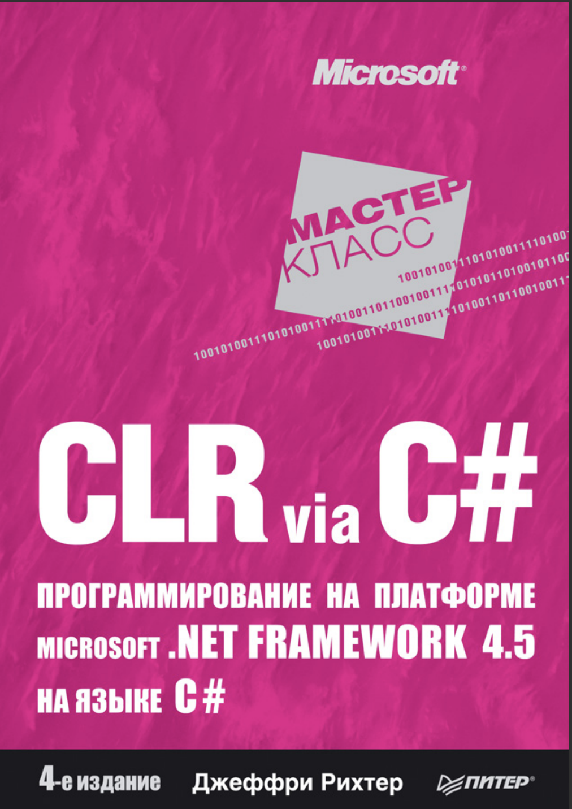
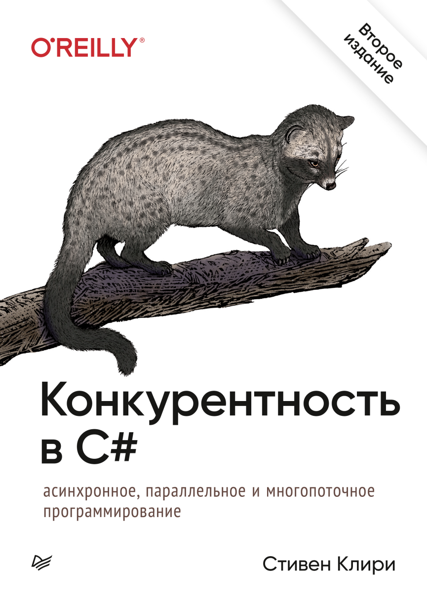

Мое изучение C#

Литература:

[&check;] CLR via C#. Джеффри Рихтер. 4-издание

База C# разработчика. 

Затрагивается: CLR, IL-код, метаданные, JIT-компилятор, GC, безопасность типов, потоки и синхронизация, отладка и профилирование, рефлексия, производительность и оптимизации, совместимость и версии ПО и многое другое.

Клири Стивен. Конкурентность в C#. Асинхронное, параллельное и многопоточное программирование. 2-е межд. изд

