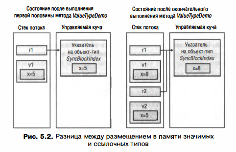
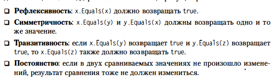

# Глава 5. Примитивные ссылочные и значимые типы

## Примитивные типы в языках программирования
1) Использование FCL типов вместо примитивных. По-моему мнению сомнительный совет, все упирается в знание разработчиков, как ведут себя примитивные типы

## Проверяемые и непроверяемые операции
1) Использование типов со знаком вместо числовых типов без знака везде, где это возможно. Это позволит компилятору выявить переполнение
2) Проверка тех данных, которые вводит пользователь или клиентская машина
3) Установка параметра компилятора /checked+ не рекомендуется, т.к. упадет производительность приложения
4) Тип decimal не относится к примитивным типам. В CLR нет IL-команд для работы со значениями этого типа. При компиляции кода с этим типов, компилятор генерирует вызовы членов типа Decimal, поэтому значения этого типа обрабатываются медленее примитивных типов. На этот тип не дейсвуют операторы checked и unchecked. Любая небезопасная операция вызовет OverflowException
5) Тип System.Numeric.BigInteger используется в массивах UInt32 для представления больших произвольных больших целочисленных переменных индекса. OverflowException никогда не будет. Но может быть исключение OutOfMemoryException

## Ссылочные и значимые типы
1) Память для ссылочных типов всегда выделяется из управляемой кучи, а оператор new возвращает адрес в памяти, где размещается сам объект
2) Незанятые полезной информацией байты объекта обнуляются (это касается полей)
3) CLR предлагает значимые типы - "облегченные". Они размещаются в стеке потока. Для работы с экземляром не нужно выполнять разыменования (dereference)
4) Классы - ссылочные тип. Структуры и перечисления - значимые типы, производные от System.ValueType, от них нельзя создать потомков.

5) Причины использовать вместо ссылочного типа значимый: 
	5.1) Тип достаточно простой и у него нет членов, способных изменить экземплярные поля типа (immutable тип)
	5.2) Тип не будет иметьь производных от него типов
	5.3) Но важно учитывать размер экземляра, поскольку по умолчанию аргументы передаются по значениями, при этом поля экземпляров значимого типа копируются, что отрицательно сказывается на производительности. Отсюда вытекает:
	5.4) Размер экземляра типа мал (меньше или равно 16 байт)
	5.5) Размер экземляра более 16 байт, но экземляры не передаются в качестве параметров метода или не являются возвращаемыми из метода значениями
6) Различия ссылочных и значимых типов:
	6.1) Объекты значимого типа сущзествуют в двух формах: неупакованной (unboxed) и упакованной (boxed). Ссылочные типы бываются только в упакованной форме
	6.2) Значимые типы производны от System.ValueType, производного от System.Object. Однако System.ValueType переопределяется метод Equals, которые сравнивает значения полей объектов. Кроме того, переопределен метод GetHashCode, который генерирует хэш-код с помощью алгоритма, учитывающего значения полей экземляра объекта.
	6.3) ValueType не может содержать виртуальные методы, также методы не могут быть абстрактными и неявно являются изолированными (то есть их нельзя переопределить)
	6.4) Неупакованные значимые типы не размещаются в куче, отведенная для них память освобождается сразу при возвращении управления методом, в котором описан экземляр этого типа.
7) как CLR управляет размещением полей для типа:
	7.1) CLR по умолчанию может решать в каком порядке размещать поля типа, однако при описании типа можно указать, сохранить ли порядок полей данного типа, определенный пррограммистом или разрешить CLR выполнить эту работу
	7.2) Для сообщения CLR своих намерений надо указать в описании типа атбрибут System.Runtime.InteropServices.StructLayoutAttribute c различными параметрами: LayoutKind.Auto, LayoutKind.Sequantial, LayoutKind.Explicit. По дефолту порядок полей выбирает компилятор
	7.3) Для ссылочных типов компилятора выбирает LayoutKind.Auto, а для значимых - LayoutKind.Sequential
	7.4) Явное расположение обычно служит для имитации того, что в неуправляемом коде на C/C++ называется объединением (union). Можно сделать так, чтобы несколько значимых полей в типе пересекались

8) упаковка значимых типов
	8.1) при упаковке экземляра значимого типа происходит следующее: 
		8.1.1) в управляемой куче выделяется память. Ее объем определяется длиной значимого типа и двумя доп членами - указателей на объект-тип и индекс SyncBlockIndex
		8.1.2) поля значимого типа копируются в память, только что выделенную в heap
		8.1.3) Возвращается адрес объекта. Этот адрес является ссылкой на объект, то есть значимый тип превращается в ссылочный
	8.2) компилятор C# создает IL-код, необходимый для упаковки экземляра значимого типа, автоматически, но вы должны понимать, что происходит "за кулисами" и помнить об опасности "распухания" кода и снижения производительности
	8.3) в примере компилятор сделал автоматическую упаковку, поля значимого типа в период выполнения копируются во вновь созданный в куче объект. Полученный адрес упакованного объекта (уже ссылочного) передается методу Add. Объект остается в heap до очередной сборки мусора, потому что на него ничего не ссылается.
	8.4) если нужна ссылка на экземпляр значимого типа, этот экземляр должен быть упакован. Обычно упаковка выполняется, когда надо передать значимый тип методу, требующему ссылочный тип

9) распаковка / копирование
	9.1) в примере мы пытаемся ссылку (указатель), содержащуюся в элементе с номером 0 массива поместить в переменную p значимого типа
	9.2) для этого все поля, содержащиеся в упакованном объекте SomeVal надо скопировать в переменную p значимого типа, находящуюся в стеке потока
	9.3) происходит это в 2 этапа:
		9.3.1) извлекается адрес полей SomeVal из упакованного объекта, этот процесс называется распаковкой
		9.3.2) затем значения полей копируются из кучи в экземляр значимого типа, находящийся в стеке
	9.4) при распаковке ссылочного типа происходит следующее: 
		9.4.1) если переменная, содержащая ссылку на упакованный значимый тип, равна null, генерится NullReferenceException
		9.4.2) если ссылка указывается на объект, не являющийся упакованным значением требуемого значимого типа, генерится InvalidCastException
	9.5) в C++/CLI разрешается распаковать упакованный value type, не копируя поля. После распаковки возвращается адрес неупакованной части упакованного объекта
		затем используя полученный указатель, можно манипулировать полями неупакованного экземляра (который находится в упакованном объекте в heap)
		в C++ можно было бы изменить значение поля x структуры SomeVal внутри упакованного экземляра SomeVal. Это позволит избежать выделения памяти для нового объекта и повторного копирования всех полей
	9.6) чтобы мониторить неявные упаковки можно с помощью ILDasm.exe посмотреть IL-код готовых методов на предмет наличия команд упаковки
	9.7) неупакованные значимые типы легче, чем ссылочные, потому что память в управляемой куче не выделяется под них и у них нет дополнительных членов, присущих каждому объекту в куче: указателя на объект тип и индекса SyncBlockIndex

	
10) равенство и тождественность: для ссылочных типов мы сравниваем ссылки на тождественность, для значимых типов в базовом методе используется отражение, что плохо сказывается на производительности, поэтому стоит переопределить метод Equals в своем значимом типе, учитывая следующее:

11) Хэш-коды объектов
	11.1) Если переопределять метод Equals, то надо переопределять и GetHashCode, посколько реализация типов System.Collections.HashTable, System.Collections.Generic.Dictionary и любых других 
	коллекций требует, чтобы два равных объекта имели одинаковые значения хеш-кодов. Поэтому нужно гарантировать соответствие алгоритма, применяемого для вычисления равенства алгоритму, используемому для вычисления хэш-кода объекта
	11.2) Если нужно получить уникальный (в рамках домена приложений) id объекта, вызовите соответствующий метод FCL в пространстве имен System.Runtime.CompilerServices, класс RuntimeHelpers, метод GetHashCode
	11.3) Если браться за реализацию собственной коллекции хэш-таблиц или писать код, который будет вызывать метод GetHashCode, никогда не стоит хранить значения хэш-кодов
	Они подвержены изменению в силу своей природы, например, при переходе к следующей версии типа алгоритм вычисления хэш-кода объекта может просто измениться

12) Примитивный тип данных dynamic
	12.1) В отличии от Object можно неявно распаковывать
	12.2) Компилятор предполагает, что возвращаемый тип метода, который принимает dynamic, тоже будет dynamic
	12.3) Динамофикация 
	12.4) Комппоновщик (Runtime Binder)
	12.5) Сборка анонимно хостируемых динамических методов (Anonymously Hosted Dynamic Methods AssemЬly)