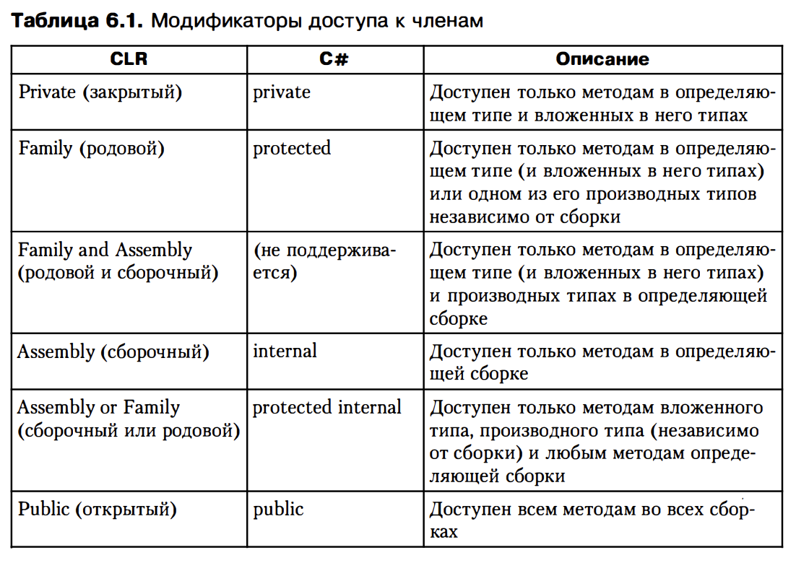
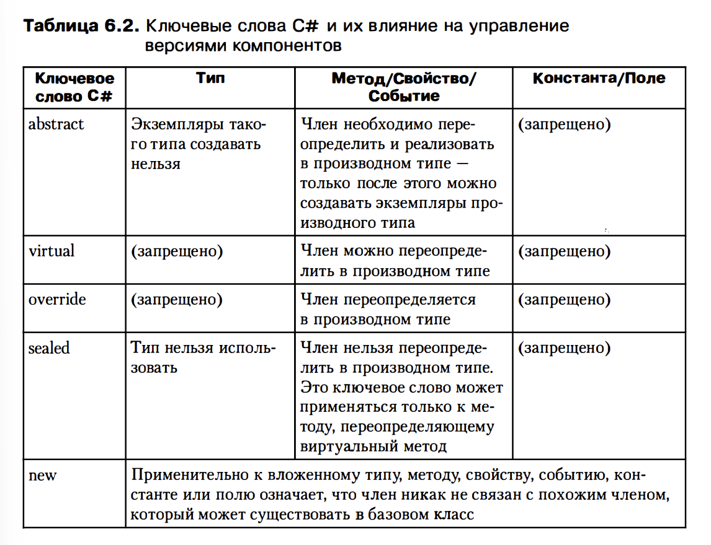

#Глава 6. Осноаные сведения о членах и типах 

1) Члены типа
	1.1) Константа
	1.2) Поле
		1.2.1) Поле может быть статическим - тогда оно является частью типа
		1.2.2) поле может быть экземлярным (нестатическим) - тогда оно является частью объекта
	1.3) Конструктор экземпляров
	1.4) Конструктор типа
	1.5) Метод - представляет собой функцию, выполняющую операции, которые изменяют или запрашивают состояние типа (статический метод)
	     или объекта (экземлярный метод). Методы обычно осуществляют чтение и запись полей типов или объектов
	1.6) Перегруженный оператор - не входит в CLS, посколько не все языки программирование ее поддерживают
	1.7) Оператор преобразования - не входит в CLS
	1.8) Свойство
	1.9) Событие - статическое событие служит механизмом, позволяющим типу посылать уведомление статическому или экземплярному методу
	     Экземплярное (нестатическое) событие служит механизмом, позволяющим объекту посылать уведомление статическому или экземплярному методу
		 События обычно инициируются в ответ на изменение состояния типа или объекта, порождающего событие. Событие состоит из двух методов, позволяющих 
		 статическим или экземплярным методам регистрировать и отменять регистрацию (подписку) на событие.
	1.10) Тип
		1.10.1) Тип можно сделать открытым (public) или внутренним (internal). Открытый тип доступен любому коду любой сборки
		        Внутренний тип доступен только из сборки, где он определен. 

2) Дружеские сборки (friend assemblies) - [assembly.InternalVisibleTo("Wintellect, PublicKey=123424..23843")]
	System.Runtime.ComplierServices;
	нужно для того, чтобы предоставить доступ только некоторым компаниям, при этом закрыть другим
	
3) Доступ к членам

Модификаторы доступа проверяются как компилятором во время сборки, так и JIT-компиляторов  в runtime
Если не указать модификатор, компилятор C# обычно (но не всегда) выберет закрытый
CLR требует, чтобы все члены интерфейсного типа были открытыми
Declared Accessibility
В производном типе переопределенные члены базового класса должны иметь тот же модификатор доступа, что и в базовом классе. Это ограничение именно языка C#, а не CLR

4) Статические методы
Такие классы существуют лишь для группировки логически связанных членов
Значимые типы не могут быть статическими
Компилятор налагает на статический класс ряд ограничений:
	4.1) Класс должен быть прямым потомком System.Object
	4.2) Класс не может реализовывать никаких интерфейсов
	4.3) В классе можно определять только статические члены (поля, методы, свойства и события). Любые экземлярные члены вызовут ошибку компиляции.
	4.4) Класс нельзя использовать в качестве поля, параметры метода или локальной переменной, поскольку это 
		подразумевает существовать переменной ссылающейся на экземпляр, что запрещено. 
		Обнаружив подобное обращение со статическим классом, компилятор вернет сообщение об ошибке.

5) Частиченые классы, структуры и интерфейсы
	5.1) Частиченые классы, структуры и интерфейсы поддерживаются исключительно компилятором C# и некоторых других языков, 
		CLR ничего о них не знает.
	5.2) ключевое слово partial говорит csc, что исходный код типа может распологаться в нескольких файлах
		Это может быть удобно для: управления версиями, разделение на конечные логические модули внутри файла, разделение кода
	5.3) Компоненты, полиморфизм и версии
		При компонентной разработке приложений (Component Software Programming, CSP) идеи ООП используются на уровне компонентов.
		Некоторые свойства компонента:
		1) Компоненты (сборка в .NET) можно публиковать
		2) Компоненты уникальны и идентифицируются по имени, версии, региональным страндартам и открытому коду
		3) Компонент сохраняет свою уникальность (код одной сборки никогда статически не связывается с другой сборкой - в .NET применяется
		только динамическое связывание)
		4) В компоненты всегда четко указана зависимость от других компонентов (ссылочные таблицы в метаданных)
		5) В компоненте определены требуемые разрешения на доступ. Для этого в CLR существует механизм защиты доступа к коду (Code Access Security, CAS)
		6) Опубликованный компонентом интерфейс (объектная модель) не изменяется во всех его служебных версиях
			Служебная версия (servicing) называют новую версию компонента, обратно совместимую с оригинальном
			Обысно служебная версия содержит исправление ошибок, исправления системы безопасности и небольшие корректировки функциональности
		7) в .NET номер версии состоит из 4 частей: старшего (major) и младшего (minor) номеров версии, номера компоновки (build) и номера редакции (revision)
			Например, 1.2.3.4: 1 - старший номер версии, 2 - младший номер версии, 3 - номер компоновки, 4 - номер редакции
			Старший и младший номера определяеют уникально сборки, а номера компоновки и редакции указывают не служебную версию
			Если выпускается версия с исправленными ошибками, изменяется номер компоновки и редакции
			Если выпускается несовместимая версия - нужно изменить старший и/или младший номер версии
		8) Можно писать код, устойчивый к изменениям. Проблемы управления возникают, когда типа, определенным в одном компоненте, используется в качестве базового класса для типа другого компонента.
			Изменения в базовом классе могут повлиять на поведение производного класса. Эти проблемы особенно характерны для полиморфизма, когда в производном типе переопределяются виртуальные методы базового класса

	5.4) Вызов виртуальных методов, свойств и событий в CLR
		В CLR есть две инструкции для вызова метода:
		1) call использующаяся для вызова статических, экземплярных и виртуальных методов
			Статический метод - необходимо указать тип, в котором определеяется метод. 
			Экземплярный или виртуальный метод - указать переменную, ссылающуюся на объект, причем call не делает проверку на null
			Если в типе переменной метод не определен, проверяются базовые типы. 
			Инструкция call часто служит для невиртуального вызова виртуального метода

			call: используется для вызова невиртуальный или статических методов
			метод, который вызывается определяется статически во время компиляции, и не поддерживает переопределение методов в производных типах
			это более простая и быстрая операция, так как вызов метода решается на этапе компиляции, и не требует дополнительных проверок во время выполнения
		2) callvirt только для вызова экземплярных и виртуальных методов
			При вызове необходимо указать переменную, ссылающуся на объект. 
			Если вызывается невиртуальный экземплярный метод - тип переменной показывает, где определен необходимый метод. 
			Для вызова виртуального экземплярного метода CLR определяет настоящий тип объета, на который ссылает переменная, и вызывает метод полиморфно
			csc проверяет значение во время компиляции 
			JIT-компилятор генерирует код для проверки значения переменной в runtime, если оно равно null - NullReferenceException. Из-за этой проверки выполняет немного медленнее чем call

			callvirt: используется для вызова виртуальных и интерфейсных методов
			в отличии от call поддерживает динамическое определение вызываемого метода во время выполнения
			это означает что при вызове метода с использованием callvirt CLR должен проверить реальный тип объекта и вызвать соответствующую реализацию метода.
			поэтому callvirt обычно требует больше вычислительного времени и может быть медленнее, чем call
		3) В C# все экземплярные методы вызываются с помощью callvirt
		4) Компиляторы стремятся  использовать команду call при вызове методов, определенных значимыми типами, поскольку они изолированные
			Экземпляр значимого типа никогда не будет null, поэтому NullRefException никогда не будет вызвано
			Для виртуального вызова виртуального метода значимого типа CLR необходимо получить ссылку на объект значимого типа, чтобы воспользоваться его таблицей методов, а это требует упаковки значимого типа. А упаковка создает большую нагрузку на кучу, увеличивая частоту сборки мусора и снижая производительность
		5) Независимо от используемой для вызова экземплярнаго или виртуального 
			метода инструкции - са 11 или са 11 vi rt - эти методы всегда в качестве первого параметра получают скрытый аргумент this, ссылающийся на объект, над 
			которым производятся действия
		6) При проектировании типа следует стремиться минимизировать количество виртуальных методов. 
			6.1) виртуальный метод вызывается медленнее невиртуалъного
			6.2) JIТ-компилятор не может подставлятъ (inline) виртуальные методы, что также бьет по производителъности
			6.3) виртуальные методы затрудняют управление версиями компонентов
			6.4) при определении типа часто создается набор перегруженных методов, чтобы сделать их полиморфными, лучше всего сделать наиболее сложный метод виртуальным, оставив другие методы невиртуальными
				Следование этому правилу поможет управлять версиями компонентов, не нарушая работу производных типов

	5.5) разумное использование видимости типов и модификаторов доступа к членам
		Три веские причины в пользу использования изолированных классов:
		1) управление версиями. Если в неизолированном определены неизолированные виртуальные методы, необходимо сохранять порядок вызова виртуальных методов в новых версиях, иначе в будущем возникнут проблемы с производными типами
		2) производительность. невиртуальные методы вызываются быстрее виртуальных, посколько для последних CLR во время выполнения проверяет тип объекта, чтобы выяснить, где находится метод. Однако встретив вызов виртуального метода 
			в изолированном типе, JIT-компилятор может сгенерировать более эффективный код, задействовав невиртуальный вызов. Это возможно потому что у излированного класса не может быть производных классов. 
		3) безопасность и предказуемость. Состояние класса должно быть надежно и защищенно. Если класс не изолирован, производный класс может изменить его состояние, воспользовавшись незащищенными полями или методами базового класса, 
			изменяющими его доступные незакрытые поля. Кроме того, в производном классе можно переопределить виртуальные методы и не вызывать реализацию соответствующих методов базового класса. 
			Виртуальные методы, свойства и собыстия базового класса позволяют контролировать его поведение и состояние в производном классе, что при неумелом обращении может вызвать непредсказуемое поведение и проблемы с безопасностью
		4) Джеффри Рихтер предложил ввести новый модификатор доступа к классу - closed: его можно использовать как базовый, но его поведение нельзя изменить в производном классе. Производному классу будут доступны только открытые члены замкнутого класса
			Это позволит изменять базовый класс, не опасаясь за работоспособность производного класса. Идеальным будет, если это будет дефолтный модификатор доступа
		5) Есть возможность сделать slosed имеющимися средствами: при реализации класса изолировать все наследуемые им виртуальные методы (включая методы, определенные в System.Object)
		6) Несколько правил, которым можно следовать при проектировании классов:
			1) Если класс не предзначзначен для наследования, его следует явно объявить изолированным. Если нет необходимости в предоставлении другим сборкам доступа к классу, его следует сделать внутренним
			2) Поля данных класса всегда следует объявлять закрытыми. По умолчанию csc так и делает. 
			3) Методы, свойства и события класса всегда следует делать закрытыми и невиртуальными. csc делает именно так по умолчанию. Естественно, чтобы типом можно было пользоваться, некоторые должны быть открытыми, но лучше не делать их 
				защищенными или внутренними, поскольку это может сделать тип уязвимым. Впрочем, защищенный или внутренний член все-таки лучше виртуального, посколько последний предоставляет производному классу большие возможности и всецело зависит от корректности его поведения
			4) в ООП есть поговорка: "лучший метод борьбы со сложностью - добавление новых типов". Если реализация алгоритма чрезмерно усложняется, следует определить вспомогательные типы, инкапсулирующие часть функциональности. Если вспомогательные типы используются в единственном супертипе, 
				следует сделать их вложенными. Это позволит ссылаться на них через супертип и позволит им обращаться к защищенным членам супертипа. Однако существует правило проектирования, рекомендующее определять общедоступные вложенные типы в области видимости файла или сборки (за пределами супертипа), 
				поскольку некоторые разработчики считают синтаксис обращения к вложенным типам громоздким.

	5.6) Работа с виртуальными методами при управлении версиями типов
		1) управление версиями - важный аспект компонентного программирования (часть смотри в главе 3, где речь шла о сборках со строгими именами и обсуждались меры, позволяющие администраторам гарантировать привязку приложение именно к тем сборкам, с которыми оно было скомпоновано и протестировано)
			Однако при управлении версиями возникают и другие сложности с совместимостью на уровне исходного кода. В частности, следует быть осторожными при добавлении и изменении членов базовго типа.
		2) 
