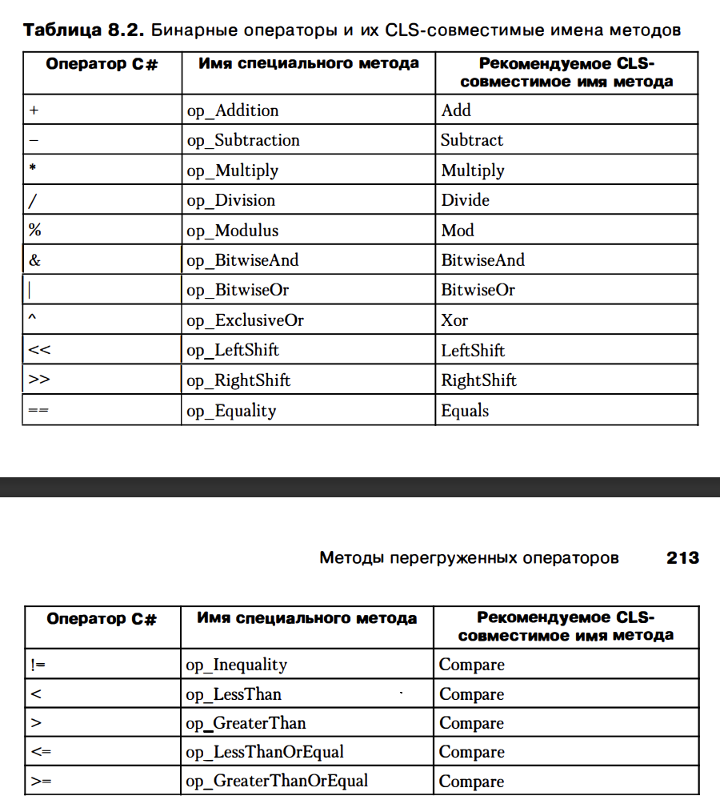

# Глава 8. Методы.

В частности, в главе показано, как определяются методы-конструкторы (создающие экземпляры типов и сами типы), методы перегрузки операторов и методы преобразования (выдающее явное и неявное привдение типов)
Кроме того, здесб рассказывается, как передать методу параметры по ссылкам и как определить метод, принимающи переменное число параметров

1) Конструкторы экземпляров и классы (ref types)
Конструкторы - специальные методы, позволяющие корректно инициализировать новый экземпляр типа. 
В отличии от других методов конструкторы экземпляров не наследуются. Иначе говоря, у класса есть только те конструкторы экземпляров, которые определены в этом классе => к констуктору экземпляров нельзя применять модификаторы virtual, new, override, sealed, abstract
Если определить класс без явно заданных конструкторов, csc создает default конструтор без параметров, реализация которого просто вызывает конструктор без параметров базового класса

Для абстрактных классов компилятор создает конструктор по умолчанию с модификатором protected, в противном случае область действия будет открытой (public). 
Если в базовом классе нет конструктора без параметров, производный класс должен явно вызывать конструтор базового класса, иначе компилятор вернет ошибку. 
Для статических классов (изолированных и абстрактных) компилятор создает конструктор по умолчанию. 

В редких случаях экземпляр типа может создаваться без вызова конструктора экземпляров. В частности метод MemberwiseClone объекта Object выделяет память, инициализирует служебные поля объекта, а затем копирует байты исходного объекта в область памяти, выделенную для нового объекта.
Кроме того, конструктор обычно не вызывается при десериализации объекта. Код десериализации выделяет память для объекта без вызова конструктора, используя метод GetUninitializedObject или GetSafeUninitializedObject типа System.Runtime.Serialization.FormatterServices 

Примечение: нельзя вызывать какие либо виртуальные методы конструктора, которые могут повлиять на создаваемый объект. Причина проста: если вызываемый виртуальный метод переопределен в типе, экземпляр которого создается, происходит реализация производного типа, но к этому моменту еще не завершилась инициализация всех полей в иерархии. В таких обстоятельствах последствия вызоыва виртуального метода непредсказуемы. 

2) Конструкторы экземпляров и структуры (значимые типы)
По большому счету, конструкторы значимых типов можно не определять. Фактически многие компиляторы (включая csc) не определяют для значимых типов конструкторы по умолчанию, не имеющие параметров
В конструкторе value type this представляет экземпляр значимого типа и ему можно приписать значение нового экземпляра значимого типа, у которого все поля инициализируются нулями. В конструкторах ссылочного типа указатель this является неизменяемым (при попытке так сделать будет CS1604)

3) Конструкторы типов
Помимо конструкторов экземпляров CLR поддерживает конструкторы типов (также известные как статические конструкторы, конструкторы классов и инициализаторы типов). Конструкторы типов можно применять и к интерфейсам (но csc этого не допускает), ссылочным и значимым типам. 
Конструкторы экземпляров используются для установки первоначального состояния экземпляра типа, конструкторы типов служат для установки первоначального состояния экземпляра типа. По умолчанию, у типа не определено конструктора (он может быть 1 и только 1). У конструкторов типов никогда не бывает параметров.
Модификатороми доступа их нельзя помечать, по дефолту - они закрытые
Конструкторы типов всегда должены быть закрытыми, чтобы код разработчика не смог их вызывать, напротив, в то же время среда CLR всегда способна вызвать конструктор типа
В таблице определений методов, составляющей метаданные модуля, метод-конструктор типа всегда называется .cctor (от class constructor)
Конструктор типа не должен вызывать конструктор базового класса. Этот вызов не обязателене, так как ни одно статическое поле типа не используется совместно с базовым типом и не наследуется от него.

4) Производительность конструкторов типов
При компиляции метода JIT компилятор сам решает, создавать ли вызов для исполнения конструктора типа. Если создавать, то надо решить, где разметить его в IL код. Есть две возможности:
	4.1) можно вставить непосредственно перед кодом, который создает первый экземпляр типа или обращаетяс к ненаследуемому полю или члену класса. ЭТо называется точно (precise) семантикой, так как CLR вызовет конструктор типа ровно тоогда, когда будет нужно
	4.2) можно создать метод в месте, предшествующему коду, обращающемуся к ненаследуемому статическому полю. Это называется семантикой вызова до инициации поля (before-field-init). Потому что в этом случае CLR обесп. выполнение стат. конструктора заранее, до обращения к статическому полю, то есть конструктор может выполняться значительно раньше

Семантика вызова до инициализации предпочитетельнее, так как предоставляет CLR свободу выбора времени вызова конструктора типа, что позволяет CLR по мере возможности создавать более эффективный код. 

5) Методы перегруженных операторов
CLR ничего не известно о перегрузке операторов, ведь среда даже не знает что такое оператор
Смысл операторов и код, который должен быть сгенерирован, когда тот или иной оператор встретиться в тексте, определяется компилятором
С точки зрения CLR операторы представляеют собой просто методы
Спецификация CLR требует, чтобы перегруженные операторные методы были открытыми и статическими
csc требует, чтобы у операторного метода тип, по крайней мере, одного из параметров или возвращаемого значения совпадал с типом, в котором определен операторный метод. Причина этого ограничения в том, что оно позволяет компилятору C# в разумное время находить кандидатуры операторный методов для привязки.

Унарные операторы:

Бинарные операторы

В спецификации CLR определены многие другие операторы, поддающиеся перегрузке, но C# их не поддерживает
Они не очень распространены. Полный список есть в спецификации ECMA общеязыковой инфраструктуры CLI, разделы 10.3.1 (унарные операторы) и 10.3.2 (бинарные)

6) Методы операторов преобразования
Иногда требуется преобразовывать объекты одного типа в объекты совершенно другого типа
Некоторые языки (в том числе C#) поддерживают перегрузку операторов преобрвазования - методы, преобразующие объекты одного типа в объекты другого типа.
Спецификация CLR требует, чтобы перегруженные методы преобразования были открытыми и статическими.
csc требует, чтобы у метода преобразования тип, по крайней мере, одного из параметров или возвращаемого значения совпадал с типов, в котором определен операторный метод
Причина такого ограничения совпадает с той, что есть у методов перегруженного оператора
Ключевые слова explicit и implicit
csc обнаруживает в коде операции приведения (преобразования типов) и при помощи внутренних механизмов генерирует IL код, которые вызывает методы операторов преобразования, определенные в типе. 
Имена этих методов будут - op_Implicit и op_Explicit с разными сигнатурами
C# позволяет создавать методы с одинаковыми названиями, входными данными, но разными возвращаемыми типами, но в других языках (таких как C++ и Java так нельзя делать)

7) Методы расширения
Позволяют определить статический метод, который вызывается посредством синтаксиса экземплярного метода
Другиим словами мы можем определить собественный метод в типе
Правила и рекомендации:
	1) C# поддерживает только методы расширения, он не поддерживает свойства расширения, события расширения, операторов расширения
	2) Методы расширения должны быть объявлены в статическом необобщенном классе. Однако нет ограничения на имя этого класса, вы можете назвать его как вам угодно. Конечно, метод расширения должен иметь по крайней мере один парметр, и только первый парметр должен быть отмечен ключевым словом this
	3) csc ищет методы расширения, заданные только в статических классах, определенных в области файла. Метод расширения должен быть опрпделен в статическом классе первого уровня.
	4) Нельзя в двух местах создать одинаковый метод расширения, иначе ошибка компилятора о неоднозначночном вызове
	5) Сущесвуют проблемы с версиями. Если в стандартной библиотеке или любой другой, создадут такой же метод, то при перекомпиляции позникнет ошибка

8) Различные расширяемые типы с методами расширения
	8.1) CLR не генерирует код для проверки значения выражения на null, поэтому компилятор не будет это проверять. Это в runtime вылезет
	8.2) Также можно создать методы расширения для интерфейсных типов
	8.3) Также можно определять методы расширения для типов-делегатов
	
9) Аттрибут расширения
	9.1) В C#, когда ы помечаем первый параметр статического метода словом this, csc применяет соответствующий аттрибут к методу, и данный аттрибут сохраняется в метаданных результирующего файла. Этот аттрибут определен в сборке System.Core.dll
		Когда скомпилированный код вызывает несуществующий экземплярный метод, компилятор может быстро просканировать все ссылающиеся сборки, чтобы определить, какая из них содержит методы расширения

10) Частичные методы
	10.1) Представим, что мы используем инструмент, который производит исходный код на C#, содержащий определение типа. Этому инструменту известно, что внутри программного кода
		есть места, в которых вы хотели бы настроить поведение типа. Обычно такая настройка производится при помощи сгенерированного инструментом кода, вызывающего виртуальные методы.
		Такой кода также содержит определения для этих виртуальных методов, где их реализация ничего не делает, а просто осуществляет возврат управления. Чтобы настроить поведение класса, нужно определить 
		собственный класс, унаследованный от базового, и затем переопределить все его виртуальные методы, реализующие желаемое поведение.

	10.2) Частичные методы в C# могут пригодиться, когда необходимо разделить реализацию метода на две части: одну, которая определена в основном файле класса, и другую, которая может быть определена в другом файле или в другой части проекта. 
		Это позволяет разделить логику метода на две части, одна из которых может быть сгенерирована автоматически или определена пользователем.

	10.3) Примером использования частичных методов может быть ситуация, когда у нас есть сгенерированный класс из какого-то инструмента или фреймворка, и мы хотим дополнить его своими методами, но не хотим изменять сгенерированный код напрямую.
		Мы можем определить частичный метод в этом классе и реализовать его в отдельном файле, добавив необходимую функциональность без изменения сгенерированного кода.