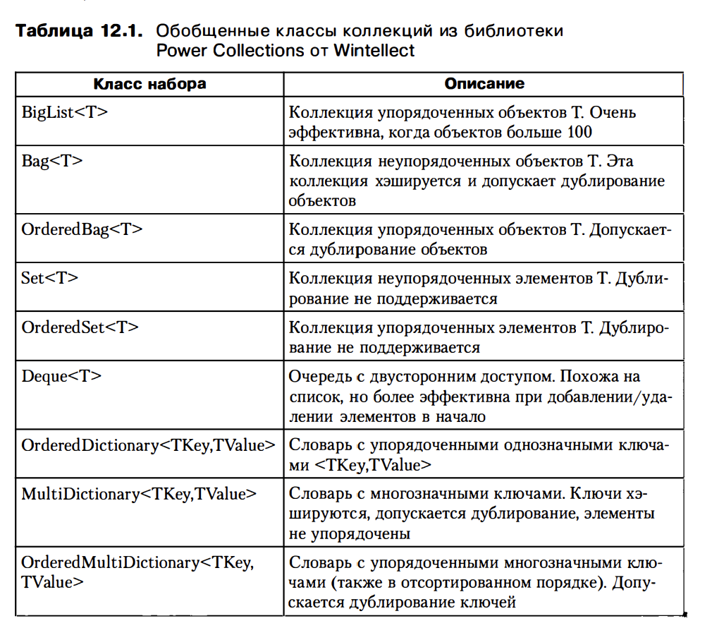
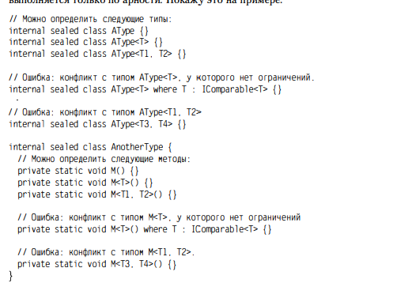

# Глава 12. Обобщения

1) Начало:
	1.1) Обобщения (generics) - еще один механизм, поддерживаемый общеязыковой исполняющей средой (CLR) и языками программирования
	1.2) Разработчик описывает алгоритм, не указывая тип данных, поэтому алгоритм может обобщенно применяться к объектам разных типов: Int32, String, например
	1.3) Поддерживаются обобщенные ссылочные и значимые типы, но обобщенные перечислимые типе нет. Также CLR поддерживает создание обобщенных методов, определенных в 
		ссылочном типе, в значимом типе или интерфейсе.
	1.4) Например, в FCL определен обобщенный алгоритм управления списками.
	1.5) При определении обобщенного типа или метода переменные, указывающие на типе (например, T), называются параметрами
		типа (type parameters), T - имя переменной, которое применяется в исходном тексте во всех местах, где используется соответствующий типа данных
	1.6) Рекомендации проектирование Microsoft утверждает, что переменные параметров должны называться T или по крайней мере, начинаеться с T: TKey, TValue
	1.7) В случае обобщенного типа или метода указанные типе данных называются аргументами типа (type arguments)
	1.8) Главные преимущества обобщений для разработчиков:
		1.8.1) Защита исходного кода. Разработчику, использующему обобщенный алгоритм, не нужен доступ к исходному тексту 
			алгоритма (при обработке с шаблонами C++ или обобщениями Java разработчику требуется исходный текст алгоритма)
		1.8.2) Безопасность типов. Компилятор и CLR обеспечивают, чтобы в алгоритма использовались лишь объекты совместимые с нужным типом данных.
		1.8.3) Более простой и понятный код. Нужно меньше операций приведения типов, такой код проще читать и поддерживать. 
		1.8.4) Повышение производительности. До появление дженериков, обобщенные алгоритмы писались с использованием Object. Чтобы такие алгоритмы работали 
			с экземплярами значимого типа, перед вызовом членом алгоритма среда CLR должна была упаковать этот экземпляр, что требует выделения памяти в heap, 
			что накладно по времени, ресурсам, и чаще страртует GC, что снижает производительность. Поскольку обобщения работают с конкретным значимым типом,
			экземпляры значимого типа могут передаваться по значению и CLR не надо выполнять упаковку. Операции приведения типов также не нужны, и CLR не надо 
			контролировать безопасность типов при их преобразовании.
	
			На тестовом примере видно следующее:
			1. с типом Int32 (value type) обобщенный алгоритм List работает гораздно быстрее, чем с необобщенным
			Разница в 20 раз в работе. Кроме того, использование значимого типа с алгоритмом ArratList требует
			множества операций упаковки, и как результат, 33 процедуры сборки мусора, а в алгоритме List не 
			требуется операций упаковки и сборки мусора (у меня правда почему-то 3 раза прошел GC)
			2. для ссылочных типов разницы нет разницы в производительности.
	1.9) CLR генерирует машинный код для любого метода при первом его вызове в применении к конкретному типу данных. 
		Это увеличивает размер рабочего набора приложения и снижает производительность. 


2) Обобщения в библиотеке FCL
	2.1) System.Collections.Generic и System.Collections.ObjectModel. Обобщения применяется с классами
		коллекций, и в FCL определено несколько таких обобщенных классов, их можно найти в этих namespaces.
		Также есть безопасные относительно потоков классы коллекций из System.Collections.Concurrent
	2.2) Microsoft рекомендует отказаться от необобщенных классов коллекций в пользу обобщенных аналогов 
		по 2 причинам. 1 мы уже затрагивали: это производительность, понятность кода
		2 причина заключается в том, что объектная модель у обобщенных классов лучше. У них меньше виртуальных 
		методов, что повышает производительности, а новые члены, добавленные в обобщенные коллекции, предоставляют
		массу новых возможностей
	2.3) Новые обобщенные интерфейсы не заменяют необобщенные: во многих ситуациях приходится задействовать
		оба вида интерфейсов. Причина - необходимость поддержания обратной совместимости. Например, 
		если бы класс List<T> реализовал только IList<T>, в коде нельзя было бы расматривать объект
		List<DateTime> как IList
		Также, например, класс System.Array, базовый для всех типов массиво, поддерживает множество 
		статических обобщенных методов, в том числе AsReadOnlyBinarySearch, Exists, Find и т.д.
		Вот так выглядят некоторые из них:
		```
		public abstract class Array : ICloneable, IList, ICollection, IEnumerable
		{
			public static void Sort<T>(T[] array);

			public static void Sort<T>(T[] array, IComparer<T> comparer);
			public static Int32 BinarySearch<T>(T[] array, T value);
		}
		```

3) Библиотека Power Collections производства Wintellect
	3.1) По заказу Microsoft компания Wintellect разработала библиотеку Роwег 
		Collections, основное назначение которой - сделать некоторые классы коллекций из SТL-библиотеки 
		С++ доступными для CLR. Классы библиотеки Power Collections распространяются бесплатно (детали на http://Wintellect.com).
		Эти классы коллекций сами по себе являются обобщенными и в них широко используются обобщения
	

4) Инфраструктруа обобщений
	4.1) Обобщения были добавлены в версию 2.0 CLR, над реализацией обобщений долго работало множество специалистов
		Для поддержания работы обобщений Microsoft нужно было сделать следующее:
		4.1.1) Создать новые IL-команды, работающие с аргументами типа.
		4.1.2) Изменить формат существующих таблиц метаданных для выражения имен типов и методов 
			с обобщенными параметрами
		4.1.3) Обновить япы, чтобы обеспечить поддержку нового синтаксиса обобщений
		4.1.4) Изменить компиляторы для генерации новых IL-команд и измененного формата метаданных
		4.1.5) Изменить JIT-компилятор, чтобы он обрабатывал новые IL-команды, работающие с аргументами типа, 
			и создавал корректный машинный код
		4.1.6) Создать новые члены отображения, для того, чтобы разработчиик с помощью запроса могли проверять
			наличие обобщенных параметров у типов и членов
		4.1.7) Определить новые предоставляющие информацию отражения члены, что позволило разработчикам создавать 
			обобщенные определения типов и методов во время исполнения
		4.1.8) Изменить отладчик, чтобы он поддержал обобщенные типы, члены, поля и локальные переменные
		4.1.9) Изменить механизм IntelliSense в VS для вызова конкретных прототипов членов при использовании
			обобщенного типа или метода с указанием типа данных

А теперь нужно рассмотреть, как работают с обобщениями внутренние механизмы CLR. Эта информация может 
пригодиться как при проектировании и создании обобщенных алгоритмов, так и при выборе готовых обобщенных
алгоритмов.
5) Открктые и закрытые типы
	5.1) CLR создает внутренню структуру данных для каждого типа, приняемого в приложении. Эти структуры
		данных называют объектами типа (type objects). Тип с обобщенными параметрами типа также считается 
		типом, причем для такого типа CLR создает внутренний объект типа. Это справедливо для ссылочных типов
		(классов), значимых типов (структур), интерфейсов и делегатов. Тем не менее тип с обобщенными параметрами
		типа называют открытым типом (open type), а в CLR запрещено конструирование экземпляров открытых типов
		(как и экземпляров интерфейсных типов)
	5.2) При ссылке на обобщенный тип в коде можно определить набор обобщенных аргументов типа. Если всем аргументам
		определенного типа переданы действительные типы данных, то он становится закрытым типом (closed type).
		CLR разрешает создание экземпляров закрытых типов. Тем не менее в коде, ссылающемся на обобщенный тип, можно
		не определять все обобщенные аргументы типа. Таким образом, в CLR создается новый объект открытого типа, 
		экземляры которого создавать нельзя. 
	5.3) CLR размещает статические поля типа в самом объекте типа. Поэтому у каждого закрытого типа есть свои статические
		поля. Иначе говоря, статические поля, определенные в List<T>, не будут совместно использоваться объектами 
		List<DateTime> и List<String>
		Иногда разработчики определяют статический конструктор для обобщенного типа, чтобы аргументы типа соответствовали
		определенным критериям. Например, обобщенный тип, используемый только с перечислимыми типами

6) Обобщенные типы и наследование
	6.1) При использовании обобщенного типа с указанием аргументов типа в CLR определяется новый объект типа, производный
		от того же типа, что и обобщенный тип.
		Например, тип List<T> является производным от Object, поэтому типы List<String> и List<Guid> тоже производные
		от Object. 
		Аналогично, тип DictionaryStringKey<TValue> - проивзодный от Dictionary<String, TValue>, поэтому 
		DictionaryStringKey<Guid> также производный от Dictionary<String, Guid>
		Понимание того, что определение аргументов типа не имеет ничего общего с иерархиями наследования, позволяет 
		разобраться, какие приведения типов допустимы, а какие нет

7) "Распухание" кода
	7.1) При JIT компиляции метода, в котором используются обобщенные параметры типа, CLR подставляет в IL-код метода
		указанные аргументы типа, а затем создает машинный код для данного метода, работающего с конкретными типам данных
		В данном подходе есть один недостаток: CLR генерирует машинный код для каждого сочетания "метод+тип", что 
		приводит к распуханию кода (code explosion), в итоге существенно увеличивается рабочий набор приложения, снижая
		производительность
	7.2) В CLR есть несколько оптимизационных алгоритмов, призванных предотвратить разрастание кода. 
		1) Если метод вызывается для конкретного аргумента типа и позже он вызывается опять с тем же аргументом типа, 
		CLR компилирует код для такого сочетания "метод+тип" только один раз. Поэтому, если List<DateTime> 
		используется в двух совершенно разных сборках (загруженных в один домен приложений), CLR компилирует методы 
		для List<DateTime> всего один раз. Это существенно сокращает степень распухания кода. 
		2) CLR считает все аргументы ссылочного типа тождественными, что опять же обеспечивает совместное использование
		кода. Например, код, скомпилированный в CLR для методов List<String>, может применяться для методов List<Stream>,
		потому что String и Stream - ссылочные типы. По сути, для всех ссылочных типов используется одинаковый код. 
		CLR выполняет эту оптимизацию, потому что все аргументы и переменные ссылочного типа - это просто указатели на 
		объекты в куче, а все указатели на объекты обрабатываются одинаково.
		3) Если аргументы типа имеют значимый тип, среда CLR должна сгенерировать машинный код именно для значимого типа. 
		Это объясняется тем, что у значимый типов может быть разный размер.

8) Обобщенные интерфейсы
	8.1) Конечно, основное преимущество обобщений - их способность определять обобщенные ссылочные и значимые типы. 
		Но для CLR также исключительно важна поддержка обобщенных интерфейсов. Без них любая попытка работы со 
		значимым типов через необобщенный интерфейс (например, IComparable) всякий раз будет приводить к необходимости
		упаковки и потере безопасности обобщенных типов. Это сильно сузило бы область применения обобщенных типов.
		Вот почему CLR поддерживает обобщенные интерфейсы. 
		Ссылочный и значимый типы реализуют обобщенный интерфейс путем задания аргументов типа, или же любой тип 
		реализует обобщенный интерфейс, не определяя аргументы типа. А этот тип реализует данный обобщенный интерфейс
		и задает аргументы типа.

9) Обобщенные делегаты
	9.1) Поддержка обобщенных делегатов в CLR позволяет передавать методам обратного вызова любые типы объектов, 
		обеспечивая при этом безопасность типов. Более того, благодаря обобщенным делегатам экземпляры значимого 
		типа могут передаваться методам обратного вызова без упаковки.
		Делегат - это просто определение класса с помощью четырех методов: конструктора и методов:
		Invoke, BeginInvoke, EndInvoke. При определении типа делегата с параметрами типа компилятор задает 
		методы класса делегата, а параметры типа применяются ко всем методам, параметры и возвращаемые значения
		которых относятся к указанному параметру типа.

10) Контравариантные и ковариантные аргументы обобщенного типа делегатов и интерфейсов
	10.1) Параметры обобщенного типа могут быть следующими:
		1) Инвариантными. Параметр обобщенного типа не может изменяться
		2) Контравариантными. Параметр обобщенного типа может изменяться в наследуемом классе. В языке С# вы обозначаете контравариантный 
			тип при помощи ключевого слова in. Контравариантный параметр обобщенного типа может появляться только во входной позиции, 
			например, в качестве аргументов метода
		3) Ковариантными. Аргумент обобщенного типа может быть изменен в базовом классе. В языке С# вы обозначаете ковариантный тип 
			при помощи ключевого слова out

	10.2) Расхождение - когда компилятор устанавливает, что между двумя типами существует обращение по ссылке. 
	```
	void ProcessCollection(IEnumeraЬle<Object> collection) { ... } 
	```
		В этот метод нельзя передать List<DateTime>, даже несмотря на то, что List наследуется от IEnumerable, а DateTime от Object
		Рассхождение также недопустимо для параметра обобщенного типа, если аргумент того типа передается в метод при помощи ключевых слов out 
		и ref:
		```
		delegate void SomeDelegate<in T>(ref Т t);
		```
		Эта строка выдает следующую ошибку: недействительное расхождение: типа параметра T должен быть инвариантно действительным для 
		SomeDelegate<T>.Invoke(ref T). T - контравариантно

11) Обобщенные методы
	11.1) Очень удобно объявить метод, который будет работать с каким то обобщенным типом
	11.2) Интерфейсы обобщенных методов и типов
		Логический вывод типов type inference 

12) Обобщение и другие члены
	В языке С# у свойств, индексаторов, событий, операторных методов, конструкторов и деструкторов не может быть параметров типа. 
	Однако их можно определить в обобщенном типе с тем, чтобы в их коде использовать параметры этого типа.

13) Верификация и ограничения
	1) Частая ошибка:ошибка CS0117: Т не содержит определение метода ...
	2) Механизм ограничений (constraints): where T : 
	```
	private static T Min<T>(T o1, T o2) where T : IComparable<T>
	```
	При попытке задать T не реализующий этот интерфейс компилятор выдаст ошибку:
	тип ... необходимо преобразовать в System.IComparable<object>, чтобы его можно было использовать в 
	качестве параметра T
	CLR не поддерживает перегрузку по именами параметров типа или по именам ограничений. Перегрузка типов и 
	методов выполняется только по арности
	
	При переопределении виртуального обобщенного метода в переопределяющем методе нужно задавать то же 
	число параметров типа, а они, в свою очередь, наследуют ограничения, заданные для них методом базового 
	класса. 
	3) К параметру могут применяться следующие ограничения: основное (primary), дополнительное (secondary), 
		и/или ограничение конструктора (constructor constraint)

14) Основные ограничения
	1) В параметре типа можно задать не более одного основного ограничения. Основным ограничением может быть 
		ссылочный тип, указывающий на неизолированный класс. 
		Нельзя использовать для этой цели следующие типы: Object, Array, Delegate, MulticastDelegate, 
		ValueType, Enum, Void
		При задании ограничения ссылочного типа вы обязуетесь перед компилятором, что любой аргумент типа
		будет иметь либо тот же тип, что ограничение, либо производный от него тип
		Ограничение class гарантирует компилятоур, что указанный аргумент типа будет иметь ref type
		Этому ограничению удовлетворяют все классы, интерфейсы, делегаты, массивы
		Ограничение struct гарантирует, что аргумент будет valut type
		Этому ограничению удовлетворяют все значимые типы, а также перечисления. Однако компилятор и CLR 
		рассматривают любой значимый тип System.Nullable<T> как особый, и значимые типы с поддержкой значения
		null не подходят под это ограничение

15) Дополнительные ограничения
	1) В параметре типа можно задать несколько дополнительных ограничений или не задавать их вообще. 
	При задании ограничения типа интерфейса компилятору гарантируется, что указананный аргумент типа будет 
	иметь тип, реализующий этот интерфейс. 
	Другой тип дополнительных ограничений называют ограничением параметра типа (type parameter constraint)
	Оно используется гораздо реже, чем ограничение интерфейса, и позволяет обобщенному типу или методу указать, 
	что между указанными аргументами типа должны быть определенные отношения. К параметру типа может быть 
	применено несколько или ни одного ограничения типа. 

16) Ограничения конструктора
	1) В параметре типа можно задать не более одного ограничения конструктора. Ограничения конструктора 
	указывают компилятору, что указанный аргумент типа будет иметь неабстрактный тип, реализующий
	открытый конструктор без параметров. csc считает за ошибку одновременное задание ограничения конструктора
	и ограничения struct, потому что это избыточно. У всех значимых типов неявно присутствует открытый конструктор
	без параметров.

17) Другие проблемы верификации
	1) Приведение переменной обобщенного типа
		Приведение переменной обобщенного типа к другому типу допускается, лишь она приводится к типу, 
		разрешенному ограничением
	2) Присваивание переменной обобщенного типа значения по умолчанию
		Присваивание переменной обобщенного типа к null допустимо, только если обощенный тип ограничен 
		ссылочным типом.
		Т.к. параметр типа T не ограничен он может иметь значимый тип, поэтому приравлять ее к null нельзя.
		Это можно сделать только если есть ограничение на ссылочный тип.
		Разработчики Microsoft посчитали, что может понадобиться присвоить переменной значение по умолчанию. 
		Для этого есть ключевое слово default. Это слово дает команду csc и JIT компилятору CLR создать код, 
		приравнивающий temp к null, если тип имеет ссылочный тип, и обнуляющий все биты переменной, если это 
		значимый тип.
	3) Сравнение переменной обобщенного типа с null
		Сравнение переменной обобщенного типа с null допустимо не зависимо от того, ограничен ли обобщенный тип
		Если мы делаем условие на проверку null обобщенного типа с ограничением на значимый тип, JIT-компилятор
		не создает просто машинный код для инструкции if. Именно поэтому и не будет возвращена ошибка, потому 
		что просто нет машинного кода, сравнивающего значимый тип с null
	4) Сравнение двух переменных обобщенного типа
		Сравнение двух переменных одинакового типа допустим только в том случае, если обобщенный параметр 
		типа имеет ссылочный тип. Сравнивать две переменные значимого тип допустимо лишь в том случае, 
		когда значимый тип перегружает оператор ==. Если параметр T ограничен ссылочным типом, перегружающим 
		метод operator==, компилятор сгенерирует вызовы этого метода при виде оператора ==.
	5) Использование переменных обобщенного типа в качестве операндов
		Немало трудностей несет в себе использование операторов с операндами обобщенного типа
		C# умеет интерпретировать операторы, применяемые к элементарным типа (+, -, *, /), однако эти 
		операторы нельзя использовать с переменными обобщенного типа, потому что во время компиляции
		csc не знает их тип. Получается, что нельзя спроектировать математический алгоритм для произвольных 
		числовых типов данных
		оператор < (>) нельзя применять к операндам типа T и T
		оператор ++ (--) нельзя применять к операнду типа T
		оператор += (-=) нельзя применять к операндам типа T и T
		Это существенно ограничивает поддержку обобщений в среде CLR, и многие разработчики (особенно из 
		научных и математических кругов) испытали глубокое разочарование. Многие пытались обойти это ограничение, 
		прибегая к отражению, перегрузке операторов и т.п. Однако все эти решения сильно снижают производительность
		или ухудшают читабельности кода.