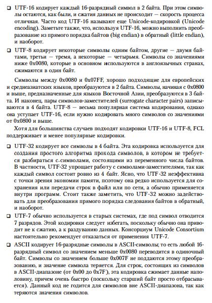
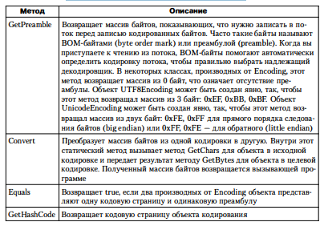
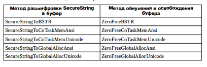

# Глава 14. Символы, строки и обработка текста


1) Символы
	1) System.Char - Значимый тип
	2) Категория символа - управляющий символ, символ валюты, буква в нижнем или верхнем регистре, знак 
		пунктуации, математический символ и т.д. System.Globalization.UnicodeCategory
	3) I sDigit, Isletter, IsWhiteSpace, IsUpper, Islower, IsPunctuation, 
		IsletterOrDigit, IsContro1 , IsNumber, IsSeparator, IsSurrogate, IsLowSurrogate, 
		IsHighSurrogate и IsSymbo1

	4) Региональные стандарты - culture, для преобразования символа с учетом culture, относящихся к вызывающему
		потоку (статическое свойство CurrentCulture класса Thread), служат ToLower и ToUpper
		Чтобы задать определенный набор региональных стандартов, передайте этим методам экземпляр класса 
		CultureInfo
	5) Equals - возвращает true, если два экземпляра представляют один и тот же 16-разрядный Unicode символ
		CompareTo - сравнивает два кодовых значения без учета региональных стандартов
		ToString - возвращает строку, состоящую из одного символа
		Parse и TryParse - получают односимвольную строку и возвращают соответствующую кодовую позицию UTF-16
		GetNumericValue - возвращает числовой эквивалент символа

	6) Три способа преобразования различных числовых типов в экземпляры типа Char и наоборот:
		- Приведение типа. Самый эффективный способ, тк компилятор генерирует IL-команды преобразования без
		вызовов каких-либо методов. ДЛя преобразования типа Char в числовое значение, такое как Int32,
		приведение подходит лучше всего. Кроме того, в C# допускается указывать, какой код выполняет 
		преобразование: проверяемый или непроверяемый
		- Использование типа Convert. У типа System.Convert есть несколько статических методов, корректно
		преобразующих Char в числовой тип и обратно. Все эти методы выполняют преобразование как проверяемую
		операцию, чтобы в случае потери данных при преобразовании вбрасывалось исключение OverflowException
		- Использование интерфейса IConvertible. В типе Char и во всех числовых типах библиотеки FCL 
		реализован интерфейс IConvertible, в котором определены такие методы, как ToUInt16 и ToChar. Этот
		способ наименее эффективен, так как вызов интерфейсных методов для числовых типов приводит к упаковке
		экземпляра: Char и все числовые типы являются значимыми. Методы IConvertible выбрасывают исключение
		InvalidCastException, если преобразование невозможно или грозит потерей данных. Все методы IConvertible
		за исключением GetTypeCode принимают ссылку на объект, реализующий интерфейс IFormatProvider. Этот 
		параметр полезен, когда по какой-либо причине при преобразовании требуется учитывать региональные 
		стандарты. В большинстве операций в этом параметре передается null, потому что он все равно 
		игнорируется.

2) Тип System.String
	1) Неизменяемый упорядоченный набор символом
	2) В C# String считают элементарным типом, то есть csc разрешает вставлять литеральные строки 
		непостредственно в исходный код. Компилятор помещает эти литеральные строки в метаданные модуля, где
		они часто загружаются и на них ссылаются во время выполнения.
		в C# с помощью оператора new нельзя создавать объекты типа String
	3) За создание нового экземпляра объекта отвечает IL-команда newobj. Однако для создание строки нет
		такой команды, вместо нее используется специальная команда ldstr (загрузка строки), которая создает
		объект String на основе литеральной строки, полученной из метаданных. 
	3) В C# имеется специальный синтаксис для ввода литеральных строк в исходный код. Для вставки специальных
		символов, таких как конец строки, возврат каретки, забой
		Задавать в коде последовательность символов конца строки и перевода каретки напрямую не рекомендуется
		Лучше использовать System.Enviroment.NewLine, которая зависит от платформы
	4) оператор + выполняется на этапе компиляции и не создается отдельных строк из литералов
		Конкатенация нелитеральных строк с помощью оператора + происходит на этапе выполнения. Для
		конкатенации нескольких строк на этапе выполнения оператор + применять нежелательно, тк он создает 
		в куче несколько строковых объектов. Вместо него использовать надо тип System.Text.StringBuilder
	5) В C# есть особый вариант объявления строки, в которой все символы между кавычками трактуются как часть
		строки. Это специальные объявления - буквальные строки (verbatim strings) - обычно используют при
		задании пути к файлу или каталогу и при работе с регулярными выражениями

3) Неизменяемые строки
	1) объект String - неизменяемым, то есть созданную однажды строку нельзя сделать длиннее или короче, 
		в ней нельзя изменить ни одного символа. Неизменяемость строк дает определенные преимущества. 
		```
		if(s.ToUpperInvariant().Substring(10, 21).EndWith("EXE")) { }
		```
		В приведенном коде ToUpperInvariant возвращает новую строку, символы в строке s не изменяются.
		Substring обрабатывает стркоу, возвращенную ToUpperInvariant, и тоже возаращает новую строку, которая
		затем передается методу EndsWith. По итогу в куче помимо строки s создается еще 2 строки, на которые
		нет ссылки. Это приведет потом к сборке мусора. Если требуется эффективно выполнять много операций со
		строками лучше использовать класс StringBuilder
	2) Благодаря неизменности строк отпадает проблема синхронизации потоков при работе со строками. 
		Кроме того, в CLR несколько ссылок String могут указывать на один, а не на несколько разных строковых
		объектов, если строки идентичны. А значит, можно сократить количество строк в системе и уменьшить 
		расход памяти - это именно то, что непосредственно относится к интернированию строк (string interning)
		По соображениям производительности тип String тесно интегрирован с CLR. В частности CLR "знает" о 
		размещении полей в этом типе и обращается к ним напрямую. За повышение производительности и прямой доступ
		приходится платить небольшую цену: класс String является изолированным. Иначе, имея возможность
		описать собственный тип, производный от String, можно было бы добавлять свои поля, противоречащие
		структуре String и нарушающие работу CLR. Кроме того, ваши действия могли бы нарушить представляения
		CLR об объекте String, которые вытекают из его неизменности

4) Сравнение строк
	1) Сравнение - одно из наиболее часто выполняемых со строками операций. Мы сравниваем их для выяснения, 
		равны ли они, и для сортировки
	2) Для сравнения строк Рихтер настоятельно рекомендует использовать один из этих методов, реализованных
		в классе String:
		
		При сортировке всегда нужно учитывать регистр
		А аргументе comparisonType передается одно из значений, определенных в перечислимом типе
		StringComparison, где есть: CurrentCulture, CuurentCultureIgnoreCase, InvariantCulture,
		InvariantCultureIgnoreCase, Ordinal, OrdinalIgnoreCase
		Аргумент CompareOptions является одним из значений, определенным перечислимым типом CompareOptions
	3) Во многих программах строки применяют для решения таких задач, как поддержка имен путей и файлов, 
		URL-адресов, параметров и разделов реестра, переменных окружения, отражения, XML-тегов. Для сравнения
		строк внутри программы следует всегда использовать флаг StringComparison.Ordinal или
		StringComparison.OrdinalIgnoreCase. Это дает самый быстрый инструмент сравнения так как он игнорирует
		лингвистические особенности и региональные стандарты.
		В то же время, если требуется корректно сравнивать строки с точки зрения лингвистических особенностей
		(обычно перед выводом их на экран для пользователя), следует использовать флаг
		SystemComparison.CurrrentCulture или SystemComparison.CurrrentCultureIgnoreCase 
	4) Обычно следует избегать использования флагов StriпgComparison.InvariantCulture и 
		StringComparison.InvariantCultureIgnoreCase. Хотя эти значения и позволяют выполнить лингвистически 
		корректное сравнение, применение их для сравнения строк в программе занимает больше времени, чем флага 
		StringComparisoп.Ordinal или StringComparison.OrdinalIgnoreCase. Кроме того, игнорирование региональных 
		стандартов - совсем неудачный выбор для сортировки строк, которые планируется показывать пользователю
	5) Если вы хотите изменить регистр символов строки перед выполнением п ростого срав нения, следует 
		использовать предоставляемый String  метод ToUpperInvariant или ToLowerInvariant. При нормализации строк 
		настоятельно рекомендуется использовать метод ToUpperInvariant, а не 
		TolowerInvariant из-за того, что в Microsoft сравнение строк в верхнем 
		регистре оптимизировано. На самом деле, в FCL перед не зависящим от 
		регистра сравнением строки нормализуют путем приведения их к верхнему 
		регистру.
	6) В типе String определено несколько вариантов перегрузок методов Equals, StartWith, EndsWith,
		и CompareTo помимо тех, что приведены ранее. Microsoft рекомендует избегать других версий: 
		CompareTo, CompareOrdinal и операторов == и != следует также избегать. Причина в том, что 
		вызывающий код не определяет явно, как должно выполняться сравнение строк, а на основании
		метода нельзя узнать, какой способ сравнения выбран по умолчанию. Например, по умолчанию
		метод CompareTo выполняет сравнение с учетом региональных страндартов, а Equals - без учета. 
		Код будет легче читать и поддерживать, если всегда явно описывать, как следует выполнять
		сравнение строк.
	7) Лингвистически корректные сравнения. ДЛя представления пары "язык-страна" (как описано в 
		спецификации RFC 1766) в .NET используется System.Globalization.CultureInfo. 
		В CLR у каждого потока есть два свойства, относящиеся к этой паре и ссылающиеся на объект
		CultureInfo: 
		
		Внутренняя реализация объекта CultureInfo ссылается на объект System.Globalization.CompareInfo, 
		инкапсулирующий принятые в данных региональных стандартах таблицы сортировки в соответствии с 
		правилами Unicode. Эти таблицы являются частью самой инфраструктуры .NET Framework, поэтому все
		версии .NET (независимо от ОС) также будут сравнивать и сортировать строки.
	8) В некоторых редких случаях требуется более тонкий контроль при сравнении строк для проверки на 
		равенство и для сортировки. Это может потребоваться при сравнении строк с японскими иероглифами. 
		Дополнительный контроль получают через объект Cultureinfo свойства Compareinfo. Как отмечалось 
		ранее, объект Cultureinfo инкапсулирует таблицы сравнения символов для различных региональных 
		стандартов, причем для каждого регионального стандарта существует только один объект CompareInfo
	9) Метод Compare класса Compareinfo принимает в качестве параметра значение 
		перечислимого типа CompareOptions, в котором определены символы IgnoreCase, 
		IgnoreKanaType, IgnoreNonSpace, IgnoreSymbols, IgnoreWidth, None, Ordinаl и StringSort. 
		Эти символы представляют собой битовые флаги, которые можно объединять 
		посредством оператора или для большего контроля над сравнением строк.
	10) Интернирование строк
		Сравнение строк трубуется во многих приложениях. Но эта операция может ощутимо сказаться на
		производительности. При порядковом сравнении (ordinal comparison) CLR быстро проверяет, 
		равно ли количество символов с строках. При отрицательном результате строки точно не равны, но
		если длина одинакова, приходится сравнивать символ за символом. При сравнении с учетом 
		региональных стандартов среде CLR тоже приходится посимвольно сравнить строки, потому что 
		две строки разной длины могут оказаться равными.
		К тому же, если в памяти содержится еще несколько экземпляров строки, 
		потребуется дополнительная память, ведь строки неизменяемы. Эффективного 
		использования памяти можно добиться, если держать в ней одну строку, на 
		которую будут указывать соответствующие ссылки. 
		Если в приложении строки сравниваются часто методом порядкового сравнения с учетом порядкового
		сравнения с учетом регистра или если в прриложении ожидается появление множества одинаковых 
		строковых объектов, то для повышения производительности надо применять поддерживаемый CLR 
		механизм интернирования строк (string interning). При инициализации CLR создает внутреннюю
		хэш таблицу, в которой ключами являются строки, а значениями - ссылки на строовые объекты в 
		heap. В классе String есть два метода, предоставляющие доступ к внутренней хэш-таюлице: 
		String Intern (String str), String IsInterned(String str)
		Первый из них, Intern, ищет String во внутренней хэш таблице. Если таковая находится возвращается
		ссылка на соответствующий объект string. Иначе создается копия строки, она добавляется во 
		внутренню хэщ-таблицу и возвращается ссылка на копию. Если приложение больше не удерживает
		ссылку на исходный объект String, сборщик мусора вправе осовободить память, занимаемую этой
		строкой. Обратите внимание, что GC не вправе освободить строки, на которые ссылается внутренняя
		хэш-таблица, поскольку в ней самой есть ссылки на эти String. Объекты String, на которые ссылается
		внутренняя хеш-таблица, нельзя освободить, пока не выгружены соответствующие домены или не закрыт
		поток.
		По умолчанию при загрузку сборки CLR интернирует все литеральные строки, описанные в метаданных
		сборки. В Microsoft выяснили, что это отрицатльно сказывается на производительности из-за 
		необходимости дополнительного поиска в хэш-таблицах, поэтому теперь можно отключить
		эту "функцию". Если сборка отмечена аттрибутом System.Runtime.CompilerServices.CompilationRelaxationAttribute,
		определяющим значение флага System.Runtime.CompilerServices.CompilationRelaxations.NoStringInterning, то в
		соответствии со спецификацией ECMA среда CLR может не интернировать все строки, определенные
		в метаданных сборки. Обратите внимание, что в целях производительности работы приложения csc
		всегда при компиляции сборки определяет этот атрибут/флаг
		Никогда не стоит писать код, в надежде, что строки будут ссылаться на один объект в heap
		В действительности, CLR версии 2.0 учитьтает этот атрибут/флаг, но только если код сборки 
		создан с помощью утилиты NGen.exe
	11) Создание пулов строк
		При обработке исходного кода компилятор должен каждую литеральную строку 
		поместить в метаданные управляемого модуля. Если одна строка встречается 
		в исходном коде много раз, размещение всех таких строк в метаданных приведет к увеличению 
		размера результирующего файла. Чтобы этого не допуститьь, многие компиляторы (в том числе csc)
		хранят литеральную строку в метаданных модуля только в одном экземпляре. Все упоминания этой 
		строки в исходном коде компилятор заменяет ссылками на ее экземпляр в метаданных. Благодаря 
		этому заметно уменьшается размер модуля. Способ не нов - в компиляторах C/C++ этот механизм 
		реализован уже давно и называется созданием пула строк (string pooling)
	12) Работа с символами и текстовыми элементами в коде
		На самом деле System.Char представляет одно 1 6-разрядное кодовое значение в кодировке Unicode, 
		которое необязательно соответствует абстрактному Uniсоdе-символу. Так, некоторые абстрактные 
		Uniсоdе-символы являются комбинацией двух кодовых значений. Например, сочетание символов U+0625 
		(арабская буква 'алеф' с подстрочной 'хамза') и U +0650 (арабская 'казра' ) 
		образует один арабский символ, или текстовый элемент. Кроме того, представление некоторых 
		абстрактных Uniсоdе-символов требует не одного, а двух 16-разрядных кодовых значений. Первое 
		называют старшим. (high surrogate), а второе - м.ладшим. заменителем. (low surrogate). 
		Значения старшего находятся в диапазоне от U+D800 до U+DBFF, младшего - от U+DCOO до U+DFFF. 
		Такой способ кодировки позволяет представить в Unicode более миллиона различных символов. 
		Символы заменители востребованы в основном в странах Восточной Азии и гораздо меньше в США и Европе
		
5) Прочие операции со строками
	

6) Эффективное создание строк
	1) Для динамический операций со строками и символами при создании объектов String в FCL имеется тип
		System.Text.StringBuilder. Его можно рассматривать как некий общедоступный конструктор для String. 
		В общем случае нужно создавать методы, у которых в качестве параметров выступают объекты String, а 
		не StringBuilder, хотя можно написать метод, возвращающий строку, создаваемую динамически 
		внутри метода. 
		У объекта StringBuilder предусмотрено поле со ссылкой на массив структур Char. Используя члены 
		StringBuilder, можно эффективно манипулировать этим массивом, сокращая строку и изменяя символы строки. 
		При увеличении строки, представляющей ранее выделенный массив символов, StringBuilder автоматически 
		выделит память для нового, большего по размеру массива, скопирует символы и приступит к работе с 
		новым массивом. А прежний массив попадет в сферу действия сборщика мусора. 
		Объект String, возвращаемый методом ToString, не может быть изменен. Поэтому, если вы вызовете метод, 
		который попытается изменить строкавое поле, управляемое объектом StringBuilder, методы этого объекта, 
		зная, что для него был вызван метод ToString, создадут новый массив символов, манипуляции с которым 
		не повлияют на строку, возвращенную предыдущим вызовом ToString
	2) У типа StringBuilder несколько конструкторов, каждый из которых обязан выделить память и инициализировать
		три внутренних поля, управляемых любым объектом StringBuilder:
		- Максимальная емкость (maximum capacity) - максимальное число символов, размещаемых в строке.
		По умолчанию оно равно Int32.MaxValue
		- Емкость (capacity) - размер массива символов StringBuilder. По умолчанию равно 16. При добавлении
		символов StringBuilder определяет не вышло ли это за пределы, и если да - удваивает емкость, и 
		копирует значения из старого массива в новый. 
		- Массиво символов (character array) - массив структур Char, содержащий набор символов 'строки'. 
		Число символом всегда меньше или равно емкости и максимальной емкости. 
	3) Сформировав строку с помощью SB, "преобразуйте" массив символов SB в объект String, вызвав метод
		ToString типа SB. Этот метод просто возвращает ссылку на поле-строку, управляемую объектом SB.
		Поскольку массив символов здесь не копируется, методе выполняется очень быстро. Объект String, 
		возращаемый методом ToString, не может быть изменен. Поэтому, если вы вызовете метод, который
		попытается изменить строковое поле, управляемое объектом StringBuilder, методы этого объекта, 
		зная, что для него был вызван метод ToString, создадут новый массив символов, манипуляции с которым
		не повлияют на строку, возвращенную предыдущим вызовом ToString

7) Члены типа StringBuilder
	1) Тип StringBuilder в отличии от String представляет изменяемую строку. Это значит, что многие члены
		SB изменяют содержимое в массиве символов, не создавая новых объектов, размещаемых в heap.
		SB выделяет память для новых объектов только: 
		- при динамическом увеличении размера строки больше установленной емкости
		- при попытке изменить массив после вызова метода ToString типа StringBuilder
	2) Методы класса StringBulder
		
	3) Большинство методов SB возвращают ссылку на тот же объект SB, похоже на паттерн строитель, который 
	помогает выстроить цепочку сразу нескольких операций:
	```
	StringBuilder sb = new StringBuilder();
	String s = sb.AppendFormat("29837498237").Replace('2', ' ').Remove(4, 3).ToString();
	```
	4) У класса StringBuilder нет некоторых аналогов для методов класса String. 
		Например, у класса String есть методы Tolower, ToUpper, EndsWith, Padleft, 
		Trim и т. д., отсутствующие у класса StringBuilder. В то же время у класса  
		StringBuilder есть удобный метод Replасе, выполняющий замену символов 
		и строк лишь в части строки (а не во всей строке). Из-за отсутствия полной 
		аналогии методов иногда приходится прибегать к преобразованиям между 
		String и StringBuilder.

8) Получение строкового представления объекта
	1) Каждый тип должен сам предоставить код, преобразующий значение экземпляра в некий строковый компонент
		Выбирая способы решения этой задачи, разработчики FCL придумали эталон программирования, предназначенный
		для повсеместного использования
		Семантически ToString возвращает строку, которая представляет текущее значение объекта в формате, 
		учитывающем текущие региональные стандарты вызвавшего потока. Строкавое представление числа, к 
		примеру, должно правильно отображать разделитель дробной части, разделитель групп разрядов и тому 
		подобные параметры, устанавливаемые региональными стандартами вызывающего потока.
		Реализация ToString из System.Object просто возвращает полное имя типа объекта.
		Все базовые типы встроенные в FCL (Byte, Int32, UInt64, Double и тд) имеюь переопределенный метод
		ToString, реализация которого возвращает строку с учетом региональных стандартов
		В отладчике Visual Studio, когда указатель мыши наводится на соответствующую переменную, появляется всплывающая подсказка. Текст этой 
		подсказки формируется путем вызова метода ToString этого объекта. Таким образом, при определении 
		класса вы должны всегда переопределять метод ToString, чтобы иметь качественную поддержку при отладке программнаго 
		кода
	2) Форматы и региональные стандарты
		Метод ToString без параметров является источником двух проблем. Во-первых, вызывающая программа 
		не управляет форматированием строки, как например, когда приложению нужно представить число в 
		денежном или десятичном формате, в процентном или шестнадцатеричном виде. Во-вторых, вызывающая
		программа не может выбрать формат, учитывающий конкретные региональные стандарты
		Вторая проблема более остро стоит для серверных приложений и менее 
		актуальна для кода на стороне клиента. Изредка приложению требуется форматировать строку с учетом 
		региональных стандартов, отличных от таковых у вызывающего потока. Для управления форматированием строки нужна 
		версия метода ToString, позволяющая задавать специальное форматирование 
		и сведения о региональных стандартах. 
	3) Тип может предложить вызывающей программе выбор форматирования и региональных стандартов, если он 
		реализует интерфейс System.IFormattable:
		```
		public interface IFormattable
		{
			String ToString(String format, IFormatProvider formatProvider);
		}
		```
		У метода ToString интерфейса IFormattable два параметра. Первый, format, - это строка, сообщающая
		методу способ форматирования объекта. Второй, formatProvider, - это экземпляр типа, который реализует
		интерфейс System.IFormatProvider. Этот типа предоставляет методу ToString информацию о региональных
		стандартах.
		Тип, реализующий метод ToString интерфейса IFormattalle, определяет допустимые варианты форматирования. 
		Если переданная строка форматирования неприемлема, тип должен генерировать исключение 
		System.FormatException. 
		Format:
		
		formatProvider:
		По умолчанию форматирование выполняется с учетом региональных стандартов, связанных с 
		вызывающим потоком. Это свойственно методу ToString без параметров и методу ToString интерфейса 
		IFormattalle со значением null в качестве formatProvider.
		При форматировании числа метод ToString 'анализирует' параметр formatProvider. Если это null, 
		метод ToString определяет региональные стандарты, связанные с вызывающим потоком, считывая 
		свойство System.Threading.Thread.CurrentThread.CurrentCulture. Оно возвращает экземпляр типа 
		System.Globalization.CultureInfo
	4) Основная идея применения интерфейса IFormatProvider такова: реализация 
		этого интерфейса означает, что экземпляр типа 'знает', как обеспечить учет 
		региональных стандартов при форматировании, а региональные стандарты, 
		связанные с вызывающим потоком, игнорируются.
	5) Тип System.Globalization. CultureInfo - один из немногих определенных 
		в FCL типов, в которых реализован интерфейс IFormatProvider. Если нужно 
		форматировать строку, скажем, для Вьетнама, следует создать объект Culturelnfo 
		и передать его ToString как параметр formatProvider. Вот как формируют строкавое представление 
		числа Decimal в формате вьетнамской валюты:
		```
		Decimal price = 123.54M;
		String s = price.ToString("C", new CultureInfo("vi-VN"));
		```
	6) Кстати, чтобы получить строку для объекта, который не отформатирован 
		в соответствии с определенными региональными стандартами, вызовите статическое свойство 
		InvariantCulture класса System.Globalization.CultureInfo и 
		передайте возвращенный объект как параметр formatProvider методу ToString:
		```
		Decimal price = 123.54M;
		String s = price.ToString("C", CultureInfo.InvariantCulture);
		```
	7) Чаще всего при получении строкового представления объекта вызывающая 
		программа задает только формат, довольствуясь региональными стандартами, 
		связанными с вызывающим потоком. Поэтому обычно мы вызываем ToString, 
		передавая строку форматирования и nu1 1 как параметр formatProvider. Для 
		упрощения работы с ToString во многие типы включены перегруженные версии 
		метода ToString. Например, у типа Decima1 есть четыре перегруженных метода 
		ToString:
		
	8) Форматирование нескольких объектов в одну строку
		String.Format - внутри него для каждого объекта вызывается метод ToString. Все возвращенные строки объединяются, а полученный результат возвращается
		методом. Однако к каждому объекту применяется общий формат и региональные стандарты вызывающего потока.
		Чтобы расширить стандартное форматирование объекта, нужно добавить внутрь фигурных скобок строку форматирования. 
		```String s = String.Format("On {0:D}, {1} is {2:E} years old", new DateTime(2010, 4, 22, 14, 35, 5), "Aidan", 7);```
		Для подставляемого параметра 0 нужно вызывать описанный в его интерфейсе IFormattable метод ToString, которому передаются в качестве параметров 
		D и null
		Для StringBuilder вместо Format будет использоваться AppendFormat
	9) Создание собственного средства форматирования
		Можно написать метод, ккоторый будет вызываться в AppendFormat типа StringBuilder независимо от того, для какого объекта выполняется форматирование.

9) Получение объекта посредством разбора строки
	1) Как получить представление конкретной строки в виде объекта
	2) Любой тип, способный провести синтаксический разбор строки, имеет открытый статический метод Parse. На вход принимает String, а на выходе 
		возвращает экземпляр данного данного типа; в каком-то смыслае Parse ведет себя как фабрика
		В FCL метод Parse существует для всех числовых типов, а также для типов DateTime, TimeSpan
	3) Все числовые типы имеют минимум один метод Parse. Пример для типа Int32:
	```public static Int32 Parse(String s, NumberStyles style, IFormatProvider provider);```
		System.Globalization.NumberStyles - набор двоичных флагов для идентификации символов, которые метод Parse должен найти в строке.
		IFormatPovider - для получения информации о региональных стандартах
		Также есть метод TryParse для всех числовых типов данных, таких как DateTime, TimeSpan и даже для IPAddress. Вот так выглядит один из двух 
		перегруженных методов TryParse типа Int32:
		```public static Boolean TryParse(String s, NumberStyles style, IFormatProvider provider, out Int32 result);```

10) Кодироваки: преобразования между символами и байтами
	1.0) Win32 программистам часто приходится писать код, преобразующий символы и строки из Unicode в Multi-Byte Character Set (MBCS). В CLR все символы
		представлены 16-разрядными Unciode-значениями, а строки состоят только из 16-разрядных Unicode-символов. Это намного упрощает работу с символами
		и строками в период выполнения
	1.1) Однако порой текст требуется записать в файл или передать его по сети. Когда текст состоит главным образом из символов английского языка, запись 
	и передача 16-разрядных значений становится неээфективной, поскольку половина значений - нули. Поэтому разумнее сначала закодировать (encode) 
	16-разрядные символы в более компактный массив байтов, чтобы потом декодировать его в массиве 16-разрядных байтов
	1.2) Кодирование текста также помогает управляемому приложению работать со строками, созданными в системах, не поддерживающих Unicode. Так, чтобы создать
	текстовый файл, предназначенный для японской версии Windows 95, нужно сохранить текст в Unicode, использую код Shift-JIS (кодовая страница 932).
	Аналогичено с помощью этого кода можно прочитать в CLR текстовый файл, созданный в японской версии винды
	1.3) Кодирование обычно выполняется, когда надо отправить строку в файл или сетевой поток с помощью типов System.IO.BinaryWriter и System.IO.StreamWriter
	1.4) Декодирование обычно выполняется при чтении из файла или сетеового потока с помощью типов System.IO.BinaryReader и System.IO.StreamReader
	1.5) Если кодировка явно не указана, все эти типы по умолчанию используют код UTF-8
	UTF-16 кодирует каждый 16-разрядный символ в 2 байта. При этом символы остаются, как были и сжатия данных не происходит - скорость процесса отличная
	Часто код UTF-16 называются Unicode-кодировкой. Используя этот код, можно выполнять преобразование из прямого порядка байтов (big endian) в обратный
	(little endian)
	1.6) UTF-8 кодирует некоторые символы одним байтом, другие - двумя байтами, третьи - тремя, а некоторые - четырьмя. Символы со значениями 0x0080, в 
	основном используются в англоязычных странах, сжимаются в один байт
	FCL еще поддерживает следующие кодировки: UTF-32, UTF-7, ASCII
	
	1.7) Когда нужно выполнить кодирование или декодирование набора символов, сначала надо получить экземпляр класса, производного от System.Text.Encoding
	Абстрактный базовый класс Encoding имеет несколько статический свойств, каждое из которых возвращает экземпляр класса, производного от Encoding.
	1.8) Помимо UTF8, у класса Encoding есть и другие статические свойства: Unicode, BigEndianUnicode, UTF32, UTF7, ASCII и Default. Последнее возвращает
	объект, который выполняет кодирование и декодирование с учетом кодовой страницы пользователя, заданной с помощью утлиты Regional and Language
	Options (Язык и региональные стандарты) панели управления (см. описание Win32 функции GetACP). Это свойство применять не рекомендуется, потому что 
	поведение приложения будет записеть от настройки машины, то есть при изменении кодовой таблицы, предлагаемой по умолчанию или выполнении приложения 
	на другой машине приложение поведет себя иначе
	1.9) Также есть статический метод GetEncoding, позволяющий указать кодовую страницу (в виде числа или строки). метод GetEncoding возвращает объект, 
	выполняющий кодирование/декодирование, используя заданную кодовую страницу. Например, можно вызвать GetEncoding с параметром "Shift-JIS" или 932
	1.10) Когда делается первый запрос объекта кодирования, свойство класса Encoding (или его метод GetEncoding) создает и возвращает объект для требуемой
	кодировки. При последующих запросах такого же объекта будет возвращаться уже имеющийся объект.
	1.11) Кроме статических свойств и метода GetEncoding класса Encoding для создания экземпляра класса кодирования можно задействовать классы System.Text.UnicodeEncoding, 
	System.Text.UTF8Encoding, System.Text.UTF32Encoding, System.Text.UTF7Encoding или System.Text.ASCIIEncoding. Только помните, что в этих случаях
	в управляемой куче появляются новые объекты, что неминумо отрицательно скажется на производительности.
	1.12) У классов UnicodeEncoding, UTF8Encoding, UTF32Encoding и UTF7Encoding есть несколько конструкторов, дающих дополнительные возможности в плане
	управления процессом кодирования и маркерами последовательности байтов (Byte Order Mark, BOM). Первые три класса также имеют конструкеторы, которые
	позволяют заставить класс вбрасывать исключение при декодировании некорректной последовательности байтов; эти конструкторы нужно использовать для 
	обеспечения безопаности приложения и защиты от приема некорректных входных данных
	1.13) Возможно, при работе с BinaryWriter или StreamWriter вам понадобится явное создание экземпляров этих классов. У класса ASCIIEncoding лишь 
	один конструктор, и поэтому возможности управления кодированием здесь невелики. Получать объект ASCIIEncoding (точнее, ссылку на него) всегда 
	следует путем запроса свойства ASCII класса Encoding. Никогда не создавайте самостоятельно экземпляр класса ASCIIEncoding - при этом создаются 
	дополнительные объекты в куче, что отрицательно сказывается на производительности
	1.14) Наиболее популярные методы, предоставляемые классами, производными от Encoding:
	

11) Кодирование и декодирование потоком символов и байтов
	1) Допустим, что мы читаем закодированную в UTF-16 строку с помощью объекта System.Net.Sockets.NetworkStream. Весьма веростноя, что байты из потока 
		поступают группами разного размера (например, сначала 5 байт, потом 7). В UTF-16 каждый символ состоит из двух байт. Поэтому в результате вызова метода GetString класса Encoding
		с передачего массива из 5 байт будет возвращена строка, содержащая только два символа. При следующем вызове GetString из потока поступят следующие
		7 байт, и GetString вернет строку, содержиающую три символа, причем все неверные.
		Причина искажения состоит в том, что ни один из производных от Encoding классов не отслеживает состояние потока между двумя вызовами своих методов.
		Если мы выполняем кодирование и декодирование символов и байтов, поступающих порциями, то нам придется приложить дополнительные усилия для 
		отслеживания состояния между вызовами, чтобы избежать потери данных. 
	2) Чтобы выполнить декодирование порции данных, следует получить ссылку 
		на производвый от Encoding объект (как описано в предыдущем разделе) и вызвать его метод GetDecoder. Этот метод возвращает ссылку на вновь созданный 
		объект, чей тип является производным от класса System.Text.Decoder. Класс 
		Decoder, подобно классу Encoding, является абстрактным базовым классом. Из документации на .NET Framework SDK вы не узнаете, что некоторые классы 
		представляют собой конкретные реализации класса Decoder, хотя FCL описывает группу производных от Decoder классов. Все 
		эти классы являются внутренними для FCL, однако метод GetDecoder создает экземпляры этих классов и возвращает их коду вашего приложения. 
	3) У всех производных от Decoder классов существуют два метода: GetChars 
		и GetCharCount. Естественно, они служат для декодирования и работают аналогично рассмотренным ранее методам GetChars и GetCharCount класса 
		Encoding. Когда вы вызываете один них, он декодирует массив байтов, насколько это 
		возможно. Если в массиве не хватает байтов для формирования символа, то 
		оставшиеся байты сохраняются внутри объекта декодирования. При следующем 
		вызове одного из этих методов объект декодирования берет оставшиеся байты 
		и складывает их с вновь полученным массивом байтов - благодаря этому декодирование данных, поступающих порциями, выполняется корректно. Объекты 
		Decoder весьма удобны для чтения байтов из потока. 
	4) 

12) Кодирование и декодирование строк в кодирование Base-64
	1) В настоящее время популярность кодировок UTF-16 и UTF-8 растет. Помимо прочего, это связано еще и с возможностью кодировать последовательности 
		байтов в строки в кодировке base-64. В FCL есть методы для кодирования и декодирования в кодировке base-64, однако не найдо думать, что это 
		происходит посредством типа, производного от Encoding. По определенным причинам кодирование и декодирование в кодировке base-64 выполняется 
		с помощью статических методов, предоставляемых типом System.Convert
		Чтобы декодировать строку в кодировке base-64 в массив байтов, вызовите статический метод FromBase64String или FromBase64CharArray класса 
		Convert. Аналогично для декодирования массива байтов в строку base-64 служит статический метод ToBase64String или ToBase64CharArray класса Convert.

13) Защищенные строки
	1) Часто объекты String применяют для хранения конфиденциальных данных, таких как пароли или информация кредитной карты. К сожалению, объекты String
		хранят массив символов в памяти, и если разрешить выполнения небезопасного или неуправляемого кода, он может просмотреть адресное пространство кода,
		найти строку с конфиденциальной информацией и использовать ее в своих неблаговидных целях. Даже если объект String существует недолго и становится добычей
		GC, CLR может не сразу задействовать ранее занятиую этим объектом память (особенно если речь идет об объектах String предыдущих версий), оставляя символы
		объекта в памяти, где они могут быть скомпрометированы.
		Кроме того, строки являются неизменяемыми, при манипуляции ими старые версии "висят" в памяти, в результате, разные версии строки остаются в различных
		областях памяти. 
	2) Для решения таких задач разработчики Microsoft добавили в FCL безопасный строковый класс System.Security.SecureString. При создании этого объекта его
		код выделяет блок неуправляемой памяти, которая содержит массив символов. Сборщик муора ничего не знает об этой неуправляемой памяти
	3) Символы строки шифруются для защиты конфиденциальной информации от любого потенциально опасного или неуправляемого кода. Для дописывания в конец 
		строки, вставки, удаления или замены отдельных символов в защищенной строке служат соответствующие методы AppendChar, InsertAt, RemoveAt, SetAt. 
		При вызове любого из этих методов код метода расшифровывает символы, выполняет операцию и затем обратно шифрует строку. Это означает, что строки
		находятся в незашифрованном состоянии в течении очень короткого периода времени. Это означает, что символы строки модифицируются в том же месте, 
		где хранятся, но скорость операций все равно конечна, так что прибегать к ним желательно пореже.
	4) SecureString реализует IDisposable. Когда боле не нужно хранить эту строку, достаточно просто вызвать метод Dispose, тогда код Dispose обнуляет 
		содержимое буфера памяти, чтобы предотвратить доступ постороннего кода, и только после этого буфер освобождается.
		Класс SecureString наследуется от класса CriticalFinalizerObject, который гарантирует вызов метода Finalize попавшего в распоряжение сборщика мусора
		объекта SecureString, обнуление строки и последующее освобождение буфера. В отличии от объекта String, при уничтожении объекта SecureString символы 
		зашифрованной строки в памяти не остаются.
	5) К сожалению, в последней версии FCL поддержка SecureString ограничена. Точнее, методов, принимающих параметр SecureString, очень немного. В версии 2 
		инфраструктуры .NET Framework передать SecureString в качестве пароля можно:
		- при работе с криптографическим провайдером (Cryptographic.ServiceProvider, CSP)
		- при создании, импорте или экспорте сертификата в формате X.509
		- при запуске нового процесса под определенной учетной записью пользователя
		- при огранизации нового сеанса записи журнала событий
		- при использовании элемента управления System.Windows.Controls.PasswordBox
	6) Можно создать свои методы, принимающие SecureString. В методе надо задействовать объект SecureString для создания буфера неуправляемой памяти, 
		хранящего расширофрованные символы, до использование этого буфера в методе. Чтобы сократить до минимума временное "окно" доступа к 
		конфиденциальным данным, ваш код должен обращаться к расшифрованной строке минимально возможное время. После использования строки буфер надо обнулить
		и освободить его как можно скорее.
		Также никогда не размещайте содержимое SecureString в типе String - в этом 
		случае незашифрованная строка находится в куче и не обнуляется, пока память 
		не будет задействована повторно после сборки мусора. Класс SecureString не 
		переопределяет метод ToString специально - это нужно для предотвращения 
		раскрытия конфиденциальных данных (что может произойти при преобразовании их в String). 
	7) Класс System.Runtime.InteropServices.Marshal предоставляет 5 методов, котоыре служат для расшифровки символов SecureString в буфер неуправляемой 
		памяти. Все методы, за исключением аргумента SecureString, статические и возвращают IntPtr. У каждого метода есть связанный метод, который нужно
		обязательно вызывать для обнуления и освобождения внутреннего буфера.
		В таблице приведены методы класса System.Runtime.InteropServices.Marshal, используемые для расшифровки SecureString в буфер неуправляемой памяти, а
		также связанные методы для обнуления и освобождения буфера:
		