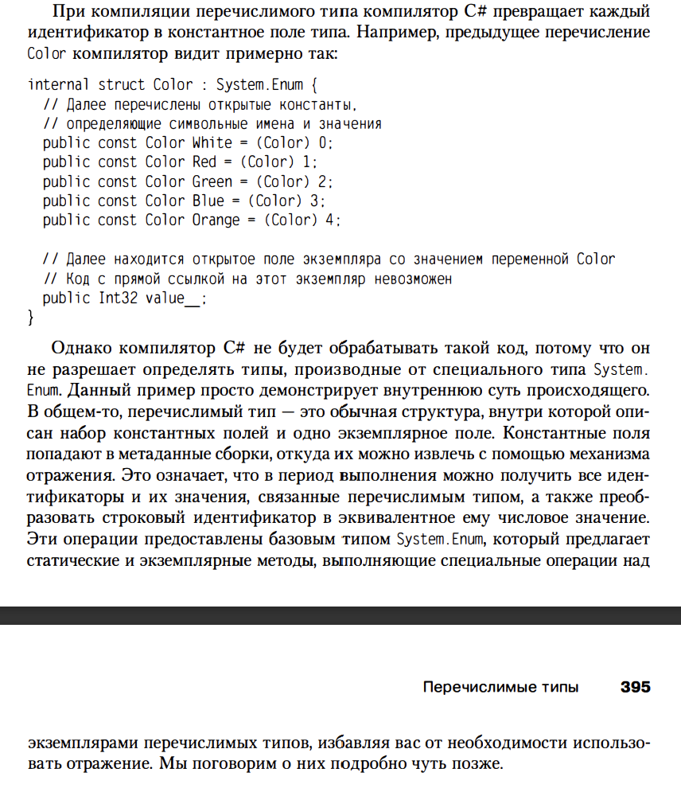
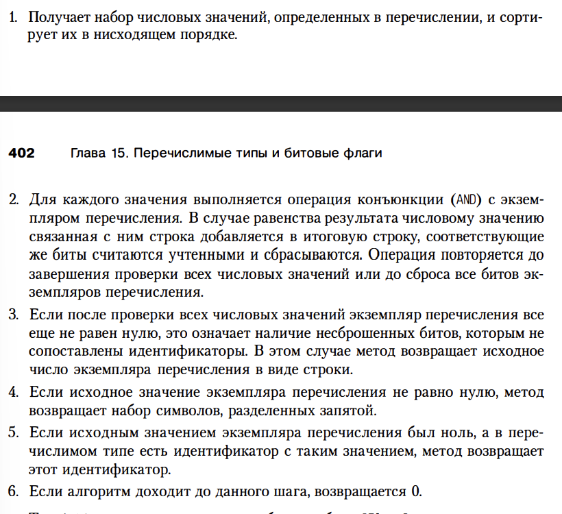
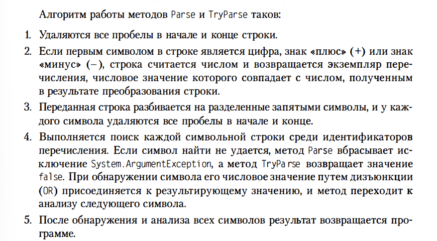

# Глава 15. Перечислимые типы и битовые флаги
Перечислимым (enumerated type) называют тип, в котором описан набор пар, состоящих из
символьных имен и значений.
Преимущества перечислимых типов:
- Легче читать, поскольку не надо запоминать соответствие между символьной записью и 
числовой. Работая с с инструментами документирования и другими утилитами, такими как отладчик
программист видит осмысленные символьные имена, а не цифры
- Перечислимые типы подвергаются строгой проверке типов. Например, компилятор сообщит об
ошибке, если в качестве значения попытаться передать не то значение

1) Каждый перечислимый тип напрямую наследуется от типа System.Enum, производного от System.ValueType.
	Перечислимые типы относятся к значимым типам, и могут выступать как в упакованной, так и в 
	неупакованной форме. У enum не может быть методов, свойств и событий, однако сымитировать
	наличие метода у перечислимого типа можно при помощи механизма методов расширения 
	(extension methods)
	
	Описанные перечислимым типом символы являются константами, и компилятор преобразует 
	ссылку на такой символ в числовое значение. В результате определяющая перечислимый типа
	сборка может оказаться ненужной в период выполнения. Но она требуется, если в коде 
	присутствует ссылка не на определенные перечислимым типом символы, а на сам тип. То
	есть возникает проблема версий, связанная с тем, что символы перечислимого типа являются
	константами, а не значениями, предназначенные только для чтения.
	В основе любогго перечисления лежит один из основных типов, например byte, sbyte, short,
	ushort, int, uint, long, ulong. На данный момент можно создать enum на базе FCL-типа, что
	раньше было невозможно и выдавалась бы ошибка: error SC1008: Type byte, sbyte .... excepted

	1.1) При работе с шестнадцатеричным форматом метод ToString всегда возвращает 
	прописные буквы. Количество возвращенных цифр зависит от типа, лежащего в основе 
	перечисления. ДЛя типов byte/sbyte - это две цифры, для типов short/ushort - четыре,
	для int/uint - восемь, для long/ulong - снова две.
	1.2) Можно объявить перечисление, различные идентификаторы которого имеют числовое 
	значение. В процессе преобразования числового значения в символ посредством общего 
	форматирования методы типа вернут один из символов, правда, неизвестно какой. Если
	соответствия не обнаруживается, возвращается строка с числовым значением.

	1.3) Нужен метод определения значения, соответствующего идентификатору, например, вводимому
	пользователем в текстовое поле. Преобразования идентификатора в экземпляр перечислимого
	типа легко реализуется статическими методами Parse и TryParse типа Enum.

	1.4) Наконец, рассмотрю статический метод IsDefined типа Enum и метод IsEnumDefined
	типа Type
	С их помощью определяется допустимость числового значения для данного перечисления
	Этот метод часто используется для проверки параметров в функциях, где мы хотим 
	взаимодействовать с enum

	При всем удобстве метода IsDefined применять его следует с осторожностью, во-первых, 
	он всегда выполняет поиск с учетом регистра, во-вторых, работает крайне-медленно, тк в нем
	используются отражения. Самостоятельно написав код проверки, можно увеличить
	производительность. Кроме того, метод работает только для перечислимых типов, 
	определенных в той сборке, из которой он вызывается. Например, пусть перечисления Color
	определено в одной сборке, а метод SetColor - в другой. При вызове методом SetColor 
	метода IsDefined все будет работать, если цвет имеет значение White, Red, Green, Blue
	или Orange. ОДнако если в будущем мы добавим в перечисление еще один цвет, метод 
	SetColor начнет использовать неизвестное ему значение, и результат его работы станет 
	непредсказуемым.

	Перечислимые типы всегда применяют в сочетании с другим типом. Обычно их используют 
	в качестве параметров методов или возвращаемых типов, свойств или полей. Часто спрашивают
	где определять перечислимый тип: внутри или на уровне того типа, которому он требуется.
	В FCL вы увидите, что обычно перечислимый тип определяется на уровне класса, которому 
	он требуется. Причина проста: сокращение объема набираемого разработчиком кода. Поэтому 
	пока не возник конфликт имен, определяйте свой перечислимый тип на одном уровне с 
	основным классом.

2) Битовые флаги
	2.1) Как правило, для создания набора комбинируемых друг с другом битовых флагов
		используют перечислимые типы. Однако несмотря на внешнюю схожесть, перечислимые типы
		семантически отличаются от битовых флагов. Если в первом случае мы имеем отдельные 
		числовые значения, то во втором приходится иметь дело с набором флагов, одни из 
		которых установлены, а другие нет

	2.2) метод ToString пытается преобразовать числовое значение в его символьный эквивалент.
		Но у числового значения может его не быть. Однако обнаружив у типы Actions атрибут [Flags],
		метод ToString рассматривает числовое значение уже как набор битовых флагов.


		Три способа форматирования выходной строки: "G" (общий), "D" (десятичный), и "X" (шестнадцатеричный).
		Формируя экземпляр перечислимого типа с использованием общего формата, метод сначала
		определяет наличие атрибута [Flags]. Если атрибут не указан, отыскивается и возвращается
		идентификатор, соответствующий данному числовому значению. Обнаружив данный атрибут, метод
		действует по следующему алгоритму:
		

		Тип битовых флагов можно определить и без атрибута [Flags], получив при этом 
		правильную результирующую строку. Для этого достаточно указать формат "F":
		```
		Actions actions = Actions.Read | Actions.Delete;
		Console.WriteLine(actions.ToString("F"));
		```
		Если числовое значение содержит бит, которому не соотвествует какой-либо идентификатор,
		в возвращаемой строке окажется только десятичное число, равное исходному значению, и ни 
		одного идентификатора. 
		Заметьте: идентификаторы, которые вы определяете в перечислимом типе, не обязаны быть степенью 
		двойки. Например: в типе Actions можно описать идентификатор с именем All, имеющий значение
		0x001F. Результатом форматирования экземпляра типа Actions со значением 0x001F станет строка 
		All. Других идентификаторов с троке не будет. 
		
		Пока мы говорили о получении строки из числовых значений. Однако можно также получить
		числовое значение строки, содержащей разделенные запятой идентификаторы, воспользовавшись 
		методом Parse типа Enum или методом TryParse

		Алгоритм работы методов Parse и TryParse таков:
		

		Никогда не следует применять метод IsDefined с перечислимыми тпами битовых флагов.
		Это не будет работать по двум причинам:
		- переданную ему строку метод не разбивает на отдельные символы, а ищет целиком,
		вместе с запятыми. Однако в перечислениях невозможен идентификатор, содержащий
		запятые, а значит, результат поиска всегда будет нулевым.
		- после передачи ему числового значения метод ищет всего один символ перечислимого 
		типа, значение которого совпадает с переданным числом. Для битовых флагов вероятность
		получения положительного результата при таком сравнении ничтожна мала, и обычно метод
		возвращает значение false

	2.3) Добавление методов к перечислимым типам
		В начале главы уже упоминалов, что определить метод как часть перечислимого типа 
		невозможно. Это ограничение можно обойти при помощи  относительно нового для C# 
		механизма методов расширения (extension method).
