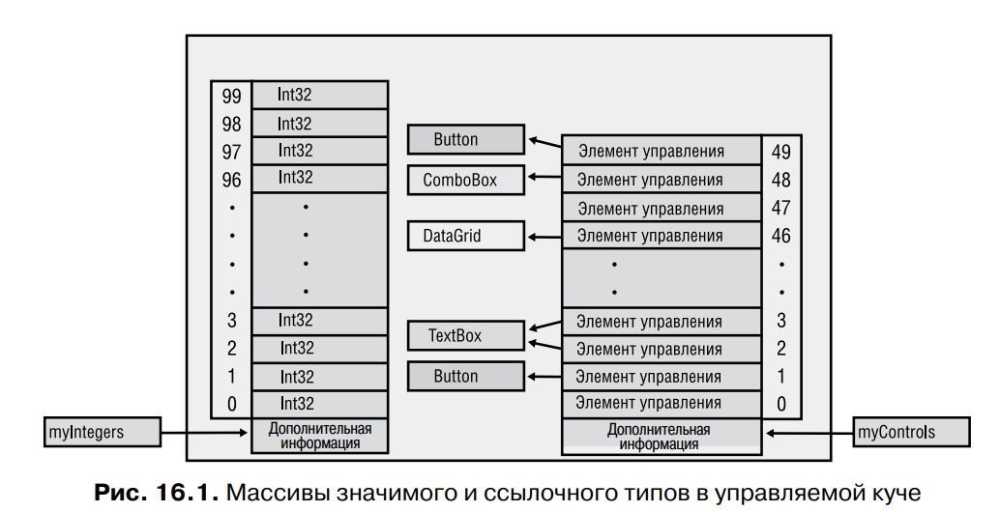

# Глава 16. Массивы

1) System.Array : System.Object -> массивы ссылочный типы данных
2) Разница между массивами ссылочных и значимых типов:
	Для значимых типов объекты создаются непосредстенно в блоке, который 
	выделен для массива. А для ссылочных типов массив хранит лишь указатели
	на объекты из хипа
	
	В массиве присутствует некая дополнительная информация. Это сведения о 
	размерности массива, нижних границах всех его измерений (почти всегда 0)
	и количестве элементов в каждом измерении
3) Можно создать многомерный массив
	```
	Double[,] myDoubles = new Double[10, 20];
	```


4) CLR подддерживается нерегулярные (jagged) массивы - "массивы массивов"
	```
	Point[][] myPolygons = new Point[3][];
	```
	Производительность одномерных нерегулярных массивов с начальным индексом такая же
	как у обычных векторов. Однако обращение к элементу нерегулярного массива 
	означает обращение к двум или больше массивам одновременно. 

5) ```
	var names = new[] { "Aidan", "Grant", 123 };
   ```
   Это ошибочное задание типа массива с помощью локальной переменной 
   неявного типа
   На такое код компилятор реагирует сообщением:
   error CS0826: No best type found for implicitly-typed array
   Дело в том, что общим базовым типом для двух строк и значения типа Int32
	является тип Object. Для компилятора это означает необходимость создать массив 
	ссылок типа Object, а затем упаковать значение типа Int32 и заставить последний 
	элемент массива ссылаться на результат упаковки, имеющий значение 123. Разработчики сочли, 
	что задача упаковки элементов массива приводит к слишком 
	высоким затратам, чтобы компилятор мог выполнять ее неявно, поэтому в такой 
	ситуации просто выводится сообщение об ошибке.

5) В качестве синтаксическоского сахара мы можем создавать массивы вот так:
	```
	String[] names = { "Aidan", "Grant" };
	```
	Тут нет ни оператора new ние квадратных скобок. Это удобно, но мы лишаемся возможности
	использовать локальные переменные неявного типа:
	```
	var names = { "Aidan", "Grant" };
	```
	Попытка компиляции такой строчки приведет к появлению двух сообщений:
	```
	error CS0820: Cannot initialize an implicitly-typed local variable with 
	 an array initializer
	error CS0622: Can only use array initializer expressions to assign array types. 
	 Try using a new expression instead
	 ```
	 Компилятор вполне способен выполниить эти действия самостоятельно, но разрабы
	 решили, что это слишком сложная задача. Ведь пришлось бы определять типа массива, 
	 создавать его при помощи оператора new, присваивать элементам начальные значения, а 
	 кроме того, определять тип локальной переменной.

6) Процедура неявного задание типа массива в случае анонимных типов и локальных 
	переменных неявного типа
	```
	var kids = new[] {new { Name="Aidan" }, new { Name="Grant" }};
	```
	Используются 2 выражения, каждое из которых представляет собой анонимный тип. 
	Благодаря идентичной структуре этих выражений компилятор относит оба объекта к 
	одному типу. Теперь можно воспользоваться возможностью неявного задания типа массива
	(когда между оператором new и квадратными скобками отсутствует имя типа). В результате
	компилятор самостоятельно определит тип, сконструирует массив и инициализирует его 
	элементы как ссылки на два экземпляра одного и того же анонимного типа. 

7) Приведение типов в массивах
	В CLR для массивов с элементами ссылочного типа допустимо приведение. В рамках
	решения этой задачи оба типа массивов должны иметь одинаковую размерность; кроме
	того, должно иметь место неявное или явное преобразование из типа элементов 
	исходного массива в целевой тип.

	Метод Array.Copy не просто копирует элементы из одного массива в другой. Он действует
	как функция memmove языка C, но при этом правильно обрабатывает перекрывающиеся области памяти. 
	Он также способен при необходимости преобразовать элементы массива в процессе их копирования
	Метод Copy выполняет следующие действия: 
	- Упаковка элементов значимого типа в элементы ссылочного типа, например 
	копирование Int32[] в Object[].
	‰- Распаковка элементов ссылочного типа в элементы значимого типа, например 
	копирование Object[] в Int32[].
‰	- Расширение (widening) примитивных значимых типов, например копирование 
	Int32[] в Double[].
‰	- Понижающее приведение в случаях, когда совместимость массивов невозможно 
	определить по их типам. Сюда относится, к примеру, приведение массива типа 
	Object[] в массив типа IFormattable[]. Если все объекты в массиве Object[]
	реализуют интерфейс IFormattable[], приведение пройдет успешно
	 
8) Бывают ситуации, когда полезно изменить тип массива, то есть выполнить его ковариацию
	(array covariance). Однако следует помнить, что эта операция сказывается на производительности

9) Базовый класс System.Array
	Clone, CopyTo, GetLength, GetLongLength, GetLowerBound, 
	GetUpperBound, Length и Rank.
	Класс System.Array содержит также статические методы для работы с массивами, в том числе AsReadOnly, BinarySearch, Clear, ConstrainedCopy, ConvertAll, 
	Copy, Exists, Find, FindAll, FindIndex, FindLast, FindLastIndex, ForEach, IndexOf, 
	LastIndexOf, Resize, Reverse, Sort и TrueForAll

10) Реализакция интерфейсов IEnumerable, ICollection, IList

11) Передача и возврат массивов
	Передавая массив в методе в качестве аргумента, вы на самом деле передаете ссылку на него.
	А значит, метод может модифицировать элементы массива. Этого можно избежать передав
	в качестве аргумента копию массива. 
	Метод ArrayCopy выполняет поверхностное копирование (shallow), и если элементы массива 
	относятся к ссылочному типу, в новом массиве окажутся ссылки на существующие объекты

	Команда Microsoft настоятельно рекомендует возвращать пустой массив, а не null

12) Массивы с ненулевой нижней границей - статический метод CreateInstance типа Array

13) Внутренняя реализация массивов
	В CLR поддерживаются массивы двух типов:
		- одномерные массивы с нулевым начальным индексом. Иногда их называют SZ-массивами
		(single-dimensional, zero-based) или векторами
		- одномерные и многомерные массивы с неизвестным начальным индексом

	System.String[] 
	System.String[*] -> CLR знает о ненулевом индексе массива

	JIT-компилятор «знает», что цикл обращается к элементам массива 
	с нулевой нижней границей, указывая Length - 1. Поэтому он в процессе выполнения генерирует код, проверяющий, все ли элементы находятся в границах массива. 
	А именно, проверяется условие:
	(0 >= a.GetLowerBound(0)) && ((Length – 1) <= a.GetUpperBound(0))
	Проверка осуществляется до начала цикла. В случае положительного результата 
	компилятор не создает в теле цикла кода, проверяющего, не вышел ли индекс 
	элемента за границы диапазона. Именно за счет этого обеспечивается высокая 
	производительность доступа к массиву.

	Кроме того, в C# и CLR возможен доступ к элементам массива при помощи 
	небезопасного (неверифицируемого) кода. В этом случае процедура проверки 
	индексов массива просто отключается. Данная техника применима только к массивам типа SByte, Byte, Int16, UInt16, Int32, UInt32, Int64, UInt64, Char, Single, 
	Double, Decimal, Boolean, а также к массивам перечислимого

14) Небезопасный доступ к массивам и массивы фиксированного размера
	Небезопасный доступ к массиву является крайне мощным средством, так как именно 
	такой доступ дает возможность работать:
	‰- с элементами управляемого массива, расположенными в куче (как показано 
	в предыдущем разделе);
	‰- с элементами массива, расположенными в неуправляемой куче (пример 
	SecureString из главы 14 демонстрирует небезопасный метод доступа к массиву, возвращаемому методом SecureStringToCoTaskMemUnicode класса System.
	Runtime.InteropServices.Marshal);
	‰- с элементами массива, расположенными в стеке потока

	Если производительность для вас критична, управляемый массив можно вместо 
	кучи разместить в стеке потока. Для этого вам потребуется инструкция stackalloc
	языка C#