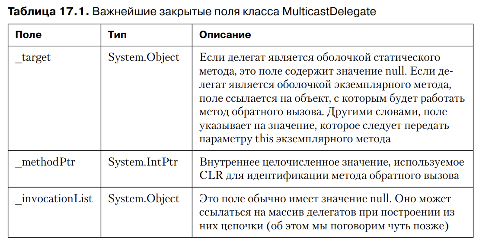
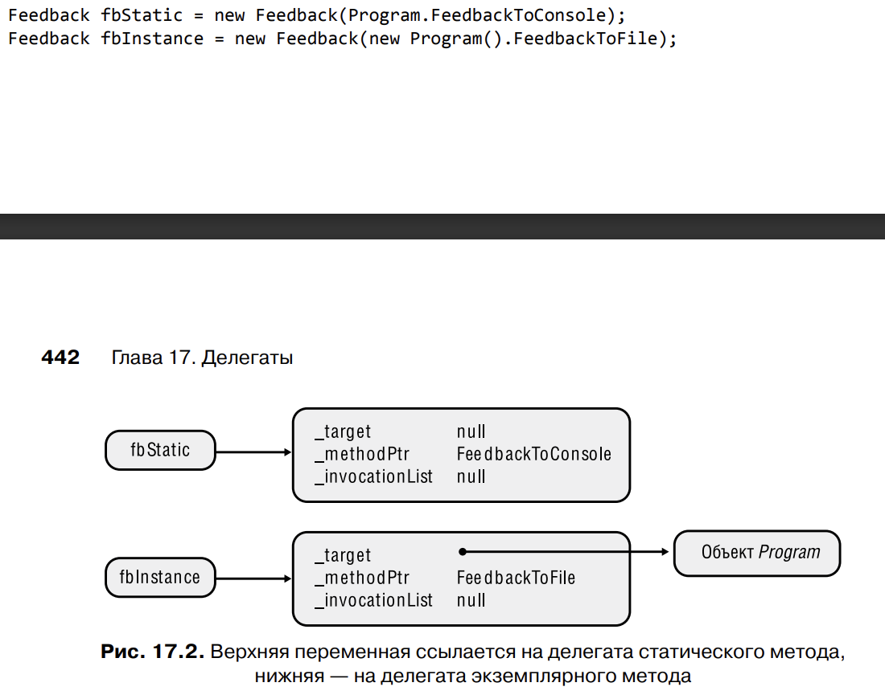

# Глава 17. Делегаты

1) Знакомство с делегатами
	В Windows механизм обратного вызова используется оконными процедурами, процедурами
	перехвата, асинхронным вызовом процедур. В .NET например можно зарегистрировать 
	такой метод для получения различных уведомлений: о необработанных исключениях, 
	изменении состояния окон, выборе пунктов меню, изменениях файловой системы и 
	завершении асинхронных операций

	В неуправляемом языке C/C++ адрес функции — не более чем адрес в памяти, 
	не несущий дополнительной информации. В нем не содержится информация ни 
	о количестве ожидаемых функцией параметров, ни об их типе, ни о типе возвращаемого функцией значения, ни о правилах вызова. Другими словами, функции 
	обратного вызова C/C++ не обеспечивают безопасность типов (хотя их и отличает 
	высокая скорость выполнения)

2) Обратный вызов статических методов
	Делегат может служить оболочкой для другого метода, позволяя выполнить обратный 
	вызов последнего косвенно, через оболочку
	Конструктор делегата с передачей метода, который надо обернуть в оболочку:
	```
	new Feedback(FeedbackToConsole);
	```
	Оператор new возвращает ссылку 
	Сигнатура метода, который мы передаем в делегат должна с ним совпадать, иначе
	компилятор выдаст ошибку: CS0123: No overload for '...' matches delegate '...'

	Как C#, так и CLR поддерживают ковариантность и контвариантность ссылочных типов
	при привязке метода к делегату. 
	Ковариантность (covariance) означает, что метод может возвратить тип, производный
	от типа, возвращаемого делегатом
	Контрвариантность (contra-variance) означает, что метод может принимать параметр,
	который является базовым для типа параметра делегата
	Ковариантность и контрвариантность работают только со ссылочными типами

3) Обратный вызов экземплярных методов
	Делегаты могут служить оболочкой как для статических, так и для экземплярных методов.
	В последнем случае делегат должен знать, какой экземпляр будет обрабатывать вызываемый 
	им метод. Создавая оболочку для экземплярного метода, вы предоставляете коду
	внутри объекта доступ к различным членам экземпляра объекта. Это означает
	наличие у объекта состояния, которое может использовать во время выполнения метода
	обратного вызова.

4) Тонкости использования делегатов
	```
	internal delegate void Feedback(Int32 value);
	```
	Эта строка заставляет компилятор создать полное определение класса, которое 
	выглядит примерно так:
	```
	internal class Feedback : System.MulticastDelegate {
		 // Конструктор
		 public Feedback(Object object, IntPtr method);

		 // Метод, прототип которого задан в исходном тексте
		 public virtual void Invoke(Int32 value);

		 // Методы, обеспечивающие асинхронный обратный вызов
		 public virtual IAsyncResult BeginInvoke(Int32 value, AsyncCallback callback, Object object);

		 public virtual void EndInvoke(IAsyncResult result);
	}
	```
	Компилятор определил класс Feedback, производный от типа System.MulticastDelegate
	из библиотеки классов Framework Class Library (все типы являются потомками MulticastDelegate)

	Делегаты можно объявить как внутри класса, вложенные в другой класс, так и в 
	глобальной области видимости.

	

	Любой делегат это лишь обертка для метода и обрабатываемого этим методом объекта. 
	Поэтому экземплярные и статиские методы для делегата ссылаются на два разных делегата.

	

5) Цепочки делегатов
	Цепочкой (chaining) называется коллекция делегатов, дающая возможность вызывать 
	все методы, представленные этими делегатами
	Открытый статический метод Combine класса Delegate добавляет в цепочку делегатов.

	

	В ситуации когда один из делегатов в цепочку становится причиной исключения 
	или блокируется на долгое время, выполнение цепочки останавливается.

	В качестве альтернативы можно воспользоваться экземплярным методом 
	GetInvocationList класса MulticastDelegate. Этот метод позволяет в явном виде 
	вызвать любой из делегатов в цепочке

6) Обобщенные делегаты
	В .NET 17 делегатов Action, от не имеющих аргументов до имеющих 16 аргументов
	Также 17 делегатов Func
	Если потребуется передать аргумент по ссылке, используя ключевые слова ref или out, 
	может потребоваться определение собственного делегата. Аналогичная ситуация, если
	вы хотите задать значения по умолчанию, передать переменное число параметров или
	если потребуется установить ограничение для аргумента-типа

7) Упрощенный синтаксис работы с делегатами
	Делегаты нужны среде CLR, как обертка, гарантирующая безопасность типов при
	вызове метода

	Упрощение 1: не создаем объект делегата
	Упрощение 2: не определяем метод обратного вызова, используем лямбда-выражения
	Упрощение 3: не создаем обертку для локальных переменных для передачи их методу
		обратного вызова


8) Делегаты и отражение
	???????

