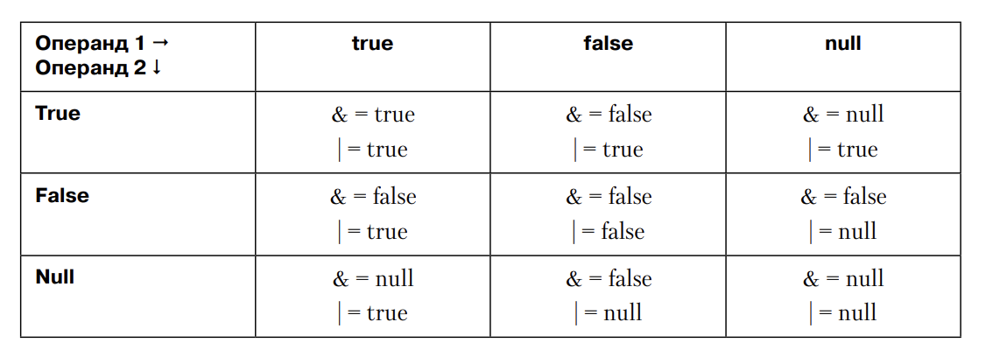

# Глава 19. Null-совместимые типы

1) Переменная значимого типа не может принимать значение null, ее значение всегда 
является значение. Поэтому типы и называются значимыми. 
Но это может создавать проблемы, например, при работе с базой данных, где Int32 
может представляться значением null.

Адаптеры таблиц ADO.NET поддерживают типы, допускающие присвоение null. Но, к 
сожалению, тпы в пространстве имен System.Data.SqlTypes не замещаются null-совместимыми
отчасти из за отсутствия однозначного соответстия между ними. К примеру, тип
SqlDecimal допускает максимум 38 разрядов, в том время как обычный тип Decimal - 
только 29. А тип SqlString поддерживает собственные региональные стандарты и порядок
сравнения.

Еще пример: в Java класс java.util.Date относится к ссылочным, в том время как в CLR
тип System.DataTime относится к значимым. Если нужно будет передать информацию из Java
в C# возможны проблемы, если придет дата null.

Чтобы исправить эти проблемы были разработаны null-совместимые значимые типы 
(nullable value type).

Чтобы понять как они работают познакомимся с определенным в FCL классом System.Nullable<T>
Класс реализует значимый тип, которые может принимать значение null.

2) Поддержика в C# null-совместимых значимых типов

Разработчики C# старались интегрировать в язык null-совместимые значимые типы, сделав
их полноправными членами соответствующего семейства типов.
```
Int32? x = 5;
Int32? y = null;
```
В C# запись Int32? аналогична записи Nullable<Int32>. Язык C# поддерживает возможность
применения операторов к экземплярам null-совместимых значимых типов.

Примеры:
```
// Неявное преобразование из типа Int32 в Nullable<Int32>
Int32? a = 5;

// Неявное преобразование из 'null' в Nullable<Int32>
Int32? b = null;

// Явное преобразование Nullable<Int32> в Int32
Int32 c = (Int32) a;

// Прямое и обратное приведение примитивного типа
// в null-совместимый тип
Double? d = 5; // Int32 -> Double? (d содержит 5.0 в виде Double)
Double? e = b; // Int32? -> Double? (e содержит null)
```

Также C# позволяет применять операторы к экземплярам null совместимых типов.
Вот как эти операторы интерпретирует C#:
1) Унарные операторы (++, -, --, !, ~). Если операнд равен null, результат тоже 
равен null.
2) Бинарные операторы (+, -, *, /, %, &, |, ^, <<, >>). Результата равен значению 
null, если этому значению равен хотя бы один операнд. Исключением является случай
воздействия операторов & и | на логический операнд ?. В результате поведение этих двух
операторов совпадает с тернарной логкой в SQL. Если ни один из операндов не равен null, 
операций проходит в обычном режиме, если же оба операнда равны null, в результате
получаем null. Особая ситуация возникает в случае, когда значению Null равен только 
один из операндов.

Возможные результаты, которые бинарные операторы дают при всех возможных значениях:


3) Операторы равенства (==, !=). Если оба операнда имеют значение null, они равны. 
Если только один из операндов равен null, операнды не равны. Если ни один из операндов
ни равен null, операнды сравниваются по значениям
4) Операторы сравнения (<, >, <=, >=). Если значение null имеет один из операндов, в 
результате получаем значение false. Если ни один не null, то по сравниваем значения.

Для операций с null совместимыми типами генерируется большой объем кода. В результате
компиляции будет создан большой объем IL-кода, вследствие чего операции с Null-совместимыми
типами медленнее аналогичных операций с другими типами.

2) Оператор объединения null-совместимых значений (null-coaleascing operator)

?? и работает с двумя операндами. Если левый операнд не равен null, оператор 
возвращает его значение, иначе значение правого операнда. 
Удобен при задании предлагаемого по умолчанию значения переменной. Поддерживает 
как ссылочные так и значимые типы данных.

Некоторые пользователи считают оператор объединения null-совместимых значений всего 
лишь синтаксическим сокращением для оператора ?. Однако оператор ?? имеет два важных
синтаксических преимущества.
Во-первых, он лучше работает с выражениями:
```
Func<String> f = () => SomeMethod() ?? "Untitled";
```
Прочитать и понять эту строчку куда проще, чем следующий фрагмент кода, требующий
присваивания переменных и использования некоторых операторов:
```
Func<String> f = () => 
{ 
	var temp = SomeMethod();
	return temp != null ? temp : "Untitled";
};
```
Во-вторых, оператор ?? лучше работает в некоторых сложных ситуациях:
```
String s = SomeMethod() ?? SomeMethod2() ?? "Untitled";
```

Эту строчку прочитать гораздо проще, чем это:
```
String s;
var sm1 = SomeMethod();
if(sm1 != null) s = sm1;
else 
{
	var sm2 = SomeMethod2();
	if (sm2 != null) s = sm2;
	else s = "Untitled"
}
```

3) Поддержка в CLR null-совместимых значимых типов

В CLR существует внутренняя поддержка null-совместимых значимых типов.

Упаковка null-совместимых значимых типов
Представим переменную типа Int32?, которой логически присвается null. Для передачи ее
методу ожидающему Object, ее следует упаковать и передать методу ссылку на упакованный
тип Int32?. Однако при этом в методе будет передано отличное от Null значение, несмотря
на то, что тип Int32 содержит null. Эта проблема решается в CLR при помощи специального
кода, который при упаковке null-совместимых типов создает иллюзию их принадлежности к
обычным типам.
При упаковке Nullable<T> проверяется его равенство null и в случае положительного 
результата вместо упаковки возвращает null. В противном случае CLR упаковывает 
значение экземпляра. Другими словами, Int32 со значением 5 упковывается в тип Int32.

Распаковка null-совместимых значимых типов
В CLR упакованный значимый тип T распаковывается в T или Nullable<T>. Если ссылка на 
упакованный значимый тип равна null и выполняется распаковка в тип Nullable<T>, CLR
присваивает Nullable<T> значение null. Пример:

```
// Создание упакованного типа Int32
Object o = 5;

// Распаковка этого типа в Nullable<Int32> и в Int32
Int32? a = (Int32?) o; // a = 5
Int32 b = (Int32) o; // b = 5

// Создание ссылки, инициализированной значением null
o = null;

// "Распаковка" ее в Nullable<Int32> и в Int32
a = (Int32?) o; // a = null
b = (Int32) o; // NullReferenceExceptio
```

Вызов метода GetType через null-совместимый значимый тип
При вызове метода GetType для объекта типа Nullable<T> CLR возвращает тип T
вместо Nullable<T>. Пример:
Int32? x = 5;
// Эта строка выводит "System.Int32", а не "System.Nullable<Int32>"
Console.WriteLine(x.GetType());

Вызов интерфейсных методов через null-совместимый значимый тип
```
Int32? n = 5;
Int32 result = ((IComparable) n).CompareTo(5); // Компилируется и выполняется
Console.WriteLine(result); // 0
```

В приведенном выше коде переменная n типа Int32? приводится к интерфейсному типу 
IComparable<Int32>. Но тип Nullable<T> в отличие от типа Int32 не реализует интерфейс
IComparable<Int32>. Тем не менее код успешно компилируется, а механизм верификации 
CLR считает, что код прошел проверку, чтобы использовать более удобный синтаксис

Без подобной поддержки со стороны CLR пришлось бы писать громоздкий код вызова 
интерфейсного метода через null-совместимый значимый тип. Для вызова метода 
потребовалось бы приведение распакованного значмиого типа перед приведением к 
интфейсу:
```
Int32 result = ((IComparable) (Int32) n).CompareTo(5);
```