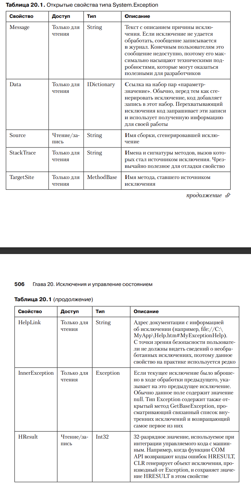

# Глава 20. Исключения и управление состоянием

1) Когда возникает ошибка, наш код скорее всего в этот момент будет находить в некоем
переходном состоянии и нам потребуется вернуть его в состояние, существовавшее до 
ошибки.

2) Определение "исключения"
Существует множество объектно-ориентированных средств — конструкторы, инструменты просмотра/задания свойств, добавления/удаления событий, вызовы 
перегрузки операторов, вызовы операторов преобразования типа, — которые не 
умеют возвращать код ошибки. Но даже они должны каким-то способом сообщать 
о ее наличии. В .NET Framework и всех поддерживаемых этой платформой языках 
программирования для этой цели существует специальный механизм, называемый 
обработкой исключений (exception handling).

Некоторые разработчики ошибочно считают, что исключения зависят от частоты возникновения
некоторого явления. К примеру, разработчик метода чтения файла может сказать:
"Читая файл, вы в итоге достигните его конца. Так как это случается всегда, я заставлю
мой метод Read в этот момент возвращать специальное значение. И тогда генерировать исключение
не понадобится". Но так считает разработчик, создающий метод Read, а не тот, кто этим
методом потом пользуется.
На момент создания метода невозможно предугадать все ситуации, в которых он будет 
вызываться. Соответственно, нельзя предсказать, насколько частыми станут попытки
прочитать файл до конца. Более того, так как большинство файлов содержит 
структурированные данные, вряд ли чтение фрагментов будет частым событием.

3) Механика обработки исключений
В основе обработки исключений в .NET Framework лежит структурная обработка и
сключений (Structured Exception Handling, SEH) Windows

Рассмотрим код, демонстрирующий стандартное применение механизма обработки исключений:

```
try {
 // Код, требующий корректного восстановления
 // или очистки ресурсов
}
catch (InvalidOperationException) {
 // Код восстановления работоспособности
 // после исключения InvalidOperationException
}
catch (IOException) {
 // Код восстановления работоспособности
 // после исключения IOException
}
catch {
 // Код восстановления работоспособности после остальных исключений.
 // После перехвата исключений их обычно генерируют повторно
 // Эта тема будет рассмотрена позже
 throw;
}
finally {
 // Здесь находится код, выполняющий очистку ресурсов
 // после операций, начатых в блоке try. Этот код
 // выполняется ВСЕГДА вне зависимости от наличия исключения
 }
 // Код, следующий за блоком finally, выполняется, если в блоке try
 // не генерировалось исключение или если исключение было перехвачено
 // блоком catch, а новое не генерировалось
```

4) Блок catch
Выражение в скобках после ключевого слова catch называется типом исключения 
(catch type). В C# эту роль играет тип System.Exception и его производные

Поиск подходящего блока catch в CLR осуществляется сверху вниз, поэтому 
наиболее конкретные обработчики должны находиться в начале списка. Сначала следуют потомки с наибольшей глубиной наследования, потом — их базовые 
классы (если таковые имеются) и, наконец, — класс System.Exception (или блок 
с неуказанным типом исключений). В противном случае компилятор сообщит об 
ошибке, так как более узкоспециализированные блоки в такой ситуации окажутся 
для него недостижимыми.

При обнаружении блока catch нужного типа CLR исполняет все внутренние 
блоки finally, начиная со связанного с блоком try, в котором было вброшено 
исключение, и заканчивая блоком catch нужного типа. При этом ни один блок 
finally не выполняется до завершения действий с блоком catch, обрабатывающим 
исключение.
После того как код внутренних блоков finally будет выполнен, исполняется 
код из обрабатывающего блока catch. Здесь выбирается способ восстановления 
после исключения. Затем можно выбрать один из трех вариантов действий:
‰- еще раз сгенерировать то же исключение для передачи информации о нем коду, 
расположенному выше в стеке;
‰- сгенерировать исключение другого типа для передачи дополнительной информации коду, расположенному выше в стеке;
‰- позволить программному потоку выйти из блока catch естественным образом

5) Блок finally
Код блока finally выполняется всегда. Обычно этот код производит очистку после выполнения блока try. Если в блоке try был открыт некий файл, блок finally
должен содержать закрывающий этот файл код:

```
private void ReadData(String pathname) {
	FileStream fs = null;
	try {
	fs = new FileStream(pathname, FileMode.Open);
	// Обработка данных в файле
	}
	catch (IOException) {
	// Код восстановления после исключения IOException
	}
	finally {
	// Файл обязательно следует закрыть
	if (fs != null) fs.Close();
	}
}
```
Если код блока try выполняется без исключений, файл закрывается. Впрочем, 
поскольку даже исключение не помешает выполнению кода в блоке finally, файл 
гарантированно будет закрыт. А если поместить инструкцию закрытия файла после 
блока finally, в случае неперехваченного исключения файл останется открытым 
(до следующего прохода уборщика мусора).

Блок try может существовать и без блока finally, ведь иногда его код просто 
не требует последующей очистки. Однако если вы решили создать блок finally, 
его следует поместить после всех блоков catch. И помните, что одному try может 
соответствовать только один блок finally.

Всегда существует вероятность того, что во время выполенния кода восстановления 
или очистки произойдет сбой, и будет выдано исключение. Впрочем, такая 
ситуация маловероятна, а ее возникновение свидетельствует о возникновении очень 
серьезных проблем в программе (скорее всего, о повреждении текущего состояния). 
Если источником исключения становятся блоки catch или finally, CLR продолжает 
работу как в случае, когда исключение генерируется после блока finally. 
Просто при этом теряется информация о первом исключении, вброшенном в блоке 
try. Скорее всего (и даже желательно), это новое исключение останется необработанным.
После этого CLR завершает процесс, уничтожая поврежденное состояние. 
Продолжение работы приложения в подобном случае привело бы к непредсказуемым 
результатам и, вероятно, к появлению дефектов в системе безопасности.

6) CLS-совместимые и CLS-несовместимые исключения

Все языки программирования, ориентированные на CLR, должны поддерживать 
создание объектов класса Exception, так как этого требует общеязыковая спецификация (Common Language Specification, CLS). Но на самом деле, CLR разрешает 
создавать экземпляры любого типа, в результате в некоторых языках появляются 
несовместимые с CLS исключения типа String, Int32 или DateTime. Компилятор 
C# разрешает генерировать только объекты, производные от класса Exception, в то 
время как в других языках это ограничение отсутствует.

Многие программисты не знают, что для передачи исключения можно генерировать объект любого типа, поэтому они пользуются только объектами, производными 
от класса Exception. До выхода версии CLR 2.0 в блоках catch перехватывались 
только CLS-совместимые исключения. Если метод на C# вызывал метод, написанный на другом языке, и тот генерировал CLS-несовместимое исключение, его было 
невозможно перехватить, что чревато нарушением защиты.

До версии 2.0 перехват CLS-несовместимых исключений осуществлялся с помощью 
примерно такого кода:
```
private void SomeMethod() {
	try {
	// Внутрь блока try помещают код, требующий корректного
	// восстановления работоспособности или очистки ресурсов
	}
	catch (Exception e) {
	// До C# 2.0 этот блок перехватывал только CLS-совместимые исключения
	// В C# 2.0 этот блок научился перехватывать также
	// CLS-несовместимые исключения
	throw; // Повторная генерация перехваченного исключения
	}
	catch {
	// Во всех версиях C# этот блок перехватывает
	// и совместимые, и несовместимые с CLS исключения
	throw; // Повторная генерация перехваченного исключения
	}
}
```

7) Класс System.Exception
CLR позволяет генерировать в качестве исключений экземпляры любого типа — от 
Int32 до String. Но в Microsoft решили, что не стоит заставлять все языки генерировать и перехватывать исключения произвольного типа. Соответственно, был 
создан тип System.Exception.

CLS-совместимыми называются типы исключений, производные от типа System.
Exception. Компиляторы C# и многих других языков позволяют коду генерировать 
только CLS-совместимые исключения



При появлении исключения CLR делает запись с указанием места его возникновения. Когда блок catch получает исключение, CLR записывает, где именно оно 
было обнаружено. Если внутри блока catch обратиться к свойству StackTrace
объекта, сгенерированного при появлении исключения, реализующий это свойство код обратится к CLR, где и будет создана строка, содержащая имена всех 
методов от точки, в которой было вброшено исключение, до точки, где оно было 
перехвачено

Следующий код генерирует то же исключение, которое было перехвачено, и заставляет 
CLR обнулить начальную точку:

```
private void SomeMethod() {
	try { ... }
	catch (Exception e) {
	...
	throw e; // CLR считает, что исключение возникло тут
			// FxCop сообщает об ошибке
	}
}
```

В противоположность этому, при повторном вызове перехваченного исключения 
с помощью ключевого слова throw удаления из стека информации о начальной 
точке не происходит. Пример:
```
private void SomeMethod() {
	 try { ... }
	 catch (Exception e) {
	 ...
	 throw; // CLR не меняет информацию о начальной точке исключения.
			// FxCop НЕ сообщает об ошибке
 }
}
```

Эти два фрагмента кода отличаются только тем, где, по мнению CLR, было 
сгенерировано исключение. К сожалению, при первом или повторном вызове исключения Windows обнуляет стек с информацией о начальной точке. И в случае 
необработанного исключения в систему сбора информации об ошибках Windows 
уходят сведения о последнем вброшенном исключении, даже если CLR «знает», 
где именно было сгенерировано самое первое исключение. Это серьезно усложняет 
отладку приложений.

В результатах трассировки стека можно обнаружить, что имена некоторых из 
вызывавшихся методов отсутствуют. Такая ситуация может возникнуть по двум 
причинам. Во-первых, в стеке содержится информация о том, куда должен вернуть 
управление поток, а не откуда произошло обращение. Во-вторых, JIT-компилятор 
может выполнять подстановку (inline) кода методов в вызывающий код, чтобы избежать слишком большого числа вызовов, и возвращать результат вызова только 
одного метода. Многие компиляторы (в том числе C#) предлагают переключатель 
командной строки /debug. При его использовании компилятор включает в результирующую сборку информацию, заставляющую JIT-компилятор прекратить 
подстановку методов. В результате трассировка стека становится более полной 
и содержательной в процессе отладки

8) Классы исключений, определенные в FCL

Специалисты Microsoft хотели сделать тип System.Exception базовым для всех 
исключений, а два других типа, System.SystemException и System.ApplicationException, 
стали бы его непосредственными потомками. Кроме того, исключения, вброшенные CLR, 
стали бы производными от типа SystemException, в то время как исключения, 
появившиеся в приложениях, должны были наследовать от ApplicationException. 
Это дало бы возможность написать блок catch, перехватывающий как все CLR-исключения, 
так и все исключения приложений

Однако на практике это правило соблюдается не полностью; некоторые исключения являются прямыми потомками типа Exception (IsolatedStorageException), некоторые CLR-исключения наследуют от типа ApplicationException
(TargetInvocationException), а некоторые исключения приложений — от типа 
SystemException (FormatException). Из-за этой путаницы типы SystemException
и ApplicationException не несут никакой особой смысловой нагрузки. В настоящее 
время в Microsoft подумывают вообще убрать их из иерархии классов исключений, 
но это невозможно, так как приведет к нарушению работы уже имеющихся приложений, в которых используются эти классы

9) Продуктивность вместо надежности

Объектно-ориентированное программирование позволяет добиться от разработчиков высокой продуктивности. Изрядная заслуга тут принадлежит композиционным удобствам, облегчающим написание, чтение и редактирование кода. 
Например, рассмотрим строку:
```
Boolean f = "Jeff".Substring(1, 1).ToUpper().EndsWith("E");
```

Включая в программу такую инструкцию, разработчик делает важное допущение 
о том, что ее выполнение пройдет без ошибок. Однако ошибки вполне возможны, и 
нам нужен способ борьбы с ними. Для этого и существуют конструкторы и механизмы 
обработки исключений, являющиеся альтернативой методам из Win32 и COM, 
возвращающим значение true или false в зависимости от результата своей работы

Продуктивность разработки достигается не только благодаря композиционности кода, 
но и благодаря некоторым возможностям компиляторов. В частности, 
компилятор способен неявно:

- вставлять в вызываемый метод необязательнее параметры;
‰-  упаковывать экземпляры значимого типа;
‰-  создавать и инициализировать массивы параметров;
‰-  связываться с членами динамических переменных и выражений;
‰-  связываться с методами расширения;
‰-  связываться с перегруженными операторами и вызывать их;
‰-  создавать делегаты;
‰-  автоматически определять тип при вызове обобщенных методов, объявлении 
локальных переменных и использовании лямбда-выражений;
‰-  определять и создавать классы замыканий (closure) для лямбда-выражений 
и итераторов;
‰-  определять, создавать и инициализировать анонимные типы и их экземпляры;
‰-  писать код поддержки LINQ (Language Integrated Queries).

Да и CLR делает многое для облегчения жизни программистов. К примеру, CLR 
умеет неявно:
‰-  вызывать виртуальные и интерфейсные методы;
‰-  загружать сборки и JIT-компилируемые методы, которые могут стать источником 
исключений FileLoadException, BadImageFormatException, 
InvalidProgramException, FieldAccessException, MethodAccessException, 
MissingFieldException, MissingMethodException и VerificationException;
‰-  пересекать границы домена приложений для доступа к объектам типа, производного 
от MarshalByRefObject, которые могут стать источником исключения AppDomainUnloadedException;
‰-  сериализовать и десериализовать объекты при пересечении границ домена приложений;
‰-  заставлять поток генерировать исключение ThreadAbortException при вызове 
методов Thread.Abort и AppDomain.Unload;
‰-  вызывать методы Finalize, чтобы сборщик мусора до освобождения памяти 
объекта выполнил завершающие операции;
‰-  создавать типы в куче загрузчика при работе с обобщенными типами;
‰-  вызывать статический конструктор типа, который может стать источником исключения 
TypeInitializationException;
‰-  генерировать различные исключения, в том числе OutOfMemoryException, 
DivideByZeroException, NullReferenceException, RuntimeWrappedException, 
TargetInvocationException, OverflowException, NotFiniteNumberException, 
ArrayTypeMismatchException, DataMisalignedException, IndexOutOfRangeException, InvalidCastException, RankException, SecurityException и многие 
другие.

Существует несколько подходов, способных сгладить проблему испорченного состояния: