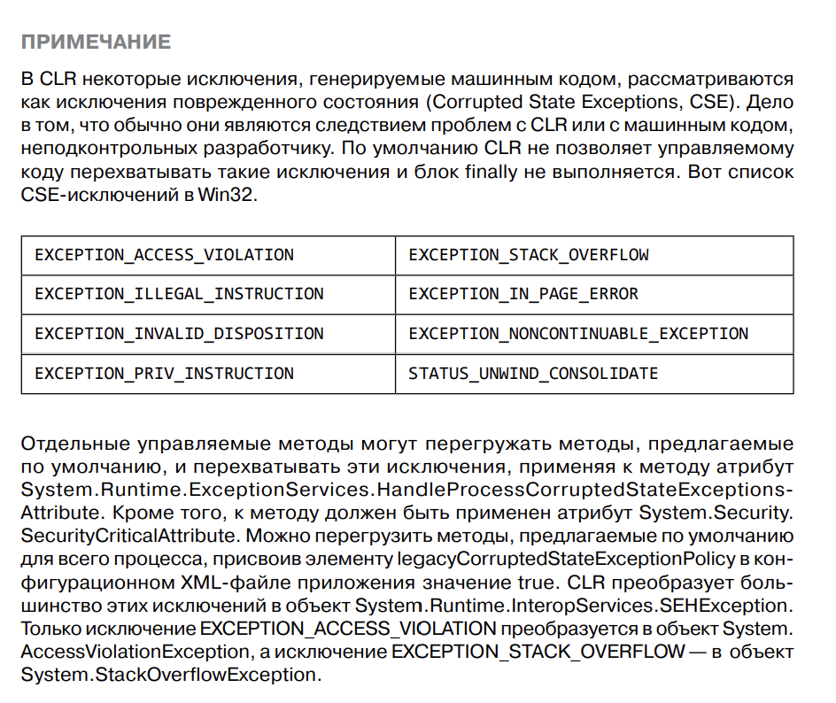
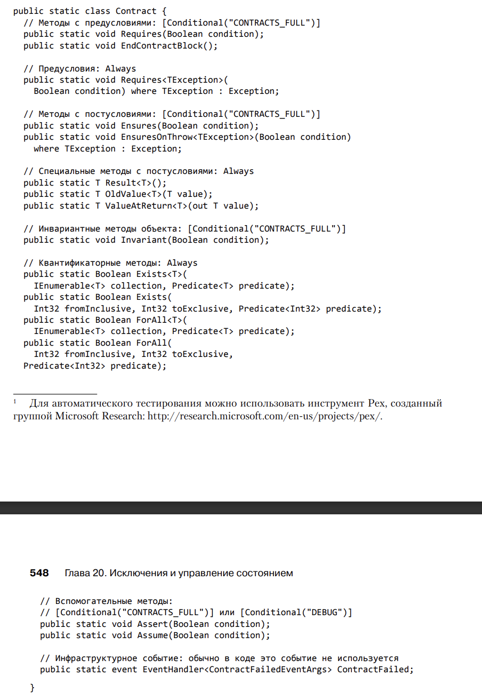

# Глава 20. Исключения и управление состоянием

1) Когда возникает ошибка, наш код скорее всего в этот момент будет находить в некоем
переходном состоянии и нам потребуется вернуть его в состояние, существовавшее до 
ошибки.

2) Определение "исключения"
Существует множество объектно-ориентированных средств — конструкторы, инструменты просмотра/задания свойств, добавления/удаления событий, вызовы 
перегрузки операторов, вызовы операторов преобразования типа, — которые не 
умеют возвращать код ошибки. Но даже они должны каким-то способом сообщать 
о ее наличии. В .NET Framework и всех поддерживаемых этой платформой языках 
программирования для этой цели существует специальный механизм, называемый 
обработкой исключений (exception handling).

Некоторые разработчики ошибочно считают, что исключения зависят от частоты возникновения
некоторого явления. К примеру, разработчик метода чтения файла может сказать:
"Читая файл, вы в итоге достигните его конца. Так как это случается всегда, я заставлю
мой метод Read в этот момент возвращать специальное значение. И тогда генерировать исключение
не понадобится". Но так считает разработчик, создающий метод Read, а не тот, кто этим
методом потом пользуется.
На момент создания метода невозможно предугадать все ситуации, в которых он будет 
вызываться. Соответственно, нельзя предсказать, насколько частыми станут попытки
прочитать файл до конца. Более того, так как большинство файлов содержит 
структурированные данные, вряд ли чтение фрагментов будет частым событием.

3) Механика обработки исключений
В основе обработки исключений в .NET Framework лежит структурная обработка и
сключений (Structured Exception Handling, SEH) Windows

Рассмотрим код, демонстрирующий стандартное применение механизма обработки исключений:

```
try {
 // Код, требующий корректного восстановления
 // или очистки ресурсов
}
catch (InvalidOperationException) {
 // Код восстановления работоспособности
 // после исключения InvalidOperationException
}
catch (IOException) {
 // Код восстановления работоспособности
 // после исключения IOException
}
catch {
 // Код восстановления работоспособности после остальных исключений.
 // После перехвата исключений их обычно генерируют повторно
 // Эта тема будет рассмотрена позже
 throw;
}
finally {
 // Здесь находится код, выполняющий очистку ресурсов
 // после операций, начатых в блоке try. Этот код
 // выполняется ВСЕГДА вне зависимости от наличия исключения
 }
 // Код, следующий за блоком finally, выполняется, если в блоке try
 // не генерировалось исключение или если исключение было перехвачено
 // блоком catch, а новое не генерировалось
```

4) Блок catch
Выражение в скобках после ключевого слова catch называется типом исключения 
(catch type). В C# эту роль играет тип System.Exception и его производные

Поиск подходящего блока catch в CLR осуществляется сверху вниз, поэтому 
наиболее конкретные обработчики должны находиться в начале списка. Сначала следуют потомки с наибольшей глубиной наследования, потом — их базовые 
классы (если таковые имеются) и, наконец, — класс System.Exception (или блок 
с неуказанным типом исключений). В противном случае компилятор сообщит об 
ошибке, так как более узкоспециализированные блоки в такой ситуации окажутся 
для него недостижимыми.

При обнаружении блока catch нужного типа CLR исполняет все внутренние 
блоки finally, начиная со связанного с блоком try, в котором было вброшено 
исключение, и заканчивая блоком catch нужного типа. При этом ни один блок 
finally не выполняется до завершения действий с блоком catch, обрабатывающим 
исключение.
После того как код внутренних блоков finally будет выполнен, исполняется 
код из обрабатывающего блока catch. Здесь выбирается способ восстановления 
после исключения. Затем можно выбрать один из трех вариантов действий:
‰- еще раз сгенерировать то же исключение для передачи информации о нем коду, 
расположенному выше в стеке;
‰- сгенерировать исключение другого типа для передачи дополнительной информации коду, расположенному выше в стеке;
‰- позволить программному потоку выйти из блока catch естественным образом

5) Блок finally
Код блока finally выполняется всегда. Обычно этот код производит очистку после выполнения блока try. Если в блоке try был открыт некий файл, блок finally
должен содержать закрывающий этот файл код:

```
private void ReadData(String pathname) {
	FileStream fs = null;
	try {
	fs = new FileStream(pathname, FileMode.Open);
	// Обработка данных в файле
	}
	catch (IOException) {
	// Код восстановления после исключения IOException
	}
	finally {
	// Файл обязательно следует закрыть
	if (fs != null) fs.Close();
	}
}
```
Если код блока try выполняется без исключений, файл закрывается. Впрочем, 
поскольку даже исключение не помешает выполнению кода в блоке finally, файл 
гарантированно будет закрыт. А если поместить инструкцию закрытия файла после 
блока finally, в случае неперехваченного исключения файл останется открытым 
(до следующего прохода уборщика мусора).

Блок try может существовать и без блока finally, ведь иногда его код просто 
не требует последующей очистки. Однако если вы решили создать блок finally, 
его следует поместить после всех блоков catch. И помните, что одному try может 
соответствовать только один блок finally.

Всегда существует вероятность того, что во время выполенния кода восстановления 
или очистки произойдет сбой, и будет выдано исключение. Впрочем, такая 
ситуация маловероятна, а ее возникновение свидетельствует о возникновении очень 
серьезных проблем в программе (скорее всего, о повреждении текущего состояния). 
Если источником исключения становятся блоки catch или finally, CLR продолжает 
работу как в случае, когда исключение генерируется после блока finally. 
Просто при этом теряется информация о первом исключении, вброшенном в блоке 
try. Скорее всего (и даже желательно), это новое исключение останется необработанным.
После этого CLR завершает процесс, уничтожая поврежденное состояние. 
Продолжение работы приложения в подобном случае привело бы к непредсказуемым 
результатам и, вероятно, к появлению дефектов в системе безопасности.

6) CLS-совместимые и CLS-несовместимые исключения

Все языки программирования, ориентированные на CLR, должны поддерживать 
создание объектов класса Exception, так как этого требует общеязыковая спецификация (Common Language Specification, CLS). Но на самом деле, CLR разрешает 
создавать экземпляры любого типа, в результате в некоторых языках появляются 
несовместимые с CLS исключения типа String, Int32 или DateTime. Компилятор 
C# разрешает генерировать только объекты, производные от класса Exception, в то 
время как в других языках это ограничение отсутствует.

Многие программисты не знают, что для передачи исключения можно генерировать объект любого типа, поэтому они пользуются только объектами, производными 
от класса Exception. До выхода версии CLR 2.0 в блоках catch перехватывались 
только CLS-совместимые исключения. Если метод на C# вызывал метод, написанный на другом языке, и тот генерировал CLS-несовместимое исключение, его было 
невозможно перехватить, что чревато нарушением защиты.

До версии 2.0 перехват CLS-несовместимых исключений осуществлялся с помощью 
примерно такого кода:
```
private void SomeMethod() {
	try {
	// Внутрь блока try помещают код, требующий корректного
	// восстановления работоспособности или очистки ресурсов
	}
	catch (Exception e) {
	// До C# 2.0 этот блок перехватывал только CLS-совместимые исключения
	// В C# 2.0 этот блок научился перехватывать также
	// CLS-несовместимые исключения
	throw; // Повторная генерация перехваченного исключения
	}
	catch {
	// Во всех версиях C# этот блок перехватывает
	// и совместимые, и несовместимые с CLS исключения
	throw; // Повторная генерация перехваченного исключения
	}
}
```

7) Класс System.Exception
CLR позволяет генерировать в качестве исключений экземпляры любого типа — от 
Int32 до String. Но в Microsoft решили, что не стоит заставлять все языки генерировать и перехватывать исключения произвольного типа. Соответственно, был 
создан тип System.Exception.

CLS-совместимыми называются типы исключений, производные от типа System.
Exception. Компиляторы C# и многих других языков позволяют коду генерировать 
только CLS-совместимые исключения


При появлении исключения CLR делает запись с указанием места его возникновения. Когда блок catch получает исключение, CLR записывает, где именно оно 
было обнаружено. Если внутри блока catch обратиться к свойству StackTrace
объекта, сгенерированного при появлении исключения, реализующий это свойство код обратится к CLR, где и будет создана строка, содержащая имена всех 
методов от точки, в которой было вброшено исключение, до точки, где оно было 
перехвачено

Следующий код генерирует то же исключение, которое было перехвачено, и заставляет 
CLR обнулить начальную точку:

```
private void SomeMethod() {
	try { ... }
	catch (Exception e) {
	...
	throw e; // CLR считает, что исключение возникло тут
			// FxCop сообщает об ошибке
	}
}
```

В противоположность этому, при повторном вызове перехваченного исключения 
с помощью ключевого слова throw удаления из стека информации о начальной 
точке не происходит. Пример:
```
private void SomeMethod() {
	 try { ... }
	 catch (Exception e) {
	 ...
	 throw; // CLR не меняет информацию о начальной точке исключения.
			// FxCop НЕ сообщает об ошибке
 }
}
```

Эти два фрагмента кода отличаются только тем, где, по мнению CLR, было 
сгенерировано исключение. К сожалению, при первом или повторном вызове исключения Windows обнуляет стек с информацией о начальной точке. И в случае 
необработанного исключения в систему сбора информации об ошибках Windows 
уходят сведения о последнем вброшенном исключении, даже если CLR «знает», 
где именно было сгенерировано самое первое исключение. Это серьезно усложняет 
отладку приложений.

В результатах трассировки стека можно обнаружить, что имена некоторых из 
вызывавшихся методов отсутствуют. Такая ситуация может возникнуть по двум 
причинам. Во-первых, в стеке содержится информация о том, куда должен вернуть 
управление поток, а не откуда произошло обращение. Во-вторых, JIT-компилятор 
может выполнять подстановку (inline) кода методов в вызывающий код, чтобы избежать слишком большого числа вызовов, и возвращать результат вызова только 
одного метода. Многие компиляторы (в том числе C#) предлагают переключатель 
командной строки /debug. При его использовании компилятор включает в результирующую сборку информацию, заставляющую JIT-компилятор прекратить 
подстановку методов. В результате трассировка стека становится более полной 
и содержательной в процессе отладки

8) Классы исключений, определенные в FCL

Специалисты Microsoft хотели сделать тип System.Exception базовым для всех 
исключений, а два других типа, System.SystemException и System.ApplicationException, 
стали бы его непосредственными потомками. Кроме того, исключения, вброшенные CLR, 
стали бы производными от типа SystemException, в то время как исключения, 
появившиеся в приложениях, должны были наследовать от ApplicationException. 
Это дало бы возможность написать блок catch, перехватывающий как все CLR-исключения, 
так и все исключения приложений

Однако на практике это правило соблюдается не полностью; некоторые исключения являются прямыми потомками типа Exception (IsolatedStorageException), некоторые CLR-исключения наследуют от типа ApplicationException
(TargetInvocationException), а некоторые исключения приложений — от типа 
SystemException (FormatException). Из-за этой путаницы типы SystemException
и ApplicationException не несут никакой особой смысловой нагрузки. В настоящее 
время в Microsoft подумывают вообще убрать их из иерархии классов исключений, 
но это невозможно, так как приведет к нарушению работы уже имеющихся приложений, в которых используются эти классы

9) Продуктивность вместо надежности

Объектно-ориентированное программирование позволяет добиться от разработчиков высокой продуктивности. Изрядная заслуга тут принадлежит композиционным удобствам, облегчающим написание, чтение и редактирование кода. 
Например, рассмотрим строку:
```
Boolean f = "Jeff".Substring(1, 1).ToUpper().EndsWith("E");
```

Включая в программу такую инструкцию, разработчик делает важное допущение 
о том, что ее выполнение пройдет без ошибок. Однако ошибки вполне возможны, и 
нам нужен способ борьбы с ними. Для этого и существуют конструкторы и механизмы 
обработки исключений, являющиеся альтернативой методам из Win32 и COM, 
возвращающим значение true или false в зависимости от результата своей работы

Продуктивность разработки достигается не только благодаря композиционности кода, 
но и благодаря некоторым возможностям компиляторов. В частности, 
компилятор способен неявно:

- вставлять в вызываемый метод необязательнее параметры;
‰-  упаковывать экземпляры значимого типа;
‰-  создавать и инициализировать массивы параметров;
‰-  связываться с членами динамических переменных и выражений;
‰-  связываться с методами расширения;
‰-  связываться с перегруженными операторами и вызывать их;
‰-  создавать делегаты;
‰-  автоматически определять тип при вызове обобщенных методов, объявлении 
локальных переменных и использовании лямбда-выражений;
‰-  определять и создавать классы замыканий (closure) для лямбда-выражений 
и итераторов;
‰-  определять, создавать и инициализировать анонимные типы и их экземпляры;
‰-  писать код поддержки LINQ (Language Integrated Queries).

Да и CLR делает многое для облегчения жизни программистов. К примеру, CLR 
умеет неявно:
‰-  вызывать виртуальные и интерфейсные методы;
‰-  загружать сборки и JIT-компилируемые методы, которые могут стать источником 
исключений FileLoadException, BadImageFormatException, 
InvalidProgramException, FieldAccessException, MethodAccessException, 
MissingFieldException, MissingMethodException и VerificationException;
‰-  пересекать границы домена приложений для доступа к объектам типа, производного 
от MarshalByRefObject, которые могут стать источником исключения AppDomainUnloadedException;
‰-  сериализовать и десериализовать объекты при пересечении границ домена приложений;
‰-  заставлять поток генерировать исключение ThreadAbortException при вызове 
методов Thread.Abort и AppDomain.Unload;
‰-  вызывать методы Finalize, чтобы сборщик мусора до освобождения памяти 
объекта выполнил завершающие операции;
‰-  создавать типы в куче загрузчика при работе с обобщенными типами;
‰-  вызывать статический конструктор типа, который может стать источником исключения 
TypeInitializationException;
‰-  генерировать различные исключения, в том числе OutOfMemoryException, 
DivideByZeroException, NullReferenceException, RuntimeWrappedException, 
TargetInvocationException, OverflowException, NotFiniteNumberException, 
ArrayTypeMismatchException, DataMisalignedException, IndexOutOfRangeException, InvalidCastException, RankException, SecurityException и многие 
другие.

Существует несколько подходов, способных сгладить проблему испорченного состояния:
- CLR запрещает авариайно завершать потоки во время выполнения кода блоков catch и 
finally. Поэтому сделать метод Transfer более устойчивым можно следующим способом:
```
public static void Transfer(Account from, Account to, Decimal amount) 
{
	try { /* здесь ничего не делается */ }
	finally {
	from -= amount;
	// Прерывание потока (из-за Thread.Abort/AppDomain.Unload)
	// здесь невозможно
	to += amount;
	}
}
```
- Класс System.Diagnostics.Contracts.Contract позволяет применять к методам контракты
кода. Именно они позволяют проверять аргументы и другие переменные перед модификацией
состояния с использованием этих аргументов/переменных. В случае соответствия контракту
вероятность повреждения состояния минимальна (но не невозможна). Если же проверка не
проходит, сразу генерерируется исключение. 
- Области ограниченного исполнения (CER) дают возможность избежать имеющихся в CLR
неоднозначностей. Например, перед входом в блок try можно загрузить все требуемые
кодом соответсвующих блоков catch и finally сборки. Кроме того, CLR скомпилирует 
весь код блоков catch и finally, включая вызываемые внутри этих блоков методы.
Таким способом можно устранить множество потенциальных исключений (в том числе
FileLoadException, BadImageFormatException, InvalidProgramException, FileAccessException,
MethodAccessException), которые могут возникать при попытке выполнения кода восстановления
после ошибок (в блоках catch) или кода очистки (в блоке finally). Также это снизит 
вероятность появления исключения OutOfMemoryException и некоторых других.
- В зависимости от местоположения состояния можно использовать транзакции, 
гарантирующие, что в состояние вносится либо весь пакет изменений, либо оно 
остается неизменным. К примеру, транзакции хорошо подходят для хранения 
данных в базе. Windows в настоящее время также поддерживает транзакционные 
операции с реестром и файлами (только для томов NTFS), так что вы можете 
воспользоваться этими функциями. К сожалению, в настоящее время в .NET 
Framework данная функциональность не представлена. Для использования 
этих операций потребуется использовать механизм P/Invoke. Дополнительную информацию по данной теме вы найдете в документации класса System.
Transactions.TransactionScope
- Можно сделать методы более явными. Например, класс Monitor обычное используется для
включения/отключения блокировки при синхронизации потока:
```
public static class SomeType {
	private static Object s_myLockObject = new Object();
	public static void SomeMethod () {
	Monitor.Enter(s_myLockObject); // В случае исключения произойдет ли
									// блокировка? Если да, то этот режим
									// будет невозможно отключить!
	try {
		// Безопасная в отношении потоков операция
	}
	finally {
		Monitor.Exit(s_myLockObject);
	}
	}
	// ...
}
```
Из-за описанных проблем не стоит использовать этот варианта перегрузки метода Enter 
класса Monitor. Лучше переписать код следующим образом:
```
public static class SomeType {

	 private static Object s_myLockObject = new Object();

	 public static void SomeMethod () {
	 
	 Boolean lockTaken = false; // Предполагаем, что блокировки нет

	 try {
		 // Это работает вне зависимости от наличия исключения!
		 Monitor.Enter(s_myLockObject, ref lockTaken);
		// Потокобезопасная операция
	 }
	 finally {
		 // Если режим блокировки включен, отключаем его
		 if (lockTaken) Monitor.Exit(s_myLockObject);
	 }
	 }
	 // ...
}
```
Хотя этот код стал более прозрачным, в случае блокировки в рамках синхронизации 
потоков лучше вообще не прибегать к обработке исключений.

Если вы считаете, что состояние повреждено настолько, что остается только завершить весь процесс, используйте статический метод FailFast класса 
Environment. Этот метод завершает процесс без выполнения активных блоков try/finally
и без вызовов метода Finalize. Метод FailFast записывает сообщение 
в журнал событий Windows, после чего включает это сообщение в отчет об ошибках. 
Затем он создает дамп памяти вашего приложения и завершает его работу.

Управляемый код хорошо подходит для приложений, которые могут перенести 
прекращение работы при возможном повреждении состояния. В эту категорию 
попадает множество приложений. Написать собственную устойчиво работающую 
библиотеку классов или приложение крайне сложно, именно поэтому в большинстве 
случаев разработчики предпочитают обходиться управляемым кодом, повышая 
продуктивность своей работы

10) Приемы работы с исключениями

Внимательно следите за состоянием и старайтесь избежать его повреждения. Проверяйте аргументы, передаваемые вашим методам, с помощью контрактов (см. 
далее в этой главе). Старайтесь не изменять состояние без необходимости, а если
изменяете — будьте готовы к сбоям и последующему восстановлению состояния. 
Если вы будете соблюдать рекомендации, изложенные в этой главе, у разработчиков
приложений не будет особых проблем с использованием типов вашей библиотеки
классов

## Активно используйте блоки finally

Блоки finally нужны, чтобы выполнить очистку после любой успешно начатой операции, прежде чем вернуть управление или продолжить 
исполнение кода, расположенного после них
Блоки finally также часто используются для явного уничтожения любых объектов с целью предотвращения утечки 
ресурсов
```
using System;
using System.IO;
public sealed class SomeType {
	private void SomeMethod() {
		FileStream fs = new FileStream(@"C:\Data.bin ", FileMode.Open);
		try 
		{
			// Вывод частного от деления 100 на первый байт файла
			Console.WriteLine(100 / fs.ReadByte());
		}
		finally 
		{
			// В блоке finally размещается код очистки, гарантирующий
			// закрытие файла независимо от того, возникло исключение
			// (например, если первый байт файла равен 0) или нет
			fs.Close();
		}
	}
}
```

Гарантированное исполнение кода очистки при любых обстоятельствах настолько важно, что большинство языков поддерживает соответствующие программные 
конструкции.
Например, в C# при использовании инструкций lock, using и foreach
блоки try/finally создаются автоматически. Компилятор строит эти блоки и при 
переопределении деструктора класса (метод Finalize). При работе с упомянутыми 
конструкциями написанный вами код помещается в блок try, а код очистки — в блок 
finally. А именно:
- если используете инструкцию lock, то внутри блока finally снимется блокировка
- если вы используете using, то внутри finally для объекта выззывается Dispose
- foreach, внутри finally для объекта IEnumerator вызывается методе Dispose
- если вы определяете деструктор, то внутри блока finally вызывается метод 
Finalize базового класса

## Не надо перехватывать все исключения

Тип из библиотеки классов ни в коем случае не должен перехватывать все исключения 
подряд: ведь он не может знать наверняка, как приложение должно реагировать на 
исключения. Кроме того, такой тип будет часто вызывать код приложения через делегаты, 
виртуальный метод или интерфейсный метод. Если в одной части приложения возникает исключение, 
то в другой части, вероятно, есть код, который может перехватить его. Исключение должно
пройти через фильтр перехвата и быть передано вверх по стеку вызовов, чтобы код приложения
смог обработать его как надо.
Если исключение осталось необработанным, CLR завершает процесс. В некоторых случаях 
метод, не способный решить поставленную задачу, обнаруживает, что состояние некоторых
объектов не поддается восстановлению. Если разрешить приложению продолжить работу, 
результаты могут оказаться плачевными, в том числе возможно нарушение безопасности. 
При обнаружении такой ситуации метод должен не генерировать исключение, а немедленно
выполнять принудительное завершение процесса вызовом метода FailFast типа System.Enviroment

Кстати, вполне допустимо перехватить исключение System.Exception и выполнить 
определенный код внутри блока catch при условии, что в конце этого кода 
исключение будет сгенерировано снова. Перехват и поглощение (без повторного 
генерирования) исключения System.Exception недопустимо, так как оно приводит 
к сокрытию факта сбоя и продолжению работы приложения с непредсказуемыми 
результатами, что означает нарушение безопасности

## Корректное восстановление после исключения

Перехватывая конкретные исключения, нужно полностью осознавать вызывающие их
обстоятельства и знать типы исключений, производные от перехватыаемого типа. 
Не следует перехватывать и обрабатывать тип System.Exception
(без повторного генерирования), так как невозможно предвидеть все возможные 
исключения, которые могут быть сгенерированы внутри блока try (особенно это 
касается типов OutOfMemoryException и StackOverflowException).

## Отмена незавершенных операций при невосстановимых исключениях

Допустим мы записываем сереализованные объекты в файл, но в какой-то момент происходит 
ошибка и файл остается в недозавершенном состоянии (поврежденным). Мы должны откатить
изменения, вернуть файл в исходное состояние.

```
public void SerializeObjectGraph(FileStream fs,IFormatter formatter, Object rootObj) 
{
	// Сохранение текущей позиции в файле
	Int64 beforeSerialization = fs.Position;
	try {
		// Попытка сериализовать граф объекта и записать его в файл
		formatter.Serialize(fs, rootObj);
	}
	catch { // Перехват всех исключений
		// При ЛЮБОМ повреждении файл возвращается в нормальное состояние
		fs.Position = beforeSerialization;
		
		// Обрезаем файл
		fs.SetLength(fs.Position);
		
		// ПРИМЕЧАНИЕ: предыдущий код не помещен в блок finally,
		// так как сброс потока требуется только при сбое сериализации
		
		// Уведомляем вызывающий код о происходящем,
		// снова генерируя ТО ЖЕ САМОЕ исключение
		throw;
	}
}
```

Перехватив и обработав исключение, не поглощайте его — вызывающему коду необходимо 
сообщить о ситуации. Это делается путем повторного генерирования того же исключения.
В С# и многих других языках это осуществляется просто: просто укажите 
ключевое слово throw без продолжения, как в предыдущем фрагменте кода.

## Сокрытие деталей реализации для сохранения контракта

Иногда бывает полезно после перехвата одного исключения сгенерировать исключение 
другого типа. Это может быть необходимо для сохранения смысла контракта 
метода. Тип нового исключения должен быть конкретным (не использоваться 
в качестве базового или любого другого типа исключений)

```
internal sealed class PhoneBook {
	private String m_pathname; // Путь к файлу с телефонами
	
	public String GetPhoneNumber(String name) 
	{
		String phone;
		FileStream fs = null;
		try {
			fs = new FileStream(m_pathname, FileMode.Open);
			// Чтение переменной fs до обнаружения нужного имени
			phone = /* номер телефона найден */
		}
		catch (FileNotFoundException e) {
			// Генерирование другого исключения, содержащего имя абонента,
			// с заданием исходного исключения в качестве внутреннего
			throw new NameNotFoundException(name, e);
		}
		catch (IOException e) {
			// Генерирование другого исключения, содержащего имя абонента,
			// с заданием исходного исключения в качестве внутреннего
			throw new NameNotFoundException(name, e);
		}
		finally {
			if (fs != null) fs.Close();
		}
		return phone;
	}
}
```

Тут информативнее сгенерировать наше внутреннее исключение, чем исключение о ненахождении
файла. Тут информацию получают из файла, а не из базы данных (деталь реализации). 
В дальнейшем это может поменяться, а у клиента этого класса до сих пор будет представление
о том, что могут возвращаться исключения, связанные с файлом. Поэтому лучше возвращать 
абстрактное исключение, дающее примерное представлению клиенту класса, какое случилось 
исключение.
Важно задать внутреннее исключение 
нового исключения как имеющее тип FileNotFoundException или IOException, 
чтобы не потерять его реальную причину, знание которой может быть полезно 
разработчику типа PhoneBook.

Используя описанный подход, мы обманываем вызывающий код в двух отношениях.
1) Исказили информацию о том, что пошло не так. В нашем примере не удалось найти файл, 
но мы говорим о том, что не удалось найти имя
2) Мы передаем неправильную информацию о месте сбоя. Если бы FileNotFoundException 
могло пробитьс янаверх стека вызовов, его свойство StackTrace говорило бы, что ошибка 
произошла в конструкторе FileStream. Но когда мы поглощаем это исключение и генерируем
новое NameNotFoundException, трассировка стека указывает, что ошибка произошла в блоке
catch, то есть на расстоянии несколько строк кода от места генерирования исключения. 
Это может серьезно затруднить отладку, поэтому описанный подход следует использовать 
с осторожностью.

А теперь представим, что тип PhoneBook реализован чуть иначе. Пусть он поддерживает 
открытое свойство PhoneBookPathName, позволяющее пользователю задавать или получать 
имя и путь к файлу, в котором нужно искать номер телефона. Поскольку пользователь знает, 
что данные телефонного справочника берутся из файла, модифицируем метод GetPhoneNumber
так, чтобы он не перехватывал исключения, а выпускал их за пределы метода. Заметьте:
я меняю не параметры метода GetPhoneNumber, а способ его абстрагированного 
представления пользователям типа PhoneBook. В результате пользователи будут ожидать,
что путь предусмотрен контрактом PhoneBook. 

Иногда генерирование исключения после перехвата уже имеющегося преследует целью 
добавление к исключению новых данных или контекста. ОДнако эта цель достигается 
намного проще. Достаточно перехватить исключение нужного вам типа, добавить в коллекцию 
его свойства Data требуемую информацию и сгенерировать его заново:
```
private static void SomeMethod(String filename) {
	try 
	{
		// Какие-то операции 
	}
	catch (IOException e) 
	{
		// Добавление имени файла к объекту IOException
		e.Data.Add("Filename", filename);
		throw; // повторное генерирование того же исключения
	}
}
```

Хороший практический пример: если конструктор типа генерирует исключение, которое не
перехватывается внутри его метода, это исключение перехватывает своими средствами CLR,
а вместо него генерирует исключение TypeInitializationException. Это полезно, так 
как CLR создает внутри методов код неявного вызова конструкторов типа. Если конструктор
типа генерирует исключение DivideByZeroException, ваш код может попытаться перехватить
его и восстановиться. При этом вы даже не узнаете о том, что был задействован 
конструктор типа. А так как CLR преобразует исключение DivideByZeroException в 
TypeInitializationException, вы четко видите, что причиной исключения стали 
проблемы с конструктором типа, а не с вашим кодом.

# Необработанные исключения

При появлении исключения CLR начинает в стеке вызовов поиска блока catch, тип
которого соответствует типу исключения. Если ни один из блоков catch не отвечает
типу исключения, возникает необработанное исключение (unhandled exception). Обнаружив
в процессе поток с необработанным исключением, CLR немедленно уничтожает этот поток.
Необработанное исключение указывает на ситуацию, которую программист не предвидел, и
должно считаться серьезной ошибкой в приложении.

Разработчикам библиотек не надо даже думать о необработанных исключениях. О них 
должны позабоботиться только разработчики приложений, которым в приложении следует 
реализовать политику, определяющую порядок обработки необработанных исключений.

Мы можем разработать систему получения информации о необработанных исключениях, 
необходимую для устранения недостаткой программы. При инициализации приложения можно 
проинформировать CLR, что есть метод, который нужно вызывать каждый раз, когда в 
каком-либо потоке возникает необработанное исключение.

Несколько слов об исключениях, которые могут произойти в распределенных приложениях, 
таких как веб-сайты и веб-службы. В идеальном мире серверное приложение, в котором 
случилось необработанное исключение, зарегистрирует сведения об исключении в журнале, 
уведомит клиента о невозможности выполнения запрошенной операции и завершит свою работу.
Но мы живем в реальном мире, в котором может оказаться невозможным отправить клиенту
уведомдление. На некоторых серверах, поддерживающих данные состояния (таких как, например,
Microsoft SQL Server) непрактично останавливать сервер и запускать его заново.
В серверном приложении информацию о необработанном исключении нельзя возвращать клиенту,
так как ему от этих сведений пользы мало, особенно если клиент создан другой компанией.
Более того, сервер должен предоставить клиентам как можно меньше информации о себе 
самом, так как это снижает вероятность успешной хакерской атаки.



# Отладка исключений

В отладчике из Microsoft VS есть специальная поддержка исключений: выберите
команду Exceptions в меню Debug. Здесь показаы типы исключений, поддерживаемые VS. 
Раскрыв весь Common Language Runtime Exceptions, мы увидим пространства имен, 
поддерживаемые отладчиком из VS.
Раскрыв пространство имен вы увидите все определенные в нем типы, производные 
от System.Exception.
Если для какого-либо исключения установлен флажок Thrown,
При генерации этого исключения отладчик остановится. В момент останова среда CLR
еще не приступила к поиску подходящего блока catch. Это может быть полезно для 
отладки кода, ответственного за перехват и обработку соответвующего исключения. 
Также это может пригодиться в ситуации, когда вы подозреваете, что компонент или
библиотека поглощает или повторно генерирует исключение, и не знаете, где остановить 
точку останова, чтобы застать компонент "на месте преступления"

# Скорость обработки исключений

Проблема производительности исключений в C# заключается в том, что они требуют 
значительных ресурсов процессора и памяти для их обработки. Когда происходит 
исключение, система должна создать объект исключения, заполнить его информацией 
об ошибке, пройти по стеку вызовов, чтобы найти соответствующий обработчик 
исключений, и выполнить необходимые действия для восстановления после ошибки. 
Все это требует времени и ресурсов.

Некоторые считают, что обработка исключений настолько медленна, что отказываются к
ней прибегать. 

Неуправляемым компиляторам C++ приходится генерировать код, отслеживающий успешное 
создание объектов. Компилятор также должен генерировать код, который при перехвате
исключения вызывает деструктор для каждого из успешно созданных объектов. Конечно, 
здорово, что компилятор принимает много кода для ведения внутренней бухгалтерии 
объектов, что негативно влияет как на объем кода, так и на время выполнения.

В то же время управляемым компиляторам намного легче вести учет объектов, поскольку
память для управляемых объетов выделяется из управляемой кучи, за которой следит
сборщик мусора. Если объект был успешно создан, а затем возникло исключение, сборщик
мусора, в конечном счете, освободит память, занятую объектом. Компилятору не приходится 
генерировать код для внутреннего учета успешно созданных объетов и последющего
вызова деструктора. Это значит, что в сравнении с неуправляемым кодом на C++ компилятор
генерирует меньше кода, меньше кода обрабатывается и во время выполнения, в результате 
быстродействие приложения растет.

Многие пользователи обращали внимание, что при большом количестве вызовов исключений
снижается производительность. Например, метод Parse типа Int32, может вызывать исключения
постоянно, когда пользователь не так ввел что-то. Для этого был введен метод TryParse, 
который не кидает Exception в случае, если нельзя перевести строку в число.

ООП повышает производительность труда программиста, и не последним фактором является 
запрет на передачу кодов ошибок в членах типов. Конструкторы, методы, свйоства и пр. 
создаются с расчетом на то, что в их работе сбоев не будет. И при условии правильности
определения в большинстве случае при использовании типов сбоев не будет, а значит, не 
будет снижения производительности, обусловленного исключениями.

Типы и их члены следует определить так, чтобы свести к минимуму вероятность их сбоев
в страндартных сценариях их использования. Если вы позже услышите от клиентов, что 
из-за выдачи множества исключений производительность неудовлетворительна, тогда и 
только тогда имеет смысла подумать о добавлении в тип методов TryXxx.

# Области ограниченного действия

Во многих приложениях не нужны высокая надежность и способность к восстановлению 
после любых сбоев. Это относится прежде всего к клиентским приложениям, например, 
Notepad.exe и Calc.exe. Они могут просто закрыться. Также многие серверные приложения
не имеют долгосрочного состояния и в случае необработанных исключений автоматически 
перезагружаются. Конечно, для некоторых серверов, например, SQL Server, потеря данных 
в подобных случаях намного более критична.

В CLR информация о состоянии хранится в классе AppDomain. Его выгрузка сопровождается
выгрузкой всего состояния. Сооответственно, если поток в домене приложений сталкивается
с необработанных исключеним, можно выгрузить домен (удалив все состояния), не завершая
всего процесса.

Областью ограниченного выполнения (Constrained Execution Region, CER) называется
фрагмент кода, который должен быть устойчив к сбоям. Так как домены приложений допускают
выгрузку с уничтожений своего состояния, области ограниченного выполнения обычно служат
для управления состоянием, общим для нескольких доменов или процессов. Особенно они
полезны, если вы собираетесь работать с состоянием, в котором возможны неожиданные
исключения. Такие исключения иногда называются асинхронными. Например, для вызова метода
среда CLR должна загрузить сборку, создать тип объекта в куче заказчика домена приложений, 
вызвать статический конструктор типа, скомпилировать IL-код в машинный и т.п. Сбой
может произойти в ходе любой из этих операций, и CLR оповестит об этом при помощи
исключения.

В процессе подготовки методов JIT-компилятор просматривает весь граф вызовов. 
Однако обрабатывает он только методы, к которым был применен атрибут 
ReliabilityContractAttribute со значениями параметра Consistency равными 
WillNotCorruptState или Consistency.MayCorruptInstance, так как для методов, 
которые могут повредить домен приложений или состояние процесса, CLR не 
дает никаких гарантий. Нужно гарантировать, что внутри защищаемого методом 
PrepareConstrainedRegions блока catch или finally будут вызываться только 
методы с настроенным, как показано в предыдущем фрагменте кода, атрибутом 
ReliabillityContractAttribute

Чтобы написать надежный метод, делайте его как можно меньше по размеру и ограничивайте
сферу его действия. Убедитесь, что там не выделяется память под объекты (например,
не выполняется упаковка), не вызывайте внутри ни виртуальных, ни интейсных методов, 
не пользуйте делегатами или отражениями, так как в этом случае JIT-компилятор не сможет
определить, какой именно метод вызывается на самом деле. Можно даже вручную
подготовить все методы при помощи одного из следующих методво класса RuntimeHelpers:
```
public static void PrepareMethod(RuntimeMethodHandle method)
public static void PrepareMethod(RuntimeMethodHandle method,
 RuntimeTypeHandle[] instantiation)
public static void PrepareDelegate(Delegate d);
public static void PrepareContractedDelegate(Delegate d)
```

Не следует забывать и про метод ExecuteCodeWithGuaranteedCleanup класса 
RuntimeHelper, который предоставляет еще одну возможность выполнения кода 
с гарантированной очисткой:

```
public static void ExecuteCodeWithGuaranteedCleanup(
 TryCode code, CleanupCode backoutCode, Object userData);
```

При вызове этого метода вы передаете тело блоков try и finally в качестве методов
обратного вызова, прототипы которых соответствуют этим двум делегатам:
```
public delegate void TryCode(Object userData);
public delegate void CleanupCode(Object userData, Boolean exceptionThrown);
```

помяну еще один способ гарантированного выполнения кода. Это класс 
CriticalFinalizerObject.

# Контракты кода

Контракты кода (code contracts) - механизм декларативного документирования решений, 
принятых в ходе проектирования кода, внутри самого кода. Контракты бывают трех видов:

- предусловия (preconditions) используются для проверки аргументов
- постусловия (postconditions) служат для проверки состояния завершения метода 
вне зависимости от того, нормально он завершился или с исключением
- инварианты (object invariants) позволяют удостовериться, что данные объекта 
находятся в хорошем состоянии на всем протяжении жизни этого объекта

Контракты облегчают использование кода, его понимание, разработку, тестирование, 
документирование и распознавание ошибок на ранних стадиях. Предусловия, постусловия и
инварианты можно представить в виде части сигнатуры методов. При этом вы можете ослабить
контракт для новой версиии кода, но обратное невозможно - усиления контракта отрицательно
скажется на совместимости версий.

В контрактах центральное место занимает статический класс System.Diagnostics.Contracts.Contract:



