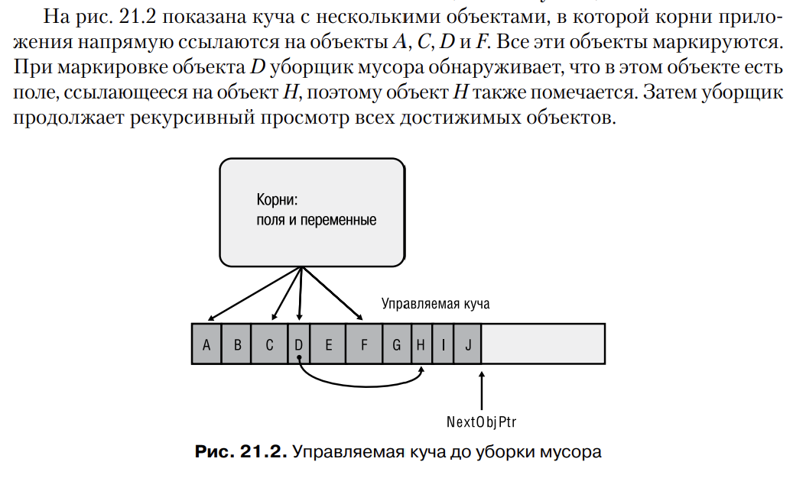
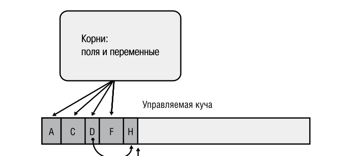
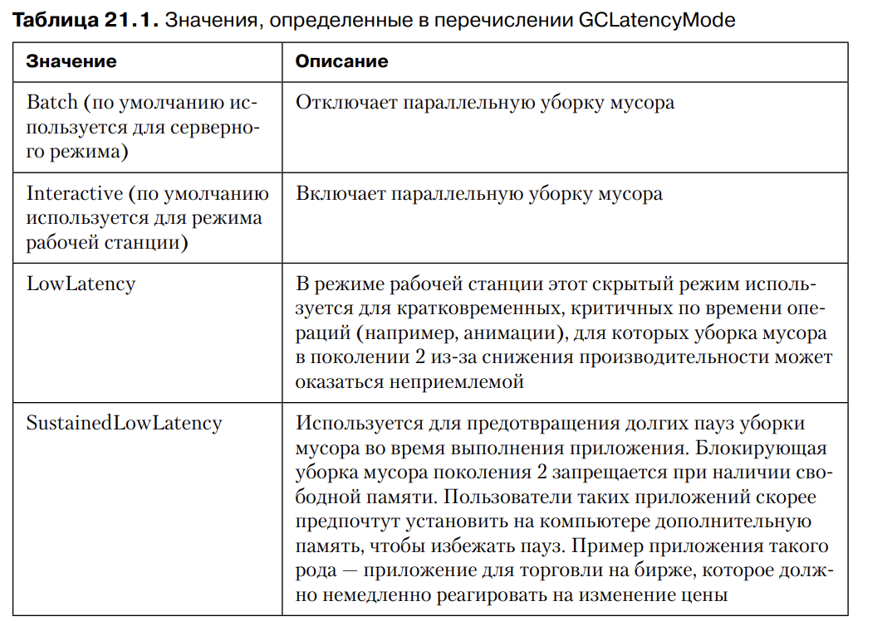
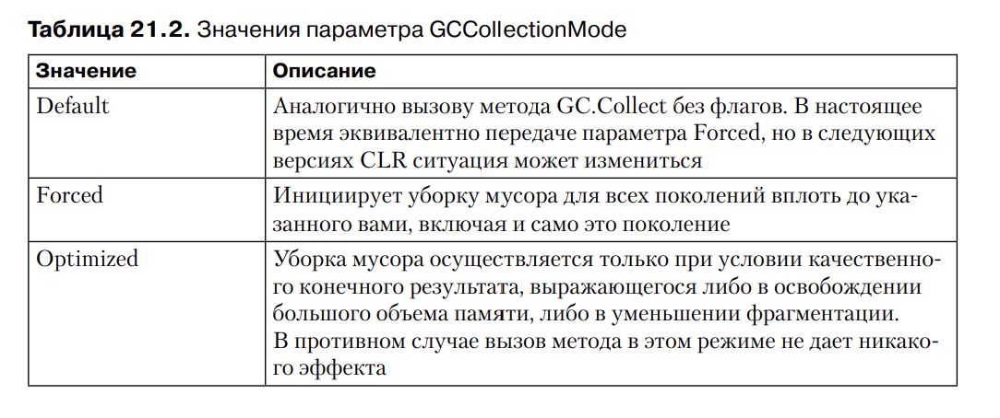
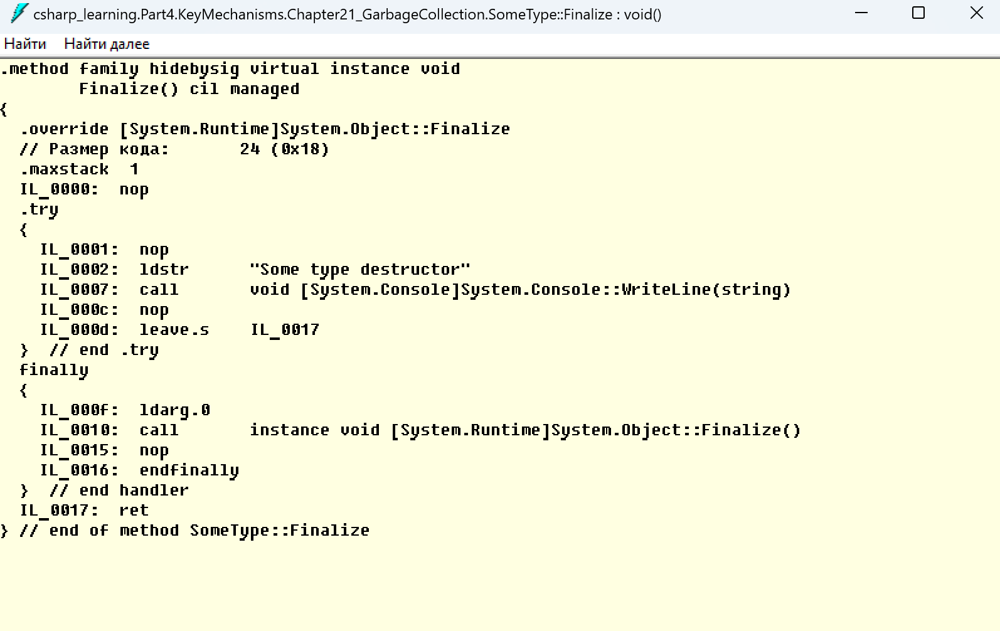
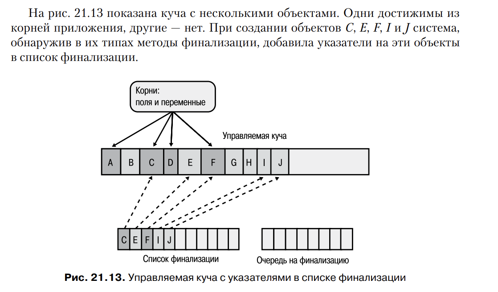
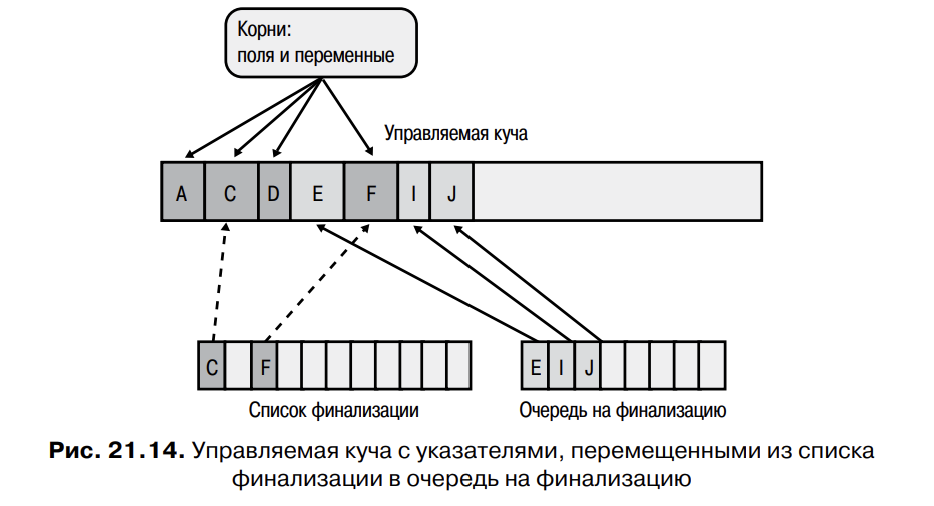
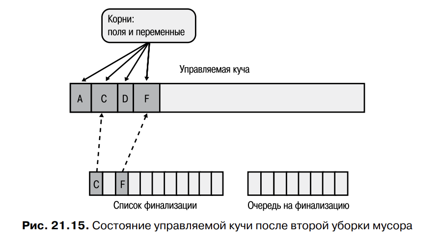
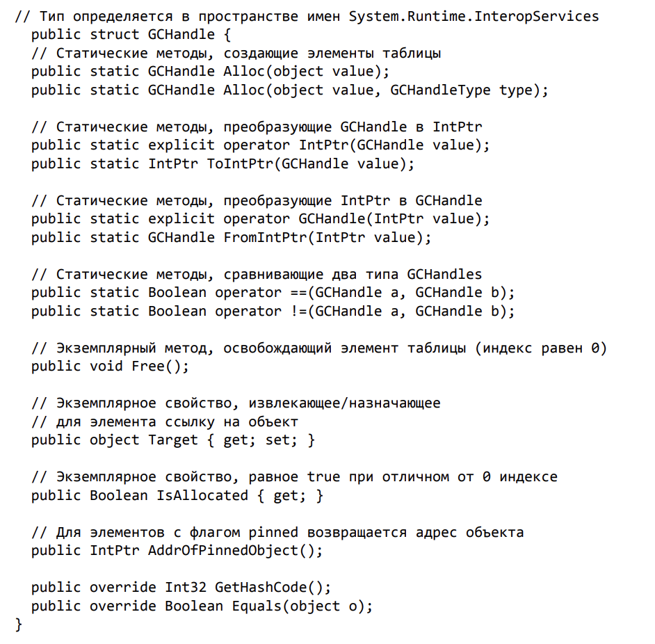

# Глава 21. Автоматическое управление памятью (уборка мусора)

В этой главе рассказано о создании новых объектов управляемыми приложениями, 
о том, как управляемая куча распоряжается временем жизни этих объектов и как 
освобождается занятая ими память. Мы рассмотрим работу уборщика мусора 
общеязыковой среды CLR и проблемы, связанные с его производительностью. 
В конце главы речь пойдет о приемах проектирования приложений, эффективно 
использующих память.

## Управляемая куча

Любая программа использует ресурсы - файлы, буферы в памяти, пространство экрана, 
сетевые подключения, базы данных и т.п. В ООП каждый тип идентифицирует некий 
доступный этой программе ресурс. Чтобы им воспользоваться, должна быть выделена 
память для представления этого типа.
Для доступа к ресурсу вам нужно:

1. Выделить память для типа, представляющего ресурс
2. Инициализировать выделенную память, установив начальное состояние ресура и сделав
его пригодным к использованию. За установку начального состояния типа отвечает конструктор.
3. Использовать ресурс, обращаясь к членам его типа (при необходимости операция
может повторяться).
4. В рамках процедуры очистки уничтожить состояние ресурса
5. Освободить память. За этот этпа отвечает исключитель GC

Программисты, ответственные за управление памятью, хронически забывают освободить
память, ставшую ненужной, или пытаются использовать уже освобожденную память.

Если вы пишете код, безопасный по отношению к типам (без использования ключевого
слова C# unsafe), повреждение памяти в ваших приложениях невозможно. Утечки памяти
остаются возможными и возникают из-за того, что приложение хранит объекты в коллекции, 
но не удаляет их, когда они становятся ненужными.

Иногда очистка ресураса дложна выполняться как можно раньше, не дожидаясь вмешательства
уборщика мусора. В таких классах можно вызвать дополнительный метод (Dispose), чтобы
очистка была выполнена по вашему собственному расписанию. Как правило, типы, требующие
специальной очистки, используют низкоуровневые системные ресурсы - файлы, сокеты или
подключения к базе данных.

## Выделение ресурсов из управляемой кучи

В CLR память для всех ресурсов выделяется из так называемой управляемой кучи (managed
heap). При инициализации процесса CLR резервирует область адресного пространства 
под управляемую кучу, а также указатель, который Рихтер называет NextObjPtr.
Он определяет, где в куче будет выделена память для следующего обхекта, и изначально
указывает на базовый адрес этой зарезервированной области адресного пространства.

По мере заполнения области объектами CLR выделяет новые области памяти, вплоть до 
заполнения всего адресного пространства. Таким образом, память приложения ограничивается
виртуальным адресным пространством процесса. Для 32-разрядных процессов можно выделить
до 1.5 гигабайта памяти, а для 64-разрядных процессов - около 8 терабайт памяти.

При выполнении оператора new среда CLR:

1. Подсчитывает количество байтов, необходимых для размещения полей типа (и всех 
полей, унаследованных об базового типа)
2. прибавляет к полученному значению количество байт, необходимых для размещения
системных полей объекта. У каждого объекта есть пара таких полей: указатель на 
объект-тип и индекс блока синхронизации. В 32 разрядных приложениях для каждого
из этих полей требуется 32 бита, что увеличивает размер каждого объекта на 8 байт, а 
в 64 разрядных приложениях каждое поле занимает 64 бита, добавляя к каждому объекту
16 байт
3. Проверяет, хватает ли в зарезервированной области байтов на выделение памяти для
объекта (при необходимости передает память). Если в heap недостаточно места для объекта,
ему выделяется память, начиная с адреса, на который ссылается указатель NextObjPtr, а
занимаемые им байты обнуляются. Затем вызывается конструктор типа (передающий NextObjPtr
в качестве параметра this), и оператор new возвращает ссылку на объект. Перед
возвратом этого адреса NextObjPtr переходит на первый адрес после объета, указывая 
на адрес, по которому в куче будет помещен следующий объект.


Увеличение указателя выполняется почти мгновенно.
Во многих приложениях, объекты, выделяемые примерно в одно время, тесно связаны
друг с другом, к тому же часто к ним обращаются примерно в одно время. Так, обычно
сразу после объекта FileStream создается объект BinaryWriter. Затем приложение 
обращается к объекту BinaryWriter, внутренний код которого использует FileStream. 
В среде, поддерживающей уборку мусора, новые объекты располагаются в памяти
непрерывно, что повышает производительность за счет близкого расположения ссылок. 
В частности, это значит, что рабочий рабор процесса будет меньше, чем подобного 
приложения, работающего в неуправляемой среде. Также, скорее всего, все объекты, 
используемые в программе, уместятся в кэше процессора. Приложение сможет получать 
доступ к этим объетам очень быстро, тк процессор будет выполнять большинство своих 
операций без кэш-промахов, замедляющих доступ к оперативной памяти.

Итак, пока складывается впечатление, что управляемая куча обладает превосходными 
характеристиками быстродействия. И все же это описание предполагает, 
что память всегда бесконечна, а CLR всегда может выделить блок для нового объекта. 
Конечно, это не так, поэтому управляемой куче необходим механизм уничтожения 
объектов, которые перестали быть нужными приложению. Таким механизмом 
является уборка мусора (Garbage Collection, GC).

## Алгоритм уборки мусора

Для управления сроком жизни объетов в некоторых системах используется алгоритм 
подсчета ссылок. Например, он используется в модели Microsoft COM (Component
Object Model). В системах с подсчетом ссылок каждый объект в куче содержит внутреннее
поле с информацией о том, сколько "частей" программы в настоящее время использует
данный объект. Когда каждая часть переходит к точке кода, в которой объект 
становится недоступным, она уменьшает поле счетчика объекта. Когда значение
счетчика уменьшается до 0, объект удаляется из памяти. К сожалению, в системах с 
подсчетом ссылок возникают серьезные проблемы с циклическими ссылками. Объекты ссылаются
друг на друга несмотря на то, что на них уже никто другой не ссылается.

Из-за проблем с алгоритмами, основанными на подсчете ссылок, CLR использует алгоритм
отслеживания ссылок вместо этого алгоритма. Алгоритм отслеживания ссылок работает
только с переменными ссылочного типа, потому что эти переменные могут ссылаться на 
объекты в куче; переменные значимых типов просто содержат данные экземпляра значимого
типа. Все переменные ссылочных типов называеются корнями (roots).

### Очистка мусора происходит в несколько фаз: 
1. Остановка всех потоков в процессе
2. Маркировка
3. Сжатие (compacting phase)
4. Перенос ссылок на новые места

Когда среда CLR запускает уборку мусора, она сначала приостанавливает все программные
потоки в процессе. Тем самым предотвращается обращение к объектам и возможное изменение
состояния во время их анализа CLR. Затем CLR переходит к этапе уборку мусора, называемому
маркировкой (marking). CLR перебирает все объекты в куче, задавая биту в поле индекса
блока синхронизации значение 0. Это означает, что все эти объекты могут быть удалены.
Затем CLR проверяет все активные корни и объекты, на которые они ссылаются. Если корень
содержит null, CLR игнорирует его и переходит к следующему корню.

Если корень ссылается на объект, в поле индекса блока синхронизации устанавливается 
бит - это и есть признак маркировки объекта. После маркировки объекта CLR 
проверяет все корни в этом объекте и маркирует объекты, на которые они ссылаются.
Встретив уже маркированный объект, уборщик мусора устанавливается, чтобы избежать 
возникновения бесконечного цикла в случае циклических ссылок.



После проверки всех корней куча содержит набор маркированных и немаркированных 
объектов. Маркированные объекты переживут уборку мусора, потому что 
на них ссылается хотя бы один объект; можно сказать, что они достижимы из кода 
приложения. Немаркированные объекты недостижимы, потому что в приложении 
не существует корня, через который приложение могло бы к ним обратиться.

Теперь, когда CLR знает, какие объекты должны остаться, а какие можно удалить, 
начинается следующая фаза уборки мусора, называемая сжатием (compacting 
phase). В этой фазе CLR перемещает вниз все «немусорные» объекты, чтобы 
они занимали смежный блок памяти. Перемещение имеет много преимуществ. 
Во-первых, оставшиеся объекты будут находиться поблизости друг от друга; это 
приводит к сокращению размера рабочего набора приложения, а следовательно, 
повышает производительность обращения к этим объектам в будущем. Во-вторых, 
свободное пространство тоже становится непрерывным, что позволяет освободить 
эту область адресного пространства. Наконец, сжатие позволяет избежать проблем 
фрагментации адресного пространства при использовании управляемой кучи.

После перемещения в памяти все ссылки на «выжившие» объекты из корней 
указывают на прежнее местонахождение объекта в памяти, а не на тот адрес, по 
которому объект был перемещен. Если возобновить выполнение потоков на этой 
стадии, потоки обратятся по старым адресам, что приведет к некорректному 
использованию памяти. Разумеется, этого допускать нельзя, поэтому в фазе сжатия 
CLR вычитает из каждого корня количество байт, на которое объект был сдвинут 
вниз в памяти. Тем самым гарантируется, что каждый корень будет ссылаться на тот 
же объект, что и прежде; просто сейчас этот объект оказался в другом месте памяти.

После сжатия памяти кучи в указатель NextObjPtr управляемой кучи заносится 
первый адрес за последним объектом, не являющимся мусором. По этому адресу 
следующий новый объект будет размещен в памяти. На рисунке показана управляемая 
куча после сжатия. После завершения фазы сжатия CLR возобновляет выполнение 
потоков приложения, а они обращаются к объектам так, словно никакой 
уборки мусора и не было.



Если CLR не удается освободить память в результате уборки мусора, а в процессах 
не осталось адресного пространства для выделения нового сегмента, значит, 
свободная память процесса полностью исчерпана. В этом случае попытка выделения 
новой памяти оператором new приведен к выдаче исключения OutOfMemoryException.
Ваше приложение может перехватить это исключение и восстановиться после 
него, но большинство приложений не пытается это делать; вместо этого исключение 
превращается в необработанное, Windows завершает процесс, а затем освобождает 
всю память, использованную процессом.

Программист должен извлечь для себя несколько важных уроков из этого описания. Во-первых, исключается утечка объектов, так как все объекты, недоступные 
от корней приложения, рано или поздно уничтожает уборщик мусора. Во-вторых, 
благодаря уборке мусора невозможно получить доступ к освобожденному объекту 
с последующим повреждением памяти.

### ВНИМАНИЕ
Статическое поле типа хранит объект, на которые ссылается, бессрочно или до выгрузки
домена приложений с загруженными типами. Чаще всего утечка памяти возникает из-за
хранения в статическом поле ссылки на коллекцию, в которую добавляются элементы. 
Статическое поле сохраняет объект коллекции, которая, в свою очередь, сохраняет все
свои элементы. Поэтому статических полей следут по возможности избегать.


## Уборка мусора и отладка

Как только объект становится недостижимым, он превращается в кандидата на удаление - 
объекты далеко не всегда "доживают" до завершения работы метода. Для приложения эта
особенность может иметь интересные последствия.

В представленном примере с Timer, если выполнить код без каких либо сторонних инструментов
IDE, то метод будет выполнен всего один раз, тк мы принудительно запустили сборку 
мусора.

Но если мы используем отладчик, то тут уже включится в ход решение, предложенное 
специалистами Microsoft:
при компиляции сборки с ключом /debug компилятора C# компилятор применяет к полученной
сборке атрибут System.Diagnostics.DebuggableAttribute с установленным флагом 
DisableOptimizations. При компиляции метода во время выполнения JIT-компилятор 
видит, что этот атрибут задан, и искуственно продлевает время жизни всех корней до 
завершения метода. В этом примере JIT-компилятор считает, что переменная t должна
существовать до конца метода. Таким образом, если происходит уборка мусора, уборщик
теперь считает, что t остается корнем, а объект Timer, на который ссылается t
по-прежнему достижим. Объект Timer переживает уборку мусора, а метод TimerCallback
будет вызываться многократно вплоть до выхода из Main.

JIT-компилятор делает это, чтобы помочь вам в процессе отладки. Теперь можно 
запустить приложение в обычном режиме (без отладчика), и если метод будет 
вызван, JIT-компилятор искусственно увеличит время жизни переменных до его 
окончания. Затем, если к процессу будет добавлен отладчик, можно вставить точку 
останова в ранее скомпилированный метод и изучить переменные.

перь вы знаете, как создать программу, которая работает в отладочном варианте, 
но не работает должным образом в готовой версии. Но программа, корректно 
работающая только в режиме отладки, бесполезна. Поэтому необходимо средство, 
обеспечивающее работу программы независимо от типа ее сборки.

Можно попробовать изменить метод Main следующим образом:
```
public static void Main() {
	// Создание объекта Timer, вызывающего метод TimerCallback каждые 2000 мс
	Timer t = new Timer(TimerCallback, null, 0, 2000);

	// Ждем, когда пользователь нажмет Enter
	Console.ReadLine();

	// Создаем ссылку на t после ReadLine
	// (в ходе оптимизации эта строка удаляется)
	t = null;
}
```

Все равно после компиляции этого кода (без параметра /debug+) и запуска полученного исполняемого файла (без отладчика) выяснится, что метод Timer_Callback
вызывается всего раз. Дело здесь в том, что JIT-компилятор является оптимизирующим, а приравнивание локальной переменной или переменной-параметра к null
равнозначно отсутствию ссылки на эту переменную. Иначе говоря, JIT-компилятор 
в ходе оптимизации полностью убирает строку t = null; из программы, из-за 
этого она работает не так, как хотелось бы. Вот как правильно следовало изменить 
метод Main:

```
public static void Main() {
	// Создание объекта Timer, вызывающего метод TimerCallback каждые 2000 мс
	Timer t = new Timer(TimerCallback, null, 0, 2000);

	// Ждем, когда пользователь нажмет Enter
	Console.ReadLine();

	// Создаем ссылку на переменную t после ReadLine
	// (t не удаляется уборщиком мусора
	// до возвращения управления методом Dispose)
	t.Dispose();
}
```

Теперь, скомпилировав этот код (без параметра /debug+) и запустив полученный 
исполняемый файл (без отладчика), вы увидите, что метод TimerCallback вызывается
несколько раз, и программа работает корректно. Это объясняется тем, что 
объект, на который ссылается переменная t, не должен удаляться, чтобы для него 
можно было вызвать метод Dispose (значение t нужно передать методу Dispose
как аргумент this). Парадокс: явно указывая, в каком месте таймер должен быть 
уничтожен, мы продлеваем его жизнь до этой точки.

### Примечание

После всего сказанного не стоит преждевременно беспокоиться о том, что ваши
собственные объекты могут быть уничтожены раньше времени. Класс Timer использовался 
в обсуждении только из-за своего специфического отсутствующего
у других классов поведения. Дело в том, что присутствие в куче объекта Timer 
приводит к периодическому вызову метода. Другие типы не в состоянии так себя вести. 
К примеру, наличие в памяти объекта String не имеет никаких последствий. Строка
просто находится в куче. Именно поэтому, чтобы продемонстрировать, как работают
корни и как время жизни объекта связано с отладчиком, я использовал объект Timer. 
Но при этом основной вопрос состоял не в том, как растянуть время жизни объекта. 
Время жизни остальных объектов определяется приложением автоматически.

## Поколения

Уборщик мусора с поддержкой поколений, который также называют эфемерным уборщиком 
мусора, работает на основе следующий предположений:

1. чем младше объект, тем короче его время жизни
2. чем старше объект, тем длиннее его время жизни
3. уборка мусора в части кучи выполняется быстрее, чем во всей куче

Сразу после инициализации в управляемой куче нет объектов. Говорят, что 
создаваемые в куче объекты составляют поколение 0. Проще говоря, к нулевому 
поколению относятся только что созданные объекты, которых не касался уборщик 
мусора

При инициализации CLR выбирает пороговый размер для поколения 0. Если 
в результате выделения памяти для нового объекта размер поколения 0 превышает 
пороговое значение, должна начаться уборка мусора. Объекты, пережившие 
уборку мусора, становятся поколением 1. Объекты из поколения 1 были 
проверены уборщиком мусора один раз. 
После уборки мусора объектов в поколении 0 не остается. Туда помещаются 
новые объекты. Приложение продолжает работу и размещает 
новые объекты. Также в ходе работы приложения становятся недоступными объекты, 
поэтому занятая ими память должна рано или поздно освободиться.

Если при попытке разместить новый объект размер поколения 0 превысил пороговое
значение, должна начаться уборка мусора. При этом уборщик мусора решает, какие
поколения следует обработать. CLR помимо выборп порогового значения поколения 0, 
также выбирает пороговый размер для поколения 1.
Начиная уборку мусора, уборщик определяет, сколько памяти занято поколением 1. ДОпустим, 
пока поколение 1 занимает намного меньше отведенной памяти, поэтому уборщик проверяет
только объект поколения 0.

Ясно, что игнорирование объектов поколения 1 повышает быстродействие уборщика. Однако
его производительность растет еще больше благодаря выборочной проверки объектов в heap.
Если корень или объект ссылается на объект из старшего поколения, уборщик игнорирует 
все внутренние ссылки старшего объекта, сокращая время построения графа доступных 
объектов. Конечно, возможна ситуация, когда старый объект ссылается на новый. Чтобы
не пропустить обновленные поля этих старых объетов, уборщик использует внутренний 
механизм JIT-компилятора, устанавливающий флаг при изменении ссылочного поля 
объекта. Он позволяет уборщику выяснить, какие из старых объектов (если они есть)
были изменены с момента последней уборки мусора. Остается проверять только старые
объекты с измененными полями, чтобы выяснить, не ссылаются ли они на новые объекты
из поколения 0.

Уборщик мусора с поддержкой поколений, предполагает, что если объект сейчас в 1 поколении,
то он будет жить и дальше, поэтому особо нет смысла проводить сборку мусора в 1 
поколении, потому что там можно высвободить мало памяти. 

Начинается проверка 1 поколения только когда оно превышает пороговое значение.
Управляемая куча поддерживает только три поколения: 0, 1 и 2.

Если уборщик видит, что после уборки мусора в поколении 0 остается очень мало 
выживших объектов, он может снизить порог для поколения 0. В этом случае уборка 
мусора будет выполняться чаще, но это меньше загрузит уборщик, поэтому рабочий 
набор процесса останется небольшим. В сущности, если все объекты поколения 0 
станут мусором, уборщику не придется даже дефрагментировать память — достаточно будет вернуть указатель NextObjPtr в начало поколения 0, чтобы посчитать 
уборку мусора законченной. Замечательный способ освобождения памяти!

В то же время, если после обработки поколения 0 уборщик мусора обнаруживает 
множество выживших объектов, значит, удается освободить мало памяти. В этом 
случае уборщик мусора может поднять порог для поколения 0. В результате уборка 
мусора выполняется реже, но каждый раз будет освобождаться значительный объем 
памяти. Кстати, если уборщик освобождает недостаточно памяти, перед генерированием
исключения OutOfMemoryException он выполняет полную уборку мусора.

## Запуск уборки мусора

Как вы уже знаете, CLR запускает уборку мусора, когда обнаруживает, что объем 
поколения 0 достиг своего порогового значения. Это самая распространенная причина 
запуска уборки мусора, однако есть и другие:

1. Вызов статического метода Collect объекта System.GC. Код явно указывает, 
в какой момент должна быть выполнена уборка мусора. Хотя Microsoft решительно 
не рекомендует использовать этот метод, иногда принудительная уборка 
мусора в приложении может быть оправдана. Этот способ рассматривается 
позднее в этой главе
2. Windows сообщает о нехватке памяти. CLR использует функции Win32 
CreateMemoryResourceNotification и QueryMemoryResourceNotification для 
контроля состояния памяти системы. Если Windows сообщает о недостаточном 
объеме свободной памяти, CLR запускает уборку мусора, чтобы избавиться от 
неиспользуемых объектов и сократить размер рабочего набора процесса.
3. Выгрузка домена приложения. При выгрузке домена приложения CLR выполняет 
полную уборку мусора для всех поколений. Домены приложений рассматриваются в 
главе 22
4. Завершение работы CLR. CLR завершает работу при нормальном завершении 
процесса (по сравнению, например, с внешним завершением работы 
из Диспетчера задач). Во время заверения CLR считает, что в процессе нет 
корневых ссылок; объектам предоставляется возможность выполнить очистку, 
но CLR не пытается дефрагментировать или освобождать память, потому 
что после завершения всего процесса Windows автоматически освобождает 
всю его память

## Большие объекты

Существует еще один путь повышения быстродействия, о котором стоит рассказать. 
CLR делит объекты на малые и большие. До настоящего момента рассматривались 
только малые объекты. Любые объекты размером 85 000 байт и более считаются 
большими. CLR работает с большими объектами по несколько отличающимся 
правилам:

1. Память для них выделяется в отдельной части адресного пространства процесса
2. К большим объектам не применяется сжатие, так как на их перемещение в памяти 
потребуется слишком много процессорного времени. Возможная фрагментация 
адресного пространства между большими объектами может привести к выдаче 
исключения OutOfMemoryException. В будущих версиях CLR большие объекты 
могут участвовать в сжатии.
3. Большие объекты всегда считаются частью поколения 2, поэтому их следует 
создавать лишь для ресурсов, которые должны жить долго. Размещение в памяти 
короткоживущих больших объектов приведет к необходимости частой уборки 
мусора в поколении 2, что снижает производительность. Обычно в больших 
объектах хранятся большие строки (например, XML или JSON) или массивы 
байтов, используемые в операциях ввода/вывода — например, при чтении данных 
из файла или сети в буфер для последующей обработки.

Все эти механизмы абсолютно прозрачны для разработчика. Вы можете просто 
забыть об их существовании до тех пор, пока в программе не возникнет какая-нибудь 
аномальная ситуация (например, фрагментация адресного пространства)

## Режимы уборки мусора

При запуске CLR выбирается один из режимов уборки мусора, который не может быть 
изменен до завершение процесса. Существует два основных режима уборки мусора:
1. Режим рабочей станции. Настраивает уборку мусора для приложений на стороне 
клиента. Он оптимизирован для минимизации времени приостановки потоков приложения,
чтобы не раздражать пользователя. Уборщик предполагает, что на компьютере работают 
другие приложения, и старанется не занимать слишком много ресурсов процессора.
2. Режим сервера. Уборщик предполагает, что на машине не запущено других 
сторонних приложений (клиентских и серверных), поэтому все ресурсы процессора можно 
бросить на уборку мусора. В это режиме управляемая куча разбирается на несколько 
разделов - по одному на процессор. Изначально уборщик мусора использует один 
поток на один прцоессор. Каждый поток выполняется в собственном разделе
одновременно с другими потоками. Такой подход хорошо работает в случае приложений с 
единообразным поведением рабочих потоков. Функция работает на компьютерах 
с несколькими процессорами; только в этом случае параллельная обработка потоков 
позволяет получить прирост производительности. 

По умолчанию приложение запускается в режиме рабочей станции с включенным режимом
параллельной уборку мусора. А серверные приложения (ASP.NET или SQL Server), 
обеспечивающие хостинг CLR, могут потребовать загрузки режима сервера.
Однако если приложение запускается на одном процессоре, то всегда выбирается режим
рабочей станции.

Автономное приложение может приказать CLR использовать серверный уборщик мусора 
путем создания конфигурационного файла, содержащего элемент gcServer. 
Пример:
```
<configuration>
 <runtime>
	<gcServer enabled="true"/>
 </runtime>
</configuration>
```
Узнать запущено ли среда CLR в серверном GC-режиме, можно при помощи логического 
свойства IsServerGC класса GCSettings. 

Кроме двух основных режимов, у уборщика мусора существует два подрежима:
параллельный (по умолчанию) и непараллельный. 
В параллельном режиме у уборщика мусора есть дополнительный фоновый поток, выполняющий
пометку объектов во время работы приложения. Когда поток размещает в памяти объект, 
вызывающий превышение порога для поколения 0, уборщик сначала приостанавливает все
потоки, а затем определяет поколения, в которых нужно выполнить уборку мусора. 
Если уборщик должен собрать мусор в поколении 0 или 1, он работает как обычно, но 
если нужно собрать мусор в поколении 2, размер поколения 0 увеличивается выше
порогового, чтобы разместить новый объект, а затем исполнение потоков приложения 
возобновляется.
Пока работают потоки приложения, отдельный поток уборщика с нормальным приоритетом
находит все недоступные объекты в фоновом режиме. После того, как объекты будут 
обнаружены, уборщик приостанавливается все потоки и решает, нужно ли дефрагментировать 
память. Если нет, если свободной памяти много. Прибегая к параллельной уборке 
мусора, приложение обычно расходует больше памяти, чем при непараллельной уборке.

Можно запретить CLR использовать режиме параллельной уборки мусора, создав конфиг
файл приложения, содержащий элемент gcConcurrent.

Хотя конфигурация GC-режима не может быть изменена до завершения процесса, 
приложение может контролировать уборку мусора при помощи свойства GCLatencyMode 
класса GCSettings. Этому свйоству могут присваиваться любые значения из перечисление
GCLatencyMode:



Режим LowLatency требует доп пояснений. Обычно его включают для реализации операций, 
для которых важно время выполнения, а затем возвращают режим Batch или Interactive. 
Однако в режиме LowLatency уборщик мусора действительно обходит вниманием 
поколение 2, так как это может занять много времени. Разумеется, если вызвать 
GC.Collect(), поколение 2 также отправится в мусор. То же самое произойдет, если 
Windows "пожалуется" CLR на недостаток системной памяти.

В режиме LowLatency приложение может выдавать OutOfMemoryException. Соответственно, 
рекомендуется включать этот режим на максимально короткое время, избегать 
размещения в памяти многих объектов, а также больших объектов и возвращаться в режимах 
Batch и Interactive при помощи области ограниченного выполнения. Также помните, что 
режим LowLatency является настройкой уровня процесса и потоки могут быть запущены
паралелльно. Эти потоки могут даже менять данную настройку в процессе ее 
использования другим потоком. В этом случае вы не можете добавить обновляющийся счетчик
(управляемый при помощи методов Interlocked).

## Программное управление уборщиком мусора

Тип System.GC позволяет приложению напрямую управлять уборщиком мусора.
Чтобы заставить уборщика мусора провести уборку следует вызвать метод GC.Collect
При вызове можно указать поколение, в котором нужно выполнить уборку мусора, параметр
GCCollectionMode и логический признак выполнения блокирующей (непараллельной) или 
фоновой (параллельной) уборки мусора. 



### Обычно следует избегать вызова любых методов Collect

Лучше не вмешиваться в работу GC и позволять ему самостоятельно настраивать пороговые
значения для поколений, основываясь на реальном поведении приложения. Однако при
написании приложения с консольным и графическим интерфейсом его код "владеет" 
процессом и CLR в этом процессе. Иногда в таких приложениях следует убираить мусор
принудительно во вполне определенное время. Это 
можно сделать при помощи метода GCCollectionMode в режиме Optimized. Режимы 
Default и Forced обычно используют для отладки и тестирования

Например, имеет смысл очистить мусор, если только что произошло некое разовое событие,
которое привело к уничтожению множества старых объектов. Вызов Collect в такой ситуации
очень кстати, ведь основанные на прозлом опыте прогнозы уборщика мусора, скорее всего,
для разовых операций окажутся неточными. Например, в приложении имеет смысл выполнить
принудительную уборку мусора во всех поколениях после инициализации приложения или 
сохранения пользователей файла с данными. Когда на веб-странице размещается элемент
управления Windows Form, полная уборка мусора выполняется при каждой выгрузке страницы.
Не нужно вручную вызывать Collect, чтобы сократить время отклика приложения; вызывайте его,
чтобы уменьшить рабочий набор процесса.

В некоторых приложениях (особенно это касается серверных приложений, хранящих
в памяти множество объектов) время на полную уборку мусора оказывается слишком 
большим. Более того, если уборка мусора длится слишком долго, может завершиться 
время ожидания клиентских запросов. Чтобы избежать подобных ситуаций, в классе GC
имеется метод RegisterForNullGCNotification. С его помощью и при использовании
дополнительных вспомогательных методов (WaitForFullGCApproach, WaitForFullGCComplete 
и CancelFullGCNotification) можно оповестить приложение о том, что уборщик мусора
близок к выполнению полной уборки. В результате приложение сможет вызвать метод 
GC.Collect для принудлительной уборки мусора в более подходящее время или свяжется
с другими серверами, чтобы лучше распределить клиентские запросы.

Имейте в виду, что методы WaitForFullGCApproach и WaitForFullGCComplete
всегда вызываются вместе, так как CLR обрабатывает их попарно.

## Мониторинг использования памяти приложения

Существуют методы, которые можно вызвать для наблюдения за работой уборщика мусора
в процессе. Так, следующие статичесике методы класса GC вызываются для выяснения
числа операций уборки мусора в конкретном поколении или для объекта памяти, занятого
в данный момент объектами в управляемой куче
```
Int32 CollectionCount(Int32 generation);
Int64 GetTotalMemory(Boolean forceFullCollection);
```

Чтобы выполнить профилирование конкретного блока кода, можно вставить до и после него
код, вызывающий эти методы, а затем вычислить разность. Это позволяет судить о том,
как этот блок кода сказывается на рабочем наборе процесса, и узнать, сколько операций
уборки мусора произошло при выполнении этого блока кода. Если показатели высокие, 
значит, нужно поработать над оптимизацией алгоритма в блоке кода.

Можно также узнать, сколько памяти расходуется отдельным доменом приложений. 
О том, как это сделать, вы узнаете в главе 22.

В ходе установки .NET Framework устанавливается также набор счетчиков производительности,
которые позволяют собирать в реальном времени самые разнообразные статические данные
о CLR. Эти данные можно просматривать с помощью утилиты PerfMon.exe или системного
монитора и состава Windows. Проще всего получить доступ к системному монитору, запустив
утилиту PerfMon.exe и щелкнув на кнопке + панели инструментов; на экране появляется
диалоговое окно AddCounters.

Для мониторинга уборки мусора в CLR выбрите объект производительности .NET CLR Memory,
затем укажите в списке нужное приложение. В завершение выберите набор счетчиков для
мониторинга, щелкните на кнопке Add, затем - на кнопке OK. Теперь системный монитор
будет в реальном времени строить график выбранного статистического показателя. 
Чтобы узнать, что означает счетчик, выделите его и установите флажок Show Description.

Еще один замечательный инструмент для анализа использования памяти и производительности
приложения назыавется PerfView. Он позволяет собирать журнале ETW (Event Tracing for
Windows) и обрабатывать их. Вы можете найти его в интернете. Наконец, можно воспользоваться
отладочным расширением SOS.dll, помогающим при проблемах с памятью и других проблемах CLR. 
Это расширение позволяет узнать, сколько памяти выделено для процесса в управляемой куче,
вывести все объекты, зарегестрированные для финализации и помещенные в очередь, 
просмотреть записи в таблице GCHandle как для домена приложений, так и для всего процесса, 
проверить корни, сохраняющие объект в куче живым, и многое другое.

## Освобождение ресурсов при помощи механизма финализации

Большинству типов для работы требуется только память, но есть и типы, которым 
помимо памяти необходимы системные ресурсы. 

Например, типу System.IO.FileStream нужно открыть файл и сохранить его дескриптор.
Затем при помощи этого дескриптора методы Read и Write данного типа работают с 
файлом. Аналогично, тип System.Threading.Mutex открывает мьютекс, являющийся объектом
ядра Windows, и сохраняет его дескриптор, который использует при вызове методов объекта
Mutex.

Если тип, использующий системный ресурс, будет уничтожен в ходе уборки мусора, 
занимаемая объектом память вернется в управляемую кучу; однако системный ресурс, о
котором ничего неизвестно GC, будет потерян. Разумеется, это нежелательно, поэтому
CLR поддерживает механизм финализации, позволяющий объекту выполнить корректную 
очистку, прежде чем уборщик мусора освободит занятую им память. Любой тип, использующий
системный ресурс (файл, сетевое соединение, сокет, мьютекс и т.д.) должен поддерживать
финализацию.

Класс System.Object определяет защищенный виртуальный метод с именем Finalize. 
Когда уборщик мусора определяет, что объект подлежит уничтожению, он вызывает метод 
Finalize этого объекта (если он переопределен). Группа проектировщиков C# решила,
что метод финализации отличается от остальных и требует специального синтаксиса. 
Поэтому для определения метода финализации в C# перед именем класса нужно добавить 
знак тильды (~):
```
internal sealed class SomeType {

	// Метод финализации
	~SomeType() {
	// Код метода финализации
	}
```

Компилятор C# внес в метаданные этого модуля защищенный метод с именем Finalize. 
Код в теле метода генерируется в блок try, а вызов метода base.Finalize - в блок
Finally:



### ВНИМАНИЕ

Специальный синтаксис в C# для определения метода финализации, напоминает синтаксис
деструктора C++. Действительно, в ранних версиях C# этот метод назывался деструктором.
Однако метод финализации работает совсем не так, как неуправляемый деструктор C++, 
что сбивает с толку многих разработчиков, переходящих между языками.
Беда в том, что разработчики ошибочно полагают, что использование синтаксиса 
деструктора означает в C# детерминированное уничтожение объектов тип, как это происходит
в C++. Но CLR не поддерживает детерминированное уничтожение, поэтому C# не может 
предоставить этот механизм.

Методы Finalize вызываются при заверешении уборки мусора для объектов, которые 
уборщик мусора определил для уничтожения. Это означает, что память таких объектов
не может быть освобождена немеделенно. Потому что метод Finalize может выполнить 
кода с обращением к полю. Так как финализируемый объект должен пережить уборку мусора,
он перевеодится в другое поколение, вследствие чего такой объект живет намного дольше,
чем следует. Ситуация неидеальная в отношении использования памяти, поэтому 
финализации следует по возможноти избегать. Проблема усугубляется тем, что при 
преобразовании поколения финализируемых объектов все объекты, на которые они ссылаются
в своих полях, тоже преобразуются, потому что они должны продолжать свое существование.
Итак, старайтесь по возможности обойтись без финализируемых объектов с полями 
ссылочного типа.

Следует избегать написания методов Finalize, обращающихся к другим объектам, типы
которых определяют метод Finalize; может оказаться, что последние уже прошли 
финализацию. Тем не менее ничто не мешает вам обращаться к экземплярам значимых типов
или объектам ссылочных типов, не определяющих метод Finalize. Также будьте внимательны
при вызове статических методов, потому что эти методы могут обращаться к объектам, 
уже прошедшим финализацию; поведение статического метода становится непредсказуемым

Для вызова методов Finalize CLR использует специальный высокоприоритетный поток. Таким
образом предотвращается ситуации взаимной блокировки, возможные в обычных условиях.
Если методы Finalize блокируются (например, входит в бесконечный цикл или ожидает
объекта, который никогда не будет освобожден), специальный поток не сможет вызывать
методы Finalize. Данная ситуация крайне нежелательна, потому что приложение не 
сможет освободить память, занимаемую финализируемыми объектами. Если метод Finalize
выдает необработанное исключение, процесс завершается; перехватить такое исключение
невозможно. 

Методы Finalize предназначены исключено для освобождения системных ресурсов. Чтобы
упростить их использование, рекомендуется по возможности обойтись без переопределения
метода Finalize класса Object; вместо этого лучше использовать вспомогательный 
класс из библиотеки FCL. Этот класс переопределяет Object и выполняет ряд дополнительных
операций. Можно создавать собственные классы, производные от него и наследующие
все его вспомогательные операции.

Если создаете управляемый тип, использующий системные ресурсы, создайте класс, производный
от специального базового класса System.Runtime.InteropServices.SafeHandle, который
выглядит примерно так (комментарии от Рихтера):
```
public abstract class SafeHandle : CriticalFinalizerObject, IDisposable {
	// Это дескриптор системного ресурса
	protected IntPtr handle;

	protected SafeHandle(IntPtr invalidHandleValue, Boolean ownsHandle) 
	{
		this.handle = invalidHandleValue;
		// Если значение ownsHandle равно true, то системный ресурс закрывается
		// при уничтожении объекта, производного от SafeHandle,
		// уборщиком мусора
	}

	protected void SetHandle(IntPtr handle) 
	{
		this.handle = handle;
	}

	// Явное освобождение ресурса выполняется вызовом метода Dispose
	public void Dispose() { Dispose(true); }

	// Здесь подойдет стандартная реализация метода Dispose
	// Настоятельно не рекомендуется переопределять этот метод!
	protected virtual void Dispose(Boolean disposing) 
	{
		// В стандартной реализации аргумент, вызывающий метод
		// Dispose, игнорируется
		// Если ресурс уже освобожден, управление возвращается коду
		// Если значение ownsHandle равно false, управление возвращается
		/ Вызов виртуального метода ReleaseHandle
		// Вызов GC.SuppressFinalize(this), отменяющий вызов метода финализации
		// Если значение ReleaseHandle равно true, управление возвращается коду
		// Если управление передано в эту точку,
		// запускается ReleaseHandleFailed Managed Debugging Assistant (MDA)
	}
	// Здесь подходит стандартная реализация метода финализации
	// Настоятельно не рекомендуется переопределять этот метод!
	~SafeHandle() { Dispose(false); }

	// Производный класс переопределяет этот метод,
	// чтобы реализовать код освобождения ресурса
	protected abstract Boolean ReleaseHandle();
	public void SetHandleAsInvalid() 
	{
		// Установка флага, означающего, что этот ресурс был освобожден
		// Вызов GC.SuppressFinalize(this), отменяющий вызов метода финализации
	}

	public Boolean IsClosed 
	{
		get 
		{
		// Возвращение флага, показывающего, был ли ресурс освобожден
		}
	}

	public abstract Boolean IsInvalid {
		// Производный класс переопределяет это свойство
		// Реализация должна вернуть значение true, если значение
		// дескриптора не представляет ресурс (обычно это значит,
		// что дескриптор равен 0 или @1)
		get
	}

	// Эти три метода имеют отношение к безопасности и подсчету ссылок
	// Подробнее о них рассказывается в конце этого раздела
	public void DangerousAddRef(ref Boolean success) {...}
	public IntPtr DangerousGetHandle() {...}
	public void DangerousRelease() {...}
}
```

Прежде всего нужно отметить, что этот класс наследуется от класса CriticalFinalizerObject, 
определенного в пространстве System.Runtime.ConstrainedExecution. Это гарантирует 
"особое обращение" со стороны CLR к этому классу и другим, проивзодным от него классам.
В частности, CLR наделяет этот класс тремя интересными особенностями:
1. При первом создании любого объекта, производного от типа CriticalFinalizerObject, 
CLR автоматически запускает JIT-компилятор, компилирующий все методы финализации 
в иерархии наследования. Компиляция этих методов после создания объекта гарантирует, 
что системные ресурсы освободятся, как только объект станет мусором. Без немедленной
компиляции метода финализации может оказаться, что ресурс будет выделен и 
использован, но не освобожден. При недостатке памяти CLR может не хватить памяти для 
компиляции метода финализации; в этом случае метод не будет исполнен, что 
приведет к утечке системных ресурсов. Также ресурсы не будут освобождены, 
если код в методе финализации содержит ссылку на тип в другой сборке, которая 
не была обнаружена CLR.
2. CLR вызывает метод финализации для типов, производных от CriticalFinalizerObject,
после вызова методов финализации для типов, непроизводных от 
CriticalFinalizerObject. Благодаря этому классы управляемых ресурсов, 
имеющие метод финализации, могут успешно обращаться к объектам, производным от 
CriticalFinalizerObject, в их методах финализации. Так, метод 
финализации класса FileStream может сбросить данные из буфера памяти на 
диск в полной уверенности, что дисковый файл еще не был закрыт.
3. CLR вызывает метод финализации для типов, производных от CriticalFinalizerObject,
если домен приложения был аварийно завершен управляющим приложением (например, 
Microsoft SQL Server или Microsoft ASP.NET). Это гарантирует освобождение системных
ресурсов даже в том случае, когда управляющее 
приложение больше не доверяет работающему внутри него управляемому коду

Класс SafeHandle является абстрактным: предполгается, что разработчик создаст класс, 
производный от SafeHandle, которые переопределит защищенный конструктор, абстрактный 
метод ReleaseHandle и абстрактное свойство IsInvalid метода доступа get.

В Windows для операций с системными ресурсами обычно используются дескрипторы. В 
классе SafeHandle определяется защищенное поле IntPtr с именем handle. Большинство 
дескрипторов считаются недействительными при равенстве их значений 0 или -1. 
Пространство имен Microsoft.Win32.SafeHandles содержит еще один вспомогательный 
класс SafeHandleZeroOrMinusOneIsInvalid вида:

```
public abstract class SafeHandleZeroOrMinusOneIsInvalid : SafeHandle {
	protected SafeHandleZeroOrMinusOneIsInvalid(Boolean ownsHandle)
		: base(IntPtr.Zero, ownsHandle) 
	{ }

	public override Boolean IsInvalid 
	{
		get 
		{
			if (base.handle == IntPtr.Zero) return true;
			if (base.handle == (IntPtr) (-1)) return true;
			return false;
		}
	}
```

Этот класс тоже является абстрактным.

На платформе Microsoft .NET Framework есть несколько открытых классов, производных 
от SafeHandleZeroOrMunusOneIsInvalid, в числе которых SafeFileHandle, 
SafeRegistryHandle, SafeWaitHandle и SafeMemoryMappedViewHandle. А так 
выглядит класс SafeFileHandle:
```
public sealed class SafeFileHandle : SafeHandleZeroOrMinusOneIsInvalid 
{
	public SafeFileHandle(IntPtr preexistingHandle, Boolean ownsHandle)
		: base(ownsHandle) 
	{
		base.SetHandle(preexistingHandle);
	}

	protected override Boolean ReleaseHandle() 
	{
		// Сообщить Windows, что системный ресурс нужно закрыть
		return Win32Native.CloseHandle(base.handle);
	}
}
```

Класс SafeWaitHandle реализован сходным образом. Единственной причиной 
для создания разных классов с похожими реализациями является обеспечение 
безопасности типов: компилятор не позволит использовать файловый дескриптор 
в качестве аргумента метода, принимающего дескриптор блокировки, и наоборот. 
Метод ReleaseHandle класса SafeRegistryHandle вызывает Win32-функцию 
RegCloseKey

Жаль, что на платформе .NET Framework отсутствуют дополнительные классы, служащие 
оболочкой различных системных ресурсов, например таких, как 
SafeProcessHandle, SafeThreadHandle, SafeTokenHandle, SafeLibraryHandle (его 
метод ReleaseHandle вызывал бы Win32-функцию FreeLibrary), SafeLocalAllocHandle 
(его метод ReleaseHandle вызывал бы Win32-функцию LocalFree) и т. п.

Стоит добавить, что у типа SafeHandle есть **еще две функциональные особенности**:

1. Когда производные от него типы используются в сценариях взаимодействия с 
неуправляемым кодом, им гарантирован особый подходит со стороны CLR. Вот пример:

```
using System;
using System.Runtime.InteropServices;
using Microsoft.Win32.SafeHandles;

internal static class SomeType {
	[DllImport("Kernel32", CharSet=CharSet.Unicode, EntryPoint="CreateEvent")]
	// Этот прототип неустойчив к сбоям
	private static extern IntPtr CreateEventBad(
		IntPtr pSecurityAttributes, Boolean manualReset,
		Boolean initialState, String name);

	// Этот прототип устойчив к сбоям
	[DllImport("Kernel32", CharSet=CharSet.Unicode, EntryPoint="CreateEvent")]
	private static extern SafeWaitHandle CreateEventGood(
		IntPtr pSecurityAttributes, Boolean manualReset,
		Boolean initialState, String name);

	public static void SomeMethod() {
		IntPtr handle = CreateEventBad(IntPtr.Zero, false, false, null);
		SafeWaitHandle swh = CreateEventGood(IntPtr.Zero, false, false, null);
	}
} 
```

Класс SafeHandle устраняет эту потенциальную утечку ресурсов. Обратите 
внимание, что прототип метода CreateEventGood возвращает SafeWaitHandle, 
а не IntPtr. При вызове метода CreateEventGood CLR вызывает Win32-функцию 
CreateEvent. Когда эта функция возвращает управление управляемому коду, CLR 
«знает», что SafeWaitHandle является производным от SafeHandle. Поэтому CLR 
автоматически создает экземпляр класса SafeWaitHandle, передавая ему полученное 
от метода CreateEvent значение дескриптора. Обновление объекта SafeWaitHandle
и присвоение дескриптора происходят в неуправляемом коде, который не может 
быть прерван исключением ThreadAbortException. В результате в управляемом 
коде не может возникнуть утечка этого системного ресурса. А в итоге объект 
SafeWaitHandle удаляется уборщиком мусора и вызывается его метод финализации, 
обеспечивающий освобождение памяти.

Наконец, классы производные от SafeHandle, гарантирует, что никто не сможет воспользоваться
возможными брешами в системе безопасности. Проблема в том, что один из потоков может
попытаться использовать системный ресурс, освобождаемый другим потоком. Это называется
атакой с повторным использованием дескрипторов. Класс SafeHandle предотвращает это 
нарушение безопасности благодаря подсчету ссылок. В нем определено закрытое поле, 
исполняющее роль счетчика. Когда производному от SafeHandle объекту присваивается 
корректный дескриптор, счетчик приравнивается к 1. Всякий раз, когда производный 
от SafeHandle объект передается как аргумент неуправляемому методу, CLR автоматически
увеличивает значение счетчика на единицу. Когда неуправляемый метод возвращает 
управление управляемому коду, CLR уменьшает значение счетчика на ту же величину.

Например, вот так выглядит прототип Win32-функции SetEvent:
```
[DllImport("Kernel32", ExactSpelling=true)]
private static extern Boolean SetEvent(SafeWaitHandle swh);
```

При вызове этого метода и передаче ему ссылки на объект SafeWaitHandle CLR увеличивает
значение счетчика перед вызовом и уменьшает значение счетчика сразу после вызова.
Разумеется, операции со счетчиком выполняются способом, безопасным по отношению 
к потокам. Как это повышает безопасноть? Если другой поток попытается освободить 
системный ресурс, оболочкой которого является объект SafeHandle, CLR узнает, что это 
ему не разрешено, потому что данный ресурс используется неуправляемой функцией.
Когда функция вернет управление программе, значение счетчика будет приравнено к 0
и ресурс освободится.

При написании или вызове кода, работающего с дескриптором (например, 
IntPtr), к нему можно обратиться из объекта SafeHandle, но подсчет ссылок придется выполнять явно с помощью методов DangerousAddRef и DangerousRelease
объекта SafeHandle. Обращение к исходному дескриптору происходит через метод 
DangerousGetHandle.

Нельзя не упомянуть о классе CriticalHandle, также определенном в пространстве имен
System.Runtime.InteropServices. Он работает точно так же, 
как и SafeHandle, но не поддерживает подсчет ссылок. В CriticalHandle и производных от него классах безопасность принесена в жертву повышению производительности (за счет отказа от счетчиков). Как и у SafeHandle, у CriticalHandle
есть два производных типа — CriticalHandleMinusOneIsInvalid и CriticalHand
leZeroOrMinusOneIsInvalid. Так как Microsoft отдает предпочтение безопасности, 
а не производительности системы, в библиотеке классов нет типов, производных от 
этих двух классов. Используйте типы, производные от CriticalHandle, 
только когда высокая производительность необходима и оправдывает некоторое 
ослабление защиты

## Типы, использующие системные ресурсы

Теперь мы знаем, как определить производный от SafeHandle класс, инкапсулирующий
системный ресурс. Давайте посмотрим, как разработчики используют подобные типы.
Начнем с натболее распространенного System.IO.FileStream. Класс позволяет открыть 
файл, прочитать из него и записать в него байты, а затем закрыть его. При создании
объекта FileStream вызывается Win32 функция CreateFile, возвращаемый дескриптор 
сохраняется в объекте SafeFileHandle, а ссылка на этот объект сохраняется как закрытое
поле в объекте FileStream. 

Классы, позволяющие пользователю управлять жизненным киклом инкапсулированных системных
ресурсов, реализуют интерфейс IDisposable, который выглядит так:
```
public interface IDisposable {
	void Dispose();
}
```

### ВНИМАНИЕ

Если класс определяет поле типа, реализующего паттерн dispose, сам класс тоже должен
реализовать этот паттерн. Метод Dispose должен уничтожить объект, на который ссылается
поле. Это позволит пользователю класса вызвать для него Dispose, что в свою очередь
приведет в освобождению ресурсов, используемых самим объектом.


Учтите, что гарантированное освобождение системных ресурсов возможно и без 
вызова Dispose. Рано или поздно оно все равно будет выполнено; вызов Dispose
позволяет вам управлять тем, когда это произойдет. Кроме того, вызов Dispose не 
удаляет управляемый объект из управляемой кучи. Единственный способ освобождения 
памяти в управляемой куче — уборка мусора. Это означает, что методы 
управляемого объекта могут вызываться даже после освобождения всех системных 
ресурсов, которые им могли использоваться.

### ВНИМАНИЕ
Определяя собственный тип, реализующий интерфейс IDisposable, обязательно сделайте 
так, чтобы все методы и свойства в случае явной очистки объекта генерировали
исключение System.ObjectDisposedException. При повторых вызовах методы Dispose
никогда не должны выдавать исключение ObjectDisposedException - они должны 
просто возвращать управление

### ВНИМАНИЕ
Рихтер рекомендует в общем случае отказаться от применения методов Dispose. Уборщик
мусора из CLR достаточно хорошо написан, и пусть он делает свою работу сам. Он 
определяет, когда объект более недоступен коду приложения, и только тогда уничтожает
его. Вызывая метод Dispose, код приложения фактически заявляет, что сам "знает",
когда объект становится ненужным приложению. Но зачастую приложение не может 
достоверно судить об этом.

Допустим, у вас есть код, создающий новый объект. Ссылка на этот объект передается другому методу, который сохраняет ее в переменной в некотором внутреннем
поле (то есть в корне), но вызывающий метод никогда об этом не узнает. Конечно
же, он может вызывать метод Dispose, но если какой-то код попытается обратиться
к этому объекту, будет выдано исключение ObjectDisposedException. Я рекомендую
вызывать методы Dispose только там, где можно точно сказать, что потребуется
очистка ресурса (как в случае с попыткой удаления открытого файла).

Кроме того, несколько потоков могут одновременно вызвать Dispose для одного
объекта. В рекомендациях проектирования указано, что метод Dispose не обязан
быть безопасным по отношению к потокам. Дело в том, что код должен вызывать
Dispose только в том случае, если он твердо уверен, что объект не используется
другими потоками.


Инструкция using инициализирует объект и сохраняет в переменной ссылку 
на него. После этого к этой переменной можно обращаться из кода, расположенного в 
скобках в инструкции using. При компиляции этого кода автоматически 
создаются блоки try и finally. Внутрь блока finally компилятор помещает код, 
выполняющий приведение типа объекта к интерфейсу IDisposable, и вызывает 
метод Dispose. Ясно, что компилятор позволяет использовать инструкцию using
только с типами, в которых реализован интерфейс IDisposable.

### ПРИМЕЧАНИЕ
Инструкция using языка C# позволяет инициализировать несколько переменных
одного типа или использовать переменную, инициализированную ранее.

## Интересные аспекты зависимостей

Тип System.IO.FileStream позволяет пользователю открыть файл для чтения и записи. 
Для повышения быстродействия реализация типа задействует буфер в памяти. Содержимое
буфера сбрасывается в файл только после его заполнения. Тип FileStream поддерживает
только запись байтов - для записи символов или строк требуется тип System.IO.StreamWriter

Конструктор StreamWriter принимает в качестве параметра ссылку на объект Stream, тем 
самым позволяя передать как параметр ссылку на объект FileStream. Внутренний код
объекта StreamWriter сохраняет ссылку на объект Stream. При записи в объект StreamWriter
он выполняет внутреннюю буферизацию данных в свой буфер памяти. После заполнения 
буфера StreamWriter записывает данные в Stream

### ПРИМЕЧАНИЕ 
Метод StreamWriter.Dispose закрывает объект FileStream. Вручную закрывать объект
FileStream не нужно

После записи данных через объект StreamWriter следует вызвать метод Dispose. Вызов 
заставляяет BinaryWriter сбросить данные в объект Stream и закрыть его.

Как вы думаете, что было бы, не будь кода, явно вызывающего метода Dispose для объекта
StreamWriter? Уборщик мусора однажды правильно определил бы, что эти объекты
стали мусором и финализировал их. Но он не может гарантировать определенной очередности
вызова методов финализации. Поэтому если объект FileStream завершится первым, он 
закроет файл. Затем после финализации объекта StreamWriter он попытается записать 
данные в закрытый файл, что вызовет исключение. В то же время, если StreamWriter 
завершается первым, данные благополучно записываются в файл.

Как с этой проблемой справились в Microsoft? Заставить уборщик мусора финализировать 
объекты в определенном порядке нельзя, так как объекты могут содержать ссылки друг
на друга, и тогда уборщик не сможет определить правильную очередность финализации.
В Microsoft нашли выход: тип StreamWriter не поддерживает финализацию, поэтому
этот тип не может сбросить данные из своего буфера в базовый объект FileStream. 
Таким образом, если вы забыли вручную закрыть объект StreamWriter, данные гарантированно
будут потеряны. В Microsoft считают, что разработчики не смогут не заметить этой 
повторяющейся потери данных и исправят код, вставив явный вызов Dispose.

## Другие возможности уборщика мусора для работы с системными ресурсами

Иногда системный ресурс, требует много памяти, а управляемый объект, являющийся его
оберткой, занимает очень мало памяти. Наиболее типичный пример - растровое изображение.
Оно может занимать несколько мегабайтов системной памяти, а управляемый объект
может быть очень небольшим, так как содержит только 4 или 8 байтовое значение.
С точки зрения CLR до уборки мусора процесс может выделять сотни растровых 
изображений (который займут мало управляемой памяти). Однако если процесс манипулирует
множеством изображений, расходование памяти процессом начнет расти с огромной скоростью.
Для исправления ситуации в классе GC предусмотрены два статических метода следующего 
вида:
```
public static void AddMemoryPressure(Int64 bytesAllocated);
public static void RemoveMemoryPressure(Int64 bytesAllocated);
```

Эти методы рекомендуются использовать в классах, в которых задействованы потенциально
большие системные ресурсы, чтобы сообщать уборщику мусора о реальном объеме занятой
памяти. Сам уборщик следит за этим показателем, и когда он становится большим, начинается
уборка мусора.

Объем некоторых системных ресурсов ограничен. Раньше в Windows разрешалось создавать 
всего пять контекстов устройства. Также ограничивалось число файлов, открываемых 
приложением. Опять же, с точки зрения CLR, до уборки мусора процесс может выделить 
память для сотен объектов (требующих мало памяти). Однако при количественном ограничении
на применение машинных ресурсов попытка задействовать их больше, чем разрешено, обычно 
приводит к появлению исключения.

Для таких исключений в пространстве имен System.Runtime.InteropServices предусмотрен
класс HandleCollector:

```
public sealed class HandleCollector {
	public HandleCollector(String name, Int32 initialThreshold);
	public HandleCollector(
	String name, Int32 initialThreshold, Int32 maximumThreshold);
	public void Add();
	public void Remove();
	public Int32 Count { get; }
	public Int32 InitialThreshold { get; }
	public Int32 MaximumThreshold { get; }
	public String Name { get; }
}
```

В классе, являющимся оберткой системного ресурса с количественным ограничением, 
следует использовать экземпляр этого класса для передачи уборщику мусора информации
о том, сколько реально задейтвовано экземпляров этого ресурса. Внутренний код класса
поддерживает счетчик занятых экземпляров, и когда значение счетчика становится
большим, происходит уборка мусора.

## Внутренняя реализация финализации

На первый взгляд, в финализации нет ничего особенного. Вы создаете объект, а когда 
его подбирает уборщик мусора, вызывается метод финализации этого объекта. Но 
на самом деле все гораздо сложнее.

Когда приложение создает новый объект, оператор new выделяет для него память 
из кучи. Если в типе объекта определен метод финализации, непосредственно перед 
вызовом конструктора экземпляра типа указатель на объект помещается в список 
финализации (finalization list) — внутреннюю структуру данных, находящуюся под 
управлением уборщика мусора. Каждая запись этого списка указывает на объект, 
для которого нужно вызвать метод финализации, прежде чем освободить занятую 
им память.



### ПРИМЕЧАНИЕ

Хотя в System.Object определен метод финализации, CLR его игнорирует. То есть
если при создании экземпляра типа метод финализации этого типа унаследован от
System.Object, созданный объект не считается подлежащим финализации. Метод
финализации объекта Object должен переопределяться в одном из производных типов.

Сначала уборщик мусора определяет, что объекты B, E, G, H, I и J — это мусор. 
Уборщик сканирует список финализации в поисках указателей на эти объекты. 
Обнаружив указатель, он извлекает его из списка финализации и добавляет в конец 
очереди на финализацию (freachable queue) — еще одной внутренней структуры 
данных уборщика мусора. Каждый указатель в этой очереди идентифицирует объект, 
готовый к вызову своего метода финализации. Вид управляемой кучи после 
уборки мусора показан на рисунке:



На рисунке видно, что занятая объектами B, G и H память была освобождена, 
поскольку у них нет метода финализации. Однако память, занятую объектами E, I
и J, освободить нельзя, так как их методы финализации еще не вызывались.

В CLR есть особый высокоприоритетный поток, выделенный для вызова методов 
финализации. Он нужен для предотвращения возможных проблем синхронизации, 
которые могли бы возникнуть при использовании вместо него одного из потоков 
приложения с обычным приоритетом. При пустой очереди на финализацию (это ее 
обычное состояние) данный поток бездействует. Но как только в ней появляются 
элементы, он активизируется и последовательно удаляет элементы из очереди, 
вызывая соответствующие методы финализации. Особенности работы данного 
потока запрещают исполнять в методе финализации любой код, имеющий какиелибо допущения о потоке, исполняющем код. Например, в методе финализации 
следует избегать обращения к локальной памяти потока.

Возможно, в будущем, CLR будет поддерживать множественные потоки финализации, 
поэтому следует избегать создания кода, в котором методы финализации 
вызываются последовательно.

Короче говоря, если объект недоступен, уборщик считает его мусором. Далее, 
когда уборщик перемещает ссылку на объект из списка финализации в очередь на 
финализацию, объект перестает считаться мусором, а это означает, что занятую 
им память освобождать нельзя. На этом этапе уборщик завершает поиск мусора, 
и некоторые объекты, идентифицированные как мусор, перестают считаться таковым — 
они как бы воскресают

По мере маркировки объектов из очереди другие объекты, на которые ссылаются 
их поля ссылочного типа, также рекурсивно помечаются — все эти объекты должны 
пережить уборку мусора. На этой стадии уборщик мусора завершил выявление 
мусора, а некоторые объекты, отнесенные к мусору, были воскрешены. Уборщик 
мусора сжимает освобожденную память, воскрешенные объекты переводятся 
в более старое поколение, а особый поток CLR очищает очередь на финализацию, 
выполняя метод финализации для каждого объекта из очереди.

Вызванный снова, уборщик обнаруживает, что финализированные объекты стали 
мусором, так как ни корни приложения, ни очередь на финализацию больше на них 
не указывают. Память, занятая этими объектами, попросту освобождается. Важно 
понять, что для освобождения памяти, занятой объектами, требующими финализации, 
уборку мусора нужно выполнить дважды. На самом деле может понадобиться 
и больше операций уборки мусора, поскольку объекты переходят в следующее поколение 
(но об этом — чуть позже). На рисунке показан вид управляемой кучи 
после второй уборки мусора:



## Мониторинг и контроль времени жизни объектов

Для каждого домена приложения CLR поддерживает таблицу GC-дескрипторов
(GC handle table), с помощью которой приложение отслеживает время жизни объекта 
или позволяет управлять им вручную. В момент создания домена приложения таблица 
пуста. Каждый элемент таблицы состоит из указателя на объект в управляемой 
куче и флага, задающего способ мониторинга или контроля объекта. Приложение 
добавляет в таблицу и удаляет из таблицы элементы с помощью показанного далее 
типа System.Runtime.InteropServices.GCHandle. 



В сущности, для контроля или мониторинга времени жизни объекта вызывается 
статический метод Alloc объекта GCHandle, передающий ссылку на этот объект, и тип 
GCHandleType, который представляет собой флаг, задающий способ мониторинга/
контроля объекта. Перечислимый тип GCHandleType определяется так:

```
public enum GCHandleType {
	Weak = 0, // Мониторинг существования объекта
	WeakTrackResurrection = 1 // Мониторинг существования объекта
	Normal = 2, // Управление временем жизни объекта
	Pinned = 3 // Управление временем жизни объекта
}
```

Вот что означают эти флаги:
1. Weak — мониторинг времени жизни объекта. Флаг позволяет узнать, когда 
уборщик мусора обнаруживает, что объект более недоступен коду приложения. 
Учтите, что метод финализации объекта мог как выполниться, так и не выполниться, поэтому объект может по-прежнему оставаться в памяти.
‰2. WeakTrackResurrection — мониторинг времени жизни объекта. Флаг позволяет 
узнать, когда уборщик мусора обнаруживает, что объект более недоступен коду 
приложения. Учтите, что метод финализации объекта (если таковой имеется) 
уже точно был выполнен, то есть память, занятая объектом, была освобождена.
‰3. Normal — контроль времени жизни объекта. Флаг заставляет уборщик мусора 
оставить объект в памяти, даже если в приложении нет переменных (корней), 
ссылающихся на него. В ходе уборки мусора память, занятая этим объектом, может быть сжата (перемещена). Метод Alloc, не принимающий флаг 
GCHandleType, предполагает, что задано значение GCHandleType.Normal.
‰4. Pinned — контроль времени жизни объекта. Флаг заставляет уборщик мусора 
оставить объект в памяти, даже если в приложении нет переменных (корней), 
ссылающихся не него. В ходе уборки мусора память, занятая этим объектом, 
не может быть сжата (перемещена). Это обычно бывает полезно, когда нужно 
передать адрес памяти в неуправляемый код. Неуправляемый код может выполнять запись по этому адресу в управляемой куче, зная, что расположение 
управляемого объекта после уборки мусора не изменится.