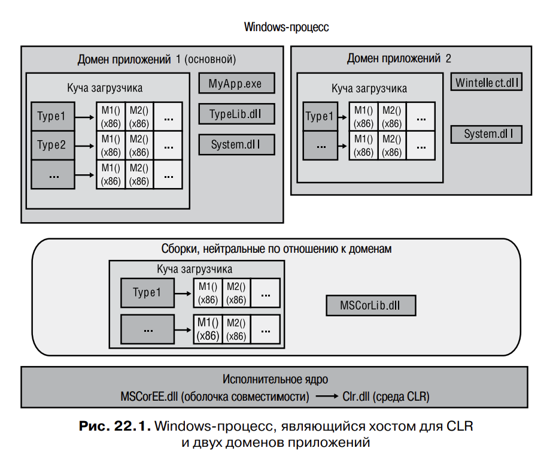
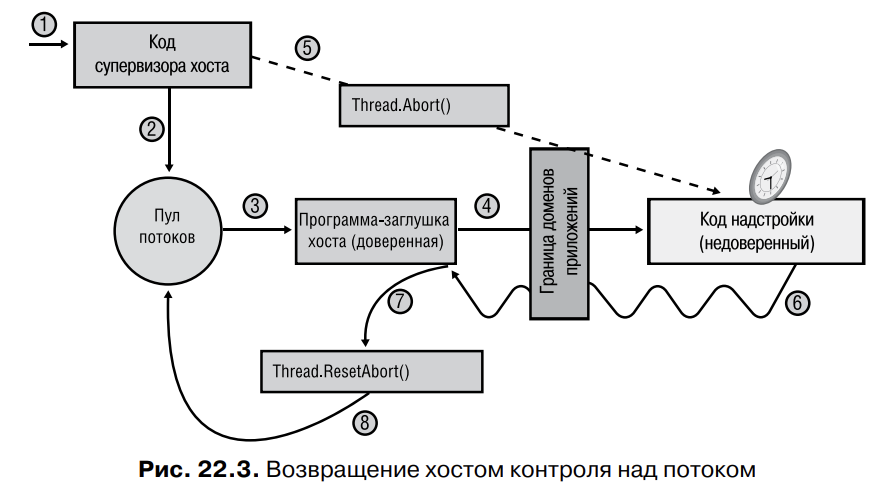

# Глава 22. Хостинг CLR и домены приложений

В этой главе обсуждаются две темы, позволяющие по-настоящему оценить достоинства
Microsoft .NET Framework - хостинг и домены приложений. Благодаря хостингу любое
приложение может использовать возможности общеязыковой среды CLR, в частности
существующие приложения можно, по крайней  мере частично, переписать при 
помощи управляемого кода. Кроме того, хостинг позволяет настраивать и дополнять 
приложения на программном уровне.

Поддержка дополнений означает возможность включения в свои программы кода сторонних 
разработчиков. В Windows загрузка чужих DLL-библиотек была исключительно рискованным
мероприятием. В такой библиотеке легко мог оказаться код, разрушающий структуры
данных, и код приложения. Либа могла использовать контекст безопасности приложений
для получения доступа к ресурсам, к которым в обычных условиях доступа у нее нет.
Домены приложений позволили решить эти проблемы. Именно они дают возможность 
запускать не пользующийся доверием код сторонних разработчиков, а CLR гарантирует
безопасность и целостность структур данных и кода, а также невозможность использовать 
в неблаговидных целях контекст безопасности.

Обычно хостинг и домены приложений используют наряду с загрузкой сборок и отражением.
Совместное примненеи эти четырех технологий превращают CLR в невероятно богатую и 
мощную платформу.

## Хостинг CLR

Платформа .NET Framework работает поверх Microsoft Windows. Это значит, что в ее 
основе должны лежать технологии, с которыми Windows может взаимодействовать.
Для начала все файлы управляемых модулей и сборок должны иметь формат PE (portable
executable), являться исполняемыми файлами EXE или динамически подключаемыми
библиотеками (DLL).

В Microsoft разработали CLR в виде COM-сервера, содержащегося в DLL. То 
есть разработчики определили для CLR стандартный COM-интерфейс и присвоили 
этому интерфейсу и COM-серверу глобально уникальные идентификаторы (GUID). 

При установке .NET Framework COM-сервер, представляющий CLR, регистрируется в 
реестре Windows как любой другой COM-сервер. Подробнее см. заголовочный
файл C++ MetaHost.h из .NET Framework SDK — в этом файле определены все 
GUID-идентификаторы и неуправляемый интерфейс ICLRMetaHost.

Любое Windows-приложение может стать хостом (управляющим приложением) 
для CLR. Однако не следует создавать экземпляры COM-сервера CLR функцией 
CoCreateInstance; вместо этого неуправляемый хост должен вызывать функцию 
CLRCreateInstance, объявленную в файле MetaHost.h. Эта функция реализована 
в библиотеке MSCorEE.dll, которая обычно расположена в каталоге C:\Windows\
System32. Обычно эту библиотеку называют оболочкой совместимости (shim) — она не 
содержит COM-сервер CLR, а только определяет, какую версию CLR следует создать.

На одной машине допускается установка нескольких версий CLR, но может 
быть только одна версия файла MSCorEE.dll (оболочка совместимости). Версия 
библиотеки MSCorEE.dll совпадает с версией самой последней установленной среды CLR, 
поэтому эта версия MSCorEE.dll «знает», как найти любые более ранние 
версии CLR, которые устанавливались на машине

Код CLR содержится в файле, имя которого зависит от версии. Для версий 
1.0, 1.1 и 2.0 это файл MSCorWks.dll, а для версии 4.0 — файл Clr.dll. Так как на один 
компьютер можно установить несколько версий CLR, эти файлы располагаются 
в разных папках:

- версия 1.0 — в папке C:\Windows\Microsoft.NET\Framework\v1.0.3705;

- версия 1.1 — в папке C:\Windows\Microsoft.NET\Framework\v1.0.4322

- версия 2.0 — в папке C:\Windows\Microsoft.NET\Framework\v2.0.50727

-‰ версия 4.0 — в папке C:\Windows\Microsoft.NET\Framework\v4.0.21006.

Функция CLRCreateInstance возвращает интерфейс ICLRMetaHost. Хост-приложение может 
вызывать функцию GetRuntime этого интерфейса, указывая 
ту версию CLR, которую следует создать. После этого оболочка совместимости 
загружает эту версию в текущий процесс.

По умолчанию оболочка совместимости анализирует управляемый исполняемый 
файл и извлекает из него сведения о версии CLR, с которой было построено и 
протестировано приложение. Однако приложение может переопределить заданные 
по умолчанию сведения, записав элементы requiredRuntime и supportedRuntime
в конфигурационный XML-файл.

Функция GetRuntime возвращает указатель на неуправляемый интерфейс 
ICLRRuntimeInfo, из которого при помощи метода GetInterface получается интерфейс 
ICLRRuntimeHost. Вызывая методы этого интерфейса, хост-приложение 
может выполнять следующие операции:

- Устанавливать хост-диспетчеры (host managers), то есть сообщать CLR, что 
хост должен участвовать в решениях, связанных с выделением памяти, планированием 
и синхронизацией потоков, загрузкой сборок и т. п. Кроме того, хосту 
могут понадобиться уведомления о начале и окончании уборки мусора, а также 
о завершении определенных операций.

- Получать информацию о CLR-диспетчерах, то есть запрещать CLR использовать 
определенные классы или члены. Кроме того, хост может указать подлежащий 
и неподлежащий отладке код, а также методы, вызываемые при наступлении 
определенных событий, таких как выгрузка домена приложения, остановка CLR
или исключение, вызванное переполнением стека.

- Инициализировать и запускать CLR

- Загружать сборку и исполнять ее код

- Останавливать CLR, предотвращая дальнейшее исполнение управляемого кода в Windows
процессе

Существует много доводов в пользу применения хостинга CLR. К примеру, 
он дает любому приложению доступ к возможностям CLR и программным средствам, 
а также хотя бы частично быть написанным на управляемом коде. Многие 
приложения, обеспечивающие хостинг исполняющей среды, предлагают массу 
возможностей разработчикам, стремящимся к расширению функциональности. 
Вот только некоторые возможности:

- программирование на любом языке

- код может компилировать (а не интерпретировать) JIT-компилятором, что обеспечивает
максимальное быстродействие

- поддержка уборки мусора, предотвращающей утечки и повреждение памяти

- выполнение кода в безопасной изоляции

- хосту не нужно заботиться о предоставлении многофункциональной среды
разрабоотки, вместо этого он использует имеющеся технологии: языки, компиляторы,
редакторы, отладчики, средства профилирования и др.

### ПРИМЕЧАНИЕ

Конечно, Windows-процессы могут обойтись и без CLR. Эта среда нужна только для
исполнения в процессе управляемого кода. До появления .NET Framework 4.0 внутри
Windows-процесса допускался только один экземпляр CLR. То есть процесс мог не
содержать CLR вообще или же содержать какую-нибудь из имеющихся версий — 1.0,
1.1 или 2.0. Это было серьезное ограничение. Например, в Microsoft Office Outlook
было невозможно загрузить два дополнительных компонента, если они создавались
и тестировались на разных версиях .NET Framework.

К счастью, начиная с .NET Framework 4.0, поддерживается возможность загрузки
версий 2.0 и 4.0 в один Windows-процесс, позволяя компонентам, написанным для
.NET Framework 2.0 и 4.0, работать параллельно, не испытывая проблем совместимости. 
Эта без преувеличения фантастическая возможность позволяет применять
компоненты .NET Framework в самых разных сценариях. Узнать, какая версия или
версии CLR загружены в определенный процесс, можно с помощью утилиты ClrVer.exe.

Загруженную в Windows-процесс среду CLR выгрузить уже нельзя. Методы AddRef
и Release не влияют на интерфейс ICLRRuntimeHost. Вы можете только завершить
процесс, вынудив Windows очистить все занятые в нем ресурсы

## Домены приложений

В ходе инициализации COM-сервер CLR создает домен приложений (AppDomain), 
представляющий собой логический контейнер для набора сборок. Первый из созданных 
доменов называют основным (default AppDomain), он уничтожается только 
при завершении Windows-процесса.

Помимо основного, хост, использующий методы неуправляемого COM-интерфейса или 
методы управляемого типа, может заставить CLR создать дополнительные домены 
приложений. Их основной задачей является обеспечение 
изоляции. Домены приложений удобны благодаря нескольким свойствам:

- Объекты, созданные одним доменом приложений, недоступны для кода других доменов. 
Когда код домена приложений создает объект, домен становится "хозяином" этого 
объекта. Иначе говоря, время жизни объекта ограничивается временем существования 
самого домена. Код другого доена может получить доступ к объекту, только используя
семантику продвижения по ссылке (marshal-by-reference) или по значению (marshal-by-value).
Тем самым обеспечивается четкое разделение кода в домене приложений, так как код 
в одном домене не может напрямую ссылаться на объект, созданный в другом домене.
Такая изоляция позволяет легко выгружать домены приложений из процесса без влияния на 
работу других доменов.

- Домены приложений можно выгружать

CLR не поддерживает выгрузку отдельный сборок. Однако можно заставить CLR выгрузить 
домен приложений со всем содержащимися в нем в данный момент сборками

- Домены приложений можно индивидуально защищать

При создании домену приложений можно назначить набор разрешений, определяющий 
максимальные права запущенных в нем сборок. Это позволяет хосту загружать код
и быть уверенным, что этот код не испортит или не прочитает важные структуры данных,
используемые самим доменом

- Домены приложений можно индивидуально настраивать

Каждый домен имеет целый набор конфигурационных параметров. Они в основном определяют,
как среда CLR должна загружать сборки в домен. Существуют и параметры, относяющиеся к 
путям поиска, перенаправлению привязки к версиям, теневому копированию и оптимизации
загрузчика

### ВНИМАНИЕ

Windows предоставляет замечательную возможность запускать каждое приложение
в собственном адресном пространстве. Это гарантирует, что код одного приложения
не получит доступа к коду и данным другого. Изоляция процессов предотвращает
появления брешей в системе безопасности, повреждение данных и другие неприятности, 
обеспечивая надежность Windows и работающих в этой операционной системе приложений. К сожалению, создание процесса в Windows — операция очень
ресурсоемкая. Win32-функция CreateProcess выполняется медленно, а виртуализация
адресного пространства процесса требует много памяти.
Однако если приложение полностью состоит из гарантированно безопасного
управляемого кода, который к тому же не вызывает неуправляемый код, можно запустить 
несколько управляемых приложений в одном Windows-процессе. Их домены
обеспечат изоляцию, необходимую для защиты, конфигурирования и завершения
отдельных приложений.

На рисунке показан отдеальный Windows процесс, в котором работает один COM-сервер
CLR, управляющий двумя доменами приложений (кстати не существует жестких 
ограничений на количество доменов приложений, который могут выполнять в одном
процессе). У каждого такого домена есть собственная куча загрузчика, ведущая учет 
обращений к типам с момента создания домена. Каждому типу в куче загрузчика 
соответствует таблица методов, строки которой указывают на код метода (если этот 
метод хоть раз исполнялся, его код уже скомпилирован JIT-компилятором).

Кроме того, в каждый домен приложений загружены сборки. В первый (он же основной)
загружены 3 сборки: MyApp.exe, TypeLib.dll и System.dll, во второй - 2 сборки:
Wintellect.dll и System.dll

Сборка System.dll загружается в оба домена. Если в обоих доменах используется один тип
из System.dll, в их кучах загрузчика будут размещены объекты одинаковых типов; память,
выделенная под эти объекты, не используется доменами совместно. Более того, когда код
домена вызывает определенные в типе методы, IL-код JIT компилируется, а результирующий
машинный код привязывается к каждому домену по отдельности, то есть он не используется
ими совместно.

Хотя отсутствие совместного использования памяти для хранения объектов или 
машинного кода выглядит расточительно, это оправдано, поскольку домены приложений 
разрабатывались для изоляции; у CLR должна быть возможность выгрузить 
домен приложений и освободить все его ресурсы, никак не затронув остальные домены. 
Дублирование структур данных CLR обеспечивает эту возможность. Кроме 
того, оно также гарантирует, что при использовании разными доменами одного типа 
статические поля будут задаваться отдельно для каждого домена.

Некоторые сборки предназначены для совместного использования разными доменами. 
Лучший пример — сборка MSCorLib.dll, созданная в Microsoft. Именно ей 
принадлежат типы System.Object, System.Int32 и другие типы, неотделимые от 
.NET Framework. Эта сборка автоматически загружается при инициализации CLR, 
и домены приложений совместно используют ее типы. Для экономии ресурсов 
MSCorLib.dll загружается как сборка, не связанная с конкретным доменом. Объекты 
всех типов в этой куче загрузчика и весь машинный код методов этих типов 
совместно используются всеми доменами процесса. К сожалению, для достижения 
всех преимуществ от совместного использования ресурсов приходится кое-чем 
жертвовать: сборки, загруженные без привязки к доменам, нельзя выгружать до 
завершения процесса. Единственный способ вернуть ресурсы — завершить процесс.

## Доступ к объектам из других доменов

Код, расположенный в одном домене приложений, способен взаимодействовать 
с типами и объектами другого домена. Однако доступ к этим типам и объектам 
возможен только через тщательно определенные механизмы. Приведенный далее 
пример демонстрирует процедуру создания домена приложений, загрузку в него 
сборки и конструирование определенного в этой сборке экземпляра типа. Код 
иллюстрирует различное поведение при конструировании типа, передаваемого путем 
продвижения по ссылке и по значению, а также типа, который вообще не использует 
механизм продвижения. Кроме того, демонстрируется, как объекты, переданные 
посредством разных вариантов продвижения, ведут себя при выгрузке создавшего 
их домена приложений

### Пример 1. Междоменное взаимодействие с продвижением по ссылке

Код метода CreateDomain создает новый домен в процессе. Этому домену присваивается значимое 
имя, а также параметры защиты и конфигурации. У нового 
домена есть собственная куча загрузчика, которая пока пуста, потому что в него 
не загружено ни одной сборки. При создании домена среда CLR не создает в нем 
никаких потоков; там не выполняется никакой код, пока вы явно не заставите поток 
вызвать код домена приложений

Когда домену-источнику нужно передать ссылку на объект в целевой домен 
приложений или вернуть ее обратно, CLR определяет в куче загрузчика этого 
домена тип представителя (proxy).

После определения этого типа в целевом домене метод CreateInstanceAndUnwrap
создает экземпляр типа представителя, инициализирует его поля таким образом, чтобы они 
указывали на домен-источник и реальный объект, и возвращает 
в целевой домен ссылку на объект-представитель

Так как во втором домене отсутствуют корни, исходный объект, на который 
ссылался представитель, может быть отправлен в мусор. Разумеется, это — не 
идеальный подход. Однако если бесконечно хранить исходный объект в памяти, 
он останется там даже после удаления представителя, что тоже не очень хорошо. 
В CLR эта проблема решается при помощи диспетчера аренды (lease manager). 
Создав для объекта представитель, CLR сохраняет объект в течение 5 минут. Если 
за это время через представитель не последовало ни одного вызова, объект деактивируется 
(deactivated) и освобождает память при следующей уборке мусора.

### Пример 2. Междодоменное взаимодействие с продвижением по значению

Этот пример похож на предыдущий. В нем точно так же создается второй домен 
приложений. Затем вызывается метод CreateInstanceAndUnwrap для загрузки той 
же сборки в новый домен и создания в нем экземпляра объекта MarshalByRefType. 
Далее CLR создает для объекта представитель, и переменной mbrt (в основном домене) 
присваивается ссылка на него. Теперь при помощи созданного представителя 
я вызываю метод MethodWithReturn. Этот метод без параметров будет выполнен 
в новом домене, а перед тем как вернуть ссылку на объект основному домену, он 
создаст экземпляр типа MarshalByValType.
Тип MarshalByValType не является производным от System.MarshalByRefObject, 
а значит, CLR не может определить тип представителя для создания его экземпляра; 
то есть объект нельзя продвинуть по ссылке через границу домена

Однако благодаря наличию у типа MarshalByValType настраиваемого атрибута 
[Serializable] метод MethodWithReturn может выполнить продвижение объекта 
по значению. Сейчас мы поговорим о том, что происходит при продвижении объекта по значению 
из одного домена (исходного) в другой (целевой).

Когда исходному домену нужно передать ссылку на объект в целевой домен 
(или возвратить ссылку из целевого домена), CLR сериализует экземплярные 
поля объекта в байтовый массив, который затем копируется. После этого CLR 
десериализует байтовый массив в целевом домене. Это вынуждает CLR загрузить 
в целевой массив сборку (если она еще не загружена), в которой определен десериализованный тип. Далее CLR создает экземпляр типа и использует значения из 
байтового массива для инициализации полей объекта так, чтобы они полностью 
совпадали со значениями исходного объекта. Иначе говоря, CLR делает точную 
копию исходного объекта в целевом домене. Затем метод MethodWithReturn возвращает ссылку на эту копию; в результате наш объект оказывается продвинутым 
по значению через границу домена

### Пример 3. Междоменное взаимодействие без продвижения

Этот пример очень похож на описанные ранее примеры 1 и 2. Точно так же создается новый домен, 
после чего вызывается метод CreateInstanceAndUnwrap для 
загрузки той же сборки в новый домен приложений и создания в нем объекта 
MarshalByValType. Переменная mbrt ссылается на представитель этого объекта.

Затем через этого представителя я вызываю метод MethodArgAndReturn, принимающий один 
аргумент. Так как среда CLR должна контролировать изоляцию 
домена, она не может просто передать ссылку на аргумент в новый домен приложений. 
Для объекта, принадлежащего к типу, производному от MarshalByRefObject, 
CLR создает представитель и выполняет продвижение объекта по ссылке. Если 
тип объекта помечен атрибутом [Serializable], CLR сериализует объект (и его 
потомков) в байтовый массив, пакует этот массив в новый домен и десериализирует.

В этом примере я передаю объект System.String через границы домена. Тип 
System.String не является производным от класса MarshalByRefObject, а значит, 
CLR не может создать представителя. К счастью, объект System.String помечен 
атрибутом [Serializable], поэтому CLR в состоянии продвинуть его по значению, 
и код будет работать. Обратите внимание, что для типа String CLR выполняет 
специальную оптимизацию. Продвигая объект String через границу домена, CLR
просто передает ссылку на него; копию объекта она не делает. Подобная оптимизация 
оказывается возможной благодаря неизменности объектов типа String, что не дает 
коду из одного домена повредить символы объекта String из другого.

Внутри метода MethodArgAndReturn я вывожу передаваемую в него строку, 
чтобы показать ее переход через границу домена. Затем я создаю экземпляр типа 
NonMarshalableType и возвращаю ссылку на этот объект в основной домен. Так как 
тип NonMarshalableType не является производным от System.MarshalByRefObject
и не помечен атрибутом [Serializable], метод MethodArgAndReturn не может продвинуть 
объект по ссылке или по значению. То есть у нас нет способа передать объект через 
границы домена. Чтобы указать на этот факт, метод MethodArgAndReturn
генерирует в основном домене исключение SerializationException. Так как моя 
программа не умеет его перехватывать, она просто прекращает свою работу.

## Выгрузка доменов

Одна из замечательных особенностей CLR — возможность выгрузки доменов 
приложений. При этом выгружаются и все загруженные в них сборки, а также 
освобождается куча загрузчика доменов. Провести эту процедуру легко: достаточно вызвать 
статический метод Unload класса AppDomain. Это заставляет CLR выполнить набор операций по 
корректной выгрузке указанного домена.

1. CLR приостанавливает все потоки в процессе, которые когда-либо выполняли 
управляемый код.

2. CLR проверяет все стеки на наличие потоков, которые в текущий момент выполняют код 
выгружаемого домена или могут рано или поздно вернуться к выполнению такого кода. CLR 
вынуждает все потоки, в стеке которых находится 
выгружаемый домен, сгенерировать исключение ThreadAbortException (при 
этом выполнение потока возобновляется). В результате потоки переходят 
к выполнению блоков finally, то есть корректно завершают свою работу. При 
отсутствии кода, перехватывающего исключение ThreadAbortException, оно 
переходит в разряд необработанных и «проглатывается» CLR; поток завершается, но 
процессу разрешается продолжить работу. Такое поведение отличается 
от стандартного, потому что в любых других ситуациях при возникновении 
необработанного исключения CLR уничтожает процесс

### ВНИМАНИЕ

CLR не уничтожит немедленно поток, который выполняет код блока finally или catch,
конструктора класса, критической области или неуправляемый код. Уничтожение
таких потоков сделало бы невозможным выполнение кода очистки, восстановления
после ошибок, инициализации типа, критического кода или любого кода, который
CLR не знает как обрабатывать. Это стало бы причиной непредсказуемого поведения
приложений и появлению дыр в системе безопасности. Уничтожаемому потоку разрешается 
закончить выполнение таких блоков, и только после этого CLR вынуждает
его сгенерировать исключение ThreadAbortException.

3. После выгрузки из домена всех потоков, обнаруженных на втором шаге, CLR 
проходит по куче и устанавливает флаг для каждого объекта-представителя, 
который ссылается на объект, созданный в выгружаемом домене. Так объекты-представители 
«узнают», что реальный объект, на который они ссылаются, 
уничтожен. В результате при попытке вызвать метод «неправильного» объекта-представителя 
появляется исключение AppDomainUnloadedException

4. CLR инициирует принудительную уборку мусора, чтобы освободить память, 
занятую объектами выгружаемого домена. Вызываются методы финализации 
для этих объектов, давая им шанс выполнить нужную очистку

5. CLR возобновляет работу всех оставшихся потоков. Поток, вызвавший метод 
AppDomain.Unload, продолжает работу; вызовы AppDomain.Unload выполняются 
синхронно

## Мониторинг доменов

Хост-приложение умеет отслеживать потребляемые доменом ресурсы. Некоторые 
хосты на основе этой информации принудительно выгружают домен, если вдруг 
потребление им памяти или ресурсов процессора выходит за разумные с точки 
зрения хоста пределы. Мониторинг позволяет также сравнить потребление ресурсов 
различными алгоритмами и сделать выбор. Но так как эта операция влияет на 
производительность, она инициируется вручную путем присвоения статическому 
свойству MonitoringEnabled класса AppDomain значения true. При этом включается 
мониторинг всех доменов. Выключить его уже нельзя; попытка присвоить свойству 
MonitoringEnabled значение false приведет к исключению ArgumentException.

При включенном мониторинге код может использовать четыре предназначенных 
только для чтения свойства класса AppDomain:

‰1. MonitoringSurvivedProcessMemorySize. Это статическое свойство типа Int64
возвращает число байтов, используемых в данный момент всеми доменами под 
управлением текущего экземпляра CLR. Значение верно с момента последней 
уборки мусора.

‰2. MonitoringTotalAllocatedMemorySize. Это свойство экземпляра типа Int64
возвращает количество байтов, выделенных определенным доменом. Значение 
верно с момента последней уборки мусора.

‰3. MonitoringSurvivedMemorySize. Это свойство экземпляра типа Int64 возвращает 
количество байтов, которые в настоящее время используются определенным 
доменом. Значение верно с момента последней уборки мусора.
‰ 
4. MonitoringTotalProcessorTime. Это свойство экземпляра типа TimeSpan возвращает 
процессорное время, использованное определенным доменом.

## Уведомление о первом управляемом исключении домена

С каждым доменом связан набор методов обратного вызова, активизирующихся, 
когда CLR начинает искать внутри домена блоки catch. Эти методы могут выполнять записи в журнал,
кроме того, хост в состоянии использовать этот механизм для отслеживания сгенерированных 
внутри домена исключений. Обратные вызовы 
не могут обработать исключение или «поглотить» его; они просто получают уведомление. 
Для регистрации такого метода обратного вызова достаточно добавить 
делегат к экземпляру события FirstChanceException класса AppDomain.

Среда CLR в данном случае работает так: при первом появлении исключения 
она задействует любой из методов обратного вызова FirstChanceException, зарегистрированный 
в домене, ставшем источником исключения. Затем CLR ищет в стеке 
этого домена блоки catch. Если какой-то из этих блоков обрабатывает исключение, 
выполнение программы возвращается в обычный режим. Если же такой блок отсутствует, 
CLR идет наверх стека вызывающего домена и снова генерирует то же самое 
исключение (после его сериализации и десериализации). Однако это исключение 
начинает восприниматься, как новое, и CLR задействует методы обратного вызова 
FirstChanceException, зарегистрированные на данный момент в текущем домене. 
Процесс продолжается, пока не будет достигнут верх стека потока. Если в результате 
исключение так и не удастся обработать, CLR завершает процесс.

## Использование хостами доменов приложений

Рассмотрим несколько обычных сценариев, касающихся хостинга и доменов приложений. Как разные 
типы приложений выполняют хостинг CLR и управляют доменами приложений

### Исполняемые приложения

Консольные приложения, приложение NT Service, приложения Windows Forms 
и приложения Windows Presentation Foundation (WPF) являются саморазмещающимися 
(self-hosted) и снабжены управляемыми EXE-файлами. Инициализировав 
процесс при помощи такого файла, Windows загружает оболочку совместимости, 
которая исследует информацию в заголовке CLR, содержащуюся в сборке приложения (EXE-файле). 
Эта информация указывает версию CLR, которая использовалась при сборке и тестировании 
приложения. Именно с ее помощью оболочка 
совместимости определяет, какую версию CLR следует загрузить в процесс. Загрузив 
и инициализировав среду, оболочка совместимости снова исследует заголовок ее 
сборки, чтобы определить, какой метод является точкой входа приложения (Main). 
CLR вызывает этот метод, и приложение начинает работу.

В процессе работы код обращается к другим типам. При ссылке на тип, содержащейся в другой 
сборке, CLR находит эту сборку и загружает ее в тот же домен. 
Туда же загружаются и все прочие сборки, на которые имеются ссылки. После 
возвращения управления методом Main Windows-процесс завершает свою работу 
(ликвидируя основной и все прочие домены).

Приложение может заставить CLR создать дополнительные домены в адресном 
пространстве процесса.

### ПРИМЕЧАНИЕ

Кстати, для завершения Windows-процесса со всеми его доменами можно воспользоваться 
статическим методом Exit класса System.Environment. Это самый корректный
способ завершения процесса, так как данный метод сначала вызывает методы финализации 
всех объектов в управляемой куче, а затем освобождает все неуправляемые
COM-объекты в CLR. После этого вызывается Win32-функция ExitProcess

### Полнофункциональные интернет-приложения Silverlight

Версия CLR для разработанной в Microsoft динамической технологии Silverlight 
отличается от версии обычной платформы .NET Framework для настольных компьютеров. 
После установки среды Silverlight перемещение на сайт, который использует эту среду, 
заставляет Silverlight CLR (CoreClr.dll) загрузить браузер (причем 
это может быть вовсе не Internet Explorer — вы можете вообще не использовать 
Windows). Каждый элемент управления Silverlight на странице работает в собственном домене. 
Когда пользователь закрывает вкладку или переходит на другой сайт, 
то домены всех неиспользуемых элементов управления Silverlight выгружаются. 
Код Silverlight в домене запускается в песочнице (sandbox) с ограниченной защитой 
и не может причинить какого-либо вреда пользователю или машине

### Microsoft ASP.NET и веб-службы XML

ASP.NET — это библиотека ISAPI (реализованная в файле ASPNet_ISAPI.dll). При 
первом запросе клиентом URL-адреса, обрабатываемого этой библиотекой, ASP.
NET загружает CLR. Когда клиент обращается с запросом к веб-приложению, 
ASP.NET определяет, были ли уже такие запросы. Если данный запрос является 
первым, CLR получает команду создать для данного веб-приложения новый домен 
(каждое приложение идентифицируется собственным виртуальным корневым 
каталогом). Далее ASP.NET заставляет CLR загрузить в новый домен сборку, 
предоставляющую нужный тип, в новый домен приложений, создает экземпляр 
этого типа и начинает вызывать его методы для исполнения запроса клиента. 
При наличии ссылок на другие типы CLR загружает в домен веб-приложения 
дополнительные сборки.

При поступлении запроса к уже работающему веб-приложению ASP.NET вместо 
нового домена создает новый экземпляр типа веб-приложения в существующем
и начинает вызывать его методы. При этом вызываемые методы оказываются уже 
преобразованными JIT-компилятором в машинный код, поэтому следующие клиентские запросы 
обрабатываются намного быстрее.

Если клиент обращается с запросом к другому веб-приложению, ASP.NET заставляет CLR 
создать новый домен. Обычно он создается в том же рабочем процессе, в котором работают 
другие домены приложений. Это значит, что в одном 
Windows-процессе может работать несколько веб-приложений, что повышает 
производительность системы. В этом случае сборки для разных веб-приложений 
загружаются в собственный домен каждого из них — это необходимо для изоляции 
кода и объектов веб-приложения от других веб-приложений.

Замечательная особенность ASP.NET — возможность изменять код веб-сайта 
без остановки веб-сервера. Когда файл на жестком диске сайта меняется, ASP.NET 
обнаруживает это, выгружает домен, содержащий старую версию (после завершения текущего 
запроса), а затем создает новый домен, загружая в него новые версии 
файлов. При этом ASP.NET использует особую функцию доменов, называемую 
теневым копированием (shadow copying).

### Microsoft SQL Server

Microsoft SQL Server относится к неуправляемым приложениям, так как большая 
часть кода SQL-сервера написана на неуправляемом языке C++. SQL-сервер поддерживает 
создание хранимых процедур на управляемом коде. При первом получении запроса на выполнение 
хранимой процедуры на управляемом коде SQL-сервер 
загружает CLR. Хранимые процедуры выполняются в собственном защищенном 
домене, что не позволяет им нарушить работу сервера базы данных

Это просто замечательная функциональность! Ведь разработчики могут выбирать 
язык программирования для создания хранимых процедур. Хранимые процедуры 
могут использовать в своем коде объекты с сильной типизацией. Кроме того, код 
компилируется JIT-компилятором в машинный код и выполняется, а не интерпретируется. 
Также разработчикам таких процедур доступны все типы, определенные 
в библиотеке FCL или любой другой сборке. В результате разработка хранимых 
процедур значительно упрощается, а приложения работают намного быстрее.

## Нетривиальное управление хостингом

## Применение управляемого код

Класс System.AppDomainManager позволяет хосту менять заданное по умолчанию 
поведение CLR при помощи управляемого кода. Конечно, это упрощает реализацию 
хоста. Вам требуется только определить собственный класс, производный от System.
AppDomainManager, переопределив все необходимые виртуальные методы. Далее 
этот класс надо скомпоновать в отдельную сборку и установить ее в глобальный 
кэш сборок (GAC), предоставив ей тем самым полное доверие.

Затем нужно заставить CLR использовать свой класс, производный от 
AppDomainManager. Это лучше всего сделать, создав объект AppDomainSetup и инициализировав 
его свойства AppDomainManagerAssembly и AppDomainManagerType
типа String. Свойству AppDomainManagerAssembly присваивается строка со строгим 
именем сборки, определяющей ваш класс, производный от класса AppDomainManager. 
Свойству же AppDomainManagerType присваивается полное имя этого класса. Кроме 
того, свойству AppDomainManager с помощью элементов appDomainManagerAssembly
и appDomainManagerType можно присвоить конфигурационный XML-файл вашего приложения. 
Также собственный хост может отправить запрос к интерфейсу 
ICLRControl и вызвать его свойство SetAppDomainManagerType, передав туда 
идентификатор установленной в GAC сборки и имя класса, производного от 
AppDomainManager

Теперь поговорим о функциях класса, производного от AppDomainManager. Он 
позволяет хосту сохранить контроль, даже когда надстройка пытается создать 
собственный домен. При этом объект, производный от AppDomainManager, может 
редактировать параметры защиты и конфигурирования. Кроме того, он в состоянии 
помешать созданию нового домена или вернуть ссылку на уже существующий. Когда новый 
домен уже создан, CLR формирует в нем новый объект, производный от 
AppDomainManager. Он также может редактировать параметры конфигурирования, 
контекст выполнения между потоками и разрешения, предоставленные сборке.

### Разработка надежных хост-приложений

Хост может указать CLR, какие действия следует предпринимать при сбое в управляемом коде. 
Вот несколько примеров (от наименее до наиболее серьезного):

1. CLR может прервать поток, если тот выполняется слишком долго или долго не 
возвращает управление (детали см. в следующем разделе).
‰
2. CLR может выгрузить домен. При этом закроются все потоки этого домена, 
а проблемный код будет выгружен.
‰
3. CLR может отключиться. При этом прекращается выполнение любого кода 
в процессе, но неуправляемому коду работать разрешено.
‰
4. CLR может выйти из Windows-процесса. При этом сначала закрываются все 
потоки и выгружаются все домены — выполняются операции очистки, после 
чего процесс закрывается.

Хост может установить так называемую политику расширения (escalation policy), 
определив тем самым поведение CLR при сбоях управляемого кода. Например, SQL-сервер 
определяет, что должна делать среда CLR при появлении необработанного 
исключения во время выполнения управляемого кода. Когда в потоке возникает 
необработанное исключение, CLR сначала пытается корректно завершить поток. 
Если поток не закрывается за определенное время, CLR пытается перейти от корректного 
к принудительному завершению потока

В большинстве случаев происходит именно так. Однако для потоков из критической 
области (critical region) действует другая политика. Поток, находящийся в критической 
области, блокируется в рамках синхронизации потоков, причем разблокировать его должен 
тот же самый поток, например, тот, что вызвал метод Monitor.
Enter, метод WaitOne типа Mutex или один из методов AcquireReaderLock или 
AcquireWriterLock типа ReaderWriterLock

Ожидание методов AutoResetEvent, 
ManualResetEvent или Semaphore не указывает на пребывание потока в критической 
области, потому что другой поток может освободить этот объект синхронизации. 
Когда поток находится в критической области, CLR полагает, что он работает 
с данными, совместно используемыми несколькими потоками того же домена. Это 
и есть наиболее вероятная причина блокирования потока. При работе с общими 
данными простое завершение потока является неудачным решением, потому что 
к данным могут обращаться другие потоки. Данные же уже повреждены. В итоге 
мы получаем непредсказуемое поведение домена и бреши в системе безопасности.

Поэтому, когда в потоке в критической области возникает необработанное 
исключение, CLR сначала пытается свести исключение к корректной выгрузке 
домена в попытке избавиться от всех используемых потоков и объектов данных. 
Если домен не выгружается за указанное время, CLR переходит от корректной 
к принудительной выгрузке

### Возвращение потока в хост

Обычно хост-приложение пытается контролировать собственные потоки. В качестве примера 
рассмотрим сервер базы данных. При поступлении запроса поток 
принимает его и пересылает другому потоку, который и должен сделать нужную 
работу. Может случиться, что второму потоку придется выполнить код, созданный 
и протестированный не командой разработчиков сервера, а сторонними программистами. 
Например, он может выполнить хранимую процедуру, написанную на 
управляемом коде. Что замечательно, сервер базы данных делает это в собственном 
домене приложений, работающем с максимальными ограничениями безопасности. 
В результате хранимая процедура не может обратиться к объектам за пределами 
собственного домена, а также получить доступ к ресурсам, к которым коду обращаться 
запрещено, например к дисковым файлам или буферу обмен.

Но что если код хранимой процедуры войдет в бесконечный цикл? То есть сервер 
базы данных «отдает» один из своих потоков для выполнения кода хранимой процедуры, но 
поток не возвращает управление. Сервер оказывается в опасном положении, и его поведение 
становится непредсказуемым. Например, может сильно упасть 
производительность. Может, серверу стоит создать дополнительные потоки? Но 
на это вам потребуются дополнительные ресурсы (например, место в стеке), кроме 
того, и этим потокам ничто не может помешать застрять в бесконечном цикле.

Для решения подобных проблем хосту предоставляется право завершения потока. 
На рисунке показана типичная архитектура хост-приложения, пытающегося 
решить проблему вышедшего из-под контроля потока. Вот как это происходит 
(номера операций соответствуют числам на рисунке)

1. Клиент отправляет запрос на сервер

2. Поток сервера принимает запрос и пересылает его потоку из пула для выполнения работы.

3. Поток из пула принимает клиентский запрос и выполняет доверенный код, 
то есть код, созданный в компании, в которой создано и протестировано само 
хост-приложение.

4. Доверенный код входит в блок try и вызывает из него другой домен (используя 
тип, производный от MarshalByRefObject). Этот домен содержит код (например, 
хранимую процедуру), созданный и протестированный сторонними разработчиками.

5. Хост фиксирует время получения исходного клиентского запроса. Если сторонний код 
не отвечает клиенту за определенное администратором время, хост 
вызывает метод Abort типа Thread, требуя от CLR остановить поток из пула 
и вынуждая выдать исключение ThreadAbortException.

6. На этом этапе поток пула начинает завершение, вызывая блоки finally, чтобы 
выполнить код очистки. В итоге поток возвращается в домен. Так как программа-заглушка 
вызвала сторонний код из блока try, в ней имеется и блок catch, 
который перехватывает исключение ThreadAbortException.

7.  В ответ на перехват исключения ThreadAbortException хост вызывает метод 
ResetAbort типа Thread. Зачем это нужно, объясняется чуть позже

8. Хост отправляет информацию о сбое клиенту и возвращает поток в пул, чтобы 
его можно было снова задействовать для обслуживания клиентских запросов

Проясню некоторые непонятные места этой архитектуры. Во-первых, метод 
Abort типа Thread выполняется асинхронно. Он отмечает целевой поток флагом 
AbortRequested и немедленно возвращает управление. Обнаружив завершение потока, 
исполняющая среда пытается перенести этот поток в безопасное место (safe place). 
Исполняющая среда считает, что поток находится в безопасном месте, если 
его можно (по ее мнению) остановить без риска серьезных последствий. Поток находится 
в безопасном месте, если выполняет управляемую операцию блокировки, 
например бездействует или «спит». Перемещение в безопасное место осуществляется путем 
захвата (см. главу 21). Поток не считается находящимся в безопасном 
месте, если он выполняет конструктор класса типа, код блока catch или finally, 
код в критической области или неуправляемый код.

Как только поток оказывается в безопасном месте, исполняющая среда обнаруживает у него
флаг AbortRequested и заставляет его выдать исключение 
ThreadAbortException. Если исключение не перехватывается, оно остается необработанным, 
выполняются все блоки finally и поток корректно завершается. В отличие от всех прочих, 
оставшись необработанным, исключение ThreadAbortException
не приводит к остановке приложения. Исполняющая среда поглощает его, и поток 
завершается, но приложение и все оставшиеся его потоки продолжают работу.

В рассматриваемом примере хост перехватывает исключение ThreadAbortException, получая 
возможность снова получить контроль над потоком и возвратить 
его в пул. Однако остается вопрос: что может помешать стороннему коду перехватить 
исключение ThreadAbortException, чтобы сохранить за собой контроль над потоком? 
У CLR к данному исключению особое отношение. Даже если код перехватывает исключение 
ThreadAbortException, CLR в конце блока catch автоматически повторно его генерирует.

В связи с этой особенностью CLR возникает вопрос: если CLR повторно генерирует исключение 
ThreadAbortException в конце блока catch, как же хосту удается 
перехватить это исключение и восстановить контроль над потоком? В блоке catch
хоста есть вызов метода ResetAbort типа Thread. Именно он запрещает CLR повторно 
генерировать исключение ThreadAbortException в конце каждого блока catch.

Тогда снова возникает вопрос: а что может запретить стороннему коду перехватить 
исключение ThreadAbortException и самому вызвать метод ResetAbort типа Thread? 
К счастью, для вызова этого метода у вызывающей программы должно быть разрешение 
SecurityPermission с флагом ControlThread, имеющим значение true. Создавая 
домен для кода сторонних разработчиков, хост не предоставляет такое разрешение, 
а, значит, такой код не сможет сохранить за собой контроль над его потоком.

Должен заметить, что брешь в системе безопасности в данном случае все-таки возможна: 
когда поток раскручивает исключение ThreadAbortException, сторонний код 
может выполнить блоки catch и finally, содержащие код с бесконечным циклом, не 
позволяющим хосту вернуть контроль над потоком. Эта проблема решается при помощи 
обсуждавшейся ранее политики расширения. Если останавливаемый поток не 
завершается за разумное время, CLR может перейти от корректной к принудительной 
остановке, принудительной выгрузке домена, отключению CLR или уничтожению 
процесса. Следует также заметить, что сторонний код может перехватить исключение 
ThreadAbortException и вбросить в блоке catch какое-то другое исключение. Если 
оно перехватывается, в конце блока catch CLR автоматически повторно выдаст исключение 
ThreadAbortException.

Большинство сторонних программ не представляет угрозы — просто с точки 
зрения хоста они тратят на решение своей задачи слишком много времени. Обычно 
блоки catch и finally содержат очень немного кода, выполняемого быстро без 
каких-либо бесконечных циклов или «долгоиграющих» операций. Поэтому вряд ли 
вам потребуется политика расширения для возвращения управления потоком хосту

Кстати, у класса Thread есть два метода Abort: один без параметров, а второй 
с параметром Object, в котором можно передать любой объект. Перехватив исключение 
ThreadAbortException, код может запросить свое предназначенное только 
для чтения свойство ExceptionState, которое вернет объект, переданный в качестве 
параметра. Это позволяет потоку, вызвавшему метод Abort, передать дополнительную 
информацию коду, перехватившему исключение ThreadAbortException. Хост 
может использовать это для информирования собственного перехватывающего кода 
о причине остановки потока