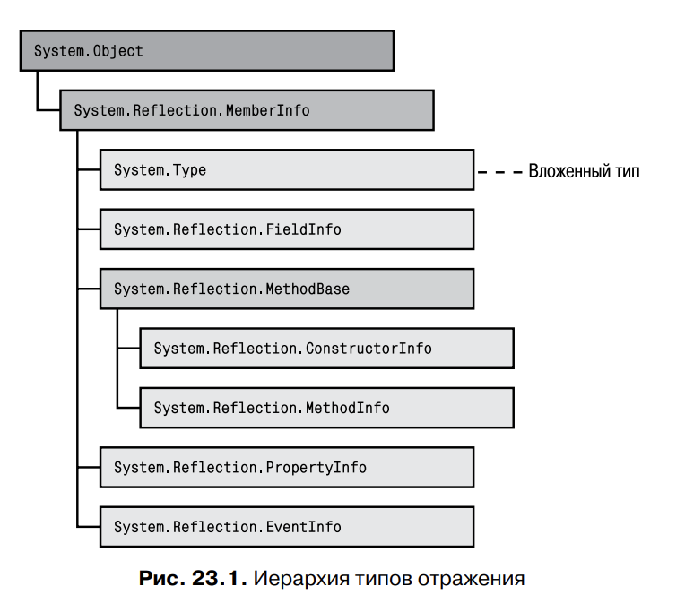
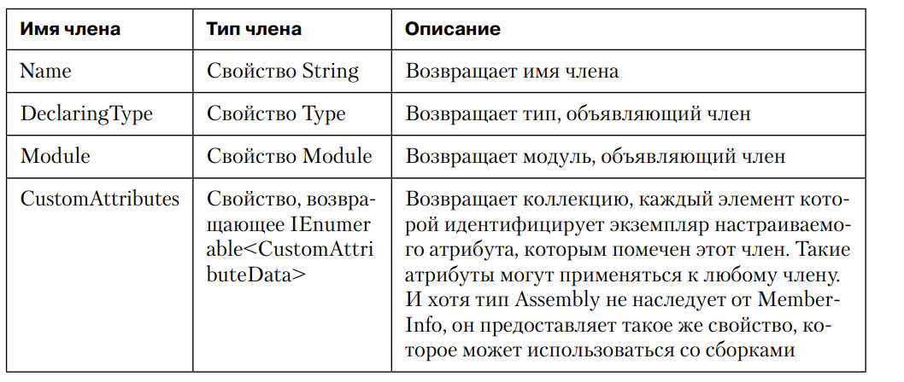
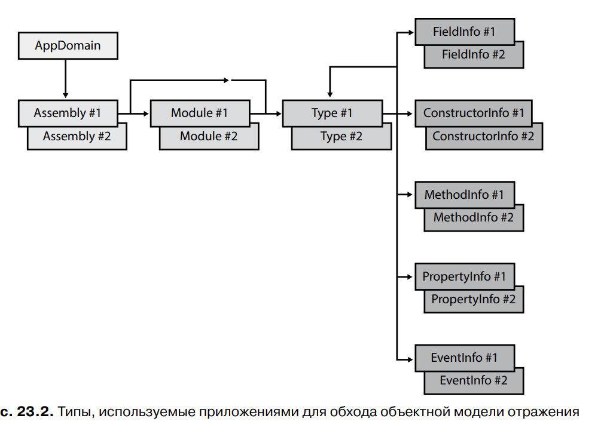
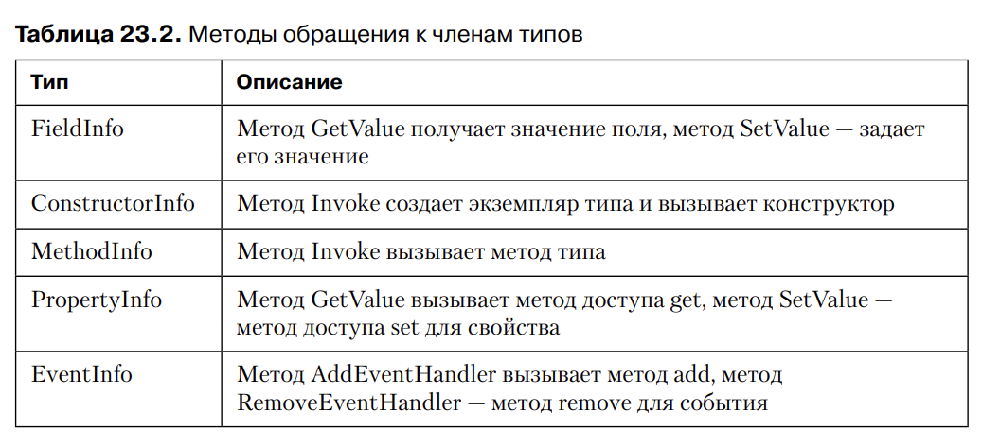

# Глава 23. Загрузка сборок и отражение

В этой главе рассказно о том, как находить информацию о типах, создавать их экземпляры и 
обеспечивать доступ к их членам, несмотря на то, что во время компиляции об этих типах ничего
не известно. 

Сведения, приведенные в этой главе, обычно нужны для создания динамически расширяемых приложений,
то есть таких, для которых одна компания создает хост-приложение, а другие - подключаемые
компоненты (add-ins), которые расширяют функциональность хоста.

Хост выполняет код подключаемых компонентов в отдельных доменах приложений с собсвенными 
параметрами защиты и конфигурирования. Хост также может выгрузить подключаемый компонент, 
выгрузив домен приложений, в котором он выполняется.

В конце главы мы поговорим о том, как задействовать все эти механизмы, — включая хостинг CLR, 
домены приложений, загрузку сборок, обнаружение типов, создание экземпляров 
типов и отражение, — для создания надежного, безопасного и динамически расширяемого приложения

## Загрузка сборок

Когда JIT-компилятор генерирует IL-код метода, он смотрит, на какие типы есть ссылки в IL-коде.
Далее во время выполнения JIT-компилятор по таблицам метаданных TypeRef и AssemblyRef выясняет,
в какой сборке определен упоминаемый тип. Запись таблицы AssemblyRef содержит все части строгого
имени сборки. JIT-компилятор собирает все эти части - имя (без расширения и пути), версию,
региональные стандарты и открытый ключ - в строку, а затем пытается загрузить сборку 
с таким именем в домен приложений (если она еще не загружена). Если загружается сборка с 
нестрогим именем, идентификационная информация представляет собой только имя сборки (без версии,
рег стандартов и открытого ключа)

CLR пытается загрузить эту сборку, используя статический метод Load класса 
System.Reflection.Assembly. Этот метод описан в открытой документации, его можно вызывать
для явной загрузки сборки в свои приложения. Он представляет собой CLR-эквивалент
Win32-функции LoadLibrary. Метод Load класса Assembly существует в нескольких перегруженных 
версиях. Вот прототипы наиболее популярных из них:
```
public class Assembly {
	public static Assembly Load(AssemblyName assemblyRef);
	public static Assembly Load(String assemblyString);
	// Менее популярные перегруженные версии не показаны
}
```
Внутренний код Load заставляет CLR применить к сборке политику привязки версии с перенаправленим
и изет нужную сборку сначала в глобальном кэше сборок (GAC), а затем последовательно в
базовом каталоге приложения, каталогах закрытых путей и каталоге, указанном в элементе 
codeBase конфигурационного файла. Если методу Load передается сборка с нестрогим именем,
он не применяет к ней политику, и CLR не ищет ее в GAC. Найдя искомую сборку, Load возвращает
ссылку на объект Assembly, представляющий загруженную сборку. Если указанная сборка не найдена,
появляется исключение System.IO.FileNotFoundException.

В большинстве динамически расширяемых приложений метод Load объекта 
AppDomain является предпочтительным механизмом загрузки сборки в домен приложений, но он 
требует наличия всех частей, идентифицирующих сборку. Часто 
разработчики создают инструменты или утилиты (такие, как ILDasm.exe, PEVerify.
exe, CorFlags.exe, GACUtil.exe, SGen.exe, SN.exe и XSD.exe), которые определенным 
образом обрабатывают сборку. Все они принимают параметр командной строки, 
задающий путь (с расширением) к файлу сборки.

Чтобы загрузить сборку с указанием пути, вызовите метод LoadFrom класса 
Assembly:

```
public class Assembly {
	public static Assembly LoadFrom(String path);
	// Менее популярные перегруженные версии не показаны
}
```

Код LoadFrom сначала вызывает метод GetAssemblyName класса System.Reflection.AssemblyName, 
который открывает указанный файл, находит запись таблицы метаданных AssemblyRef, извлекает 
идентификационную информацию сборки и возвращает ее в объекте System.Reflection.AssemblyName
(файл при этом закрывается). Затем LoadFrom вызывает метод Load класса Assembly, передавая 
ему объект AssemblyName. На этом этапе CLR применяет политику перенаправления версий и ищет
в определенных местах соотв сборку. Найдя сборку, Load загружает ее и возвращает объект
Assembly, представляющий загруженную сборку; именно его возвращает LoadFrom. Если методу Load
не удается найти сборку, LoadFrom загружает сборку по пути, переданному в качестве параметра
в LoadFrom. Ясно, что если сборка с теми же идентификационными данными уже загружена, 
LoadFrom просто возвращает объект Assembly, представляющий уже загруженную сборку.

Кстати, методу LoadFrom можно передавать в качестве параметра URL-адрес.

При получении URL-адреса среда CLR загружает файл, устанавливает его 
в загрузочный кэш пользователя и уже из него загружает файл. Система должна 
быть подключена к Интернету, иначе произойдет исключение. Однако если файл 
уже был загружен в кэш ранее, а браузер Internet Explorer настроен на работу в автономном 
режиме (команда Work Offline (Работать автономно) в меню File (Файл)), 
будет использован файл из кэша, и исключение не возникнет. Также можно вызвать 
метод UnsafeLoadFrom, который загрузит уже загруженную веб-сборку, игнорируя 
некоторые параметры защиты.

Конструкторы графического интерфейса и другие инструменты Microsoft Visual 
Studio обычно используют метод LoadFile класса Assembly. Этот метод может 
загрузить сборку по любому пути и его можно задействовать для загрузки сборки 
с идентичными параметрами в единственный домен приложений. Это удобно 
в случае, когда при помощи конструктора или другого инструмента были внесены 
изменения в графический интерфейс приложения, а затем это приложение было 
собрано заново. При загрузке LoadFile среда CLR не разрешает зависимости автоматически, 
поэтому ваш программный код должен быть зарегистрирован в событиях 
AssemblyResolve и иметь явно загруженные методы обратных вызовов событий 
всех зависимых сборок.

Если вы создаете инструмент, который просто анализирует метаданные сборки 
сиспользованием отражения (об этом — чуть позже), не выполняя никакого кода сборки, 
лучше всего для загрузки сборки задействовать метод ReflectionOnlyLoadFrom
или, в некоторых редких случаях, метод ReflectionOnlyLoad класса Assembly. Вот 
прототипы обоих методов:

```
public class Assembly {
	public static Assembly ReflectionOnlyLoadFrom(String assemblyFile);
	public static Assembly ReflectionOnlyLoad(String assemblyString);
	// Менее популярные перегруженные версии не показаны
}
```

При загрузке сборок методом ReflectionOnlyLoadFrom или ReflectionOnlyLoad
среда CLR запрещает выполнение какого-либо кода сборки, а при попытке выполнить код 
генерирует исключение InvalidOperationException. Эти методы 
позволяют инструменту загружать сборки с отложенным подписанием, сборки 
для процессора другой архитектуры, а также сборки, для загрузки которых нужны 
особые разрешения.

Многие приложения содержат EXE-файлы, зависимые от многих DLL-файлов. 
При установке этих приложений также должны устанавливаться все файлы. Однако обычно 
практикуется установка единственного EXE-файла. В этом случае 
в первую очередь идентифицируйте все DLL-файлы, от которых зависит ваш 
EXE-файл и которые не являются частью платформы Microsoft .NET Framework. 
Затем добавьте эти DLL-файлы к вашему проекту в Visual Studio и для каждого 
добавленного DLL-файла откройте окно свойств и измените значение Build Action
на Embedded Resource. Это действие даст указание компилятору C# добавить DLL-файлы 
в EXE-файл, который в конечном итоге и будет устанавливаться.

На этапе выполнения программы среда CLR не сможет найти зависимые сборки, 
что может вызвать проблемы. Для решения этих проблем зарегистрируйте методы 
обратного вызова при помощи события ResolveAssembly при инициализации вашего 
приложения. Программный код должен выглядеть примерно так:

```
private static Assembly ResolveEventHandler(Object sender, ResolveEventArgs args) {
	String dllName = new AssemblyName(args.Name).Name + ".dll"; 

	var assem = Assembly.GetExecutingAssembly(); 
	String resourceName = assem.GetManifestResourceNames().FirstOrDefault(rn => 
		rn.EndsWith(dllName)); 

	if (resourceName == null) return null; 
	// Not found, maybe another handler will find it

	using (var stream = assem.GetManifestResourceStream(resourceName)) { 
		Byte[] assemblyData = new Byte[stream.Length]; 
		stream.Read(assemblyData, 0, assemblyData.Length);
		return Assembly.Load(assemblyData); 
	} 
}
```

При первом вызове в потоке метода, ссылающегося на тип, зависящий от 
DLL-файла, возникнет событие AssemblyResolve, и показанный программный 
код обратного вызова найдет встроенный DLL-файл и загрузит его путем вызова 
перегруженного метода Load, у которого в качестве аргумента будет использоваться 
Byte[]. И хотя мне нравится прием встраивания зависимых DLL в другие сборки, 
следует помнить, что он увеличивает объем памяти, используемой приложением 
во время выполнения.

## Использование отражения для создания динамически расширяемых приложений

Метаданные - набор таблиц. При построении сборки или модуля компилятор создает таблицы 
определений типов, полей, методов и т.д. В пространстве имен System.Reflection есть несколько
типов, позволяющих писать код разбора этих таблиц. На самом деле типы из этого пространства
имен предоставляют объектную модель для работы с метаданными сборки или модуля.

Типы, составляющие эту объектную модель, позволяют легко перечислить все типы из таблицы
определений типов, а также получить для каждого из них базовый тип, интерфейсы и ассоциированные
с ним флаги. Остальные типы из пространства имен System.Reflection дают возможность запрашивать 
поля, методы, свойства и события типа путем разбора соответствующих таблиц метаданных. Можно
узнать какими атрибутами помечена та или иная сущность метаданных. Есть даже классы, позволяющие
определить указанные сборки и методы и возвращающие в методе байтовый IL-поток. Располагая 
этой информацией можно легко создать программы, сходные с программой ILDasm.exe компании
Microsoft.

### ПРИМЕЧАНИЕ

Нужно иметь в виду, что некоторые типы отражения и часть их членов созданы специально для 
разработчиков, пишущих компиляторы для CLR. Прикладные разработчики обычно не используют эти 
типы и члены. В документации к библиотеке FCL не сказано четко, какие типы предназначены для 
разработчиков компиляторов, а какие - для разработчиков приложений, но если понимать, что 
некоторые типы и члены отражения предназначены "не для всех", то документация становится 
более понятной.


В реальности приложениям редко требуются типы отражения. Обычно отражения используется в 
библиотеках классов, которым нужно понять определение типа для предоставления расширенной
функциональности. Например, механизм сериализации из FCL применяет отражения, чтобы выяснить,
какие поля определены в типе. Объект форматирования из механизма сериализации получает 
значения этих полей и записывает их в поток байтов. Проектировщики Microsoft Visual Studio 
используют отражение, чтобы определить, какие свойства следует показывать разработчикам при 
размещении элементов на поверхности веб-формы или формы Windows Forms во время ее создания.

Отражение также применяют, когда для решения некоторой задачи во время выполнения приложению 
нужно загрузить определенный тип из некоторой сборки. Например, приложение может попросить 
пользователя предоставить имя сборки и типа, чтобы явно загрузить ее, создать экземпляр
данного типа и вызывать его методы. Концептуально подобное использование отражения напоминает
вызов Win32 функций LoadLibrary и GetProcAddress. Часто привязку к типам и вызываемым
методам, осуществляемую таким образом, называют поздним связыванием (late binding) - в отличие
от раннего связывания (early binding), применяемого, когда требуемые приложению типы и методы
известны при компиляции.

## Производительность отражения

Отражение - исключительно мощный механизм, позволяющий во время выполнения обнаружить и 
использовать типы и их члены, о которых во время компиляции ничего не было известно. Но у 
этой мощи есть два серьезных недостатка.

1. При использовании отражения безопасность типов на этапе компиляции не контролируется. Так 
как в отражении активно применяются строки, вы теряете безопаность типов на этапе компиляции. 
Допустим, для поиска типа с именем int средствами отражения используется вызов Type.GetType("int");
код успешно компилируется, но во время выполнения возвращает null, так как с точки зрения
CLR тип int называется System.Int32

2. Отражение работает медленно. При использовании отражения имена типов и их члены на момент
компиляции неизвестны - они определяются в процессе выполнения, причем все типы и члены 
идентифицируются по строковому имени. Это значит, что при отражении постоянно выполняется 
поиск строк в метаданных сборки пространства имен System.Reflection. Часто строковый поиск
выполняется без учета регистра, что дополнительно замедляет процесс.

В общем случае вызов метода или обращение к полю или свойству посредством 
отражения также работает медленно. При использовании отражения перед вызовом 
метода аргументы требуется сначала упаковать в массив и инициализировать его 
элементы, а потом при вызове метода извлекать аргументы из массива и помещать 
их в стек потока. Кроме того, CLR приходится проверять правильность числа и типа 
параметров, переданных методу. И наконец, CLR проверяет наличие у вызывающего кода разрешений
доступа.

В силу этих причин лучше не использовать отражения для обращения к полям или вызова 
методов/свойств. Если вы пишете приложение, которое динамически ищет и создает объекты, следуйте
одному из перечисленных далее подходов.

1. Порождайте свои типы от базового тип, известного на момент компиляции. Затем, создав 
экземпляр своего типа во время выполнения, поместите ссылку на него в переменную базового 
типа и вызывайте виртуальные методы базового типа.

2. Реализуйте в типах интерфейсы, известные на момент компиляции. Затем, создав экземпляр своего
типа во время выполнения, поместите ссылку на него в переменную того же типа, что и интерфейс,
и вызывайте методы, определенные в интерфейсе.


Рихтер предпочитает второй подход, так как в первом случае разработчику невозможно выбрать 
базовый тип, оптимальный для конкретной ситуации. Хотя методика порождения своего типа от 
базового лучше в отношении контроля версий, потому что вы всегда добавляете члены в базовый
тип и наследуете от него свой тип, но не можете добавить члены в интерфейс без принудительного
изменения кода всех типов, реализующих этот интерфейс, и их повторной компиляции.

В любом случае он настоятельно рекомендует определять базовый тип или интерфейс в их собственной
сборке - будет меньше проблем с управлением версиями.

## Нахождение типов, определенных в сборке

Отражение часто используется, чтобы выяснить, какие типы определены в сборке. Для получения 
этой информации FCL предлагает несколько методов. Наиболее популярный - свойство ExportedTypes
класса Assembly. Вот пример кода, который загружает сборку и выводит имена всех определенных
в ней открытых экспортированных типов.

### Объект Type

Приведенный выше код перебирает массив объектов System.Type. Тип System.Type - отправная точка
для операций с типами и объектами. Он представляет ссылку на тип

Как вы помните, в System.Object определен открытый невиртуальный метод 
GetType. При вызове этого метода CLR определит тип указанного объекта и вернет 
ссылку на его объект Type
Поскольку для каждого тип в домене приложений есть только один объект Type, чтобы выяснить, 
относятся ли объекты к одному типу, можно задействовать операторы равенства и неравенства:

```
private static Boolean AreObjectsTheSameType(Object o1, Object o2) {
	return o1.GetType() == o2.GetType();
}
```
Помимо вызова метода GetType класс Object FCL предлагает другие способы получения объекта Type:

1. В типе System.Type есть несколько перегруженных версий статического метода GetType. Все они
принимают тип String. Эта строка должна содержать полное имя типа (включая его пространство
имен). Имена примитивных типов, поддерживаемые компилятором (такие, как int, string, bool
и другие типы языка C#, запрещены, потому что они ничего не значат для CLR. Если строка содержит
просто имя типа, метод проверяет, определен ли тип с указанным именем в вызывающей сборке. Если
это так, возвращается ссылка на соответствующий объект Type.

2. Если в вызывающей сборке указанный тип не определен, проверяются типы, определенные в 
MSCorLib.dll. Если и после этого тип с указанным именем найти не удается, возвращается null
или генерируется исключение System.TypeLoadException - все зависит от того, какая перегруженная
версия метода GetType вызывалась и какие ей передавались параметры.

В GetType можно передать полное имя типа с указанием сборки. В этом случае GetType будет 
искать тип в указанной сборке (и при необходимости загрузит ее).

1. В типе System.Type есть статический метод ReflectionOnlyGetType. Этот метод ведет себя так же,
как только что описанный метод GetType, за исключением того, что тип загружается только для 
отражения, но не для выполнения кода. 

2. В типе System.TypeInfo есть экземплярные методы DeclaredNestedTypes и GetDeclaredNestedTypes

3. В типе System.Reflection.Assembly есть экземплярные методы GetType, DefinedTypes и ExportedTypes

Во многих языках программирования есть оператор, позволяющий получить объект Type по имени типа.
Для получения ссылки на Type лучше использовать именно такой оператор, а не перечисленные
методы, так как при компиляции оператора получается более быстрый код. В C# это 
оператор typeof, хотя обычно его не применяют для сравнение информации о типах, загруженных 
посредством позднего и раннего связывания как в следующем примере:

```
private static void SomeMethod(Object o) {
	// GetType возвращает тип объекта во время выполнения
	// (позднее связывание)
	// typeof возвращает тип указанного класса
	// (раннее связывание)
	if (o.GetType() == typeof(FileInfo)) { ... }
	if (o.GetType() == typeof(DirectoryInfo)) { ... }
}
```

### ПРИМЕЧАНИЕ

Первая инструкция if проверяет, ссылается ли переменная o на объект типа FileInfo,
но не на тип, производный от FileInfo. Иначе говоря, этот код проверяет на точное,
а не на совместимое соответствие. Совместимое соответствие обычно достигается
путем приведения типов либо использования оператора is или as языка C#.

Как упоминалось ранее, объект Type представляет ссылку на тип, то есть содержит минимум 
информации. Для получения более полной информации о типе 
следует получить объект TypeInfo, представляющий определение типа. Объект 
Type можно преобразовать в TypeInfo вызовом метода расширения GetTypeInfo
класса System.Reflection.IntrospectionExtensions:

```
Type typeReference = ...; // Например: o.GetType() или typeof(Object)
TypeInfo typeDefinition = typeReference.GetTypeInfo();
```

И хотя эта возможность менее полезна, объект TypeInfo можно преобразовать 
в объект Type вызовом метода AsType класса TypeInfo.

```
TypeInfo typeDefinition = ...; 
Type typeReference = typeDefinition.AsType()
```

При получении объекта TypeInfo CLR приходится убеждаться в том, что сборка, определяющая тип, 
загружена. Это затратная операция, без которой можно 
обойтись, если вам достаточно ссылок на типы (объекты Type). Однако после получения объекта 
TypeInfo можно запрашивать многие свойства типа и узнать о них 
много полезного. Большинство свойств, таких как IsPublic, IsSealed, IsAbstract, 
IsClass, IsValueType и т. д., описывают флаги, связанные с типом. Другие свойства 
(к ним относятся Assembly, AssemblyQualifiedName, FullName, Module и пр.) 
возвращают имя сборки, в которой определен тип или модуль, и полное имя типа. 
При помощи свойства BaseType можно узнать базовый тип. Все методы и свойства, 
предоставляемые типом TypeInfo, описаны в документации FCL.

## Создание экземпляра типа

Получив ссылку на объект, производный от Type, можно создать экземпляр этого 
типа. FCL предлагает для этого несколько механизмов:

1. Методы CreateInstance класса System.Activator. Этот класс поддерживает 
несколько перегруженных версий статического метода CreateInstance. При 
вызове этому методу передается ссылка на объект Type либо значение String, 
идентифицирующее тип объекта, который нужно создать. Версии, принимающие тип Type, проще: 
вы передаете методу набор аргументов конструктора, а он 
возвращает ссылку на новый объект.
Версии CreateInstance, в которых желаемый тип задают строкой, чуть 
сложнее. Во-первых, для них нужна еще и строка, идентифицирующая сборку, 
в которой определен тип. Во-вторых, эти методы позволяют создавать удаленные объекты, 
если правильно настроить параметры удаленного доступа. 
В-третьих, вместо ссылки на новый объект эти версии метода возвращают 
объект System.Runtime.Remoting.ObjectHandle (производный от System.
MarshalByRefObject). ObjectHandle — это тип, позволяющий передать объект, созданный в одном 
домене приложений, в другой домен, не загружая в целевой домен приложений 
сборку, в которой определен этот тип. Подготовившись к работе с переданным 
объектом, нужно вызвать метод Unwrap объекта ObjectHandle. Только после этого 
загружается сборка, в которой находятся метаданные переданного типа. Если 
выполняется продвижение объекта по ссылке, создаются тип-представитель 
и объект-представитель. При продвижении по значению копия десериализуется.

2. Методы CreateInstanceFrom объекта System.Activator. Класс Activator также 
поддерживает несколько статических методов CreateInstanceFrom. Они не отличаются 
от CreateInstance за исключением того, что для них всегда нужно задавать строковыми 
параметрами тип и сборку, в которой он находится. Заданная 
сборка загружается в вызывающий домен приложений методом LoadFrom (а не 
Load) объекта Assembly. Поскольку ни один из методов CreateInstanceFrom
не принимает параметр Type, все они возвращают ссылку на тип ObjectHandle, 
который необходимо дополнительно развернуть

3. Методы объекта System.AppDomain. Тип AppDomain поддерживает четыре 
экземплярных метода (у каждого есть несколько перегруженных версий), создающих 
экземпляр типа: CreateInstance, CreateInstanceAndUnwrap, CreateIntanceFrom и 
CreateInstanceFromAndUnwrap. Они работают совсем как методы 
Activator, но являются экземплярными методами, позволяя задать домен 
приложений, в котором нужно создать объект. Методы, названия которых 
оканчиваются на Unwrap, удобнее, так как они позволяют обойтись без дополнительного 
вызова метода.

4. Экземплярный метод Invoke объекта System.Reflection.ConstructorInfo.
При помощи ссылки на объект TypeInfo можно привязаться к некоторому 
конструктору и получить ссылку на объект ConstructorInfo, чтобы затем вызвать 
его метод Invoke. Новый объект всегда создается в вызывающем домене 
приложений, а затем возвращается ссылка на новый объект. К этому методу мы 
тоже вернемся позднее в этой главе.

### ПРИМЕЧАНИЕ

Среда CLR не требует, чтобы у значимого типа был конструктор. И это создает проблемы, 
так как все перечисленные механизмы создают объект путем вызова его конструктора. 
Однако версии метода CreateInstance типа Activator позволяют создавать
экземпляры значимых типов без вызова их конструкторов. Чтобы создать экземпляр
значимого типа, не вызывая его конструктор, нужно вызвать версию CreateInstance,
принимающую единственный параметр Type, или версию, принимающую параметры
Type и Boolean.

Эти механизмы позволяют создавать объекты любых типов, кроме массивов 
(то есть типов, производных от System.Array) и делегатов (потомков типа System.
MulticastDelegate). Чтобы создать массив, надо вызвать статический метод 
CreateInstance объекта Array (существует несколько перегруженных версий этого 
метода).

Для создания делегата следует вызвать статический метод CreateDelegate объекта Delegate (у этого метода 
также есть несколько перегруженных версий).

Для создания экземпляра обобщенного типа сначала нужно получить ссылку на 
открытый тип, а затем вызвать открытый экземплярный метод MakeGenericType
объекта Type, передав массив типов, который нужно использовать в качестве параметров типа. 
Затем надо получить возвращенный объект Type и передать его в один 
из описанных ранее методов. Вот пример:

```
using System;
using System.Reflection;

internal sealed class Dictionary<TKey, TValue> { }
public static class Program 
{
	public static void Main() 
	{
		// Получаем ссылку на объект Type обобщенного типа
		Type openType = typeof(Dictionary<,>);

		// Закрываем обобщенный тип, используя TKey=String, TValue=Int32
		Type closedType = openType.MakeGenericType(
			new Type[] { typeof(String), typeof(Int32) });

		// Создаем экземпляр закрытого типа
		Object o = Activator.CreateInstance(closedType);

		// Проверяем, работает ли наше решение
		Console.WriteLine(o.GetType());
	}
}
```
Скомпилировав и выполнив этот код, мы получим:
``` Dictionary`2[System.String,System.Int32] ```

## Создание приложений с поддержкой подключаемых компонентов

В построении открытых расширяемых приложений центральное место занимают интерфейсы. Вместо 
них можно было бы задействовать базовые классы, но в общем случае интерфейс предпочтительнее, 
так как позволяет разработчику подключаемого компонента (add-in) выбрать собсвенные базовые 
классы. Допустим вы хотите создать приложение, позволяющее пользователям создавать типы, которые
ваше приложение сможет загружать и применять. Такое приложение должно строиться следующим 
образом:

1. Создайте сборку для хоста, определяющую интерфейс с методами, обеспечивающими взаимодействие
вашего приложения с подключаемыми компонентами. Определяя параметры и возвращаемые 
значения методово этого интерфейса, постарайтесь задействовать другие интерфейсы или типы, 
определенные в MSCorLib.dll. Если нужно передавать и возвращать собственные типы данных, 
определите их в этой же сборке. Задав интерфейс, дайте сборке строгое имя, после чего можете
передать ее своим партнерам и пользователям. После публикации нужно избегать любых изменений
типов сборки, которые могут нарушить работу подключаемых модулей. В частности, вообще 
нельзя изменять интерфейс. Но если вы опредлили типы данных, ничего не случится, если вы 
добавите в них новые члены. Внеся какие-либо изменения в сборку, нужно развертывать ее 
вместе с файлом политики издателя.

### ПРИМЕЧАНИЕ

Вы можете использовать типы, определенные в MSCorLib.dll: CLR всегда загружает ту версию 
MSCorLib.dll, которая соответствует версии самой среды CLR. Кроме того, в процесс всегда 
загружается только одна версия MSCorLib.dll. Иначе говоря, разные версии MSCorLib.dll никогда
не загружаются совместно. В итоге несоответствий версий типа не будет, и ваше приложение
использует меньше памяти. 

2. Разработчики подключаемых компонентов, конечно, определят свои типы в собственных сборках. 
Кроме того, их сборки будут ссылаться на вашу интерфейсную сборку. Сторонние разработчики также
смогут выдавать новые версии своих сборок, когда захотят: приложение сможет воспринимать 
подключаемых типы без проблем. 

3. Создайте сборку, содержащую типы вашего приложения. Очевидно, она будет ссылаться на интерфейс
и типы, определенные в первой сборке. Код сборки вы можете изменять как угодно. Поскольку 
разработчики подключаемых компонентов не ссылаются на эту сборку, вы можете в любой момент 
выдать ее новую версию, и это на затронет сторонних разработчиков.

Этот короткий раздел содержит очень важную информацию. Используя типы в разных сборках, нельзя
забывать о версиях. Не пожалейте времени и выделите в отдельную сборку типы, которые вы применяете
для взаимодействия со сборками.  Избегайте изменения типов и номера версии такой сборки.
Однако если вам действительно нужно изменить определения типов, обязательно поменяйте номер
версии и создайте файл политики издателя для новой версии. 

### ПРИМЕР:

1. Нам нужен код сборки для хоста:
```
namespace Wintellect.HostSDK {
 public interface IAddIn {
	String DoSomething(Int32 x);
 }
}
```

2. Затем идет код сборки подключаемого компонента - библиотеки AddInTypes.dll, в которой 
определены два открытых типа, реализующие интерфейс IAddIn из HostSDK. Для построения этой 
сборки необходимо добавить ссылку на HostSDK.dll:

```
using Wintellect.HostSDK;
public sealed class AddIn_A : IAddIn 
{
	public AddIn_A() 
	{ }

	public String DoSomething(Int32 x) 
	{
		return "AddIn_A: " + x.ToString();
	}
}

public sealed class AddIn_B : IAddIn 
{
	public AddIn_B() 
	{ }

	public String DoSomething(Int32 x) 
	{
		return "AddIn_B: " + (x * 2).ToString();
	}
}
```

3. Рассмотрим код сборки простого хоста (консольного приложения) - файла Host.exe. При 
построении этой сборки используется ссылка на HostSDK.dll. Определяя используемые подключаемым
модулем типы, код хоста предполагает, что искомые типы определены в сборках, файлы которых 
содержат расширения dll, а сами сборки развернуты в том же каталоге, что и exe файл хоста. 
Библиотека Microsoft MEF (Managed Extensibility Framework) строится на базе различных 
механизмов, которые я демонстрирую в этом разделе, в также предоставляет дополнительные 
средства регистрации и поиска подключаемых компонентов. Если вы занимаетесь построением 
динамически расширяемых приложений, я рекомендую поближе познакомиться с MEF, потому что это
упростит часть материала этой главы.

```
using System; 
using System.IO; 
using System.Reflection; 
using System.Collections.Generic; 
using Wintellect.HostSDK; 

public class Program 
{
	public static void Main() 
	{ 
		// Находим каталог, содержащий файл Host.exe
		String AddInDir = 
			Path.GetDirectoryName(Assembly.GetEntryAssembly().Location); 

		// Предполагается, что сборки подключаемых модулей
		// находятся в одном каталоге с EXE-файлом хоста
		var AddInAssemblies = Directory.EnumerateFiles(AddInDir, "*.dll");

		// Создание набора объектов Type, которые могут
		// использоваться хостом
		var AddInTypes = 
			from file in AddInAssemblies 
			let assembly = Assembly.Load(file) 
			from t in assembly.ExportedTypes // Открыто экспортируемые типы
			// Тип может использоваться, если это класс, реализующий IAddIn
			where t.IsClass && 
			typeof(IAddIn).GetTypeInfo().IsAssignableFrom(t.GetTypeInfo()) 
			select t; 

		// Инициализация завершена: хост обнаружил типы, пригодные для использования
		// Пример конструирования объектов подключаемых компонентов
		// и их использования хостом
		foreach (Type t in AddInTypes) { 
		IAddIn ai = (IAddIn) Activator.CreateInstance(t); 
		Console.WriteLine(ai.DoSomething(5)); 
	} 
}
```

В этом простом примере не используются домены приложений. Однако в реальной жизни подключаемые
модули создаются в собственных доменах приложений с собственными параметраи защиты и конфигурирования.
И, конечно же, домен приложений можно выгрузить, если нужно удалить подключаемый модуль из 
памяти. Чтобы обеспечить взаимодействие между доменами приложений, лучше всего потребовать от 
разработчиков подключаемых модулей создавать собственные типы, производные от MarshalByRefObject.
При создании нового домена приложений хост создаст в нем экземпляр собственного производного от 
MarshalByRefObject типа. Код хоста (в основном домене) будет взаимодействовать с собственным
типов (в других доменах), заставляя их загружать сборки подключаемых модулей, создавая и 
используя экземпляры определенных в этих модулях типов.

## Нахождение членов типа путем отражения

До настоящего момента рассказывалось о тех составляющих механизма отражения - загрузке сборок,
нахождении типов и создании объектов, - которые необходимы для создании динамически 
расширяемых приложений. Однако, чтобы обеспечить высокую производительность и безопасность
типов во время компиляциии, нужно избегать отражения. В динамически расширяемом приложении
после создания объекта код хоста обычно приводит объект к интерфейсному типу (это предпочтительный
вариант) или базовому классу, известному на момент компиляции; это обеспечивает быстроту 
доступа к членам объекта и безопасность типов во время компиляции.

В оставшейся части главы рассказывается о некоторых аспектах отражения, применяемых для 
нахождения и вызова членов типа. Возможность поиска и вызова членов типа обычно нужна
при создании  инструментов для разработчиков и средств анализа сборок, ориентированных на 
выявление определнных структур в программном коде или использование определенных членов. 
В качестве примера таких инструментов: ILDasm, FxCop и конструкторы форм для приложений
Windows Forms И Web Forms, разрабатываемых в Visual Studio. Также в некоторых библиотеках 
для предоставления разработчикам расширенной функциональности. Пример - библиотеки, обеспечивающие
сериализацию и десериализацию, а также простую привязку к данным.

### Нахождение членов типов

Членами типа могут быть поля, конструкторы, методы, свойства, события и вложенные типы.
В FCL есть тип System.Reflection.MemberInfo - абстрактный класс, инкапсулирующий набор свойств,
общих для всех членов типа. У MemberInfo много дочерних классов, каждый из которых 
инкапсулирует чуть больше свойств отдельных членов типа.



Приведенная программа демонстрирует, как нужно запрашивать члены типа и выводить информацию 
о них. Этот код обрабатывает все открытые типа всех сборок, загруженных в вызывающий домен
приложений. Для каждого типа вызывается свойство DeclaredMembers, которое возвращает коллекцию
объектов типа, производного от MemberInfo; каждый объект описывает один член из определенных 
в типе. Далее для каждого члена выводятся его описание (поле, конструктор, метод, свойство)
и строковое значение (полученное методов ToString).

Так как тип MemberInfo является корнем иерархии, стоит обсудить его подробнее. 



В таблице показаны некоторые неизменяемые (только для чтение) свойства и методы типа 
MemberInfo, общие для всех членов типа. System.Type наследуется от типа MemberInfo, поэтому 
Type также обладает всеми перечисленными в таблице свойствами.



На рисунке представлена сводка типов, используемых приложениями для обхода модели объектов
отражения. Домен приложений (AppDomain) дает возможность узнать, какие сборки в него загружены, 
сборка (Assembly) - из каких модулей она состоит, а сборка или модуль 0 определенные в них типы.
В свою очередь, тип (Type) позволяет получить информацию обо всех его членах 
(вложенные типы, поля, конструкторы, методы, свойства и события). Пространства 
имен не входят в иерархию, так как они представляют собой синтаксические наборы 
типов. Если нужно перечислить все пространства имен, определенные в сборке, 
достаточно перечислить все типы в сборке и просмотреть их свойства Namespace.

Тип позволяет также находить реализуемые им интерфейсы. И из конструктора, 
метода, метода-аксессора свойства или метода 
создания/удаления сообщения можно вызвать метод GetParameters, чтобы получить массив 
объектов ParameterInfo, которые информируют вас о типах параметров 
членов. Можно также запросить свойство ReturnParameter, чтобы получить объект 
ParameterInfo с подробной информацией о возвращаемом значении члена. Чтобы 
получить набор параметров типа для обобщенных типов и методов, можно вызывать метод 
GetGenericArguments. Наконец, чтобы получить набор нестандартных 
атрибутов, примененных ко всем указанным сущностям, можно вызывать метод 
GetCustomAttributes

### Обращение к членам типов

Итак, вы знаете, как получить информацию о членах типа. Следующим шагом 
должно стать обращение к одному из этих членов. Термин «обращение» в данном 
случае зависит от разновидности члена.



В таблице указано, какие методы следует вызывать в каждом конкретном случае.

Тип PropertyInfo представляет информацию метаданных свойств, поддерживая доступные только 
для чтения свойства CanRead, CanWrite и PropertyType. Эти свойства показывают, можно ли 
читать и записывать свойство, а также его тип данных. У PropertyInfo также есть свойства 
GetMethod и SetMethod, возвращающие объекты MethodInfo для методово чтения и записи значения
свойства. Методы GetValue и SetValue типа PropertyInfo существуют для удобства, их внутренний 
код получает соответствующие объекты MethodInfo и вызывает их. Для поддержки параметратических 
свойств (индексаторов C#) методы SetValue и GetValue предоставляют параметр index типа Object[]

Тип EventInfo представляет метаинформацию событий (см. главу 11). Он 
поддерживает доступное только для чтения свойство EventHandlerType, которое 
возвращает объект Type для делегата события. У EventInfo также есть свойства 
AddMethod и RemoveMethod, которые возвращают объекты MethodInfo для методов 
добавления и удаления делегатов. Чтобы добавить или удалить делегата, можно 
обратиться с вызовом к этим объектам MethodInfo или же воспользоваться более 
удобными методами AddEventHandler и RemoveEventHandler класса EventInfo.

** В приведенном приложении-примере ** демонстрируются разные способы 
применения отражения для доступа к членам типа. Класс SomeType представляет 
тип с различными членами: закрытым полем (someField), открытым конструктором (SomeType), 
получающим аргумент типа Int32 по ссылке, открытым методом 
(ToString), открытым свойством (SomeProp) и открытым событием (SomeEvent). 
При наличии определения типа SomeType я также могу предложить три разных 
метода использования отражения для доступа к членам SomeType. Каждый метод 
задействует отражение по-своему.

‰1. Метод BindToMemberThenInvokeTheMember демонстрирует привязку и последующий вызов.
‰ 
2. Метод BindToMemberCreateDelegateToMemberThenInvokeTheMember демонстрирует привязку 
с последующим созданием делегата, ссылающегося на объект или 
член. Вызов через делегата выполняется очень быстро, и этот вариант позволяет 
еще больше повысить производительность программного кода для случаев 
многократного вызова одинаковых членов разными объектами.
‰
3. Метод UseDynamicToBindAndInvokeTheMember демонстрирует использование 
в языке С# примитивного типа dynamic (см. главу 5) с целью упрощения синтаксиса доступа 
к членам. К тому же этот вариант может помочь добиться действительно хорошей 
производительности программного кода для случаев вызова 
одинаковых членов разными объектами, потому что связывание происходит один 
раз для каждого типа и затем кэшируется таким образом, чтобы последующий 
многократный вызов членов происходил быстро. Вы также можете использовать 
этот вариант с целью вызова членов для объектов различных типов.


## Использование дескрипторов привязки для снижения потребления памяти процессом

Во многих приложениях требуется привязка к нескольким типам (то есть объектам Type) или их
членам (объектам, производным от MemberInfo), а эти объекты сохраняются в определенной коллекции.
Позже приложение ищет нужный объект в коллекции и вызывает его. Это разумное решение, но 
есть одна загвоздка: объекты Type и объекты, производные от MemberInfo, занимают много места
в памяти. Поэтому если в приложении много таких объектов и к ним надо обращаться часто, объем
потребляемой памяти резко возрастает, что отрицательно сказывается на производительности. 

Внутренние механизмы CLR поддерживают более компактную форму хранения этой информации. CLR 
создает такие объекты в приложениях лишь для того, чтобы упростить работу программиста. 
Самой среде CLR для работы эти большие объекты не нужны. В приложениях, в которых сохраняется
и кэшируется много объектов Type и объектов-потомков MemberInfo, можно сократить потребление
памяти, если использовать не объекты, а описатели времени выполнения. В FCL определены три 
типа описателей (в System):  RuntimeTypeHandle, RuntimeFieldHandle и RuntimeMethodHandle. 
Все они — значимые типы с единственным полем IntPtr; за счет чего расходуют очень мало 
ресурсов (то есть памяти). 
Поле IntPtr представляет собой дескриптор, ссылающийся на тип, поле или метод 
в куче загрузчика домена приложений. Так что теперь нам достаточно научиться 
просто и эффективно преобразовывать «тяжелые» объекты Type и MemberInfo
в «легкие» дескрипторы времени выполнения, и наоборот. Это не сложно, если 
задействовать перечисленные далее методы и свойства.

1. Чтобы преобразовать объект Type в RuntimeTypeHandle, вызовите статический 
метод GetTypeHandle объекта Type, передав ему ссылку на объект Type.

‰2. Чтобы преобразовать RuntimeTypeHandle в объект Type, вызовите статический 
метод GetTypeFromHandle объекта Type, передав ему RuntimeTypeHandle.

‰3. Чтобы преобразовать объект FieldInfo в RuntimeFieldHandle, запросите экземплярное 
неизменяемое свойство FieldHandle объекта FieldInfo.

‰4. Чтобы преобразовать RuntimeTypeHandle в объект FieldInfo, вызовите статический 
метод GetTypeFromHandle объекта FieldInfo.
‰5. Чтобы преобразовать объект MethodInfo в RuntimeMethodHandle, запросите 
экземплярное неизменяемое свойство MethodHandle объекта MethodInfo.

‰6. Чтобы преобразовать RuntimeTypeHandle в объект MethodInfo, вызовите статический 
метод GetMethodFromHandle объекта MethodInfo

В приведенной программе создается много объектов MethodInfo, которые 
преобразуются в экземпляры RuntimeMethodHandle, а затем выводится информация 
о разнице в объеме потребляемой памяти