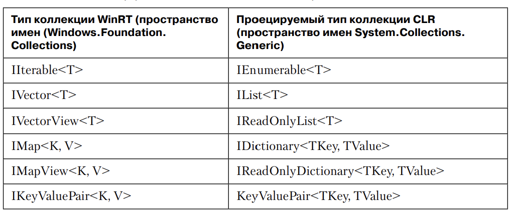
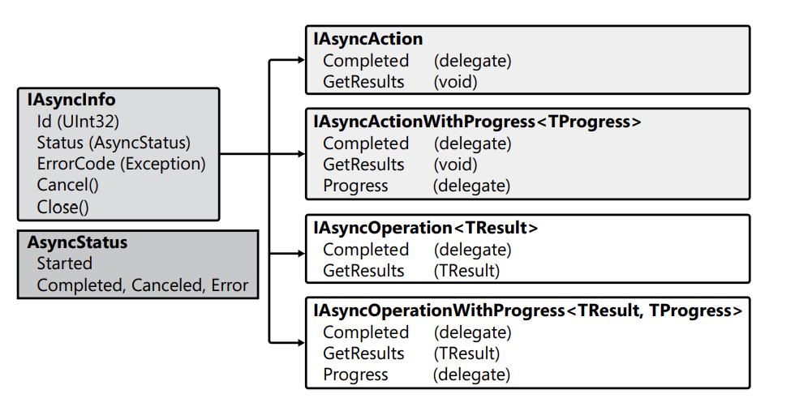

# Глава 25. Взаимодействие с компонентами WinRT

В Windows 8 появилась новая библиотека классов, при помощи которой приложения могут 
использовать функциональность операционной системы. Эта библиотека классов официально 
называется Windows Runtime (WinRT), а для работы с ее 
компонентами применяется система типов WinRT. Многие задачи, для решения 
которых создавалась WinRT, совпадают с задачами общеязыковой среды CLR в ее 
исходном воплощении — например, упрощение разработки приложений и простое взаимодействие 
с кодом, написанным на других языках программирования. 
Компания Microsoft обеспечивает поддержку использования компонентов WinRT 
в неуправляемом коде C/C++, в JavaScript (для виртуальной машины JavaScript 
«Chakra» от Microsoft), а также в C# и Visual Basic.

!(images/winrt_components.png)

На рисунке представлены различные возможности, предоставляемые компонентами WinRT, и различные
языки, поддерживаемые Microsoft для работы с ними. Код приложений, написанных на C/C++
должен компилироваться для каждой конкретной архитектуры процессора (x86, x64, ARM). 
Разработчикам .NET достаточно откомпилировать свой код в IL-код, чтобы потом среда CLR
преобразовала его в машинный код для конкретного процессора. Разработчики JS включают
исходный код в свое приложение, а виртуальная машина Chakra разбирает его и преобразует 
в машинный код конкретного процессора. Другие компании тоже могут выпускать языки и среды,
поддерживающие взаимодействие с компонентами WinRT.

Приложения Windows Store и настольные приложения могут использовать 
компоненты WinRT для обращения к функциональности операционной системы. 
Пока количество компонентов WinRT, поставляемых как составная часть Windows, 
относительно невелико по сравнению с размером библиотеки классов .NET 
Framework. Впрочем, это вполне естественно, потому что компоненты ориентированы на 
решение тех задач, с которыми операционная система справляется лучше 
всего: предоставления разработчикам абстрактного представления оборудования 
и средств взаимодействия между приложениями. Таким образом, большинство 
компонентов WinRT предоставляет такие функции, как хранение информации, 
сетевые операции, графика, мультимедиа, безопасность, многопоточность и т. д. 
Другие базовые средства (например, операции со строками) и более сложные подсистемы 
(например, поддержка LiNQ) операционной системой не поддерживаются, 
а предоставляются языком, используемым для работы с компонентами WinRT 
операционной системы.

Во внутренней реализации компоненты WinRT представляют собой компоненты COM 
(Component Object Model) — технологии, представленной компанией 
Microsoft в 1993 году. COM имеет репутацию излишне сложной модели с множеством 
запутанных правил и крайне громоздкой моделью программирования. Тем 
не менее в модели COM было заложено немало правильных идей, и за прошедшие 
годы разработчики Microsoft приложили значительные усилия по ее упрощению. 
Для компонентов WinRT компания Microsoft ввела очень значительное изменение: 
вместо библиотек типов для описания API компонентов COM теперь используются 
метаданные. Да, APO компонентов WinRT описывается в формате метаданных .NET 
(ECMA-335), который был стандартизирован комитетом ECMA — и в том самом 
формате метаданных, который рассматривался в этой книге.

Метаданные обладают значительно большими возможностями, чем библиотеки 
типов, а их полноценная поддержка изначально заложена в CLR. Кроме того, CLR 
поддерживает взаимодействие с компонентами COM через обертки RCW (Runtime 
Callable Wrappers) и CCW (COM Callable Wrappers). В общем и целом это позволяет 
языкам (таким, как C#), работающим на базе CLR, легко взаимодействовать 
с типами и компонентами WinRT.

В C# ссылка на объект WinRT в действительности представляет собой ссылку 
на обертку RCW, которая содержит внутреннюю ссылку на объект WinRT. Аналогичным 
образом при передаче объекта CLR WinRT API вы в действительности 
передаете ссылку на обертку CCW, а CCW содержит ссылку на объект CLR.

Метаданные компонентов WinRT хранятся в файлах с расширением .winmd. 
У компонентов WinRT, входящих в поставку Windows, метаданные хранятся в файлах 
Windows.*.winmd, находящихся в каталоге %WinDir%\System32\WinMetadata. При 
построении приложения используется ссылка на следующий файл Windows.winmd, 
устанавливаемый Windows SDK:

```%ProgramFiles(x86)%\Windows Kits\8.0\References\CommonConiguration\Neutral\Windows.winmd```

Система типов Windows Runtime создавалась, прежде всего, для того, чтобы 
разработчики могли успешно писать приложения с применением всех знакомых им 
технологий, инструментов, приемов и соглашений. Для этого некоторые функции 
WinRT проецировались на соответствующие технологии разработки. Для разработчиков 
.NET Framework существует два вида проекций:

1. Проекции уровня CLR неявно реализуются средой CLR (и как правило, в отношении 
интерпретации метаданных). Следующий раздел посвящен правилам 
системы типов компонентов WinRT и тому, как CLR проецирует эти правила 
на парадигму разработки .NET Framework.

2. Проекции уровня .NET Framework реализуются явно в вашем коде посредством использования 
новых API, введенных в FCL. Проекции уровня .NET 
Framework необходимы в тех ситуациях, когда рассогласование между системой 
типов WinRT и системой типов CLR становится слишком значительным для 
неявного разрешения средствами CLR. Проекции уровня .NET Framework рассматриваются 
далее в этой главе.

## Проекции уровня CLR и правила системы типов компонентов WinRT

Компоненты WinRT образуют систему типов, сходную с системой типов CLR. Когда 
среда CLR встречает тип WinRT, она обычно разрешает использование этого типа 
с использованием обычных технологий взаимодействия CLR. Однако в некоторых 
случаях CLR скрывает тип WinRT и предоставляет доступ к нему через другой тип. 
Во внутренней реализации CLR ищет некоторые типы (при помощи метаданных), 
а затем отображает их на типы FCL. Полный список типов WinRT, которые CLR 
неявно проецирует на типы FCL, доступен по адресу 
http://msdn.microsoft.com/en-us/library/windows/apps/hh995050.aspx

### Основные концепции системы типов WinRT

Система типов WinRT по функциональности уступает системе типов CLR. Ниже 
перечислены основные концепции системы типов WinRT и способы их проекции CLR.

**Имена файлов и пространства имен.** Имя самого файла .winmd должно совпадать с именем 
пространства имен, содержащего компоненты WinRT. Например, файл с именем 
Wintellect.WindowsStore.winmd должен содержать компоненты 
WinRT, определенные в пространстве имен Wintellect.WindowsStore или в одном 
из его подпространств. Поскольку файловая система Windows не учитывает регистр 
символов, пространства имен, различающиеся только регистром символов, 
недопустимы. Кроме того, имя компонента WinRT не может совпадать с именем 
пространства имен

**Общий базовый тип.** Компоненты WinRT не имеют общего базового класса. 
Когда CLR проецирует тип WinRT, все выглядит так, словно тип WinRT является 
производным от System.Object; соответственно все типы WinRT наследуют такие 
открытые методы, как ToString, GetHashCode, Equals и GetType. При использовании 
объекта WinRT в C# объект кажется производным от System.Object, а объекты 
WinRT могут передаваться в коде. Также возможен вызов «унаследованных» методов — таких, как ToString.

**Основные типы данных.** Система типов WinRT поддерживает основные типы 
данных: логический, байтовый без знака, 16-, 32 и 64-разрядные целые числа со 
знаком и без, вещественные числа одинарной и двойной точности, 16-разрядные 
символы, строки и void. Все остальные типы данных, как и в CLR, образуются из 
этих основных типов данных.

Байтовый тип со знаком в WinRT не поддерживается

**Классы.** ы. Система типов WinRT является объектно-ориентированной; это означает, 
что компоненты WinRT поддерживают абстракцию данных, наследование и полиморфизм. 
Однако некоторые языки (например, JavaScript) не поддерживают 
наследование типов, и в интересах этих языков компоненты WinRT почти не используют 
наследование, а это значит, что они также не используют полиморфизм. 
По сути наследование и полиморфизм задействованы только теми компонентами 
WinRT, предназначенных для других языков, помимо JavaScript. Из компонентов 
WinRT, включенных в поставку Windows, наследование и полиморфизм используются 
только компонентами XAML (для построения пользовательских интерфейсов). 
Приложения, написанные на JavaScript, строят свой пользовательский интерфейс 
средствами HTML и CSS.

**Структуры.** WinRT поддерживает структуры (значимые типы), экземпляры 
которых продвигаются по значению через границы взаимодействий (interoperability 
boundary) COM. В отличие от значимых типов CLR, структуры WinRT могут 
содержать только открытые поля, которые относятся к основным типам данных 
(или являются другими структурами WinRT). Кроме того, структуры WinRT не 
могут определять конструкторы или вспомогательные методы. Для удобства CLR 
проецирует некоторые структуры операционной системы WinRT на собственные 
типы CLR, которые могут содержать конструкторы и вспомогательные методы. 
Такие спроецированные типы выглядят более естественно для разработчиков CLR. 
В качестве примеров можно привести структуры Point, Rect, Size и TimeSpan, 
определенные в пространстве имен Windows.Foundation.

**Null-совместимые структуры.** В рамках WinRT API также могут определяться 
null-совместимые структуры (значимые типы). CLR проецирует интерфейс WinRT 
Windows.Foundation.IReference<T> как тип CLR System.Nullable<T>.


**Перечисления.** Значения перечислимых типов передаются просто в виде 
32-разрядного целого числа со знаком или без. Если вы определяете перечисляемый тип в 
C#, он должен базироваться на типе int или uint. Кроме того, 32-разрядные без знака 
интерпретируются как флаги, которые могут объединяться операцией ИЛИ.

**Интерфейсы.** В типах параметров и возвращаемых значений интерфейсов 
WinRT могут использоваться только WinRT-совместимые типы.

**Методы.** В WinRT реализована ограниченная перегрузка методов. А именно, 
поскольку язык JavaScript использует динамическую типизацию, он не умеет различать 
методы, различающиеся только по типам параметров. Например, JavaScript 
преспокойно передаст число методу, ожидающему получить строку. Однако 
JavaScript отличит метод с одним параметром от метода с двумя параметрами. 
Кроме того, WinRT не поддерживает методы перегрузки операторов и значения 
аргументов по умолчанию.

**Свойства.** В качестве типа данных свойств WinRT могут задаваться только 
WinRT-совместимые типы. WinRT не поддерживает параметризованные свойства 
и свойства, доступные только для записи.

**Делегаты.** В типах параметров и возвращаемых значений делегатов WinRT 
могут использоваться только WinRT-совместимые типы. При передаче делегата 
компоненту WinRT объект делегата упаковывается в CCW и не уничтожается 
уборщиком мусора до тех пор, пока обертка CCW не будет освобождена использующим 
ее компонентом WinRT. Делегаты WinRT не имеют методов BeginInvoke и EndInvoke. 

**События.** Компоненты WinRT могут определять события, используя типы 
делегатов WinRT. Так как многие компоненты WinRT запечатаны (не допускают 
наследование), в WinRT определяется делегат TypedEventHandler, у которого параметр 
sender относится к обобщенному типу (вместо System.Object).

```
public delegate void TypedEventHandler<TSender, TResult>(TSender sender,
 TResult args); 
```

Также существует тип делегата Windows.Foundation.EventHandler<T>, который CLR проецирует
на знакомый тип делегата .NET Framework System.EventHandler<T>.

**Исключения.** Во внутренней реализации компоненты WinRT, как и компоненты 
COM, передают информацию о своем состоянии в значениях HRESULT (32-разрядное целое число 
со специальной семантикой). CLR проецирует значения WinRT типа Windows.Foundation.HResult на объекты исключений.

Пример: HRESULT 0x8007000e (E_OUTOFMEMORY) отображается на System.OutOfMemoryException

Компонент WinRT, реализованный на C#, может просто выдать исключение нужного типа, 
а CLR преобразует его в соответствующее значение HRESULT. Чтобы полностью контролировать 
значение HRESULT, создайте объект исключения, задайте соответствующее значение HRESULT в 
свойстве HResult объекта, после чего выдайте объект исключения.

**Строки.** Конечно, неизменяемые строки могут передаваться между системами 
типов WinRT и CLR. Тем не менее система типов WinRT не разрешает строкам принимать 
значение null. Если передать null в строковом параметре функции WinRT 
API, CLR обнаруживает этот факт и выдает исключение ArgumentNullException; 
вместо null для передачи пустой строки функциям WinRT API следует использовать 
String.Empty. Строки передаются по ссылке; возвращение строк функциями 
WinRT API всегда сопровождается их копированием. При передаче или получении 
строковых массивов CLR (String[]) от функций WinRT API создается копия массива, 
которая передается или возвращается на сторону вызова.

**Дата и время.** Структура WinRT Windows.Foundation.DateTime представляет дату/время в 
формате UTC. CLR проецирует структуру WinRT DateTime на 
структуру .NET Framework System.DateTimeOffset, которую следует использовать вместо структуры 
.NET Framework System.DateTime. В итоговом экземпляре 
DateTimeOffset CLR преобразует дату и время UTC, возвращаемые WinRT, в локальное время. 
CLR передает функциям WinRT API структуру DateTimeOffet с временем UTC.

**URI.** CLR проецирует тип WinRT Windows.Foundation.Uri на тип .NET 
Framework System.Uri. Если при передаче типа .NET Framework Uri функции 
WinRT API используется относительный URI-адрес, среда CLR выдает исключение 
ArgumentException; WinRT поддерживает только абсолютные URI. Переход через 
границы взаимодействий всегда сопровождается копированием URI.

### ПРИМЕЧАНИЕ

IClosable/IDisposable CLR проецирует интерфейс WinRT Windows.Foundation.IClosable (состоящий 
из единственного метода Close) на интерфейс .NET System.IDisposable. Следует учесть, что все
функции WinRT API, выполняющие операции ввода/вывода, реализованы асинхронно. Так как метод
интерфейса IClosable называется Close, а не CloseAsync, метод Close не должен выполнять 
никакие операции ввода/вывода. 
В этом он семантически отличается от типичного поведения Dispose в .NET Framework. Для 
типов, реализованных в .NET Framework, метод Dispose может выполнять операции 
ввода-вывода; более того, часто он обеспечивает запись буферизованных данных 
перед фактическим закрытием устройства. Но когда код C# вызывает Dispose для 
типа WinRT, операции ввода-вывода (в частности, запись буферизованных данных) 
выполняться не будут, что может привести к возможной потере данных. Вы должны 
учитывать это обстоятельство и явно вызывать методы, предотвращающие потерю
данных, для компонентов WinRT, инкапсулирующих потоки вывода. Например, при 
использовании объекта DataWriter всегда следует вызывать его метод StoreAsync.

**Массивы.** В WinRT API поддерживаются одномерные массивы с индексированием от нуля. 
WinRT может передавать элементы массива либо в метод, либо из 
него — но никогда в обоих направлениях. Соответственно вы не сможете передать 
массив функции WinRT API, изменить элементы массива, а затем обратиться 
к измененным элементам после возвращения из функции API. Впрочем, я описал 
контракт, который должен соблюдаться. Тем не менее среда не занимается активным 
контролем его соблюдения, поэтому некоторые проекции могут передавать 
содержимое массива в обоих направлениях. Обычно это делается для естественного 
повышения производительности.

**Коллекции.** При передаче коллекции WinRT API среда CLR упаковывает объект коллекции 
в обертку CCW и передает ссылку на CCW функции WinRT API. 
При вызовах через CCW вызывающий поток пересекает границу взаимодействия, 
что приводит к снижению производительности. С другой стороны, в отличие от 
массивов, при передаче коллекций WinRT API возможно выполнение операций 
с коллекциями «на месте» без копирования элементов.



В таблице перечислены интерфейсы коллекций WinRT и их проекции в коде приложений .NET.
Как показывает приведенный список, команда CLR основательно потрудилась 
над тем, чтобы по возможности упростить взаимодействие между системой типов
WinRT и системой типов CLR, а разработчики управляемого кода могли бы использовать 
компоненты WinRT в своем коде.

## Поекции уровня .NET Framework

Если CLR не может неявно подобрать проекцию типа WinRT для разработчика .NET 
Framework, приходится использовать явные проекции. Есть три основные области, 
в которых необходимы проекции: асинхронное программирование, взаимодействие 
между потоками WinRT и .NET Framework, а также передача блоков данных между 
функциями CLR и WinRT API.

## Асинхронные вызовы WinRT API из кода .NET

Синхронное выполнение операции ввода-вывода в программном потоке может 
привести к его блокировке на неопределенный период времени. Если поток графического 
интерфейса ожидает завершения синхронной операции ввода/вывода, 
пользовательский интерфейс приложения перестает реагировать на действия 
пользователя (операции с сенсорным экраном, мышью и пером), а это раздражает 
пользователя. Чтобы предотвратить подобную блокировку, компоненты WinRT, 
выполняющие операции ввода-вывода, предоставляют доступ к своей функциональности 
через асинхронный программный интерфейс. Более того, компоненты 
WinRT, выполняющие вычислительные операции, также предоставляют доступ к 
своей функциональности через асинхронный программный интерфейс, если выполнение операции 
занимает более 50 миллисекунд. Проблемы построения приложений, быстро реагирующих 
на действия пользователя, также рассматриваются в части V этой книги.

Чтобы эффективно использовать многочисленные асинхронные функции WinRT 
API, необходимо понимать, как правильно работать с ними в коде C#.



На рисунке изображены различные интерфейсы WinRT IAsyncXxx. Все четыре главный интерфейса 
происходят от интерфейса IAsyncInfo. Два интерфейса IAsyncAction предоставляют возможность 
узнать о завершении операции, но их операции завершаются без возвразаемого значения (их методы
GetResults возвращают void). Два интерфейса IAsyncOperation позволяют не только узнать о 
завершении операции, но и получить возвращаемое значение (их методы GetResults возвращают
обобщенный тип TResult).

Два интерфейса IAsyncXxxWithProgress позволяют коду получать периодические оповещения 
о ходе выполнения асинхронной операции. Большинство 
асинхронных операций не поддерживает оповещения, но у некоторых видов операций 
(как, например, у фоновой загрузки и отправки данных) такая возможность 
предусмотрена. Для получения оповещений следует определить в коде еще один 
метод обратного вызова, создать для него делегата и назначить его свойству Progress
объекта IAsyncXxxWithProgress. При обращении к методу обратного вызова передается аргумент, 
тип которого соответствует обобщенному типу TProgres.

В .NET Framework для упрощения асинхронных операций используются типы 
из пространства имен System.Threading.Tasks. Типы для выполнения асинхронных вычислений 
и их использование рассматриваются в главе 27, а типы для 
выполнения асинхронного ввода-вывода — в главе 28. Кроме того, в C# имеются 
ключевые слова async и await, которые позволяют выполнять асинхронные операции 
с применением модели последовательного программирования, существенно 
упрощающей структуру кода.

Оператор C# await заставляет компилятор провести поиск метода GetAwaiter
в интерфейсе IAsyncOperation<StorageFile>, возвращенном методом GetFileAsync. 
Интерфейс не предоставляет метод GetAwaiter, поэтому компилятор ищет метод 
расширения. К счастью, разработчик .NET Framework включили в библиотеку 
System.Runtime.WindowsRuntime.dll методы расширения, вызываемые для интерфейсов 
WinRT IAsyncXxx.

```
namespace System 
{ 
	public static class WindowsRuntimeSystemExtensions 
	{ 
		public static TaskAwaiter GetAwaiter(this IAsyncAction source); 

		public static TaskAwaiter GetAwaiter<TProgress>(this 
			IAsyncActionWithProgress<TProgress> source);
		
		public static TaskAwaiter<TResult> GetAwaiter<TResult>(this 
			IAsyncOperation<TResult> source); 

		public static TaskAwaiter<TResult> GetAwaiter<TResult, TProgress>(
			this IAsyncOperationWithProgress<TResult, TProgress> source);
	}
}
```

Во внутренней реализации все эти методы создают объект TaskCompletionSource
и приказывают объекту IAsyncXxx обратиться к методу обратного вызова, который 
задает финальное состояние TaskCompletionSource при завершении асинхронной 
операции. Объект TaskAwaiter, возвращаемый методами расширения — то, что 
в конечном счете должен получить C#. При завершении асинхронной операции 
объект TaskAwaiter следит за тем, чтобы код продолжал выполняться через 
объект SynchronizationContext (см. главу 28), связанный с исходным потоком. 
Затем поток выполняет код, сгенерированный компилятором C#, который запрашивает
свойство Result объекта TaskCompletionSource.Task; это приводит 
к получению результата (StorageFile в моем примере), выдаче исключения 
OperationCanceledException в случае отмены или другого исключения в случае 
ошибки. Пример внутренней реализации этих методов приведен в конце раздела.

Мы рассмотрели наиболее типичный сценарий вызова асинхронной функции 
WinRT API и определения результата. Однако в своем коде я показал, как узнать 
об отмене операции, но не объяснил, как на практике производится отмена. Также
остался нерассмотренным вопрос обработки оповещений о ходе выполнения операции. 
Чтобы правильно обработать отмену и оповещения, вместо автоматического 
вызова компилятором одного из методов расширения GetAwaiter следует явно 
вызвать один из методов расширения AsTask, также явно определяемых классом 
WindowsRuntimeSystemExtensions.

```
namespace System 
{ 
	public static class WindowsRuntimeSystemExtensions 
	{ 
		public static Task AsTask<TProgress>(
			this IAsyncActionWithProgress<TProgress> source, 
			CancellationToken cancellationToken, IProgress<TProgress> progress);

		public static Task<TResult> AsTask<TResult, TProgress>(
			this IAsyncOperationWithProgress<TResult, TProgress> source, 
			CancellationToken cancellationToken, IProgress<TProgress> progress);

		// Более простые перегруженные версии не показаны
	} 
}
```

Итак, пора рассмотреть реализацию в целом. Вот как происходит асинхронный 
вызов функций WinRT API с полной поддержкой отмены и оповещений о ходе 
выполнения в тех случаях, когда они необходимы:

```
using System; // Для AsTask из WindowsRuntimeSystemExtensions
using System.Threading; // Для CancellationTokenSource
internal sealed class MyClass 
{ 
	private CancellationTokenSource m_cts = new CancellationTokenSource(); 

	// ВНИМАНИЕ: при вызове из потока графического интерфейса
	// весь код выполняется в этом потоке:
	private async void MappingWinRTAsyncToDotNet(WinRTType someWinRTObj) 
	{ 
		try { 
			// Предполагается, что XxxAsync возвращает
			// IAsyncOperationWithProgress<IBuffer, UInt32> 
			IBuffer result = await someWinRTObj.XxxAsync(...) 
				.AsTask(m_cts.Token, new Progress<UInt32>(ProgressReport));
			/* Завершение... */
		} 
		catch (OperationCanceledException) { /* Отмена... */ }
		catch (SomeOtherException) { /* Ошибка... */ }
	} 

	private void ProgressReport(UInt32 progress) { /* Оповещение... */ }

	public void Cancel() { m_cts.Cancel(); } // Вызывается позднее
}
```

Конечно, многим читателям хотелось бы понять, как методы AsTask преобразуют 
объект WinRT IAsyncXxx в объект .NET Framework Task, к которому в конечном 
итоге применяется await. В следующем коде представлена внутренняя реализация 
самого сложного метода AsTask. Конечно, более простые перегруженные версии 
устроены проще.

```
public static Task<TResult> AsTask<TResult, TProgress>(
 this IAsyncOperationWithProgress<TResult, TProgress> asyncOp,
 CancellationToken ct = default(CancellationToken),
 IProgress<TProgress> progress = null) 
{ 
	// При отмене CancellationTokenSource отменить асинхронную операцию
	ct.Register(() => asyncOp.Cancel()); 

	// Когда асинхронная операция оповещает о прогрессе,
	// оповещение передается методу обратного вызова
	asyncOp.Progress = (asyncInfo, p) => progress.Report(p);

	// Объект TaskCompletionSource наблюдает за завершением
	// асинхронной операции
	var tcs = new TaskCompletionSource<TResult>(); 

	// При завершении асинхронной операции оповестить TaskCompletionSource.
	// Когда это происходит, управление возвращается коду,
	// ожидающему завершения TaskCompletionSource.
	asyncOp.Completed = (asyncOp2, asyncStatus) => 
	{
		switch (asyncStatus) 
		{ 
			case AsyncStatus.Completed: tcs.SetResult(asyncOp2.GetResults()); break; 
			case AsyncStatus.Canceled: tcs.SetCanceled(); break; 
			case AsyncStatus.Error: tcs.SetException(asyncOp2.ErrorCode); break; 
		} 
	}; 
	return tcs.Task; 
}
```

## Взаимодействия между потоками WinRT и потоками .NET

Многие классы .NET Framework работают с типами, производными от System.
IO.Stream — как, например, классы сериализации и LINQ. Чтобы использовать объект WinRT, 
реализующий интерфейсы WinRT IStorageFile или IStorageFolder, 
с классом .NET Framework, которому необходим тип, производный от Stream, 
следует задействовать методы расширения, определенные в классе System.IO.Wi
ndowsRuntimeStorageExtensions.

```
namespace System.IO { // Определяется в System.Runtime.WindowsRuntime.dll
	public static class WindowsRuntimeStorageExtensions 
	{ 
		public static Task<Stream> OpenStreamForReadAsync(this IStorageFile file); 

		public static Task<Stream> OpenStreamForWriteAsync(this IStorageFile file); 

		public static Task<Stream> OpenStreamForReadAsync(this 
			IStorageFolder rootDirectory, 
			String relativePath); 

		public static Task<Stream> OpenStreamForWriteAsync(this 
			IStorageFolder rootDirectory, 
			String relativePath, CreationCollisionOption creationCollisionOption);
	} 
}
```

В следующем примере один из методов расширения используется для открытия 
объекта WinRT StorageFile и чтения его содержимого в объект .NET Framework 
XElement:

```
async Task<XElement> FromStorageFileToXElement(StorageFile file) 
{ 
	using (Stream stream = await file.OpenStreamForReadAsync()) { 
		return XElement.Load(stream); 
	} 
}
```

Наконец, класс System.IO.WindowsRuntimeStreamExtensions предоставляет 
методы расширения, «преобразующие» потоковые интерфейсы WinRT (такие, как 
IRandomAccessStream, IInputStream или IOutputStream) в тип .NET Framework 
Stream, и наоборот.

В следующем примере один из методов расширения используется для «преобразования» 
объекта WinRT IInputStream в объект .NET Framework Stream:

```
XElement FromWinRTStreamToXElement(IInputStream winRTStream) { 
	Stream netStream = winRTStream.AsStreamForRead(); 
	return XElement.Load(netStream); 
}
```

Обратите внимание: методы «преобразования», предоставляемые .NET 
Framework, не ограничиваются простым внутренним преобразованием типа. Методы, 
адаптирующие потоки WinRT в потоки .NET Framework, неявно создают 
буфер для потока WinRT в управляемой куче. В результате большинство операций 
осуществляет запись в буфер и не нуждается в пересечении границы взаимодействия, 
что способствует повышению производительности — это особенно важно 
в ситуациях с многочисленными мелкими операциями ввода-вывода (например, 
при разборе документа XML).

Одно из преимуществ использования проекций потоков .NET Framework заключается в том, 
что если метод используется более одного раза для AsStreamXxx
для одного экземпляра потока WinRT, вам не придется беспокоиться о возможности 
создания нескольких разных буферов и о том, что данные, записанные в один 
буфер, не будут видны в другом. Функции .NET Framework API следят за тем, 
чтобы каждый объект потока использовал уникальный экземпляр адаптера, а все 
пользователи работали с одним буфером.

И хотя в большинстве случаев стандартная буферизация обеспечивает хороший 
компромисс между производительностью и затратами памяти, иногда требуется 
изменить 16-килобайтный размер буфера, используемый по умолчанию. Методы 
AsStreamXxx предоставляют перегруженные версии с такой возможностью. Например, если 
вы знаете, что будете работать с очень большим файлом в течение 
длительного времени, а количество одновременно используемых других буферизованных 
потоков будет небольшим, вы сможете обеспечить некоторый прирост 
производительности, выделив для своего потока очень большой буфер. И наоборот, 
в некоторых ситуациях с необходимостью минимальной задержки можно 
потребовать, чтобы из сети читалось ровно столько байтов, сколько необходимо 
приложению; тогда буферизацию можно вообще отключить. Если передать методу 
AsStreamXxx нулевой размер буфера, то объект буфера не создается.


## Передача блоков данных между CLR и WinRT

Там, где это возможно, рекомендуется использовать проекции потоков из предыдущего раздела, 
потому что они обладают достаточно хорошими характеристиками 
производительности. Однако некоторые ситуации требуют передачи между CLR 
и компонентами WinRT физических блоков данных. Например, при использовании 
компонентов файловых и сокетовых потоков WinRT необходимо выполнять чтение 
и запись физических блоков данных. Кроме того, криптографические компоненты 
WinRT выполняют шифрование и дешифрование блоков данных, а пикселы растровой графики 
также хранятся в виде физических блоков данных

В .NET Framework блоки данных обычно передаются в виде массива байтов 
(Byte[]) или в виде потока (например, при использовании класса MemoryStream). 
Конечно, массивы байтов и объекты MemoryStream не могут передаваться компонентам 
WinRT напрямую, поэтому WinRT определяет интерфейс IBuffer; объекты, 
реализующие этот интерфейс, представляют физические блоки данных, которые 
могут передаваться функциям WinRT API. Интерфейс WinRT IBuffer определяется 
следующим образом:

```
namespace Windows.Storage.Streams { 
	public interface IBuffer 
	{ 
		UInt32 Capacity { get; } // Максимальный размер буфера (в байтах)
		UInt32 Length { get; set; } // Количество используемых байтов в буфере
	}
}
```

Как видите, объект IBuffer имеет максимальный размер и текущую длину; как 
ни странно, он не предоставляет средств для выполнения чтения или записи данных 
в буфер. Это объясняется, прежде всего, тем, что типы WinRT не могут выражать 
указатели в своих метаданных, потому что указатели плохо соответствуют правилам 
некоторых языков (например, JavaScript или безопасного кода C#). Таким 
образом, объект IBuffer — всего лишь способ передачи адреса памяти между CLR 
и WinRT API. Для обращения к байтам по адресу памяти используется внутренний интерфейс 
COM IBufferByteAccess. Обратите внимание: это интерфейс 
COM (потому что он возвращает указатель), а не интерфейс WinRT. Группа .NET 
Framework определила для этого интерфейса COM внутреннюю обертку RCW, 
которая выглядит примерно так:

```
namespace System.Runtime.InteropServices.WindowsRuntime 
{ 
	[Guid("905a0fefbc5311df8c49001e4fc686da")] 
	[InterfaceType(ComInterfaceType.InterfaceIsIUnknown)] 
	[ComImport] 
	internal interface IBufferByteAccess 
	{ 
		unsafe Byte* Buffer { get; } 
	} 
}
```

Во внутренней реализации CLR может взять объект IBuffer, запросить его интерфейс 
IBufferByteAccess, а затем обратиться к свойству Buffer для получения 
небезопасного указателя на байты, содержащиеся в буфере. По этому указателю 
к байтам можно обратиться напрямую.

Чтобы избавить разработчиков от написания небезопасного кода, работающего 
с указателями, в FCL был включен класс WindowsRuntimeBufferExtensions. Он 
определяет набор методов расширения, которые явно вызываются разработчиками 
для передачи блоков данных между массивами байтов и потоками CLR и 
объектами WinRT IBuffer. Для использования этих методов расширения следует 
включить в исходный код директиву using System.Runtime.InteropServices.
WindowsRuntime;:

```
namespace System.Runtime.InteropServices.WindowsRuntime 
{ 
	public static class WindowsRuntimeBufferExtensions 
	{ 
		public static IBuffer AsBuffer(this Byte[] source); 

		public static IBuffer AsBuffer(this Byte[] source, Int32 offset,
		Int32 length); 

		public static IBuffer AsBuffer(this Byte[] source, Int32 offset,
		Int32 length, Int32 capacity);

		public static IBuffer GetWindowsRuntimeBuffer(this MemoryStream stream); 

		public static IBuffer GetWindowsRuntimeBuffer(this MemoryStream stream,
		Int32 position, Int32 length);
	} 
}
```

Итак, если у вас имеется массив Byte[] и вы хотите передать его функции 
WinRT, получающей IBuffer, просто вызовите AsBuffer для массива Byte[]. 

По сути, ссылка на Byte[] упаковывается в объект, реализующий интерфейс 
IBuffer; содержимое массива Byte[] при этом не копируется, так что операция 
выполняется очень эффективно. Аналогичным образом, если у вас имеется объект 
MemoryStream, в котором упакован буфер Byte[], вы просто вызываете для него 
метод GetWindowsRuntimeBuffer, чтобы ссылка на буфер MemoryStream была заключена 
в объект, реализующий интерфейс IBuffer. И снова содержимое буфера 
не копируется, поэтому операция обладает высокой эффективностью. Следующий 
метод демонстрирует обе ситуации:

```
private async Task ByteArrayAndStreamToIBuffer(IRandomAccessStream winRTStream, Int32 count) 
{ 
	Byte[] bytes = new Byte[count]; 
	await winRTStream.ReadAsync(bytes.AsBuffer(), (UInt32)bytes.Length, InputStreamOptions.None); 
	Int32 sum = bytes.Sum(b => b); // Обращение к прочитанным байтам через Byte[]
	using (var ms = new MemoryStream()) 
	using (var sw = new StreamWriter(ms)) 
	{ 
		sw.Write("This string represents data in a stream"); 
		sw.Flush(); 
		UInt32 bytesWritten = await winRTStream.WriteAsync(ms.GetWindowsRuntimeBuffer()); 
	} 
}
```

Интерфейс WinRT IRandomAccessStream реализует интерфейс WinRT IInputStream, 
определяемый следующим образом:

```
namespace Windows.Storage.Streams { 
 public interface IOutputStream : IDisposable 
 { 
	IAsyncOperationWithProgress<UInt32, UInt32> WriteAsync(IBuffer buffer);
 } 
}
```

Когда вы вызываете методы расширения AsBuffer или GetWindowsRuntimeBuffer
в своем коде, эти методы упаковывают исходный объект в объект, класс которого 
реализует интерфейс IBuffer. Затем CLR создает для этого объекта обертку CCW 
и передает ее функции WinRT API. Когда функция WinRT API запрашивает свойство Buffer 
интерфейса IBufferByteAccess для получения указателя на массив 
байтов, массив фиксируется в памяти, а его адрес возвращается WinRT API для 
обращения к данным. Фиксация снимается, когда WinRT API вызывает метод COM 
Release для интерфейса IBufferByteAccess.

Если вы вызываете функцию WinRT API, возвращающую IBuffer, то, скорее всего, сами данные 
находятся в неуправляемой памяти, и вам нужен механизм обращения к этим данным из 
управляемого кода. Для решения этой задачи следует обратиться к другим методам расширения, 
определяемым классом WindowsRuntimeBufferExtensions.

```
namespace System.Runtime.InteropServices.WindowsRuntime 
{ 
	public static class WindowsRuntimeBufferExtensions 
	{
		public static Stream AsStream(this IBuffer source); 

		public static Byte[] ToArray(this IBuffer source); 

		public static Byte[] ToArray(this IBuffer source, UInt32 sourceIndex,
			Int32 count); 

		// Не показано: метод CopyTo для передачи байтов между IBuffer и Byte[]
		// Не показано: методы GetByte, IsSameData
	} 
}
```

Метод AsStream создает объект, производный от Stream, который служит оберткой для 
исходного объекта IBuffer. При наличии такого объекта можно обращаться 
к данным IBuffer, вызывая Read, Write и прочие подобные методы Stream. Метод 
ToArray во внутренней реализации создает Byte[], после чего копирует все байты 
из исходного объекта IBuffer в Byte[]; учтите, что этот метод расширения может 
дорого обходиться в отношении затрат памяти и процессорного времени.

Класс WindowsRuntimeBufferExtensions также содержит несколько перегруженных версий метода 
CopyTo, позволяющих копировать байты между IBuffer
и Byte[]; метод GetByte, читающий данные из IBuffer по одному байту; и метод 
IsSameData, сравнивающий содержимое двух объектов IBuffer. Вряд ли эти методы 
будут часто использоваться в ваших приложениях.

Также стоит упомянуть о том, что .NET Framework определяет класс System.
Runtime.InteropServices.WindowsRuntimeBuffer для создания объекта IBuffer, 
байты которого находятся в управляемой куче. Также существует компонент 
WinRT Windows.Storage.Streams.Buffer для создания объекта IBuffer, байты 
которого находятся в системной куче. Скорее всего, большинству разработчиков 
.NET Framework не придется использовать эти классы в своем коде

## Определение компонентов WinRT в коде C#

До настоящего момента рассматривались возможности использования компонентов 
WinRT в C#. Однако вы также можете определять компоненты WinRT в коде C# 
для последующего использования в C/C++, C#/Visual Basic, JavaScript и в других 
языках. И хотя это возможно, стоит разобраться в том, в каких ситуациях такое 
решение оправдано. Например, бессмысленно определять компонент WinRT на C#, 
если он будет использоваться только в других управляемых языках, работающих 
поверх CLR. Дело в том, что система типов WinRT обладает существенно меньшей 
функциональностью, ограничивающей ее возможности по сравнению с системой 
типов CLR.

Также неоправданно использование WinRT в неуправляемых языках C/C++. Программисты пишут на 
этих языках высокопроизводительные приложения, и вряд ли они захотят использовать компонент
WinRT, реализованный на управляемом языке, поскольку тоогда потребуется загрузка CLR в процесс,
а следовательно, увеличение затрат памяти и снижение производительности из-за уборки мусора 
и JIT-компиляции кода. По этой причине многие компоненты WinRT (включая 
компоненты, входящие в поставку Windows) реализованы в неуправляемом коде. 
Конечно, в неуправляемых приложениях C++ могут быть части, не столь критичные 
по производительности, и в некоторых ситуациях привлечение функциональности 
.NET Framework для повышения продуктивности разработки оправдано. Например, сервис Bing Maps 
использует неуправляемый код C++ для прорисовки своего 
пользовательского интерфейса с применением DirectX, а в реализации бизнес-логики также 
применяется C#.

Итак, по моему мнению, компоненты WinRT, реализованные на C#, лучше всего 
подходят для разработчиков приложений Windows Store, которые строят пользовательский 
интерфейс средствами HTML и CSS, а затем используют JavaScript для 
связывания интерфейса с бизнес-логикой, реализованной в виде компонента WinRT. 
Другой возможный сценарий — использование функциональности существующих 
компонентов FCL из приложений HTML/JavaScript.

Разработчики, работающие с HTML и JavaScript, уже готовы к затратам памяти 
и снижению производительности, обусловленными использованием браузерного 
ядра. Скорее всего, дополнительные затраты памяти и снижение производительности из-за 
использования CLR для них не будут критичны.

Построение компонента WinRT на C# начинается с создания в Microsoft Visual 
Studio проекта типа WindowsRuntime Component. При этом создается вполне обычный 
проект библиотеки классов, однако компилятор C# будет запущен с параметром 
командной строки /t:winmdobj для создания файла с расширением .winmdobj. При 
наличии этого параметра компилятор также генерирует часть IL-кода иначе, чем 
при обычном запуске. Например, компоненты WinRT добавляют и удаляют делегатов событий 
не так, как это делает CLR, поэтому компилятор включает другой 
код в методы add и remove событий. Позднее в этом разделе я покажу, как явно 
реализовать методы add и remove событий.

Когда компилятор создаст файл .winmdobj, запускается утилита экспорта WinMD 
(WinMDExp.exe), которой передаются созданные компилятором файлы .winmdobj, 
.pdb и .xml (doc). Программа WinMDExp.exe анализирует метаданные файла и убеждается в том, 
что типы соответствуют правилам системы типов WinRT (см. начало 
главы). Она также изменяет метаданные, содержащиеся в файле .winmdobj; IL-код 
при этом остается неизменным. Говоря конкретнее, все типы CLR отображаются на эквивалентные 
типы WinRT. Например, ссылка на тип .NET Framework 
IList<String> заменяется ссылкой на тип WinRT IVector<String>. Результат 
работы WinMDExp.exe представляет собой файл .winmd, который может использоваться другими 
языками программирования.

Содержимое файла .winmd можно просмотреть в программе ILDasm.exe. По умолчанию программа 
ILDasm.exe выводит необработанное содержимое файла, но с параметром командной строки /project 
она покажет, как будут выглядеть метаданные 
после проецирования типов WinRT на эквивалентные типы .NET Framework.

### ВНИМАНИЕ

Когда управляемый код использует компонент WinRT, также написанный на управляемом коде, 
CLR рассматривает компонент WinRT так, как если бы он был обычным
управляемым компонентом — то есть CLR не создает CCW и RCW, а следовательно,
не вызывает через них функции WinRT API. Это приводит к заметному повышению
быстродействия. Однако в процессе тестирования компонента функции API вызываются не так, 
как они вызывались бы из других языков (скажем, из C/C++ или
JavaScript). Таким образом, помимо заниженных затрат памяти и снижения производительности, 
управляемый код может передать null функции WinRT API, требующей
String — и это не приведет к выдаче исключения ArgumentNullException. Кроме того,
функции WinRT API, реализованные в управляемом коде, могут изменять переданные массивы, 
и вызывающая сторона увидит измененное содержимое массива при
возврате управления; обычно система типов WinRT запрещает изменение массивов,
переданных функция API. На практике вы столкнетесь и с другими различиями, так
что будьте внимательны

В примере кода в конце главы продемонстрирована реализация различных компонентов 
WinRT на C#. В компонентах задействованы многие возможности, упоминавшиеся в главе, 
а многочисленные комментарии объясняют суть происходящего. Если потребуется написать 
компонент WinRT на C#, Рихтер рекомендует взять приведенный код за образец.
Также есть код на JS, который демонстрирует обращение ко всем представленным компонентам
и функциям WinRT