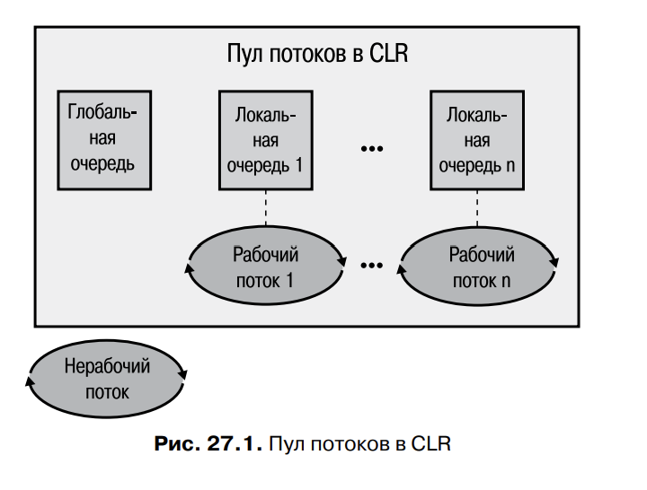

# Глава 27. Асинхронные вычислительные операции

В этой главе рассказывается о различных способах асинхронного выполнения 
операций, вынесенных в отдельные потоки. К вычислительным операциям, в частности, 
относятся компиляция кода, проверка орфографии, проверка грамматики, 
пересчет электронных таблиц, перекодирование аудио- и видеоданных, создание 
миниатюр изображений. Как видите, такие операции встречаются в финансовых 
и технических приложениях повсеместно.

Так как потоки у нас не работают на 100%, это значит, что некоторые (если не все) потоки в 
процессах вообще не исполняются. Они ждут операции ввода или вывода, например срабатывания 
таймера, чтения данных из базы или записи данных в нее, нажатия клавиши на клавиатуре, 
перемещения указателя или нажатия кнопки мыши.

При операциях ввода-вывода драйверы Microsoft Windows инициируют работу устройств, а сам 
процессор в это время не исполняет потоки, запущенные в системе. Именно поэтому диспетчер 
задач показывает низкую загрузку процессора.

Однако даже приложения, предназначенные для операций ввода-вывода, обрабатывают 
получаемые данные, поэтому распараллеливание вычислений может 
значительно повысить их пропускную способность. В этой главе рассказывается 
о пуле потоков общеязыковой исполняющей среды и основных приемах его использования. 
Это крайне важная информация, так как пул потоков является ключевой технологией, 
обеспечивающей разработку и реализацию масштабируемых, 
быстрореагирующих и надежных приложений и компонентов. Также в этой главе 
рассказывается о механизмах, позволяющих выполнять вычислительные операции 
посредством пула потоков. Эти операции происходят в асинхронном режиме, что 
позволяет, во-первых, обеспечить быструю реакцию на действия пользователей 
приложений с графическим интерфейсом, во-вторых, распределить занимающие 
много времени вычисления между различными процессорами.

## Пул потоков CLR

Создание потока - дорогостоящая операция. Кроме того, при наличии множества потоков впустую
расходуется память и снижается производительность, ведь ОС приходится планировать выполнение 
потоков и выполнять переключение контекста.

Среда CLR спопосбна управлять собственным пулом потоков, то есть наборов готовых потоков,
доступных для использования приложениями. Для каждого экземпляра CLR существует свой пул,
используемый всеми доменами приложений, находяющимися под управлением экземпляра CLR. 

При инициализации CLR пул пуст. В его внутренней реализации поддерживается очередь запросов
на выполнение операций. Для выполнения приложением асинхронной операции вызывается метод,
размещающий соответствующий запрос в очереди пула потоков. Код пула извлекает записи из очереди
и распределяет их среди потоков из пула. Если пул пуст, создается новый поток. Как уже 
отмечалось, создание потока отрицательно сказывается на производительности. Однако по завершению 
исполнения своего задания поток не уничтожается, а возвращается в пул и ожидает следующего 
запроса. Поскольку поток не уничтожается, производительности не страдает.

Когда приложение отправляет пулу много запросов, он пытается обслужить их 
все с помощью одного потока. Однако если приложение создает очередь запросов 
быстрее, чем поток из пула их обслуживает, создаются дополнительные потоки. 
Такой подход позволяет обойтись при обработке запросов небольшим количеством 
потоков.

Когда приложение прекращает отправлять запросы в пул, появляются незанятые 
потоки, впустую занимающие память. Поэтому через некоторое время бездействия 
(различное для разных версий CLR) поток пробуждается и самоуничтожается, освобождая ресурсы. 
Это опять отрицательно сказывается на производительности, но в 
данном случае это уже не столь важно, поскольку уничтожаемый поток все равно простаивал, 
а значит, приложение в данный момент не было особо загружено работой.

Пул потоков позволяет найти компромисс в ситуации, когда малое количество 
потоков экономит ресурсы, а большое позволяет воспользоваться преимуществами 
многопроцессорных систем, а также многоядерных и гиперпотоковых процессоров. 
Пул потоков действует по эвристическому алгоритму. Если приложение должно 
выполнить множество заданий и при этом имеются доступные процессоры, пул 
создает больше потоков. При снижении загрузки приложения потоки из пула 
самоуничтожаются

## Простые вычислительные операции

Для добавления в очередь пула потоков асинхронных вычислительных операций 
обычно вызывают один из следующих методов класса ThreadPool:

```
static Boolean QueueUserWorkItem(WaitCallback callBack);
static Boolean QueueUserWorkItem(WaitCallback callBack, Object state);
```

Эти методы ставят «рабочий элемент» вместе с дополнительными данными 
состояния в очередь пула потоков и сразу возвращают управление приложению. 
Рабочим элементом называется указанный в параметре callback метод, который 
будет вызван потоком из пула. Этому методу можно передать один параметр 
через аргумент state (данные состояния). Без этого параметра версия метода 
QueueUserWorkItem передает методу обратного вызова значение null. Все заканчивается тем, 
что один из потоков пула обработает рабочий элемент, приводя к вызову 
указанного метода. Создаваемый метод обратного вызова должен соответствовать 
делегату System.Threading.WaitCallback, который определяется так:

```
delegate void WaitCallback(Object state);
```

### ПРИМЕЧАНИЕ

Если метод обратного вызова генерирует необработанное исключение, CLR завершает процесс 
(если это не противоречит политике хоста). Необработанные исключения
обсуждались в главе 20.

В приложениях Windows Store класс System.Threading.ThreadPool недоступен для
открытого использования. Впрочем, он косвенно используется при использовании
типов из пространства имен System.Threading.Tasks (см. раздел «Задания» далее
в этой главе).

## Контексты исполнения

С каждым потоком связан определенный контекст исполнения. Он включает в себя параметры 
безопасности (сжатый стек, свойство Principal объекта 
Thread и идентификационные данные Windows), параметры хоста (System.
Threading.HostExecutionContextManager) и контекстные данные логического 
вызова (см. методы LogicalSetData и LogicalGetData класса System.Runtime.
Remoting.Messaging.CallContext).

Когда поток исполняет код, значения параметров контекста исполнения оказывают влияние на 
некоторые операции. В идеале всякий раз при использовании для выполнения заданий
вспомогательного потока в этот вспомогальный поток должен копироваться контекст исполнения
первого потока. Это гарантирует использование одинаковых параметров безопасности и хоста
в обоих потоках, а также доступ вспомогательного потока к данным, сохраненным в контексте
логического вызова исходного потока.

По умолчанию CLR автоматически копирует контекст исполнения самого первого потока во все
вспомогальные потоки. Это гарантирует безопасность, но в ущерб производительности, потому что 
в контексте исполнения содержится много информации. Сбор всей информации и ее копирование 
во вспомогательные потоки занимает немало времени. Вспомогательный поток может, в свою очередь,
использовать вспомогательные потоки, при этом создаются и инициализируются дополнительные 
структуры данных.

Класс ExecutionContext в пространстве имен System.Threading позволяет 
управлять копированием контекста исполнения потока. Вот как он выглядит:

```
public sealed class ExecutionContext : IDisposable, ISerializable {
	[SecurityCritical] public static AsyncFlowControl SuppressFlow();
	public static void RestoreFlow();
	public static Boolean IsFlowSuppressed();
	// Не показаны редко применяемые методы
}
```

С помощью этого класса можно запретить копирование контекста исполнения, 
повысив производительность приложения. Для серверных приложений рост производительности 
в этом случае оказывается весьма значительным. Для клиентских приложений особой выгоды нет, 
кроме того, метод SuppressFlow помечается атрибутом [SecurityCritical], в результате 
становится невозможным вызов некоторых клиентских приложений.

Разумеется, запрещать копирование контекста исполнения можно, только если вспомогательному 
потоку не требуется содержащаяся там информация. Когда инициирующий контекст 
исполнения не переходит во вспомогательный поток, тот использует последний 
связанный с ним контекст исполнения. Поэтому при отключенном копировании 
контекста поток не должен исполнять код, зависящий от состояния текущего контекста 
исполнения (например, идентификационных данных пользователя Windows).

Пока мы обсуждаем только запрет копирования контекста исполнения при вызове метода 
ThreadPool.QueueUserWorkItem, но этот прием используется как при 
работе с объектами Task (см. раздел «Задания» данной главы), так и при инициировании 
асинхронных операций ввода-вывода (о них речь идет в главе 28).

## Скоординированная отмена

Платформа .NET предлагает стандартный паттерн операций отмены. Этот паттерн 
является скоординированным, то есть требует явной поддержки отмена операций. Другими словами,
как код, выполняющий отменяемую операцию, так и код, пытающийся реализовать отмену, должны
относиться к типам, о которых рассказывается в этом разделе. Так как необходимость отмены
занимающих много времени вычислительный операций не вызывается сомнения, к вашим вычислительным
операциям имеет смысл добавить возможность отмена. О том, как это сделать и идет речь в этом разделе.

Начнем с описания двух основных типов из библиотеки FCL, входящих в состав стандартного
паттерна скоординированной отмены.

Для начала потребуется объект System.Threading.CancellationTokenSource. Вот как выглядит 
данный класс:

```
public sealed class CancellationTokenSource : IDisposable { // Ссылочный тип
	public CancellationTokenSource();
	public Boolean IsCancellationRequested { get; }
	public CancellationToken Token { get; }
	public void Cancel(); // Вызывает Cancel с аргументом false
	public void Cancel(Boolean throwOnFirstException);
	...
}
```

Этот объект содержит все состояния, необходимые для управляемой отмены. После создания 
объекта CancellationTokenSource (ссылочный тип) получить один или несколько экземпляров 
CancellationToken (значимый тип) можно из свойства Token. Затем они передаются операциям, 
поддерживающим отмену. Вот наиболее полезные члены значимого типа CancellationToken:

```
public struct CancellationToken { // Значимый тип
	public static CancellationToken None { get; } // Очень удобно

	Boolean IsCancellationRequested { get; } // Вызывается операциями,
											// не связанными с Task

	public void ThrowIfCancellationRequested(); // Вызван операциями,
												// связанными с Task
	
	// WaitHandle устанавливается при отмене CancellationTokenSource
	public WaitHandle WaitHandle { get; }
	// Члены GetHashCode, Equals, == и != не показаны

	public Boolean CanBeCanceled { get; } // Редко используется

	public CancellationTokenRegistration Register(
		Action<Object> callback, Object state,
		Boolean useSynchronizationContext); // Более простые варианты
											// перегрузки не показаны
}
```

Экземпляр CancellationToken относится к упрощенному значимому типу, так как содержит всего одно
закрытое поле: ссылку на свой объект CancellationTokenSource. Цикл вычислительной операции может 
периодически обращаться к свойству IsCancellationRequested объекта CancellationToken, чтобы узнать,
не требуется ли раннее завершение его работы, то есть прерывание операции. Процессор перестает
совершать операции, в результате которых вы не заинтересованы.

### ПРИМЕЧАНИЕ

Чтобы предотвратить отмену операции, ей можно передать экземпляр
CancellationToken, возвращенный статическим свойством None структуры
CancellationToken. Это очень удобное свойство возвращает специальный экземпляр
CancellationToken, не связанный с каким-либо объектом CancellationTokenSource (его
закрытое поле имеет значение null). При отсутствии объекта CancellationTokenSource
отсутствует и код, который может вызвать метод Cancel. А значит, запрос к свойству
IsCancellationRequested упомянутого экземпляра CancellationToken всегда будет получать в 
ответ значение false. Аналогичная ситуация с запросом к свойству CanBeCanceled. 
Значение true возвращается только для экземпляров CancellationToken, полученных
через свойство Token перечисления CancellationTokenSource.

При желании можно зарегистрировать один или несколько методов таким 
образом, чтобы они вызывались при отмене объекта CancellationTokenSource. 

Для регистрации метода обратного вызова следует передать методу Register структуры 
CancellationToken делегата Action<Object> состояние, которое вы предполагаете передать через 
делегат в метод обратного вызова, и значение типа Boolean, указывающее, должен ли вызываться
делегат с использованием контекста SynchronizationContext вызывающего потока. Если передать 
в параметре useSynchronizationContext значение false, поток, вызывающий метод Cancel, последовательно
запустит все зарегистрированные методы. При передаче же значения true обратные вызовы отсылаются
фиксированному объекту SynchronizationContext, который выбирает, какой из потоков активизирует
тот или иной обратный вызов.

### ПРИМЕЧАНИЕ

Если вы регистрируете метод обратного вызова, используя уже отмененный объект
CancellationTokenSource, поток, вызывающий метод Register, активизирует обратный
вызов (вероятно, черезSynchronizationContext вызывающего потока, если в параметре
useSynchronizationContext передано значение true).

Многократный вызов метода Register приводит к многократной же активизации 
методов обратного вызова, причем последние могут генерировать необработанное
исключение. Если вызвать метод Cancel объекта CancellationTokenSource с параметром true, 
первый же метод обратного вызова, ставший источником необработанного исключения, остановит
выполнение остальных методов обратного вызова, 
а исключение будет также сгенерировано методом Cancel. Если же передать этому 
методу значение false, будут вызваны все зарегистрированные методы обратного 
вызова. Все появляющиеся при этом необработанные исключения добавляются 
в коллекцию. Если после завершения всех методов обратного вызова обнаруживается наличие 
необработанных исключений, метод Cancel генерирует исключение 
AggregateException, свойству InnerExceptions которого присваивается коллекция 
сгенерированных объектов исключений. При отсутствии необработанных исключений метод Cancel 
просто возвращает управление.

### ВНИМАНИЕ

евозможно определить, с какой операцией связан тот или иной объект из коллекции
InnerExceptions исключения AggregateException. То есть вы фактически получаете
только информацию о том, что некоторые операции выполнены не были, и по типу
исключения можете определить, в чем была причина такого поведения. Чтобы выяснить 
местоположение ошибки, нужно исследовать свойство StackTrace объекта
исключения и вручную проверить исходный код.

Метод Register объекта CancellationToken возвращает структуру CancellationTokenRegistration, 
которая выглядит следующим образом:

```
public struct CancellationTokenRegistration 
	: IEquatable<CancellationTokenRegistration>, IDisposable 
{
	public void Dispose();
	// Не показаны GetHashCode, Equals, операторы == и !=
	}
```

Метод Dispose позволяет удалить из объекта CancellationTokenSource зарегистрированный 
обратный вызов, с которым связан данный объект. В результате при вызове метода Cancel 
этот обратный вызов игнорируется. Вот код, демонстрирующий регистрацию двух обратных 
вызовов с одним объектом CancellationTokenSource:

```
varcts = new CancellationTokenSource();
cts.Token.Register(() => Console.WriteLine("Canceled 1"));
cts.Token.Register(() => Console.WriteLine("Canceled 2"));
```

При вызове ```cts.Cancel()``` будут выполнены оба обратных вызова.

Наконец, можно создать новый объект CancellationTokenSource, связав друг с другом другие 
объекты CancellationTokenSource. Отмена этого нового объекта произойдет при отмене любого
из входящих в его состав объектов. 

```
var cts1 = new CancellationTokenSource();
var cts2 = new CancellationTokenSource();

// тип CancellationTokenSource
var linkedCts = CancellationTokenSource.CreateLinkedTokenSource(cts1.Token, cts2.Token);
```

Часто возникают ситцации, когда наужно отменить операцию по истечении какого-то периода
времени. Например, серверное приложение начало выполнять вычисления по запросу от клиента. При 
этом серверное приложеное должно гарантировать, что ответит клиенту не позже чем через 2 секунды.
В некоторых случаях лучше получить ответ с ошибкой или неполным результатом, чем дожидаться
полного результата в течении долгого времени. К счастью, класс CancellationTokenSource умеет
инициализировать собственную отмену по истечении заданного интервала. Для этого следует 
либо создать объект CancellationTokenSource одним из конструкторов, получающих величину задержки,
либо вызвать метод CancelAfter класса CancellationTokenSource.

```
public sealed class CancellationTokenSource : IDisposable { // Ссылочный тип
	public CancellationTokenSource(Int32 millisecondsDelay); 
	public CancellationTokenSource(TimeSpan delay); 
	public void CancelAfter(Int32 millisecondsDelay); 
	public void CancelAfter(TimeSpan delay); 
	... 
}
```

## Задания

Вызвать метод QueueUserWorkItem класса ThreadPool для запуска асинхронных вычислительных операций
очень просто. Но есть проблема, что мы не можем узнать о завершении операции и получить 
возвращаемое значение. Для этого специалисты Microsoft ввели понятие заданий.

```
ThreadPool.QueueUserWorkItem(ComputeBoundOp, 5); // Вызов QueueUserWorkItem
new Task(ComputeBoundOp, 5).Start(); // Аналог предыдущей строки
Task.Run(() => ComputeBoundOp(5)); // Еще один аналог
```

Для создание объекта Task следует вызывать конструктор, передав ему делегат Action или 
Action<Object>, указывающий, какую операцию вы хотите выполнить. При передаче метода, ожидающего
тип Object, в конструктор Task следует передать также аргумент, который должен быть в итоге
передан операции. При вызове Run передается делегает Func<TResult> или Action, определяющий
выполняемую операцию. Также конструктору можно передать CancellationToken.

По желанию конструктору можно передавать флаги из enum TaskCreationOptions, управляющие 
способами выполнения заданий:

```
[Flags, Serializable]
public enum TaskCreationOptions {
	None = 0x0000, // По умолчанию

	// Сообщает планировщику, что задание должно быть поставлено
	// на выполнение по возможности скорее
	PreferFairness = 0x0001,
	// Сообщает планировщику, что ему следует более активно

	// создавать потоки в пуле потоков.
	LongRunning = 0x0002,

	// Всегда учитывается: присоединяет задание к его родителю
	AttachedToParent = 0x0004,

	// Если задача пытается присоединиться к родительской задаче,
	// она интерпретируется как обычная, а не как дочерняя задача.
	DenyChildAttach = 0x0008,

	// Заставляет дочерние задачи использовать планировщик по умолчанию
	// вместо родительского планировщика.
	HideScheduler = 0x0010
}
```

Большинство этих флагов являются рекомендациями, которые могут и игнорироваться объектом 
планировщика заданий TaskScheduler; всегда принимаются к выполнению только флаги AttachedToParent,
DenyChildAttach и HideScheduler, которые никак не связаны с TaskScheduler.

### Завершение задания и получение результата

Можно дождаться завершения задания и получить реузльтат выполнения.

Рассмотрим метод Sum:

```
private static Int32 Sum(Int32 n) {
	Int32 sum = 0;
	for (; n > 0; n--)
	checked { sum += n; } // при больших n выдается System.OverflowException
	return sum;
}
```

Можно создать объект Task<TResult> (производный от Task) и в качестве универсального аргумента
TResult передать тип результата, возвращаемого вычислительной операцией. Затем остается 
дождаться завершения выполняющего задания и получить результата при помощи такого кода:

```
// Создание задания Task (оно пока не выполняется)
Task<Int32> t = new Task<Int32>(n => Sum((Int32)n), 1000000000);

// Можно начать выполнение задания через некоторое время
t.Start();

// Можно ожидать завершения задания в явном виде
t.Wait(); // ПРИМЕЧАНИЕ. Существует перегруженная версия,
		  // принимающая тайм-аут/CancellationToken

// Получение результата (свойство Result вызывает метод Wait)
Console.WriteLine("The Sum is: " + t.Result); // Значение Int32
```

### ВНИМАНИЕ

При вызове потоком метода Wait система проверяет, началось ли выполнение задания Task, которого
ожидает поток. В случае положительного результата проверки поток, вызывающий метод Wait, блокируется
до завершения задания. Но если задание еще не начало выполняться, система может (в зависимости
от объекта TaskScheduler) выполнить его помощи потока, вызывающего метод Wait. В этом случае
данный поток не блокируется. Он выполняет задание Task и немедленно возвращает управление. Это
снижает затраты ресурсов (не приходится создавать поток взамен блокированного), повышает 
производительность (на создание потока и переключение контекста не тратится время). ОДнако 
и это может быть не очень хорошо. Например, если перед вызовом метода Wait в рамках синхронизации
потока происходит его блокирование, а затем задание пытается получить доступ к тем же 
запертым ресурсам, возникает взаимная блокировка (deadlock)!

Если вычислительное задание генерирует необработанное исключение, оно поглощается и сохраняется
в коллекции, а потоку пула разрешается вернуться в пул. Затем при вызове метода Wait или 
свойства Result эти члены вбросят исключение System.AggregateException.
Для удобства в этом классе переопределяется метод GetBaseException, который возвращает исключение
с максимальным уровнем вложенности, которое и считается источником проблемы.

Можно ожидать завершения массива объектов Task. Для этого в одоименном классе существует два 
статических метода. Метод WainAny блокирует вызов потоков до завершения выполнения всех объектов
в массиве Task. Этот метод возвращает индекс типа Int32 в массив, содержающий завершенные задания, 
заставляя поток продолжить исполнения. Если происходит тайм-аут, метод возвращает -1. Отмена
же метоад посредством структуры CancellationToken приводит к исключению OperationCanceledException.

### ВНИМАНИЕ

Если вы ни разу вызывали методы Wait или Result и не обращались к свойству Exception класса 
Task, код не узнает о исключениях. Иначе говоря, вы не получите информации о том, что программа
столкнулась с неожиданной проблемой. Для распознавания скрытых исключений можно зарегестрировать
метод обратного вызова со статическим событием UnobservedTaskException класса TaskScheduler. 
При уничтожении задания со скрытым исключение в ходе уборки мусора это событие активизируется
потоком финализации уборщика мусора CLR. После этого обработчику события передается объект
UnobservedTaskExceptionEventArgs, содержащий скрытое исключение AggregateException.

Статический метод WaitAll класса Task блокирует вызывающий поток до завершения всех объектов
Task в массиве. Метод возвращает true после завершения всех объектов и значение false, 
если истекает время ожидания. Отмена этого метода посредством структуры CancellationToken также
приводит к исключению OperationCanceledException.

### Отмена задания

Отредактируем метод Sum, чтобы он мог работать со структурой CancellationToken:

```
private static Int32 Sum(CancellationTokenct, Int32 n) 
{
	Int32 sum = 0;
	for (; n > 0; n--) {
		// Следующая строка приводит к исключению OperationCanceledException
		// при вызове метода Cancel для объекта CancellationTokenSource,
		// на который ссылается маркер
		ct.ThrowIfCancellationRequested();
		checked { sum += n; }
	}
	return sum;
}
```

В этом коде цикл вычислительной операции периодически вызывает метод, чтобы проверить, не появился
ли запрос на отмену операции. Этот метод аналогичен свойству IsCancellationRequeted этого
же класса. Однако при отмене объекта CancellationTokenSource метод генерирует исключение
OperationCanceledException. 

Причиной исключения становится факт, что в отличие от рабочих 
элементов, запущенных методом QueueUserWorkItem класса ThreadPool, задания поддерживают 
концепцию выполнения и даже могут возвращать значение. Следовательно, нужен способ, 
позволяющий отличить завершеренное задание от незавершенного. Именно для этого применяется
исключение.

Создаваемый объект Task можно связать с объектом CancellationToken, 
передав его конструктору Task (как показано ранее). Если отменить объект 
CancellationToken до планирования задания, задание тоже будет отменено (Попытка отменить 
задание до начала его выполнения приводит к появлению исключения InvalidOperationException).
Однако если задание уже начало выполняться (при помощи метода Start), его код должен 
в явном виде поддерживать отмену. 

К сожалению, несмотря на то что с объектом Task связан объект CancellationToken, у вас нет 
доступа к последнему. То есть вы должны каким-то образом поместить тот же самый объект 
CancellationToken, который использовался при создании объекта Task, в код задания. Проще всего 
при написании этого кода воспользоваться лямбда-выражением и «передать» объект 
CancellationToken в качестве переменной замыкания (что, собственно, и было 
сделано в предыдущем примере

## Автоматический запуск задания по завершению предыдущего

Вызов метода Wait или запрос свойства Result при незавершенном задании приведет, скорее всего, к
появлению в пуле нового потока, что увеличит расход ресурсов и отрицательно скажется на расширяемости.

К счастью, существует способ узнать о завершении задания. Оно может просто инициировать выполнение
следующего задания. Вот как следует переписать предыдущий код, чтобы избежать блокировки потоков:

```
/ Создание объекта Task с отложенным запуском
Task<Int32> t = Task.Run(() => Sum(CancellationToken.None, 10000));

// Метод ContinueWith возвращает объект Task, но обычно
// он не используется
Task cwt = t.ContinueWith(task => Console.WriteLine("The sum is: " + task.Result))
```

Теперь, как только задание, выполняющее метод Sum, завершится, оно инициирует выполнение
следующего задания (также на основе потока из пула), которое выведет результат. Исполняющий 
этот код поток не блокируется, ожидая завершения каждого из указанных заданий; он может в это время
исполнять какой-то другой код или, если это поток из пула, вернуться в пул для решения
других задач. Обратите внимание, что выполняющее метод Sum Задание может завершиться до 
вызова метода ContinueWith. Впрочем, это не проблема, так как метод ContinueWith заметит 
завершение задания Sum и немедленно начнет выполнение задания, отвечающего за вывод результата.

Также следует обратить внимание на то, что метод ContinueWith возвращает 
ссылку на новый объект Task (в моем коде она помещена в переменную cwt). При 
помощи этого объекта можно вызывать различные члены (например, метод Wait, 
Result или даже ContinueWith), но обычно он просто игнорируется, а ссылка на 
него не сохраняется в переменной.

Следует сказать, что во внутренней реализации объект Task содержит коллекцию ContinueWith. Это
дает возможность сделает цепочку методов ContinueWith при помощи единственного объекта Task.
Когда это задание завершится, все задания из коллекции ContinueWith окажутся в очереди в пуле
потоков. 

Кроме того, при вызове метода ContinueWith можно установить флаги, перечисления
TaskContinuationOptions. Первые шесть флагов аналогичны 
флагам показанного ранее перечисления TaskCreationOptions. Вот как выглядит 
тип TaskContinuationOptions:

```
[Flags, Serializable]
public enum TaskContinuationOptions {
	None = 0x0000, // По умолчанию

	// Сообщает планировщику, что задание должно быть поставлено
	// на выполнение по возможности скорее
	PreferFairness = 0x0001,

	// Сообщает планировщику, что ему следует более активно
	// создавать потоки в пуле потоков.
	LongRunning = 0x0002,

	// Всегда учитывается: присоединяет задание к его родителю
	AttachedToParent = 0x0004,

	// Если задача пытается присоединиться к родительской задаче,
	// она интерпретируется как обычная, а не как дочерняя задача.
	DenyChildAttach = 0x0008,

	// Заставляет дочерние задачи использовать планировщик по умолчанию
	// вместо родительского планировщика.
	HideScheduler = 0x0010,

	// Запрещает отмену до завершения предшественника.
	LazyCancellation = 0x0020,

	// Этот флаг устанавливают, когда требуется, чтобы поток,
	// выполняющий первое задание, выполнил и задание ContinueWith.
	// Если первое задание уже завершено, поток, вызывающий ContinueWith,
	// выполняет задание ContinueWith
	ExecuteSynchronously = 0x80000,

	// Эти флаги указывают, когда запускать задание ContinueWith
	NotOnRanToCompletion = 0x10000,
	NotOnFaulted = 0x20000,
	NotOnCanceled = 0x40000,
	// Эти флаги являются комбинацией трех предыдущих
	OnlyOnCanceled = NotOnRanToCompletion | NotOnFaulted,
	OnlyOnFaulted = NotOnRanToCompletion | NotOnCanceld,
	OnlyOnRanToCompletion = NotOnFaulted | NotOnCanceled,
}
```

При вызове метода ContinueWith флаг OnlyOnCanceled показывает, 
что новое задание должно выполняться только в случае отмены предыдущего. Аналогично, флаг 
OnlyOnFaultedдает понять, что выполнение нового задания должно начаться только после того, 
как первое задание станет источником необработанного исключения. 

Ну а при помощи флага OnlyOnRanToCompletion вы программируете запуск нового задания 
только при условии, что предыдущее задание не 
было отменено и не создало необработанного исключения, а было выполнено 
полностью. Без этих флагов новое задание запускается вне зависимости от того, 
как завершилось предыдущее. После завершения объекта Task автоматически 
отменяются все его вызовы с незапущенными заданиями.

## Дочерние задания

Как демонстрирует данный код, задания поддерживают в числе прочего и отношения предок-потомок:

```
Task<Int32[]> parent = new Task<Int32[]>(() => {
	var results = new Int32[3]; // Создание массива для результатов

	// Создание и запуск 3 дочерних заданий
	new Task(() => results[0] = Sum(10000),
		TaskCreationOptions.AttachedToParent).Start();
	new Task(() => results[1] = Sum(20000),
		TaskCreationOptions.AttachedToParent).Start();
	new Task(() => results[2] = Sum(30000),
		TaskCreationOptions.AttachedToParent).Start();
	// Возвращается ссылка на массив
	// (элементы могут быть не инициализированы)
	return results;
});

// Вывод результатов после завершения родительского и дочерних заданий
var cwt = parent.ContinueWith(parentTask => Array.ForEach(parentTask.Result, Console.WriteLine));

// Запуск родительского задания, которое запускает дочерние
parent.Start();
```

Родительское задание создает и запускает три объекта Task. По умолчанию задания-потомки 
попадают на самый верхний уровень и не имеют отношения к своему предку. Однако при установке
флага TaskCreationOptions.AttachedToParent родительское задание завершается только после 
завершения всех его потомков. Если при создании объекта Task методом ContinueWith 
установить флаг TaskContinuationOptions.AttachedToParent, то задание, запускаемое после 
завершения предыдущего, станет его потомком

### Структура задания

Каждый объект Task состоит из набора полей, определяющих состояние задания. В их числе входят:

1. идентификатор типа Int32 (предназначенное только для чтения свойство Id объекта Task)

2. значение типа Int32, представляющее состояние выполнения задания, ссылка на родительское задание

3. ссылка на объект TaskScheduler, показывающий время создания задания

4. ссылка на метод обратного вызова 

5. ссылка на объект, которые следует передать в метод обратного вызова (этот объект
доступен через readonly свойство AsyncState объекта Task)

6. ссылка на класс ExecutionContext

7. ссылка на ManualResetEventSlim.

Кроме того, каждый объект Task имеет ссылку на дополнительное состояние, создаваемое по 
требованию. Это дополнительное состояние включает в себя объект 
CancellationToken, коллекцию объектов ContinueWithTask, коллекцию объектов 
Task для дочерних заданий, ставших источником необработанных исключений, 
и прочее в том же духе. За все эти возможности приходится платить, так как для 
хранения каждого состояния требуется выделять место в памяти. Если дополнительные 
возможности вам не нужны, для более эффективного расходования ресурсов 
рекомендуем воспользоваться методом ThreadPool.QueueUserWorkItem.

Классы Task и Task<TResult> реализуют интерфейс IDisposable, что позволяет 
после завершения работы с объектом Task вызвать метод Dispose. Пока что этот 
метод всего лишь закрывает объект ManualResetEventSlim, но можно определить 
классы, производные от Task и Task<TResult>, которые будут выделять свои ресурсы, 
освобождаемые при помощи переопределенного метода Dispose. Разумеется, 
разработчики практически никогда не вызывают метод Dispose для объекта Task; 
они просто позволяют уборщику мусора удалить освободившиеся ресурсы.

Идентификаторы были введены для того, чтобы каждому заданию соответствовал уникальный номер. 
В Visual Studio идентификаторы можно увидеть в окнах 
Parallel Tasks и Parallel Stacks. Но тк присвоение ид происходит автоматически, практически
невозможно понять, какие значение к каким заданиям относятся. Тем не менее можно обратиться
к статическому свойству CurrentId объекта Task, которое возвращает значение типа Int32, 
допускающего присвоение значение null (Int32?). Узнать ид кода, отладка которого происходит
в данный момент, можно также в окнах Visual Studio Watch и Immediate. После этого останется
найти это задание в окне ParallelTasks или ParallelStacks. Если же запросить свойство CurrentId
для задания, которое не выполняется, возвращается null.

Узнать, на какой стадии своего жизненного цикла находится задание, можно при помощи предназначенного
только для чтения свойства Status объекта Task, оно вощвращает значение TaskStatus:

```
public enum TaskStatus {
	// Флаги, обозначающие состояние задания:
	Created, // Задание создано в явном виде
	// и может быть запущено вручную

	WaitingForActivation, // Задание создано неявно
	// и запускается автоматически

	WaitingToRun, // Задание запланировано, но еще не запущено

	Running, // Задание выполняется

	// Задание ждет завершения дочерних заданий, чтобы завершиться
	WaitingForChildrenToComplete,

	// Возможные окончательные состояния задания:
	RanToCompletion,
	Canceled,
	Faulted
}
```

Только что созданный объект Task имеет статус Created. Позднее, когда задание ставится в очередь
на выполнение, его статус меняется на WaitingToRun. Запущенному заданию в потоке присваивается
статус Running. Приостановленному заданию, которое ожидает завершения дочерних заданий, 
соответствует статус WaitingForChildrenToComplete. Полностью завершенное задание имеет 
одно из трех возможных состояний: RanToCompletion, Canceled или Faulted. Узнать результат
выполнения задания Task<TResult> можно через его свойство Result. Если выполнение задачи 
Task или Task<TResult> прерывается, узнать, какое именно исключение было вброешно, 
можно через свойство Exception  объекта Task; оно всегда возвращает объект AggregateException, 
коллекция которого состоит из необработанных исключений.

Для удобства объект Task предоставляет набор предназначенных только для 
чтения свойств типа Boolean: IsCanceled, IsFaulted и IsCompleted. Последнее 
свойство возвращает значение true, если объект Task находится в состоянии 
RanToCompleted, Canceled или Faulted. Определить, успешно ли выполнено задание, 
проще всего при помощи вот такого кода:

```
if (task.Status == TaskStatus.RanToCompletion)
```

Объект Task оказывается в состоянии WaitingForActivation, если он создается при помощи 
одной из следующих функций: ContinueWith, ContinueWhenAll, 
ContinueWhenAny или FromAsync. Задание, созданное путем конструирования 
объекта TaskCompletionSource<TResult>, также оказывается в состоянии 
WaitingForActivation. Это состояние означает, что планирование задания управляется 
его собственной инфраструктурой. К примеру, невозможно явным образом 
запустить объект Task, созданный вызовом функции ContinueWith. Это задание 
запустится автоматически после завершения предыдущего.

### Фабрики заданий

Иногда надо получить набор Task, находящихся в одном и том же состоянии. Для этого не нужно 
раз за разом передавать одни и те же параметры для каждого задания, достаточно создать 
фабрику заданий, инкапсулирующую нужное состояние. Для этого используются типы 
TaskFactory и TaskFactory<TResult> из пространства имен System.Threading.Tasks.

При создании этих классов их конструкторам передаются параметры, которыми задания должн ы
обладать по умолчанию. А точнее, передаются CancellationToken, TaskScheduler, TaskCreationOptions,
TaskContinuationOptions, наделяющие задания нужным свойствами.

В примере номер 7 создатеся объект TaskFactory<Int32>, при помощи которого потом создаются
три объекта Task. При этом все объекты Task обладаются одним и тем же маркером CancellationTokenSource,
чтобы все они имели одного родителя, чтобы для них всех использовался один и тот же заданный
по умолчанию планировщик заданий и чтобы все они выполнялись одновременно.

Поэтому из трех объектов Task, созданных методом StartNew класса TaskFactory, 
формируется массив. Данный метод удобен для создания и запуска дочерних заданий. В цикле каждое
из дочерних заданий, ставшее источником необработанного исключения, отменяет все остальные 
запущенные в данный момент задания. Напоследок в классе TaskFactory вызывается метод 
ContinueWhenAll, создающий задание, выполняющееся после завершения всех дочерних заданий. 
Будучи создано в синхронном режиме с помощью заданного по умолчанию планировщика.

Но так как оно должно выполняться даже после отмены остальных дочерних заданий, 
его свойство CancellationToken переопределяется путем передачи ему значения 
CancellationToken.None. Это вообще исключает возможность отмены задания. 
Ну и после того, как обрабатывающее результаты задание завершает свою работу, 
создается еще одно задание, предназначенное для вывода максимального из возвращенных 
дочерними заданиями значения.

### ПРИМЕЧАНИЕ

Вызов статических методов ContinueWhenAll и ContinueWhenAny классов
TaskFactory или TaskFactory<TResult> делает недействительными следующие флаги 
TaskContinuationOption: NotOnRanToCompletion, NotOnFaulted и NotOnCanceled. 
Игнорируются и такие вспомогательные флаги, как OnlyOnCanceled, OnlyOnFaulted
и OnlyOnRanToCompletion. То есть методы ContinueWhenAll и ContinueWhenAny запускают 
следующее задание вне зависимости от того, каким оказывается результат
выполнения предыдущего

### Планировщики заданий

Именно объект TaskScheduler отвечает за 
выполнение запланированных заданий и выводит информацию о них в отладчике Visual Studio.


В FCL существует два производных от TaskScheduler типа: планировщик заданий в пуле потоков 
и планировщик заданий контекста синхронизации. По умолчанию все приложения используют 
первый из них, планирующий задания рабочих потоков в пуле. Для получения ссылки на него
используется статическое свойство Default класса TaskScheduler.

Планировщики заданий контекста синхронизации обычно применяются в приложениях Windows Forms, 
Windows Presentation Foundation (WPF), Silverlight 
и Windows Store. Они планируют задания в потоке графического интерфейса приложения, 
обеспечивая оперативное обновление таких элементов интерфейса, как 
кнопки, пункты меню и т. п. Этот планировщик вообще никак не использует пул 
потоков. Получить на него ссылку можно с помощью статического метода 
FromCurrentSynchronizationContext класса TaskScheduler.

Простое приложение на WinForms, демонстрирующее применения планироващика заданий контекста 
синхронизации:

```
internal sealed class MyForm : Form {
	private readonly TaskScheduler m_syncContextTaskScheduler;
	public MyForm() 
	{
		m_syncContextTaskScheduler =
		TaskScheduler.FromCurrentSynchronizationContext();
		Text = "Synchronization Context Task Scheduler Demo";
		Visible = true; Width = 600; Height = 100;
	}

	// Получение ссылки на планировщик заданий
	private readonly TaskScheduler m_syncContextTaskScheduler =
	TaskScheduler.FromCurrentSynchronizationContext();

	private CancellationTokenSource m_cts;

	protected override void OnMouseClick(MouseEventArgs e) 
	{
		if (m_cts != null) // Операция начата, отменяем ее
		{ 
			m_cts.Cancel();
			m_cts = null;
		} 
		else // Операция не начата, начинаем ее
		{
			Text = "Operation running";
			m_cts = new CancellationTokenSource();

			// Задание использует планировщик по умолчанию
			// и выполняет поток из пула
			Task<Int32> t = Task.Run(() => Sum(m_cts.Token, 20000), m_cts.Token);

			// Эти задания используют планировщик контекста синхронизации
			// и выполняются в потоке графического интерфейса
			t.ContinueWith(task => Text = "Result: " + task.Result,
				CancellationToken.None,
				TaskContinuationOptions.OnlyOnRanToCompletion,
				m_syncContextTaskScheduler);

			t.ContinueWith(task => Text = "Operation canceled",
				CancellationToken.None, TaskContinuationOptions.OnlyOnCanceled,
				m_syncContextTaskScheduler);

			t.ContinueWith(task => Text = "Operation faulted",
				CancellationToken.None, TaskContinuationOptions.OnlyOnFaulted,
				m_syncContextTaskScheduler);
		}
		base.OnMouseClick(e);
	}
}
```

При щелчке на клиентской области данной формы в потоке пула начинает 
выполняться вычислительное задание. Это хорошо, так как означает, что GUI-поток 
не заблокирован и может реагировать на операции с пользовательским 
интерфейсом. При этом исполняемый потоком из пула код не должен пытаться 
обновлять элементы интерфейса. В противном случае будет выдано исключение 
InvalidOperationException.

После завершения задания, связанного с вычислениями, начинает выполняться 
одно из трех следующих за ним заданий. Все эти задания обрабатываются планировщиком 
контекста синхронизации, причем этот планировщик ставит задания 
в очередь GUI-потока, позволяя коду этих заданий успешно обновлять элементы 
интерфейса. Обновление подписей на форме осуществляется через унаследованное 
свойство Text.

Так как вычислительное задание (метод Sum) запускается в потоке пула, пользователь 
может отменить операции при помощи элементов интерфейса. В моем примере 
для отмены операции достаточно щелкнуть на клиентской области формы.

Разумеется, при наличии специальных требований к планировщику можно 
определить собственный класс, производный от TaskScheduler. Microsoft предлагает 
множество примеров кода для заданий и различных планировщиков в пакете Parallel 
Extensions Extras. Там вы найдете, в частности, следующие планировщики:

1. **IOTaskScheduler**

Ставит задания в очередь в потоках ввода-вывода пула, а не в рабочих потоках.

2. **LimitedConcurrencyLevelTaskScheduler**

Позволяет одновременно выполняться не более чем n заданиям, где n — параметр конструктора.

3. **OrderedTaskScheduler**

Разрешает выполнение только одного задания за раз. 
Данный класс является производным от LimitedConcurrencyLevelTaskScheduler и в качестве 
параметра n ему передается 1.

4. **PrioritizingTaskScheduler**

Ставит задания в очередь в пуле потоков среды CLR. 
После этого можно вызвать метод Prioritize и указать, что задание должно 
быть обработано раньше всех остальных заданий (если это еще не сделано). 
Метод Deprioritize, соответственно, позволяет выполнить задание после всех 
прочих.

5. **ThreadPerTaskScheduler**

Создает и запускает отдельный поток для каждого задания, при этом пул потоков не используется.

## Методы For, ForEach и Invoke класса Parallel

Существуют стандартные ситуации, в которых теоретически возможно повышение производительности,
обусловленное применением заданий. Для упрощения программирования эти сценарии инкапсулированы 
в статический класс System.Threading.Tasks.Parallel. Например:

```
// Один поток выполняет всю работу последовательно
for (Int32 i = 0; i < 1000; i++) DoWork(i);
```

Вместо обработки всех элементов этой коллекции можно воспользоваться методом For класса 
Parallel и распределить работу между несколькими потоками из пула:

```
// Потоки из пула выполняют работу параллельно
Parallel.For(0, 1000, i => DoWork(i));
```

Аналогичным образом следующую конструкцию:
```
// Один поток выполняет всю работу по очереди
foreach (var item in collection) DoWork(item);
```

можно заменить такой:

```
// Потоки из пула выполняют работу параллельно
Parallel.ForEach(collection, item => DoWork(item));
```

Если у вас есть выбор между For и ForEach, лучше используйте цикл For, так 
как он работает быстрее.
Если вам нужно выполнить несколько методов, можно сделать это последовательно — например, 
вот так:

```
// Один поток выполняет методы по очереди
Method1();
Method2();
Method3();
```

Также возможно параллельное выполнение:

```
// Потоки из пула выполняют методы одновременно
Parallel.Invoke(
	() => Method1(),
	() => Method2(),
	() => Method3());
```

Все эти методы заставляют вызывающий поток тоже включаться в работу и он не простаивает. Если
же он выполнит свою работу раньше, то он приоставновится до завершения оставльных, что тоже
неплохо, так как это обеспечивает семантику, аналогичную применению цикла for и foreach.
Если какая-либо операция сбросит исключение, вызыванные метод Parallel выдаст исключение
AggregateException.

Следует с осторожностью относится к этим методам, поскольку они хороши исключения для параллельных
задач. Также следует избегать рабочих элементов, вносящих изменения в любые совместо
используемые данные, так как при одновременном управлении несколькими потоками эти данные
могут оказаться поврежденными. Обычно эта проблема решается в рамках синхронизации потоков 
блокированием фрагментов кода, в которых реализуется доступ к данным. Однако так как после
этого доступ к данным в каждый момент времени сможет получать только один поток, теряется
преимущество одновременного обслуживания множества потоков.

Кроме того, методы класса Parallel потребляют много ресурсов - приходится выделять память
под делегаты, которые вызываются по одному для каждого рабочего элемента. При наличии множества
рабочих элементов, которые могут обслуживаться разными потокам, можно получить рост 
производительности. К тому же если каждый элемент выполняет много работы, на снижение 
производительности из-за вызова делегатов можно не обращать вниманияя. Проблемы начинаются 
в случае, когда методы класса Parallel применяются к небольшому числу рабочих элементов или же
к элементам, обсуживание которых происходит очень быстро.

Следует упоменять, что для методов For, ForEach и Invoke класса Parallel существуют перегруженные
версии, принимающие объект ParallelOptions. Вот как он выглядит:

```
public class ParallelOptions
{
	public ParallelOptions();

	// Допускает отмену операций
	public CancellationTokenCancellationToken { get; set; } 

	// По умолчанию CancellationToken.None
	// Позволяет задать максимальное количество рабочих
	// элементов, выполняемых одновременно
	public Int32MaxDegreeOfParallelism { get; set; } 

	// По умолчанию -1 (число доступных процессоров)
	// Позволяет выбрать планировщика заданий
	public TaskSchedulerTaskScheduler { get; set; } // По умолчанию TaskScheduler.Default
}
```

Существуют перегруженные версии и для методов For и ForEach, позволяющие передать три делегата:

1. Делегат локальной инициализации задания (localInit) для каждой выполняемой задачи
вызывается только один раз — перед получением команды на обслуживание рабочего элемента.

2. Делегат body вызывается один раз для каждого элемента, обслуживаемого участвующими в 
процессе потоками.

3. Делегат локального состояния каждого потока (localFinally) вызывается 
один раз для каждого задания, после того как оно обслужит все переданные ему 
рабочие элементы. Также он вызывается, если код делегата body становится источником 
необработанного исключения.

Следующий пример демонстрирует использование этих трех делегатов на примере суммирования байтов
для всех файлов, содержащихся в каталоге:

```
private static Int64 DirectoryBytes(String path, String searchPattern,
 SearchOption searchOption) 
{
	var files = Directory.EnumerateFiles(path, searchPattern, searchOption);
	Int64 masterTotal = 0;

	ParallelLoopResult result = Parallel.ForEach<String, Int64>(
		files,

		() => { // localInit: вызывается в момент запуска задания
			// Инициализация: задача обработала 0 байтов
			return 0; // Присваивает taskLocalTotal начальное значение 0
		},


		(file, loopState, index, taskLocalTotal) => { // body: Вызывается
			// один раз для каждого элемента
			// Получает размер файла и добавляет его к общему размеру
			Int64 fileLength = 0;
			FileStreamfs = null;
			try 
			{
				fs = File.OpenRead(file);
				fileLength = fs.Length;
			}
			catch (IOException) 
			{ /* Игнорируем файлы, к которым нет доступа */ }
			finally 
			{ 
				if (fs != null) fs.Dispose(); 
			}
			return taskLocalTotal + fileLength;
		},


		taskLocalTotal => { // localFinally: Вызывается один раз в конце задания
			// Атомарное прибавление размера из задания к общему размеру
			Interlocked.Add(ref masterTotal, taskLocalTotal);
		});

		return masterTotal;
}
```

Каждое задание управляет собственной промежуточной суммой (в переменной taskLocalTotal) для 
данных ей файлов. После того как все задание завершатся, в безопасной в отношении потоков
режиме обновляется общая сумма. Для этого используется метод Interlocked.Add. Так как 
промежуточная сумма для каждого задания своя, во время обработки элементов не труется 
синхронизация потоков, которая отрицательно сказывается на производительности. Они возникают
только на последнем этапе при вызове метода Interlocked.Add. То есть снижения производительности
происходит единовременно для задания, а не для рабочего элемента. 

Вероятно вы обработили внимание, что делегату body передается объект ParallelLoopState:

```
public class ParallelLoopState{
	public void Stop();
	public BooleanIsStopped { get; }
	public void Break();
	public Int64? LowestBreakIteration{ get; }
	public BooleanIsExceptional { get; }
	public BooleanShouldExitCurrentIteration { get; }
}
```

Каждое принимающее участи в работе задание получает собственный объект ParallelLoopState 
и использует его для взаимодействия с другими работающими заданиями. Метод Stop останавливает
цикл, и все будущие запросы к свойству IsStopped возвращают значение true. Метод Break 
заставляет цикл отказаться от обработки всех элементов, расположенных после выделенного. 
Предположим, что цикл ForEach должен обработать 100 элементов, но после обработки пятого элемента
был вызван метод Break. В итоге цикл гарантированно обрабатывает первые пять элементов 
и возвращает управление. Впрочем, это не исключает обработки дополнительных элементов. Свойство
LowestBreakIteration возвращает низшую итерацию цикла, на которой был вызван метод Break. Если
этот метод вообще не вызвался, свойство возвращает значение null.

Свойство IsException возвращает true, если при обработке хотя бы одного 
элемента было вброшено необработанное исключение. Если обработка занимает 
много времени, ваш код может обратиться к свойству ShouldExitCurrentIteration, 
чтобы узнать, не нужно ли прервать текущую итерацию цикла. Свойство возвращает значение 
true, если был вызван метод Stop или Break, отменен объект 
CancellationTokenSource (ссылка на него дается через свойство CancellationToken
класса ParallelOption) или же обработка элемента привела к необработанному 
исключению.

Методы For и ForEach класса Parallel возвращают экземпляр ParallelLoopResult, который выглядит 
так:

```
public struct ParallelLoopResult{
	// Возвращает false в случае преждевременного завершения операции
	public Boolean IsCompleted { get; }
	public Int64? LowestBreakIteration{ get; }
}
```

Результат работы цикла можно определить при помощи свойств. Если свойство IsCompleted возвращает
значение true, значит, цикл пройден полностью, и все элементы обработаны. Если свойство 
IsCompleted возвращает значение false, а свойство LowestBreakIteration - значение null, значит,
каким-то из потоков был вызван метод Stop. Если же в последнем случае значение, возвращаемое
свойством LowestBreakIteration, отлично от null, значит, каким-то из потоков был вызван метод
Break.  При этом возвращенное свойством LowestBreakIteration значение 
типа Int64 указывает индекс последнего гарантированно обработанного элемента. 
Для корректного восстановления в случае выдачи исключения следует перехватить 
AggregateException.

## Встроенный язык паралельных запросов

Разработанный Microsoft встроенный язык запросов (Language Integrated Query, 
LINQ) предлагает удобный синтаксис запросов к данным. С его помощью элементы легко 
фильтровать и сортировать, возвращать спроецированные наборы 
элементов и делать многое другое. При работе с объектами все элементы в наборе 
данных последовательно обрабатываются одним потоком — это называется 
последовательным запросом (sequential query).

Повысить производительность 
можно при помощи языка параллельных запросов (Parallel LINQ), позволяющего 
последовательный запрос превратить в параллельный (parallel query).

Последний во внутренней реализации задействует задания (поставленные в очередь планировщиком, 
используемым по умолчанию), распределяя элементы коллекции 
среди нескольких процессоров для обработки. Как и в случае с методами класса 
Parallel, максимальный выигрыш достигается при наличии множество элементов для 
обработки или когда обработка каждого элемента представляет собой 
длительную вычислительную операцию.

Вся функциональность Parallel LINQ реализована в статическом классе 
System.Linq.ParallelEnumerable. В частности, этот 
класс содержит параллельные версии всех стандартных LINQ-операторов, таких 
как Where, Select, SelectMany, GroupBy, Join, OrderBy, Skip, Take и т. п. Все эти 
методы являются методами расширения типа System.Linq.ParallelQuery<T>. 

Для вызова их параллельных версий следует преобразовать последовательный запрос 
(основанный на интерфейсе IEnumerable или IEnumerable<T>) в параллельный 
(основанный на классе ParallelQuery или ParallelQuery<T>), воспользовавшись 
методом расширения AsParallel класса ParallelEnumerable, который выглядит 
следующим образом:

```
var query = 
	from type in assembly.GetExportedTypes().AsParallel()

	from method in type.GetMethods(BindingFlags.Public | 
		BindingFlags.Instance | BindingFlags.Static)

	let obsoleteAttrType = typeof(ObsoleteAttribute)
		where Attribute.IsDefined(method, obsoleteAttrType)
		orderbytype.FullName
		let obsoleteAttrObj = (ObsoleteAttribute)
		Attribute.GetCustomAttribute(method, obsoleteAttrType)
		select String.Format("Type={0}\nMethod={1}\nMessage={2}\n",
		type.FullName, method.ToString(), obsoleteAttrObj.Message);

// Вывод результатов
foreach (var result in query) Console.WriteLine(result);
```

Хотя подобные решения не типичны, также существует возможность в ходе операций 
переключиться с параллельного режима на последовательный. Это делается 
при помощи метода AsSequential класса ParallelEnumerable:

```
public static IEnumerable<TSource> AsSequential<TSource>(
	this ParallelQuery<TSource> source)
```

Этот метод преобразует ParallelQuery<T> в интерфейс IEnumerable<T>, и все 
операции начинают выполняться всего одним потоком.

Обычно результат LINQ-запроса вычисляется потоком, исполняющим инструкцию foreach 
(как было показано ранее). Это означает, что все результаты 
запроса просматриваются всего одним потоком. Параллельный режим обработки 
обеспечивает метод ForAll класса ParallelEnumerable:

```
static void ForAll<TSource>(
	this ParallelQuery<TSource> source, Action<TSource> action)
```

Этот метод позволяет нескольким потокам одновременно обрабатывать результаты запросов. 
Мой приведенный ранее код с помощью этого метода можно переписать следующим образом:

```
// вывод результатов
query.ForAll(Console.WriteLine);
```

Однако одновременный вызов метода Console.WriteLine несколькими потоками 
отрицательно сказывается на производительности, так как класс Console внутренне 
синхронизирует потоки, гарантируя, что к консоли в каждый момент времени имеет 
доступ только один поток. Именно это предотвращает смешение вывода потоков, 
из-за которого может появиться непонятный результат. Используйте метод ForAll
в случаях, когда требуется вычисление каждого из результатов.

Так как при параллельном LINQ-запросе элементы обрабатываются несколькими потоками 
одновременно, результаты возвращаются в произвольном порядке. 
Для сохранения очередности обработки элементов применяется метод AsOrdered
класса ParallelEnumerable. С его помощью потоки разбивают элементы по группам, 
которые впоследствии сливаются друг с другом. Однако все это отрицательно 
сказывается на производительности. Вот операторы, предназначенные для выполнения 
неупорядоченных операций: Distinct, Except, Intersect, Union, Join, 
GroupBy, GroupJoin и ToLookup. После любого из этих операторов можно вызвать 
метод AsOrdered, чтобы упорядочить элементы.

Следующие операторы выполняют упорядоченные операции: OrderBy, 
OrderByDescending, ThenBy и ThenByDescending. Если вы хотите вернуться к неупорядоченным 
операциям, чтобы повысить производительность, после любого из 
этих операторов также можно вызвать метод AsUnordered.

Parallel LINQ также предоставляет дополнительные методы:

```
public static ParallelQuery<TSource> WithCancellation<TSource>(
 this ParallelQuery<TSource> source, CancellationToken cancellationToken)

public static ParallelQuery<TSource> WithDegreeOfParallelism<TSource>(
 this ParallelQuery<TSource> source, Int32 degreeOfParallelism)

public static ParallelQuery<TSource> WithExecutionMode<TSource>(
 this ParallelQuery<TSource> source, ParallelExecutionMode executionMode)

public static ParallelQuery<TSource> WithMergeOptions<TSource>(
 this ParallelQuery<TSource> source, ParallelMergeOptions mergeOptions)
```

### ВНИМАНИЕ

Можно вызывать метод WithDegreeOfParallelism, указав число ядер, превышающее реально имеющегося,
оставив часть ядер для решения других задач. Если запрос выполянет синхронную операцию
ввода-вывода, можно указать число ядер, превышающее реально имеющееся, так как во время таких 
операций потоки блокируются. При таком подходе потоки используются неэффективно, зато вы 
быстрее получаете результат. Это можно делать в клиентских приложениях, но это крайне не 
рекомендуется прибегать к синхронным операциям ввода-вывода в серверных приложениях.

Paralel LINQ анализирует запрос и выбирает как лучше выполнять обработки. Иногда производительность
может оказаться лучше при последовательных запросах. Обычно это бывает при использовании 
следующих операций: Concat, ElementAt(OrDefault), First(OrDefault), Last(OrDefault), 
Skip(While), Take(While) или Zip. 
Кроме того, это верно для случаев использования перегруженных версий методов Select(Many) 
или Where, в которых селектору передается 
позиционный индекс или делегат, возвращающий логическое значение. При этом 
запрос можно принудительно обработать в параллельном режиме, передав методу 
WithExecutionMode один из флагов ParallelExecutionMode:

```
public enum ParallelExecutionMode {
	Default = 0, // Способ обработки запроса выбирается автоматически
	ForceParallelism = 1 // Запрос обрабатывается в параллельном режиме
}
```

Как уже упоминалось, в Parallel LINQ обработкой запросов занимается целая группа потоков, 
а значит, возникает необходимость соединения полученных результатов в один. Для управления 
буферизацией и слиянием элементов 
используется метод WithMergeOptions, которому передается один из флагов 
ParallelMergeOptions:

```
public enum ParallelMergeOptions {
	Default = 0, // Аналогично AutoBuffered (в будущем может измениться)
	NotBuffered = 1, // Результаты обрабатываются по мере готовности
	AutoBuffered = 2, // Поток буферизует некоторые результаты
	// перед обработкой
	FullyBuffered = 3 // Поток буферизует все результаты перед обработкой
}
```

По сути, эти параметры позволяют выбрать желаемое соотношение скорости 
работы и потребления памяти. Флаг NotBuffered экономит память, но обработка 
элементов происходит медленнее. А вот флаг FullyBuffered увеличивает потребление памяти, 
но результат вы получите быстрее. Компромиссом между этими 
вариантами является флаг AutoBuffered. Определить, какой именно вариант лучше 
всего подходит именно вам, проще всего экспериментальным путем. Можно также 
принять параметры, предлагаемые по умолчанию, что оптимально для большинства ситуаций

## Периодические вычислительные операции

В пространстве имен System.Threading определен класс Timer, позволяющий периодически вызывать методы
из пула потоков. Создавая экземпляр этого класса, вы сообщаете пулу, что вам нужен метод, 
обратный вызов которого должен быть выполнен в заданное время. У класса Timer есть
несколько очень похожих друг на друга конструкторов:

```
public sealed class Timer : MarshalByRefObject, IDisposable {
	public Timer(TimerCallback callback, Object state,
		Int32 dueTime, Int32 period);
	public Timer(TimerCallback callback, Object state,
		UInt32 dueTime, UInt32 period);
	public Timer(TimerCallback callback, Object state,
		Int64 dueTime, Int64 period);
	public Timer(TimerCallback callback, Object state,
		Timespan dueTime, TimeSpan period);
}
```

Параметр callback указывает имя метода, обратный вызов которого должен выполняться потоком
из пула. Конечно, созданный метод обратного вызова должен соответствовать типу делегата 
System.Threading.TimerCallback, который определяется следующим образом:

```
delegate void TimerCallback(Object state);
```

Параметр dueTime позволяет задать для CLR время ожидания (в миллисекундах) перед первым 
вызовом метода обратного вызова. Это время представляется 32-разрадным значением со знаком
или без, 64-разрядны мзначением со знаком или значением TimeSpan. Чтобы метод обратного вызова
активизировался немедленно, передайте в параметр 0. Последний параметр period указывает
периодичность (в миллисекундах) последующих обращений к методу обратного вызова. Если ему передано
значение Timeout.Infinite(-1), поток из пула ограничится одним обращением к методу обратного
вызова.

В пуле имеется всего один поток для всхе объектов Timer. Именно он знает время активизации 
следующего таймера. В этот момент поток пробуждается и вызывает метод QueueUserWorkItem
объекта ThreadPool, чтобы добавить в очередь пула потоков элемент, активизирующий метод 
обратного вызова. В результата один метод будет выполняеться несколькими потоками пула. 
Решить эту проблему можно при помощи таймера, параметру period которого присвоено значние
Timeout.Infinite. Такой таймер срабатывает только один раз. Затем в рамках метода обратного
вызова вызывается метод Change и указыается новое время задержки, а параметру period снова 
присваивается значение Timeout.Infinite. Вот так выглядят перегруженные версии метода Change:

```
public sealed class Timer : MarshalByRefObject, IDisposable {
	public Boolean Change(Int32 dueTime, Int32 period);
	public Boolean Change(UInt32 dueTime, UInt32 period);
	public Boolean Change(Int64 dueTime, Int64 period);
	public Boolean Change(TimeSpan dueTime, TimeSpan period);
}
```

Класс Timer содержит также метод Dispose, позволяющий вообще отключать 
таймер и при желании при помощи параметра notifyObject сообщать ядру о завершении 
всех ожидающих обратных вызовов. Вот как выглядят перегруженные 
версии метода Dispose:

```
public sealed class Timer : MarshalByRefObject, IDisposable {
	public Boolean Dispose();
	public Boolean Dispose(WaitHandle notifyObject);
}
```

Для периодического выполнения операций также возможен другой вариант организации кода - с
использованием статического метода Delay класса Task в сочетании с ключевыми словами C# 
async и await. Пример 9 показывает переработанную версию кода из примера 8.

### Разновидности таймеров

Библиотека FCL содержит различные таймеры, но большинство программистов даже не знают,
чем они отличаются друг от друга.

1. **Класс Timer из пространства имен System.Threading.**

Этот класс рассматривался в предыдущем разделе. Он лучше других подходит для выполнения 
повторяющихся фоновых заданий с потоками пула

2. **Класс Timer из пространства имен System.Windows.Forms.**

Создание экземпляра этого класса указывает Windows на необходимость связать таймер 
с вызывающим потоком (см. Win32-функцию SetTimer). При срабатывании 
таймера Windows добавляет в очередь сообщений потока сообщение таймера 
(WM_TIMER). Поток должен извлечь эти сообщения и передать их нужному методу 
обратного вызова. Обратите внимание, что вся работа осуществляется одним 
потоком — устанавливает таймер тот же поток, который исполняет метод обратного вызова. 
Это предотвращает параллельное выполнение метода таймера в нескольких потоках

3. **Класс DispatcherTimer из пространства имен System.Windows.Threading.**

Этот класс является эквивалентом класса Timer из пространства имен System.
Windows.Forms для приложений Silverlight и WPF.

4. **Класс DispatcherTimer из пространства имен Windows.UI.XAML.**

Этот класс является эквивалентом класса Timer из пространства имен System.Windows.Forms 
для приложений Windows Store.

5. **Класс Timer из пространства имен System.Timers.**

Этот класс является, по 
сути, оболочкой для класса Timer из пространства имен System.Threading. Он 
заставляет CLR по срабатыванию таймера ставить события в очередь пула потоков. 
Поскольку класс System.Timers.Timer является производным от класса 
Component из пространства имен System.ComponentModel, таймеры можно размещать 
в рабочей области конструктора форм приложения Visual Studio. Кроме 
того, он предоставляет свойства и события, упрощающие его использование 
в конструкторах Visual Studio. Этот класс появился в FCL в те времена, когда 
у Microsoft еще отсутствовала четкая концепция потоков и таймеров. Вообще 
говоря, его стоило бы удалить, оставив его функции классу System.Threading.
Timer. Я никогда не работаю с классом System.Timers.Timer и не советую этого
вам (разве что вам совершенно необходимо разместить таймер в рабочей области 
конструктора форм).

## Как пул управляет потоками

В этом разделе Рихтер останавливается на том, каким образом пул управляет рабочими потоками
и потоками ввода-вывода. Глубоко погражаться в детали не будет, так как внутренняя реализация 
этого процесса менялась при переходе от одной версии CLR к другой и наверняка изменится 
в будущем. Поэтому пул потоков можно представить в виде черного ящика. Для некоторых приложений
пул потоков подходит лучше, чем для других. 

### Ограничение количества потоков в пуле

CLR позволяет указать максимально возможное количество потоков, создаваемых пулом. Однако 
возникает ощущение, что задавать верхний предел для пула не стоит, потому что это может 
привести к зависанию или взаимной блокировке. Представьте очередь из 1000 рабочих элементов,
забловкированную сигнальным событием элемента под номером 1001. Если верхний предел для количества
потоков равен 1000, этот новый поток исполнен не будет, а значит, вся тысяча потоков навсегда
окажется заблокированной. Конечному пользователю останется только завершить работу
приложения, потеряв несохраненные данные. Разработчики обычно не накладывают ограничений
на доступные для приложения ресурсы. Кому захочется при запуске приложения ограничивать объем 
используемой им памяти или пропускную способность канала связи? И все же по каким-то причинам 
некоторые разработчики считают возможным ограничивать максимальное количество потоков в пуле.

Из-за проблем, связанных с зависаниями и взаимными блокировками, разработчики CLR постоянно 
увеличивают заданное по умолчанию максимальное количество потоко в пуле. В настоящее время
предел составляет 1000 потоков, что для 32-разрядного процесса, имеющего не менее 2 Гбайт
адресного пространства, может рассматриваться как отсутствие ограничений. После загрузки 
библиотек Win32 и библиотек CLR, а также выделения собственной и управляемой кучи остается
примерно 1.5 Гбайт адресного пространства. Так как каждый поток требует для стека в 
пользовательском режиме и блока окружения (TEB) более 1 Мбайт памяти, в 32-разрядном процессе
допустимо примерно 1260 потоков. Попытки создать большее количество потоков приведут 
к исключению OutOfMemoryException. 64-разрядный процесс предлагает 8 Тбайт адресного пр-ва,
так что теоритически вы можете создавать сотни тысяч потоков. Но это будет пустая трата ресурсов,
особенно с учетом того факта, что идеальное количество потоков совпадает с количеством процессоров.
По идее разработчики CLR следует убрать ограничения, но в настоящий момент это невозможно, так как
в результате прекратят свою работу приложения, разработанные в преположении об ограниченном
количестве потоков в пуле. 

Класс System.Threading.ThreadPool предлагает несколько статических методов для управления
количество потоко в пуле: GetMaxThreads, SetMaxThreads, GetMinThreads, SetMinThreads и
GetAvailableThreads. Впрочем, я не рекомендую 
ими пользоваться. Попытки менять заданные по умолчанию ограничения обычно 
ухудшают работу приложений. Если вы считаете, что вашему приложению требуются 
сотни или даже тысячи потоков, скорее всего, что-то не так с архитектурой 
приложения или механизмом использования потоков.

### Управление рабочими потоками



На рисунке оказаны различные структуры данных, делающие рабочие потоки 
частью пула. Метод ThreadPool.QueueUserWorkItem и класс Timer всегда помещают рабочие 
элементы в глобальную очередь. Рабочие потоки берут элементы для обработки из очереди 
по алгоритму "первый пришел - первым ушел". А так как при наличии нескольких потоков элементы 
из глобальной очереди могут удаляться одновременно, все рабочие потоки конкурируют за право 
на блокировку в рамках синхронизации потоков, которое гарантирует, что никакие два или более потока
не смогут одновременно обрабатывать один и тот же элемент. В некоторых приложениях это право 
на блокировку становится узким местом, до некоторой степени ограничивающим масштабируемость
и производительность. 

Рассмотрим процесс планирования заданий с помощью заданного по умолчанию планировщика (поведение
других объектов, производных от TaskScheduler, может отличаться от описываемого). При 
планировании задания для нерабочего потока объект Task добавляется в глобальную очередь. При 
этом каждый рабочий поток обладает собственной локальной очередью, в которую и добавляются 
планируемые задания. 

Рабочий поток, готовый к обработке элементов, сначала проверяет наличие 
объектов Task в локальной очереди. Обнаружив такой объект, он изымает его из 
очереди и обрабатывает. Изъятие производится по алгоритму «последним пришел — первым ушел». 
Так как доступ к началу локальной очереди имеет только 
рабочий поток, блокировка в рамках синхронизации потоков больше не требуется,
а добавление заданий в очередь и изъятие их из нее происходят очень быстро. Побочным 
эффектом такого поведения является то, что выполнение заданий идет 
в порядке, обратном порядку их постановки в очередь.

### ВНИМАНИЕ

Пул потоков не гарантирует определенного порядка обработки элементов из
очереди, особенно с учетом того факта, что наличие нескольких потоков делает
возможной одновременную обработку нескольких элементов. Проследите за тем,
чтобы для вашего приложения порядок обслуживания элементов очереди не был
принципиален.

Обнаружив пустую локальную очередь, рабочий поток пытается взять задание 
из локальной очереди другого рабочего потока. Задания, опять же, берутся с конца 
очереди, а значит, требуется блокировка в рамках синхронизации потоков, что несколько 
снижает производительность. Остается надеяться на то, что блокировка 
будет случаться относительно редко. Если пустыми оказываются все локальные 
очереди, рабочий поток извлекает (прибегая к блокировке) элемент из глобальной 
очереди по алгоритму «первым пришел — первым ушел». В случае пустой глобальной очереди 
рабочий поток переходит в режим ожидания. Если этот режим длится 
долго, поток просыпается и самоуничтожается, освобождая занятые ресурсы (ядро, 
стеки, TEB).

Пул быстро создает рабочие потоки, а их количество определяется значением, 
переданным в метод SetMinThreads класса ThreadPool. Если вы не вызывали этот 
метод (а вызывать его не рекомендуется), количество потоков по умолчанию совпадает 
с количеством процессоров, которые может задействовать процесс. Оно 
определяется маской сходства (affinity mask) процесса. Обычно процессу разрешается 
использовать все процессоры, и пул создает рабочие потоки, количество 
которых быстро достигает числа процессоров. Затем пул начинает отслеживать 
частоту завершения рабочих элементов, и для тех из них, выполнение которых 
занимает много времени (с недокументированным значением), создает дополнительные потоки. 
При увеличении темпа завершения элементов рабочие потоки уничтожаются