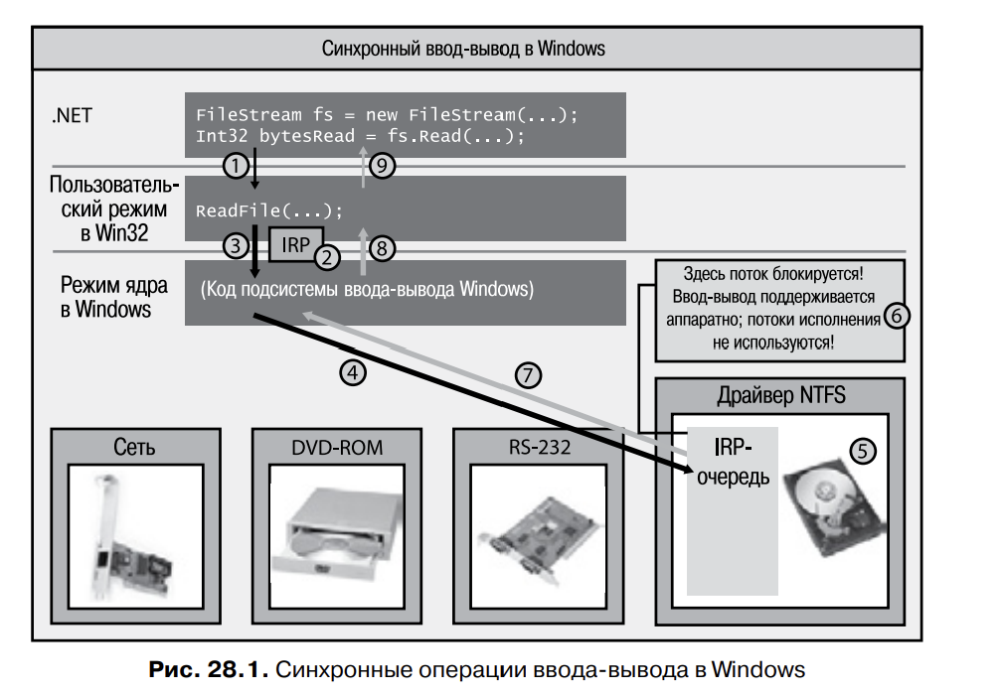
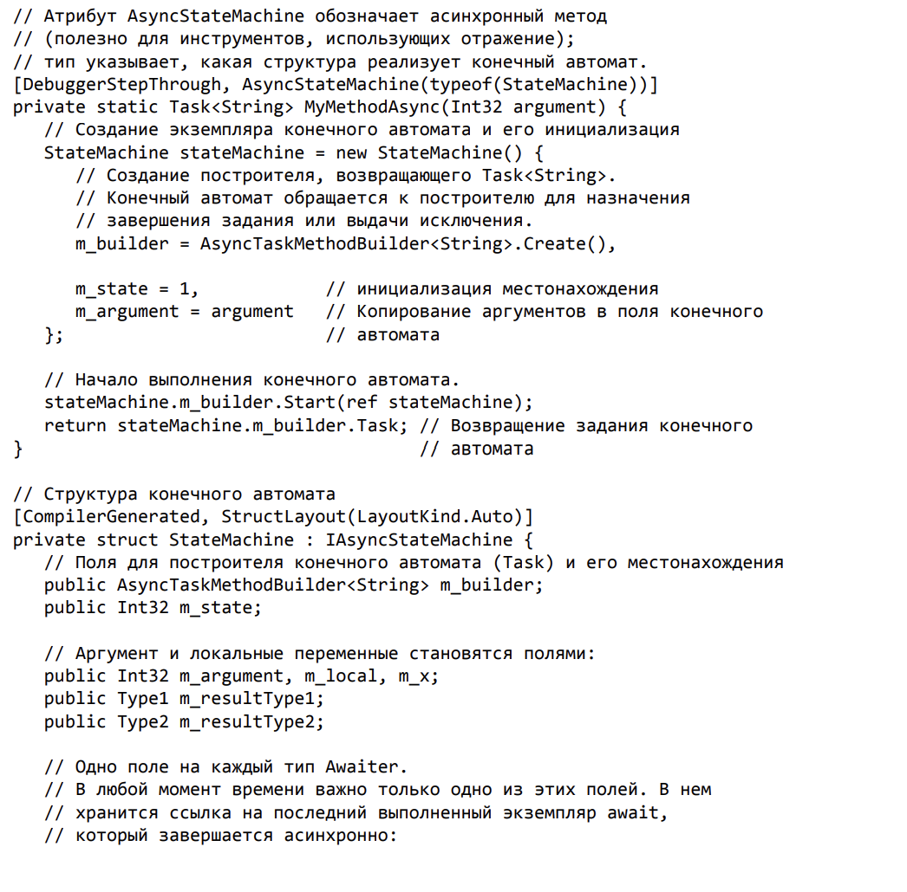
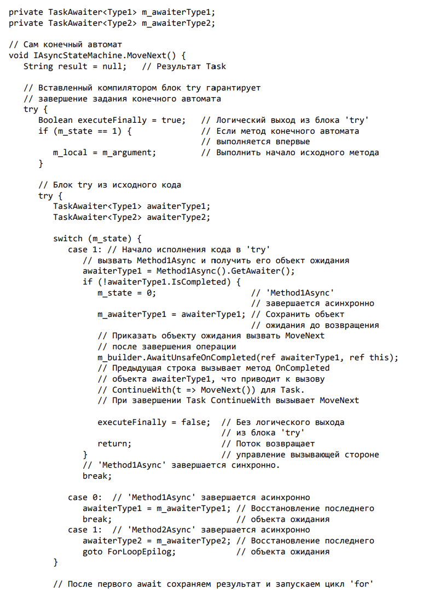
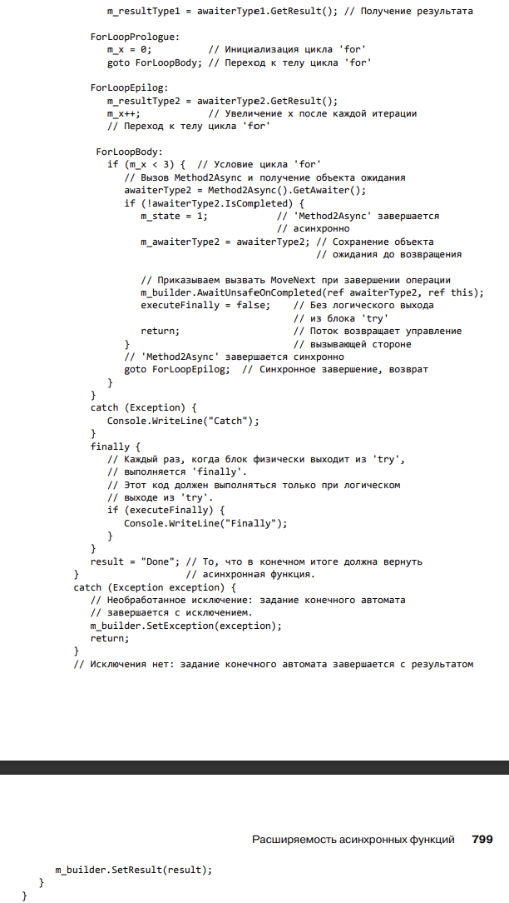
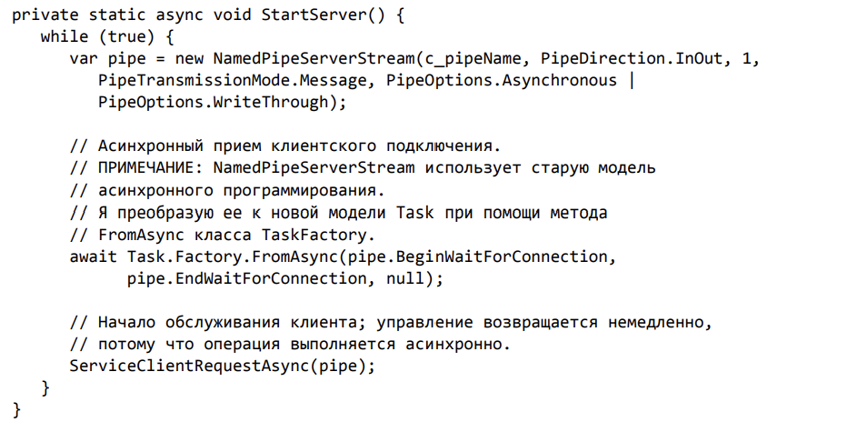

# Глава 28. Асинхронные операции ввода-вывода

В предыдущей главе рассматривались возможности асинхронного выполнения 
вычислительных операций, когда пул потоков распределяет задания среди многочисленных ядер, 
обеспечивая параллельное исполнение потоков, что позволяет повысить производительность за 
счет более эффективного расходования ресурсов системы.

В этой главе речь идет об асинхронном выполнении операций ввода-вывода, когда аппаратное
обеспечение решает свои задачи вообще без участия потоков и процессора. Это, несомненно,
оказывает влияние на эффективность расходования системных ресурсов, так как в этом случае
эти ресурсы вообще не потребляются. Впрочем, пул потоков исполнения все равно играет 
важную роль, тк именно там обрабатываются результаты разнообразных операций ввода-вывода.

## Операции ввода-вывода в Windows



На рисунке показан компьютер с присоединенным к нему перифирийным оборудованием. Каждое 
из устройств снабжено собственной платой со специализированным микропроцессором. К примеру,
плата жесткого диска умеет вращать диск, устанавливать головку на нужную дорожку, читать 
данные с диска и записывать их на него, перемещать данные в память компьютера и обратно.

Создается объект FileStream. Далее методом Read читаются данные из файла. Вызов метода 
Read объекта FileStream сопровождается переходом потока от управляемого кода в машинный 
код/код пользовательского режима, при этом вызывается Win-32 функция ReadFile. Она выделяет
память для небольшой структуры, называемой пакетом запросов ввода-вывода (I/O Request Packet,
IRP). Эта структура инициализируется дескриптором файла, смещением внутри файла, с которого
начнется чтение байтов, адресом массива Byte[], выделенного для считываемых байтов, количеством
байтов, предназначенных для передачи и т.д.

Функция ReadFile обращается к ядру Windows, переводя поток из кода пользовательского 
режима в код в режиме ядра и передавая в ядро IRP-структуру (3). 
По дескриптору устройства ядро узнает, какое устройство предназначено для 
конкретной операции ввода-вывода, после чего пакет запросов ставится в IRP-очередь 
нужного драйвера устройства (4). Каждый драйвер устройства управляет 
собственной очередью запросов ввода-вывода от всех запущенных на машине процессов. 
При появлении IRP-пакетов драйвер устройства передает содержащуюся в 
них информацию соответствующему устройству, которое, собственно, и выполняет 
операцию ввода-вывода (5)

Пока поток ждет ответа от устрройства ввода-вывода, он простаивает, поэтому Windows переводит
его в спяющее состояние, чтобы не расходовать процессорное время впустую. Однако при этом
поток продолжает занимать место в памяти со своим стеком пользовательского режима, стеком
режима ядра, блоком переменных окруженяи потока (Thread Enviroment Block, TEB) и другими
структурами данных, которые в этот момент не используются. 

**Приложения с UI перестают реагировать на действия пользователей на время блокировки потока.**

После завершения устройством операции IO Windows пробуждает поток, ставит его в очередь 
процессора и позволяет ему вернуться из режима ядра сначала в пользовательским режим, а затем
и в управляемый код (7, 8 и 9). Метод Read объекта FileStream при этом возвращает 
значение типа Int32, содержащее количество прочитанных из файла байтов. Это дает вам 
информацию о количестве байтов, оказавшихся в массиве Byte[], ранее переданном методу Read.

### ПРИМЕР

Представим реализую веб-приложения, в которой для каждого пришедшего запроса формируется 
запрос к базе данных. При поступлении запроса поток и пула потоков обращается к вашему коду. 
При выдаче синхронного запроса к базе данных этот поток окажется заблокированным на 
неопределенное время, необходимое для получения ответа из БД. Если в это время придет 
еще один клиентский запрос, пул создаст еще один поток, которые снова окажется заблокированным.
В итоге можно оказаться с целым набором заблокированных потоков, ожидающим ответа из БД. 
Получается, что веб-сервер выделяет массу ресурсов (поток и памяти для них), которые почти
не используются!

Проблема усугбляется тем, что при получении результатов из БД блокировка с потоков будет 
снята одновременно и все они начнут выполняться. В ситуации, кодга поличество потоков больше 
количества ядер, ОС прибегнет к частым перемещением контекста, что значительно снизит 
производительность. Так что это не тот путь, которые позволил бы реализовать масштабируемое
приложение. 

![])(images/async_IO_operations.png)

Теперь рассматрим процедуру выполнения асинхронным IO операций в Windows. На рисунке показаны
жесткий диск, пул потоков среды CLR. Открытие файла по-прежнему выполняется путем создания
FileStream, но теперь ему передается флаг FileOptions.Asynchronous, которые указывает 
Windows, что операции чтения из файла и записи в файл следует выполнять асинхронно.

Чтения данных из файла теперь выполняется BeginRead. ReadAsync создает объект Task<Int32>, 
представляющим незавершенную операцию чтения, а затем вызывает Win32 функцию ReadFile, 
которая выделяет метод под IRP-пакет, инициализирует его, как и в предыдущем сценарии, 
и передает в ядро Windows. Windows добавляет IRP-пакет в IRP-очередь драйвера жесткого диска,
но на этот раз поток не блокируется, а немеделенно возвращает управление после вызовов
метода BeginRead (5, 6 и 7). Конечно, это может произойти до обработки IRP-пакета, поэтому
после ReadAsync не может следовать код, который пытается обратиться к байтам в переданном
методу массиве Byte[].

Может возникнуть вопрос, когда и каким образом обрабатываются считываемые данные? При вызове
ReadAsync возвращается объект Task<Int32>. Используя этот объект, можно вызвать метод 
ContinueWith для регистрации метода обратного вызова, которые должен выполняться при 
завершении задачи, а затем обрабатывать данные в методе обратного вызова. Также можно 
использовать асинхронные функции C#, позволяющие использовать последовательную структуру
кода (как при выполнении синхронного ввода-вывода).

Закончив обработку IRP-пакета (а), устройство помещает делегат в очередь CLR-пула потоков (b).
В дальнейшем какой-то из потоков пула берет готовый IRP-пакет и активизируе метод обратного
вызова (c) (Готовые IRP-пакеты извлекаются из пула по алгоритму "Первым пришел-первым 
обслужен"). В результате вы узнаете о завершении операции, а обращения к данным массива 
Byte[] внутри метода станут безопасными.

### Вернемся к примеру с веб-приложением

Теперь разобравшись с основами, разберемся с примером веб-приложения.

Предположим, в ответ на клиентский запрос сервер выдает асинхронный запрос к базе данных. При 
этом ваш поток не блокируется, а возвращается в пул, получая возможность заняться обработкой
других клиентских запросов. Таким образом, получается, что для обработки всех входящих 
запросов достаточно всего одного поткоа. Полученный от базы данных отчет также окажется в очереди
пула потоков, ото есть наш поток сможет тут же его обработать и отправить данные клиенту.
Таким образом, единственный поток обрабатывает не только клиентские запросы, но и все ответы
базы данных. В итоге сервер практически не потребляет системные ресурсы, но работает с 
максимальной возможной скоростью, так как переключения контекста не происходит. 

Если элементы появляются в пуле быстрее, чем поток может их обработать, пул может создать доп
потоки. Пул быстро создает по одному потоку на каждый процессор. Соответственно, на машине
с четырьмя процессорами четыре клиентских запроса к базе данных и ответа базы данных (в любой
комбинации) будут обрабатываться в четырех потоках без какого-либо переключения контекста.

### ПРИМЕЧАНИЕ

Предполагается, что другие потоки в это время отсутствуют. Большую часть времени 
действительно так, ведь большинство компьютеров не задействует процессор на 100 %. 
Однако даже при полной загрузке процессора все будет работать описанным образом, если 
исполняемые потоки имеют низкие приоритеты. Наличие других потоков приводит к переключениям 
контекста. Это плохо с точки зрения производительности, но хорошо с точки 
зрения надежности. Напоминаю, что Windows выделяет на каждый процесс по крайней 
мере один поток и переключает контекст, гарантируя, что даже блокировка одного потока 
не остановит работу приложения.

### Случай блокировки одного из потоков

Однако при блокировке потока (выполнения синхронной операции ввода-вывода, вызове метода
Thread.Sleep или ожидания, связанном с блокировкой потока в рамках синхронизации потоков)
Windows уведомляет пул о том, что один из его потоков прекратил работу. Пул для восполнения
недостаточной загрузки процессора создает новый поток взамен заблокированного. К сожалению,
такой выход из положения не идеален, потому что создание нового потока обходится довольно 
дорого с точки зрения затрат времени и памяти.

Кроме того, позднее поток может быть разблокирован, и в итоге процессор окажется перегруженным,
что приведет к переключения контекста и снижению производительности. Впрочем, эта 
проблема решается средствам пула. Завершившим свою работу потокам, которые вернулись в пул,
не дают обрабатыавть новые элементы, пока загрузка процессора не достигнет определенного 
уровня. Таким способом уменьшается количество перелчений контекста и повышается производительность.
Если впоследствии пул обнаружит, что потоков больше чем необходимо, он просто позволит 
лишним потокам самоуничтожиться, освододив ресурсы. 

Для реализации описанного поведения CLR-пул потоков использует такой 
ресурс Windows, как порт завершения ввода-вывода (I/O Completion Port). Он 
создается при инициализации CLR. Затем с этим портом можно связать подсоединяемые устройства, 
чтобы в результате их драйверы «знали», куда поставить в 
очередь IRP-пакет. Подробнее этот механизм описан в моей книге «Windows via 
C/C++» (Microsoft Press, 2007).

### Еще плюсы асинхронных IO операций

Асинхронный ввод-вывод кроме минимального использования ресурсов и уменьшения количества 
переключений контекста предоставляет и другие преимущества. 
Скажем, в начале сборки мусора CLR приостанавливает все потоки в процессе. 
Получается, чем меньше у нас потоков, тем быстрее произойдет уборка мусора. 
Кроме того, при уборке мусора CLR просматривает в поисках корней все стеки потоков.
Соответственно, чем меньше у нас потоков, тем меньше стеков приходится 
просматривать и тем быстрее работает уборщик мусора. Плюс ко всему, если в процессе 
обработки потоки не были заблокированы, большую часть времени они будут 
проводить в пуле в режиме ожидания. А значит, в начале уборки мусора потоки 
окажутся наверху стека, и поиск корней не займет много времени.

При достижении отлаживаемым приложением точки останова Windows приостанавливает все 
его потоки. После возвращения к отладке следует возобновить 
все потоки, а значит, при наличии большого количества потоков пошаговая отладка 
будет выполняться крайне медленно. Асинхронный ввод-вывод позволяет обойтись 
всего несколькими потоками, повышая тем самым производительность отладки.

Выгоды этим не исчерпываются. Предположим, ваше приложение должно загрузить с различных
сайтов 10 изображений. Загрузка каждого из них занимает 
5 секунд. В синхронном режиме выполнения (загрузка одного изображения за 
другим) вам потребуется 50 секунд. Однако при помощи всего одного потока можно 
начать 10 асинхронных операций загрузки и получить все изображения всего за 
5 секунд! То есть время выполнения нескольких синхронных операций ввода-вывода 
получается путем суммирования времени, которое занимает каждая отдельная операция, 
в то время как в случае набора асинхронных операций ввода-вывода время 
их завершения определяется самой медленной из выполняемых операций.

Для приложений с графическим интерфейсом асинхронные операции открывают еще одно 
преимущество: их интерфейс всегда реагирует на действия конечного 
пользователя. В приложениях Silverlight и Windows Store вообще все операции 
ввода-вывода выполняются только асинхронно, потому что библиотеки классов 
операций ввода-вывода предоставляют только асинхронные версии своих операций; 
методы выполнения синхронных операций просто отсутствуют. Это было сделано 
намеренно, чтобы приложение не переставало реагировать на действия конечного 
пользователя.

## Асинхронные функции C#

Асинхронные операции - ключ к созданию производительных, масштабируемых приложений, выполняющих
множество операций с небольшим количеством поткоов, эффективно задействовать все процессоры 
в системе. Осознавая это, разработчики CLR разработали модель программирования, призаванную 
сделать его доступным для всех программистов.

Эта модель использует объекты Task и асинхронные функции языка C#. В следующем примере кода
асинхронные функции используются для выполнения двух асинхронных операций:

```
private static async Task<String> IssueClientRequestAsync(String serverName, String message) 
{ 
	using (var pipe = new NamedPipeClientStream(serverName, "PipeName",
		PipeDirection.InOut, PipeOptions.Asynchronous | PipeOptions.WriteThrough))
	{ 
		pipe.Connect(); // Прежде чем задавать ReadMode, необходимо
		pipe.ReadMode = PipeTransmissionMode.Message; // вызвать Connect

		// Асинхронная отправка данных серверу
		Byte[] request = Encoding.UTF8.GetBytes(message);
		await pipe.WriteAsync(request, 0, request.Length);

		// Асинхронное чтение ответа сервера
		Byte[] response = new Byte[1000]; 
		Int32 bytesRead = await pipe.ReadAsync(response, 0, response.Length);
		return Encoding.UTF8.GetString(response, 0, bytesRead);
	} // Закрытие канала
}
```

В приведенном коде сразу видно, что IssueClientRequwstAsync является асинхронной функцией.
Когда метод помечается ключевым словом async компилятор преобразует код метода в тип, 
реализующий конечный автомат. Это позволяет потоку выполнить часть кода в конечном автомате,
а затем вернуть управление без выполнения всего метода до завершения.

Таким образом, при вызове этого метода поток конструирует NamedPipeClientStream, вызывает
Connect, задает значение свойства ReadMore, преобразует заданное сообщение в Byte[] и вызывает
WriteAsync. Внутренняя реализация WriteAsync создает объект Task и возвращает его IssueClientRequestAsync.
На этой стадии оператор C# await вызывает ContinueWith для объекта Task с передачей метода, 
возобновляющего выполнение конечного автомата, после чего поток возвращает управление из 
IssueClientRequestAsync.

В будущем драейвер сетевого устройства завершит запись данных в канал. Поток из пула 
оповестит объект Task, что приведет к активации метода обратного вызова ContinueWith, 
заставляющего поток возобновить выполнение конечного автомата. А если конкретнее, поток 
заново входит в метод IssueClientRequestAsync, но в точке оператора await. Теперь наш
метод выполнит сгенерированный компилятором код, запрашивающий состояния объекта Task. 
В случае ошибки выдается представляющее ее исключение. Если операция завершается успешно, 
оператор await возвращает результата. В нашем случае WriteAsync возвращает Task вместе 
Task<TResult>, так что возвращаемое значение отсутствует.

Далее выполнение нашего метода продолжается созданием объекта Byte[] и последующим вызовом
асинхронного метода ReadAsync для NamedPipeClientStream. Внутренняя реализация ReadAsync
создает объект Task<Int32> и возвращает его. И снова оператор await вызывает ContinueWith
для объекта Task<Int32> с передачей метода, возобновляющего выполнение конечного автомата, 
и снова поток возвращает управление из IssueClientRequestAsync.

В будушем сервер вернет ответ клиентской машине, драйвер сетевого устройства получит этот 
ответ, а потом из пула уведомит объект Task<Int32>, который возобновит выполнение конечного 
автомата. Оператор await заставляет компилятор сгенерировать код, который запрашивает свойство
Result объекта Task (Int32) и присваивает результат локальной переменной bytesRead, или 
выдает исключение в случае ошибки. Затем выполняется оставшаяся часть кода IssueClientRequestAsync,
которая возвращает строку результата и закрывает канал. На этой стадии конечный автомат
отработал до завершения, а уборщик мусора при необходимости освободит память. 

Так как асинхронные функции возвращают управление до того, как их конечный автомат 
отработает до завершения, выполнение метода, вызвавшего IssueClientRequestAsync, 
продолжится сразу же после того, как IssueClientRequestAsync
выполнит свой первый оператор await. Но как вызывающая сторона узнает, что 
выполнение конечного автомата IssueClientRequestAsync завершилось?

Когда вы помечаете метод ключевым словом async, компилято автоматически генерирует код, 
создающий объект Task в начале выполнения конечноного автомата; этот объект Task завершается
автоматически при завершении конечного автомата. Заметьте, что типом возвращаемого значения
IssueClientRequestAsync является Task<string>. Фактически возвращается объект Task<String>,
который создается кодом, сгенерированным компилятором, а свйство Result объекта Task в данном
случае имеет тип String. Ближе к концу IssueClientRequestAsync я возвращаю строку. Это 
заставляет код, сгенерированный компилятором, завершить созданный им объект Task<String>
и задать его свойству Result возвращенную строку.

**Для асинхронных функций действует ряд ограничений:**

1. Метод Main приложения не может быть преобразоан в асинхронную функцию. Кроме того, конструкторы,
методы доступа свойств и методы доступа событий не могут быть преобразованы в асинхронные функции.

2. Асинхронная функция не может иметь праметры out и ref

3. Оператор await не может использоваться в блоке catch, finally или unsafe

4. Не допускается установление блокировки, поддерживающей владения потоком или рекурсию, 
до операции await, и ее снятие после оператора await. Это ограничения объясняется тем, что 
один поток может выполнить код до await, а другой поток может выполнить код после await. 
При использовании await с командой C# lock компилятор выдает сообщение об ошибке. Если вместо
этого явно вызвать методы Enter и Exit класса Monitor, то код откопилируется, но Monitor.Exit
выдаст исключение SynchronizationLockException во время выполнения

5. В выражениях запросов оператор await может использоваться только в первом выражении 
коллекции условия from или в выражении коллекции условия join.

Все эти ограничения не столь существенны. При их нарушении компилятор выдает сообщения, а 
проблемы обычно удается решить при помощи незначительной модификации кода.

## Преобразование асинхронной функции в конечный автомат


Работа с асинхронным функциями станет более эффективной, если вы будете понимать суть 
преобразований кода, которые компилятор выполняет за вас. На мой взгляд, разоабраться в 
происходящем проще всего на коннкретном примере, поэтому мы начнем с определения нескольких 
простых типо и методов.

Расмотрим пример 1. Код MyMethodAsync выглядит довольно запутанно, но он демонстрирует несколько
ключевых моментов. Во первых, самая асинхронная функция возвращает Task<String>, но в теле кода
возвращается String. Во вторых, в ней вызываются другие функции, которые выполняют 
асинхронные операции - одна автономно, другая в цикле for. Наконец, также присутствует код
обработки исключений. При компиляции MyMethodAsync компилятор код метода в структуру конечного
автомата с возможностью приостановки и продолжения выполнения.

Рихтер взял этот код, откомпилировал его, а затем преобразовал IL-код обработно в исходник C#.
Далее он слегка упростил код и добавил подробные комментарии, что мы поняли, что делает 
компилятор для работы асинхронных функций. Ниже приведен основной код, созданный 
в результате преобразования (как сам код метода MethodAsync, так и структуру конечного автомата).






Если вы не пожалеете времени на просмотр кода и чтение комментариев, думаю, 
вы сможете понять, что компилятор делает за вас. Пожалуй, стоит особо упомянуть 
об одном важном моменте. Каждый раз, когда в вашем коде используется оператор 
await, компилятор берет указанный операнд и пытается вызвать для него метод 
GetAwaiter. Этот метод может быть как экземплярным методом, так и методом 
расширения. Объект, возвращаемый при вызове GetAwaiter, называется объектом 
ожидания (awaiter).

После того как конечный автомат получит объект ожидания, он запрашивает 
его свойство IsCompleted. Если операция завершается синхронно, возвращается 
значение true, и в порядке оптимизации конечный автомат просто продолжает выполнение. 
Он вызывает метод GetResult объекта ожидания, который либо выдает 
исключение в случае неудачного выполнения операции, либо возвращает результат, 
если операция прошла успешно. Конечный автомат продолжает выполнение для 
обработки результата.

Если операция завершается асинхронно, IsCompleted возвращает false. В этом 
случае конечный автомат вызывает метод OnCompleted объекта ожидания, передавая ему 
делегата метода MoveNext конечного автомата. И теперь конечный автомат 
позволяет своему потоку вернуть управление в исходную точку, чтобы тот мог продолжить 
выполнение другого кода. В будущем объект ожидания, инкапсулирующий 
Task, узнает о своем заверении и вызывает делегата, что приводит к выполнению 
MoveNext. По полям конечного автомата определяется способ перехода к правильной 
точке кода, что создает иллюзию продолжения выполнения метода с того места, 
с которого он был прерван. На этой стадии код вызывает метод GetResult объекта 
ожидания и продолжает выполнение для обработки результата.
Так работает модель асинхронных функций, единственная цель которой — упрощение работы 
программиста по написанию кода без блокировки исполнения.

## Расширяемость асинхронных функций

Представление всех разновидностей асинхронных операций одним типом Task чрезвычайно полезно,
потому что оно позволяет реализовать комбинаторы (WhenAll и WhenAny класса Task) и другие
полезные операции.

На 800 странице представлен пример класса TaskLogger, который может использоваться для 
вывода информации о незавершенных асинхронных операциях. Такая информация чрезвычайно полезна
в ходе отладки, особенно если ваше приложение виснет из-за некорректного запроса или отсутствия
реакции сервера.

Наряду с гибкостьью, обусловленной использованием Task, асинхронные функции предоставляют еще
одну точку расширения: компилятор вызывает GetAwaiter для операнда, использовавшегося с 
await. Таким образом, операнд вообще не обязан быть объектом Task; он может относиться
к любому типу, содержащему метод GetAwaiter. Пример моего собственного объекта ожидания, 
связывающего конечный автомат async-метода с инициируемым событием.

## Асинхронные функции и обработчики событий

Асихронные функции обычно используют Task или Task<TResult> в качестве возвращаемого значения,
представляющий завершение конечного автомата функции. Однако также возможно определение
асинхронной функции с возвращаемым типом void. Это особый случай, который поддерживается 
компилятором C# для упрощения очень распространненой ситуации: реализации асинхронного 
обработчика события.

Почти все методы обработчиком событий имеют сигнатуру: 

```
void EventHandlerCallback(Object sender, EventArgs e);
```

На практике в обработчиках событий довольно часто выполняются операции ввода-вывода - например,
когда пользователь щелкает на элементе пользовательского интерфейса, чтобы открыть файл и 
прочитать его данные. Чтобы UI реагировал на действия пользователя, ввод-вывод должен 
выполняться асинхронно. ДЛя использования такого кода в методе обработчика события с типом
возвращаемого значения void компилятор C# должен разрешить асинхронным функциям иметь 
возвращаемый тип void, чтобы оператор await мог использоваться для выполнения неблокирующих
операций ввода-вывода. Когда асинхронная функция возвращает void, компилятор генерирует код 
создания конечного автомата, но не создает объект Task, потому что он все равно не будет
использоваться. По этой причине невозможно узнать, что конечный автомат асинхронной 
функции, возвращающей void, отработал до завершения.


### ПРИМЕЧАНИЕ

При попытке пометить ключевым словом async точку входа программы (Main) компилятор C# 
выдает сообщение об ошибке. Если размесить операторы await в методе Main, 
основной поток процесса вернет управление из Main сразу же после выполнения первого 
оператора await. А поскольку код, вызывающей Main, не может получить объект Task для 
отслеживания и ожидания завершения, процесс просто завершится (из-за возвращения 
управления из Main), а остальной код Main не будет выполнен. Компилятор C# считает 
подобную ситуацию ошибкой и принимает меры для ее предотвращения.

## Асинхронные функции в FCL

Асинхронные функции сразу видны в коде, потому что 
по действующим соглашениям имя метода снабжается суффиксом Async. В FCL 
многие типы, предоставляющие операции ввода-вывода, также предоставляют 
методы XxxAsync. Несколько примеров:

1. Все производные от System.IO.Stream классы предоставляют методы ReadAsync, 
WriteAsync, FlushAsync и CopyToAsync.
‰ 
2. Все производные от System.IO.textReader классы предоставляют методы 
ReadAsync, ReadLineAsync, ReadToEndAsync и ReadBlockAsync. Классы, производные 
от System.IO.TextWriter, предоставляют методы WriteAsync, WriteLineAsync и FlushAsync.
‰ 
3. Класс System.Net.Http.HttpClient предоставляет методы GetAsync, GetStreamAsync, 
GetByteArrayAsync, PostAsync, PutAsync, DeleteAsync и др.
‰ 
4. Все производные от System.Net.WebRequest классы (включая FileWebRequest, 
FtpWebRequest и HttpWebRequest) предоставляют методы GetRequestStreamAsync
и GetResponseAsync.
‰ 
5. Класс System.Data.SqlClient.SqlCommand предоставляет методы ExecuteDbDataReaderAsync, 
ExecuteNonQueryAsync, ExecuteReaderAsync, 
ExecuteScalarAsync и ExecuteXmlReaderAsync.
‰ 
6. Инструменты (такие, как SvcUtil.exe), создающие типы представителей для веб-служб, 
также генерируют методы XxxAsync.

Есть еще другие модели асинхронного программирования - как, например, модель, использовавшая
методы BeginXxx и EndXxx в сочетании с интерфейсом IAsyncResult. Также имеется событийная
модель, использовавшая методы XxxAsync (не возвращающая объекта Task) с вызовывами методов
обработчиков событий при завершении асинхронных операций. Но эти две модели теперь считаются
устаревшими.

Просматривая описания классов FCL, можно заметить, что у некоторых классов 
нет методов XxxAsync, а вместо них предоставляются методы BeginXxx и EndXxx. 
В основном это объясняется тем, что у компании Microsoft не было времени для 
обновления этих классов новыми методами. В будущем эти классы будут доработаны, 
и в них появится полноценная поддержка новой модели. А до того времени 
можно воспользоваться вспомогательным методом, адаптирующим старую модель 
BeginXxx/EndXxx для новой модели на базе Task.

Ранее Рихтер приводил код клиентского приложения, которое передает запрос по именованному
каналу. Пора привести серверную часть этого кода.



В классе NamedPipeServerStream определены методы BeginWaitForConnection
и EndWaitForConnection, но еще не определен метод WaitForConnectionAsync. 
Ожидается, что этот метод будет добавлен в будущей версии FCL. Впрочем, как 
видно из предыдущего кода, я вызываю метод FromAsync класса TaskScheduler, 
передаю ему имена методов BeginXxx и EndXxx, а метод FromAsync создает объект 
Task, который является «оберткой» для этих методов. Теперь объект Task можно 
использовать с оператором await.

### ПРИМЕЧАНИЕ

У метода FromAsync класса TaskScheduler имеются перегруженные версии, получающие 
IAsyncResult, а также перегруженные версии, получающие делегатов для методов BeginXxx 
и EndXxx. По возможности постарайтесь избегать версии с IAsyncResult, потому что они 
менее эффективны

Для старой событийной модели программирования в FCL нет вспомогательный методов, 
адаптирующих эту модель к новой модели на базе Task, поэтому вам 
придется программировать их вручную. Следующий код показывает, как упаковать объект 
WebClient (использующий событийную модель программирования) 
с объектом TaskCompletionSource, чтобы для него можно было вызывать await
в асинхронной функции.

```
private static async Task<String> AwaitWebClient(Uri uri) { 
	// Класс System.Net.WebClient поддерживает событийную модель
	// асинхронного программирования
	var wc = new System.Net.WebClient(); 

	// Создание объекта TaskCompletionSource и его внутреннего объекта Task
	var tcs = new TaskCompletionSource<String>(); 

	// При завершении загрузки строки объект WebClient инициирует
	// событие DownloadStringCompleted, завершающее TaskCompletionSource
	wc.DownloadStringCompleted += (s, e) => {
		if (e.Cancelled) tcs.SetCanceled(); 
		else if (e.Error != null) tcs.SetException(e.Error); 
		else tcs.SetResult(e.Result); 
	}; 

	// Начало асинхронной операции
	wc.DownloadStringAsync(uri); 

	// Теперь мы можем взять объект Task из TaskCompletionSource
	// и обработать результат обычным способом.
	String result = await tcs.Task;
	// Обработка строки результата (если нужно)...

	return result; 
}
```

## Асинхронные функции и исключения

Если при обработке драйвером устройства асинхронного запроса что-то пойдет не 
так, Windows нужно проинформировать об этом приложение. К примеру, представим, что при 
передаче байтов по сети произошел тайм-аут. Если данные не пришли 
вовремя, драйвер устройства сообщает вам, что асинхронная операция завершилась 
с ошибкой. Для этого он отправляет готовый IRP-пакет в CLR-пул потоков, а поток пула 
завершает объект Task с исключением. При возобновлении выполнения 
конечного автомата оператор await видит, что попытка выполнения операции была 
неудачной, и выдает исключение.

При использовании await с Task вместо AggregationException выдается первое внутренее исключение
(это делает метод GetResult класса TaskAwaiter). Это было сделано для того, чтобы поведение
когда соотвтетсовало ожиданиям разработчика. Кроме того, без этого вам пришлось бы перехватывать
AggregateException в вашем коде, проверять внутреннее исключение и либо перехватывать его, 
либо выдавать заново. От этого код становится слишком громоздким. 

Если ваш метод конечного автомата сталкивается с необработанным исключением, то объект Task, 
представляющий асинхронную функцию, завершается из-за 
необработанного исключения. Любой код, ожидающий завершения этого объекта 
Task, «увидит» это исключение. Однако асинхронная функция также может иметь 
возвращаемый тип void; в этом случае вызывающая сторона не может обнаружить 
необработанное исключение. Таким образом, при выдаче необработанного исключения 
асинхронной функцией, возвращающей void, сгенерированный компилятором код 
перехватит его и выдаст заново с использованием контекста синхронизации стороны 
вызова (см. далее). Если сторона вызова исполняется в потоке графического интерфейса, то 
исключение будет перезапущено потоком графического интерфейса. Обычно 
повторное инициирование исключений приводит к завершению всего процесса.

## Другие возможности асинхронных функций

Когда отладчик VisualStudio остановлен на операторе await, 
пошаговое выполнение (F10) осуществляет переход в отладчик при достижении 
следующей команды после завершения операции. При этом код может выполняться 
даже в другом потоке, а не в том, который инициировал операцию! Такое поведение 
очень удобно и существенно упрощает отладку

Кроме того, при пошаговом выполнении с заходом (F11) в асинхронную функцию 
можно выйти из функции, вернувшись на сторону вызова (Shift+F11); впрочем, это 
должно быть сделано на открывающей фигурной скобке асинхронной функции. 
После ее прохождения комбинация Shift+F11 не будет работать, пока асинхронная 
функция не отработает до завершения. Если вам потребуется отладить вызывающий 
метод до того, как конечный автомат отработает до завершения, установите точку 
прерывания в вызывающем методе и включите код на выполнение (F5).

Некоторые асинхронные операции выполняются очень быстро, а, следовательно, 
завершаются почти мгновенно. В таких ситуациях неэффективно приостанавливать 
конечный автомат, чтобы другой поток немедленно возобновил его выполнение; гораздо 
эффективнее просто разрешить конечному автомату продолжить выполнение. 
К счастью, код, сгенерированный компилятором для оператора await, проверяет 
подобные ситуации. Если асинхронная операция завершается непосредственно 
перед возвратом управления из потока, поток не возвращает управление, а просто 
выполняет следующую строку кода.

Все это, конечно, хорошо, но время от времени попадаются асинхронные функции, которые 
выполняют значительные вычисления перед запуском асинхронной 
операции. Если вызвать такую функцию из потока графического интерфейса вашего 
приложения, интерфейс перестанет реагировать на действия пользователя. А если 
асинхронная операция завершается синхронно, то пользовательский интерфейс 
будет недоступен в течение еще большего времени. Таким образом, если вы хотите 
инициировать асинхронную функцию из другого потока, используйте статический 
метод Run класса Task:

```
// Task.Run вызывается в потоке графического интерфейса
Task.Run(async () => { 
	// Этот код выполняется в потоке из пула
	// TODO: Подготовительные вычисления...
	await XxxAsync(); // Инициирование асинхронной операции
	// Продолжение обработки...
});
```

В этом примере показана еще одна полезная возможность C#: асинхронные лямбда-выражения. Дело
в том, что оператор await нельзя просто поместить в тело обычного лямбда-выражения, 
потому что компилятор не сможет преобразовать метод в конечный автомат. Размещение async
перед лямбда-выражением заставит компилятор преобразовать лямбда-выражение в метод конечного
автомата, возвращающий значение Task или Task<TResult>, которое может быть присвоено 
любой делегатной переменной Func с типом возвращаемого значения Task или Task<TResult>.

При написании кода очень легко вызвать функцию async, забыв от использовании оператора await:

```
static async Task OuterAsyncFunction() 
{ 
	InnerAsyncFunction(); // В этой строке пропущен оператор await!
	// Код продолжает выполняться, как и InnerAsyncFunction...
}
```

К счастью, в таких ситуациях компилятор C# выдает предупреждение и предлагает 
применить оператор await к результату вызова. Это хорошо, но в отдельных 
случаях вас действительно не интересует, когда завершится InnerAsyncFunction, 
и вы бы предпочли использовать этот код без предупреждений компилятора. Чтобы 
избавиться от предупреждения, просто присвойте переменной объект Task, возвращенный 
InnerAsyncFunction. В дальнейшем переменную можно игнорировать (компилято не выдает
предупреждения о том, что локальная переменная не используется в программе).

```
static async Task OuterAsyncFunction() { 
	var noWarning = InnerAsyncFunction(); // Строка без await
	// Этот код продолжает выполняться, как и код InnerAsyncFunction...
}
```

Сам же Рихтер предпочитает определять метод расширения, который выглядит так:

```
[MethodImpl(MethodImplOptions.AggressiveInlining)] // Заставляет компилятор
												   // убрать вызов при оптимизации
public static void NoWarning(this Task task) { /* Не содержит кода */ }

static async Task OuterAsyncFunction() { 
	InnerAsyncFunction().NoWarning(); // Строка без await
									  // Код продолжает выполняться, как и InnerAsyncFunction...
}
```

У асинхронных операций ввода-вывода есть одна действительно замечательная особенность: вы 
можете инициировать сразу несколько операций, чтобы они выполнялись параллельно. Это может 
обеспечить феномальный прирост производительности приложения. Я еще нигде не приводил код,
который запускает сервер именованного канала, а затем обращается к нему с клиентскими запросами.
Вот как он выглядит:

```
public static async Task Go() {
	// Запуск сервера немедленно возвращает управление, потому что
	// сервер ожидает клиентские запросы в асинхронном режиме
	StartServer(); // Возвращает void, компилятор выдает предупреждение

	// Создание набора асинхронных клиентских запросов;
	// сохраняем Task<String> каждого клиента.
	List<Task<String>> requests = new List<Task<String>>(10000); 
	for (Int32 n = 0; n < requests.Capacity; n++) 
		requests.Add(IssueClientRequestAsync("localhost", "Request #" + n));
	
	// Асинхронное ожидание завершения всех клиентских запросов
	// ВНИМАНИЕ: если 1+ заданий выдадут исключение,
	// WhenAll заново инициирует последнее исключение
	String[] responses = await Task.WhenAll(requests); 
	
	// Обработка всех запросов
	for (Int32 n = 0; n < responses.Length; n++) 
		Console.WriteLine(responses[n]); 
}
```

Код запускает сервер именнованого канала, чтоб он начинал прослушивание клиентских запросов, а 
затем в цикле for инициррует 100000 запросов с максимальной возможной скоростью. При каждом
вызове IssueClientRequestAsync возвращается объект Task<String>, который добавляется в 
коллекцию. Теперь сервер именнованного канала с максимальной возможной скоростью, обрабатывает
эти запросы, используя потоки из пула, которые пытаются обеспечить максимальную загрузку всех
процессоров на машине (у Рихтер во время тестирования этого кода процессор дошел до 100%
нагрузки. После окончания теста процессор вернулся в нормальнео состояние). По мере того, 
как сервер обрабатывает каждый запрос, объект Task<string> каждого запроса завершается со 
строковым ответом, возвращенным сервером.

Чтоб дождаться получения всех ответом на все клиентские запросы, прежде чем переходить 
к обработке результов, был вызван статический метод WhenAll класса Task. Во внутренней 
реализации представлений этот метод создает объект Task<String[]>, который завершается 
после завершения всех объектов Task из коллекции. Затем оператор await вызывается для 
объекта Task<String[]>, чтобы конечный автомат продолжил работа после выполнения всех задач. 
Я последовательно перебираю ответы и обрабатываю их.

Возможно вы хотели обработать каждый запрос по мере поступления - вместо того, чтоб дожидаться
всех из завершения. Эта задача решается почти точно также просто при помощи статическиого 
метод WhenAny класса Task. Обновленная версия когда выглядит так:

```
public static async Task Go() { 
	// Запуск сервера немедленно возвращает управление, потому что
	// сервер ожидает клиентские запросы в асинхронном режиме
	StartServer(); 

	// Создание набора асинхронных клиентских запросов;
	// сохраняем Task<String> каждого клиента.
	List<Task<String>> requests = new List<Task<String>>(10000); 
	for (Int32 n = 0; n < requests.Capacity; n++) 
		requests.Add(IssueClientRequestAsync("localhost", "Request #" + n));

	// Продолжение с завершением КАЖДОЙ задачи
	while (requests.Count > 0) { 
		// Последовательная обработка каждого завершенного ответа
		Task<String> response = await Task.WhenAny(requests); 
		requests.Remove(response); // Удаление завершенной задачи из коллекции
	
		// Обработка одного ответа
		Console.WriteLine(response.Result); 
	} 
}
```

Здесь создаются цикл while, перебирающий клиентские запросы. В цикле оператор await вызываеся
для метода WhenAny класса Task, который возвращает один объект Task<String> для клиентского
запроса, обработанные сервером. После получения объекта Task<String> я исключаю его из коллекции,
а затем запрашиваю результат обработки.

## Потоковые модели приложений

В .NET Framework поддерживаются разнообразные модели приложений, каждая 
из которых может предложить собственную потоковую модель. Консольные приложения и 
Windows-службы (которые фактически тоже являются консольными 
приложениями, просто вы не видите консоль) не навязывают никакой потоковой 
модели; то есть поток может делать все, что он хочет и когда хочет.

Однако приложения с графическим пользовательским интерфейсом (GUI), 
в том числе приложения Windows Forms, Windows Presentation Foundation (WPF), 
Silverlight и Windows Store, предлагают такую модель, в которой обновлять окно 
можно только создавшему его потоку. GUI-потоки обычно порождают асинхронные 
операции, чтобы предотвратить блокировку и не допустить отсутствия реакции 
интерфейса на средства пользовательского ввода — мышь, клавиатуру, перо, сенсорный экран. 
Однако при завершении асинхронной операции поток пула завершает 
объект Task, возобновляя работу конечного автомата.

Для некоторых приложений такое поведение нормально и даже желательно, 
потому что оно эффективно. Но для других моделей приложений (например, 
приложений с графическим интерфейсом) оно создает проблемы, потому что код 
выдает исключение при попытке обновления элементов пользовательского интерфейса 
через поток из пула. Иногда последний должен каким-то образом заставить 
графический поток обновлять элементы пользовательского интерфейса.

Приложения ASP.NET  позволяют любому потоку делать все, что угодно. Начав 
обрабатывать клиентский запрос, поток пула может выбрать пользовательские 
региональные стандарты (System.Globalization.CultureInfo), позволив серверу 
осуществить принятые в рассматриваемом регионе форматы чисел, дат и времени.
Также веб-сервер может определить идентификационные данные клиента (System.
Security.Principal.IPrincipal), предоставив ему доступ только к тем ресурсам, 
на которые у него есть права. Порожденная одним потоком пула асинхронная операция 
заканчивается другим потоком, который обрабатывает ее результат. Хотя эта 
работа и выполняется по поручению клиентского запроса, региональные стандарты 
и идентификационные данные клиента должны «переходить» к новому потоку пула, 
чтобы вся работа, выполняемая по поручению клиента, использовала региональные 
стандарты и идентификационную информацию клиента.

К счастью, в FCL определен базовый класс **System.Threading.SynchronizationContext**, 
позволяющий решить все описанные проблемы. Объект, производный от 
этого класса, связывает прикладную модель с потоковой. В FCL имеется группа 
классов, производных от класса SynchronizationContext, но обычно напрямую 
они не используются; более того, многие из них даже не документированы.

В основном разработчикам приложений не нужно ничего знать о классе SynchronizationContext. 
При вызове await для Task используется объект SynchronizationContext вызывающего потока. 
Когда пул потока завершает объект 
Task, используется объект SynchronizationContext, обеспечивающий соответствие 
потоковой и прикладной модели. Таким образом, когда GUI-поток выполняет 
await для Task, код, следующий за оператором await, заведомо будет исполнен 
в GUI-потоке, что позволяет этому коду обновить элементы пользовательского 
интерфейса. Для приложений ASP.NET код, следующий за оператором await, заведомо выполняется 
в пуле потока, с которым связаны региональные стандарты 
и идентификационные данные клиента.

В большинстве случаев возобновление работы конечного автомата с использованием 
потоковой модели приложения чрезвычайно полезно и удобно. Впрочем, 
в отдельных случаях оно способно создать проблемы. Следующий пример вызывает 
взаимную блокировку приложения WPF:

```
private sealed class MyWpfWindow : Window 
{ 
	public MyWpfWindow() { Title = "WPF Window"; } 

	protected override void OnActivated(EventArgs e) 
	{ 
		// Запрос свойства Result не позволяет GUI-потоку вернуть управление;
		// поток блокируется в ожидании результата
		String http = GetHttp().Result; // Синхронное получение строки
		base.OnActivated(e); 
	} 

	private async Task<String> GetHttp() 
	{ 
		// Выдача запроса HTTP и возврат из GetHttp
		HttpResponseMessage msg = await new HttpClient().GetAsync("http://Wintellect.com/"); 

		// В эту точку мы никогда не попадем: GUI-поток ожидает завершения
		// этого метода, а метод не может завершиться, потому что GUI-поток
		// ожидает его завершения ­­> ВЗАИМНАЯ БЛОКИРОВКА!
		return await msg.Content.ReadAsStringAsync(); 
	} 
}
```

Разработчики, создающие библиотеки классов, определенно должны знать о классе 
SynchronizationContext. Это позволит им создавать высокопроизводительный 
код, работающий со всеми моделями приложений. Так как большая часть библиотечного 
кода не зависит от модели приложения, нам хотелось бы избежать дополнительных затрат, 
связанных с использованием объекта SynchronizationContext. 
Кроме того, разработчики библиотек классов должны сделать все возможное, чтобы 
помочь разработчикам приложений избежать ситуаций взаимной блокировки. 
Для решения обеих проблем классы Task и Task<TResult> предоставляют метод 
ConfigureAwait с сигнатурой следующего вида:

```
// Task определяет метод:
public ConfiguredTaskAwaitable 
	ConfigureAwait(Boolean continueOnCapturedContext); 

// Task<TResult> определяет метод:
public ConfiguredTaskAwaitable<TResult> 
	ConfigureAwait(Boolean continueOnCapturedContext); 
```


При передаче true метод ведет себя так, как если бы он вообще не вызвался. Но если передать 
значение false, то оператор await не запрашивает объект 
SynchronizationContext вызывающего потока, а когда поток пула завершает задание Task, то 
происходит простое завершение с выполнением кода после оператора 
await через поток пула.

Хотя мой метод GetHttp не входит в библиотеку классов, проблема взаимной 
блокировки исчезает при добавлении вызовов ConfigureAwait. Измененная версия 
метода GetHttp выглядит так:

```
private async Task<String> GetHttp() { 
	// Выдача запроса HTTP и возврат из GetHttp
	HttpResponseMessage msg = await new HttpClient().GetAsync("http://Wintellect.com/") 
		.ConfigureAwait(false); 

	// На этот раз управление попадет в эту точку, потому что поток пула
	// может выполнить этот код (в отличие от выполнения через GUI-поток).
	return await msg.Content.ReadAsStringAsync().ConfigureAwait(false); 
}
```

Как показывает предыдущий код, вызов ConfigureAwait(false) должен быть 
применен к каждому объекту Task, используемому с await. Это связано с тем, что 
асинхронные операции могут завершаться синхронно, и когда это происходит, вызывающий 
поток просто продолжает выполняться без возвращения управления 
стороне вызова; вы никогда не знаете, какой операции потребуется игнорировать 
объект SynchronizationContext, поэтому необходимо приказать всем операциям 
игнорировать его. Это также означает, что код библиотеки классов должен быть 
независимым от модели приложения.

Также можно переписать метод GetHttp так, как показано ниже, чтобы все выполнение 
происходило через поток пула:

```
private Task<String> GetHttp() { 
	return Task.Run(async () => 
	{ 
		// Выполнение в потоке пула, с которым не связан
		// объект SynchronizationContext
		HttpResponseMessage msg = await new HttpClient().GetAsync("http://Wintellect.com/"); 
		return await msg.Content.ReadAsStringAsync(); 
	}); 
}
```

Обратите внимание: в этой версии кода метод GetHttp не является асинхронной 
функцией; я удалил ключевое слово async из сигнатуры метода, потому что метод 
более не содержит оператор await. С другой стороны, лямбда-выражение, передаваемое 
Task.Run, является асинхронной функцией.

## Асинхронная реализация сервера

Многолетнее общение с множеством разработчиков показало, что лишь очень 
немногие из них знают о встроенных средствах .NET Framework, позволяющих 
строить асинхронные серверы с хорошей масштабируемостью. В этой книге я не 
смогу объяснить, как эта задача решается для каждого вида серверов, но могу хотя 
бы указать, что следует искать в документации MSDN:

1. **Построение асинхронных приложений Web Forms ASP.NET**

добавьте в файле .aspx строку «Async=true» в директиве page и ознакомьтесь с описанием метода 
RegisterAsyncTask класса System.Web.UI.Page.

2. **Построение асинхронных MVC-контроллеров ASP.NET**

объявите класс контроллера производным от System.Web.Mvc.AsyncController и верните 
Task<ActionResult> из метода действия

3. **Построение асинхронного обработчика ASP.NET**

объявите класс производным от System.Web.HttpTaskAsyncHandler и переопределите его абстрактный 
метод ProcessRequestAsync

4. **‰Построение асинхронной службы WCF**

реализуйте службу как асинхронную функцию, возвращающую Task или Task<TResult>

## Отмена операций ввода-вывода

В общем случае Windows не предоставляет возможности отмены затянувшейся операции 
ввода-вывода. Многие разработчики хотели бы видеть такую возможность, но 
реализовать ее достаточно сложно. Ведь если вы обращаетесь с запросом к серверу, 
а потом решаете, что ответ вам больше не нужен, просто приказать серверу проигнорировать 
исходный запрос уже не удастся; нужно принять байты на клиентской 
машине и отбросить их. Кроме того, возникает ситуация гонки — запрос на отмену 
может поступить в то время, когда сервер передает ответ. И как должно поступить 
ваше приложение? Вам придется обработать эту потенциальную ситуацию в своем 
коде и решить, то ли проигнорировать данные, то ли обработать их.

Для упрощения этой задачи я рекомендую реализовать метод расширения 
WithCancellation, который расширяет Task<TResult> (вам также понадобится 
аналогичная перегрузка, расширяющая Task) следующим образом:

```
private struct Void { } // Из-за отсутствия необобщенного класса
					    // TaskCompletionSource.
 
private static async Task<TResult> WithCancellation<TResult>(this Task<TResult> originalTask,
	CancellationToken ct) 
{ 
	// Создание объекта Task, завершаемого при отмене CancellationToken
	var cancelTask = new TaskCompletionSource<Void>(); 

	// При отмене CancellationToken завершить Task
	using (ct.Register(t => ((TaskCompletionSource<Void>)t).TrySetResult(new Void()),
		cancelTask)) 
	{ 
		// Создание объекта Task, завершаемого при отмене исходного
		// объекта Task или объекта Task от CancellationToken
		Task any = await Task.WhenAny(originalTask, cancelTask.Task);
		// Если какой-либо объект Task завершается из-за CancellationToken,
		// инициировать OperationCanceledException
		if (any == cancelTask.Task) ct.ThrowIfCancellationRequested(); 
	} 

	// Выполнить await для исходного задания (синхронно); awaiting it 
	// если произойдет ошибка, выдать первое внутреннее исключение
	// вместо AggregateException
	return await originalTask; 
}
```

Теперь этот метод расширения вызывается следующим образом:

```
public static async Task Go() 
{ 
	// Создание объекта CancellationTokenSource, отменяющего себя
	// через заданный промежуток времени в миллисекундах
	var cts = new CancellationTokenSource(5000); // Чтобы отменить ранее,
	var ct = cts.Token;							 // вызовите cts.Cancel()
	
	try 
	{ 
		// Я использую Task.Delay для тестирования; замените другим методом,
		// возвращающим Task
		await Task.Delay(10000).WithCancellation(ct); 
		Console.WriteLine("Task completed"); 
	} 
	catch (OperationCanceledException) 
	{ 
		Console.WriteLine("Task cancelled"); 
	} 
}
```

### Некоторые операции ввода-вывода должны выполняться синхронно

К сожалению, не все операции ввода-вывода в Win32 API допускают асинхронное выполнение. 
К примеру, CreateFile (вызываемый конструктором FileStream) всегда выполняется синхронно. 
При попытке создать или открыть файл на сервере в сети до возвращения управления методом 
CreateFile может пройти несколько секунд — в это 
время вызывающий поток ничего не делает. 
Windows также не предоставляет функций дляасинхронного обращения к реестру, обращения к
журналу событий, получения списка файлов/подкаталогов, изменения атрибутов файла/каталога и т. д.\

Рассмотрим случай, когда такое поведение становится проблемой. Представим, что нам нужно 
разработать простой элемент интерфейса для ввода пути к файлу и поддержкой автоматического 
завершения (примерно как в часто используемом диалоговом окне открытия файла). Этот элемент 
управления должен задействовать отдельные потоки для перебора папок, в которых осуществляется
поиск файлов, так как в Windows не существует функции асинхронного перебора файлов. По мере
того, как пользователь продолжает вводить путь к файлу, вам придется подключать доп потоки,
игнорируя результаты ранее порожденных потоков. В Windows Vista появилась новая Win32 функция
CancelSynchronoudIO. Она позволяет одному потоку отменять синхронную операцию ввода-вывода,
проводимую другим. Эта функция не отражена в FCL, но если вы решите использовать ею из 
управляемого кода, вызовите ее при помощи механизма P/Invoke.

Многие полагают, что с синхронным прикладным программным интерфейсом 
работать проще, и во многих случаях это действительно так. Но иногда именно 
синхронные интерфейсы сильно осложняют жизнь

Из-за проблем, возникающих при синхронном выполнении операций ввода-вывода, 
при проектировании Windows Runtime группа Windows решила предоставить 
все методы ввода/вывода в асинхронной форме. Таким образом, сейчас существует 
функция Windows Runtime API для асинхронного открытия файлов (см. описание 
метода OpenAsync класса Windows.Storage.StorageFile). Windows Runtime не 
представляет функций API для синхронного выполнения операций ввода/вывода. К счастью, 
при вызове этих функций можно воспользоваться асинхронными 
функциями C# для упрощения кода.

### Проблемы FileStream

При создании объекта FileStream флаг FileOptions.Asynchronous позволяет указать, 
какие операции — синхронные или асинхронные — будут использоваться для 
взаимодействия (что эквивалентно вызову Win32-функции CreateFile и передаче 
ей флага FILE_FLAG_OVERLAPPED). При отсутствии этого флага Windows выполняет 
все операции с файлом в синхронном режиме. Разумеется, ничто не мешает вызвать 
метод ReadAsync объекта FileStream. С точки зрения приложения это выглядит как 
асинхронное выполнение операций, но на самом деле класс FileStream эмулирует 
асинхронное поведение при помощи дополнительного потока, который впустую 
тратит ресурсы и снижает производительность.

В то же время можно создать объект FileStream, указав флаг FileOptions.Asynchronous. 
После этого вы можете вызвать метод Read объекта FileStream для 
выполнения синхронной операции. Класс FileStream эмулирует такое поведение, 
запуская асинхронную операцию и немедленно переводя вызывающий поток в спящий режим 
до завершения операции. Это тоже не самый эффективный способ, но он 
лучше, чем вызов метода BeginRead с применением объекта FileStream, созданного 
без флага FileOptions.Asynchronous.

### Подведем итоги. 

При работе с объектом FileStream следует заранее выбрать, 
синхронным или асинхронным будет ввод-вывод файлов, и установить флаг 
FileOptions.Asynchronous (или не делать этого). Если флаг установлен, всегда 
вызывайте метод ReadAsync, а если нет — метод Read. Это обеспечит наилучшую 
производительность. Если вы собираетесь выполнить синхронную или асинхронную 
операцию с объектом FileStream, эффективней всего конструировать данный объект с 
флагом FileOptions.Asynchronous. В качестве альтернативы можно создать 
два объекта FileStream для одного файла. Один объект FileStream будет открыт 
для асинхронного ввода-вывода, второй — для синхронного. Учтите, что класс 
System.IO.File содержит вспомогательные методы (Create, Open и OpenWrite), 
которые создают и возвращают объекты FileStream. Во внутренней реализации 
ни один из этих методов не использует флаг FileOptions.Asynchronous, поэтому 
для построения масштабируемых приложений с хорошим временем отклика от 
этих методов лучше держаться подальше.

Следует также помнить, что драйвер устройства файловой системы NTFS выполняет 
некоторые операции в синхронном режиме вне зависимости от способа 
открытия файла. 

## Приоритеты запросов ввода-вывода

В главе 26 было показано, каким образом приоритет потока влияет на способ его 
исполнения. Однако сами потоки также выполняют запросы ввода-вывода к различным аппаратным 
устройствам для чтения и записи данных. Если время процессора окажется выделено под запросы 
с низким приоритетом, в очереди очень 
быстро окажутся сотни и даже тысячи запросов. Так как для их обработки требуется 
время, скорее всего, поток с низким приоритетом повлияет на быстродействие 
системы, приостановив более приоритетные потоки. Именно поэтому можно 
наблюдать снижение быстродействия компьютера при выполнении длительных 
низкоприоритетных заданий, таких как дефрагментация диска, сканирование на 
вирусы, индексирование содержимого и т. п.

Windows позволяет указать приоритет потока при выполнении запросов ввода-вывода. 
К сожалению, данная функциональность 
еще не включена в FCL; надеюсь, она появится в следующей версии. Однако преимуществом 
данной функции уже можно воспользоваться при помощи механизма 
P/Invoking. Вот как выглядит такой код:

```
internal static class ThreadIO {
	public static BackgroundProcessingDisposer BeginBackgroundProcessing(
		Boolean process = false) 
	{
		ChangeBackgroundProcessing(process, true);
		return new BackgroundProcessingDisposer(process);
	}

	public static void EndBackgroundProcessing(Boolean process = false) 
	{
		ChangeBackgroundProcessing(process, false);
	}

	private static void ChangeBackgroundProcessing(
		Boolean process, Boolean start) 
	{
		Boolean ok = 
			process ? SetPriorityClass(GetCurrentWin32ProcessHandle(),
			start ? ProcessBackgroundMode.Start : ProcessBackgroundMode.End)
			: SetThreadPriority(GetCurrentWin32ThreadHandle(),
			start ? ThreadBackgroundgMode.Start : ThreadBackgroundgMode.End);
		if (!ok) throw new Win32Exception();
	}

	// Эта структура позволяет инструкции using выйти
	// из режима фоновой обработки

	public struct BackgroundProcessingDisposer : IDisposable 
	{
		private readonly Boolean m_process;

		public BackgroundProcessingDisposer(
			Boolean process) { m_process = process; }
		
		public void Dispose() { EndBackgroundProcessing(m_process); }
	}

	// См. Win32-функции THREAD_MODE_BACKGROUND_BEGIN
	// и THREAD_MODE_BACKGROUND_END
	private enum ThreadBackgroundgMode { Start = 0x10000, End = 0x20000 }

	// См. Win32-функции PROCESS_MODE_BACKGROUND_BEGIN
	// и PROCESS_MODE_BACKGROUND_END
	private enum ProcessBackgroundMode { Start = 0x100000, End = 0x200000 }

	[DllImport("Kernel32", EntryPoint = "GetCurrentProcess",
	ExactSpelling = true)]
	private static extern SafeWaitHandle GetCurrentWin32ProcessHandle();

	[DllImport("Kernel32", ExactSpelling = true, SetLastError = true)]
	[return: MarshalAs(UnmanagedType.Bool)]
	private static extern Boolean SetPriorityClass(
	SafeWaitHandle hprocess, ProcessBackgroundMode mode);

	[DllImport("Kernel32", EntryPoint = "GetCurrentThread", ExactSpelling = true)]
	private static extern SafeWaitHandle GetCurrentWin32ThreadHandle();

	[DllImport("Kernel32", ExactSpelling = true, SetLastError = true)]
	[return: MarshalAs(UnmanagedType.Bool)]
	private static extern Boolean SetThreadPriority(
	SafeWaitHandle hthread, ThreadBackgroundgMode mode);

	// http://msdn.microsoft.com/en-us/library/aa480216.aspx
	[DllImport(
	"Kernel32", SetLastError = true, EntryPoint = "CancelSynchronousIo")]
	[return: MarshalAs(UnmanagedType.Bool)]
	private static extern Boolean CancelSynchronousIO(SafeWaitHandle hThread);
}
```

Следующий код показывает, как все это использовать:

```
public static void Main () {
	using (ThreadIO.BeginBackgroundProcessing()) {
	// Здесь располагается низкоприоритетный запрос ввода-вывода
	// (например, вызов BeginRead/BeginWrite)
	}
}
```

Вы объясняете Windows, что поток должен выполнять низкоприоритетные запросы ввода-вывода 
при помощи метода BeginBackgroundProcessing класса ThreadIO. 
Обратите внимание, что при этом также снижается приоритет выполнения потока 
процессором. Вернуть поток к выполнению запросов ввода-вывода обычной важности 
(и к обычному приоритету выполнения потока процессором) можно методом 
EndBackgroundProcessing или же вызвав метод Dispose для значения, возвращенного 
методом BeginBackgroundProcessing (при помощи инструкции using языка 
C#, как показано в примере). Поток может влиять только на собственный режим 
фоновой обработки; Windows не позволяет одному потоку менять режим фоновой 
обработки другого потока.

Чтобы заставить все потоки в процессе обрабатывать низкоприоритетные 
запросы ввода-вывода и снизить приоритет выполнения потоков процессором, 
можно вызвать метод BeginBackgroundProcessing, передав ему значение true
для параметра process. Процесс может воздействовать только на собственный 
фоновый режим обработки; Windows не позволяет потоку менять фоновый режим 
обработки другого процесса.

### ВНИМАНИЕ

В сферу ответственности разработчика входит применение новых фоновых приоритетов, 
обеспечивающих более высокое быстродействие активных приложений,
и принятие мер для устранения инверсии приоритетов. При наличии активных операций 
ввода-вывода с обычным приоритетом поток, работающий в фоновом режиме,
может получать результаты запросов ввода-вывода с задержкой в несколько секунд. 
Если поток с низким приоритетом в рамках синхронизации потоков получит право
на блокировку, ожидаемое потоком с обычным приоритетом, последний может
оказаться в ожидании окончания обработки низкоприоритетных запросов вводавывода. 
Для возникновения проблемы потоку с фоновым приоритетом не придется
даже отправлять запросы на ввод-вывод. Поэтому следует свести к минимуму совместное 
использование объектов синхронизации потоками с обычным и фоновым
приоритетами (а лучше вообще этого избегать). Это избавит вас от инверсии приоритетов, 
при которой потоки с обычным приоритетом перестают выполняться из-за
блокировок, установленных потоками с фоновым приоритетом.