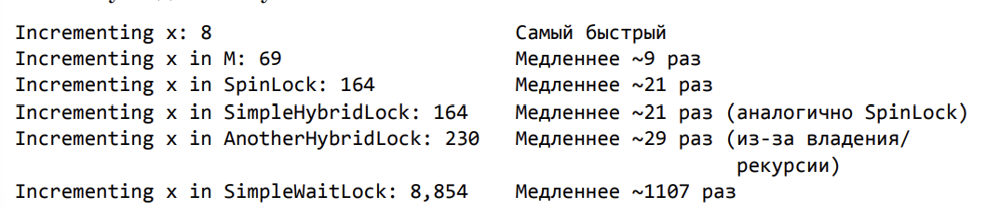

# Глава 30. Гибридные конструкции синхронизации потоков

Комбинация конструкций пользовательского и режима ядра называется гибридными конструкциями
синхронизации потоков.

При отсутствии конкуренации гибридные конструкции дают более высокую производительность, чем 
простейшие конструкции пользовательского режима. 

В них применяются простейшие конструкции режима ядра, что позволяет избежать зацикливания.

## Простая гибридная блокировка

Класс SimpleHybridLock (**Пример 1**). 

Поле AutoResetEvent создается при конструировании объекта SimpleHybridLock, что тоже сильно 
бьет по производительности. Далее в главе рассматривается еще одна гибридная конструкция 
AutoResetEventSlim, которая не создает поля AutoResetEvent до возникновения конкуренции со
стороны потоков, одновременно пытающихся добиться права на блокирование.

Закрывающий поле AutoResetEvent метод Dispose также бьет по производительности.

**Рассмотрим методы Enter и Leave**

Первый вызвавший **метод Enter** поток сделает равным 1 переменную waiters, увидит, что прежде
потоков, ожидающих права на данное блокирование не было, поэтому после вызова методе Enter он
возвращает управление. Здесь важно то, что поток очень быстро блокируется.

Если теперь появится второй поток и вызовет Enter, он увеличиь waiters уже до двух и обнаружит
присутствие уже запертого потока, поэтому он блокируется вызывая метод WaitOne, использующий
поле AutoResetEvent. Вызов WaitOne заставит поток перейти в ядро Windows, и именно эта процедура
приводит к значительному снижению производительности.

Однако этот поток в любом случае должен прекратить работу, поэтому тот факт, что полная остановка
требует лишних временных затрат, не является слишком критичным. В итоге поток блокируется и 
перестает впустую расходовать процессорное время из-за зацикливания.

Теперь перейдем к **методу Leave**. Его вызов потоком сопровождается вызовом метода 
Interlocked.Decrement, вычитающего из поля waiters единицу. Равенство этого поля нулю означает
отсутствие заблокированных потоков внутри вызова метода Enter, поэтому поток, который вызвал
метод Leave, может просто вернуть управление.

Если же обнаруживается отличное от единицы значение поля waiters, значит есть наличие конкуренции
и что, по крайней мере есть один заблокированный поток в ядре. Поток, вызвавший Leave, должен
разбудить один (и только один) из заблокированных потоков. Для этого он вызывает метод
Set объекта AutoResetEvent. Данная операция ведет к снижению производительности, так как потоку
приходится совершать переходы к ядру и обратно.

### ПРИМЕЧАНИЕ

Метод Leave может вызвать любой поток в любой момент времени, потому что метод Enter не
сохраняет информацию о том, какому потоку удалось успешно запереться. Можно добавить для этого 
поле, но это снижается производительность методов Enter и Leave.

Рихтер предпочитает иметь быстродействующее блокирование и корректно использующий его код.
С информацией подобного рода не умеют работать ни события, ни семафоры; это могут делать
только мьютексы.

## Зацикливание, владение потоком и рекурсия

Тк переход в режим ядра крайне не производителен, а потоки остаются запертывам на очень 
короткое время, общую производительность можно повысить, заставив поток перед переходом
в режим ядра на некоторое вермя зациклиться в пользовательском режиме. Если в это время
блокирование, которого ожидает поток станет возможным, перехода в режим ядра не понадобится.

Кроме того, некоторые варианты блокирования налагают ограничение, в соответствие с которым 
получить право на блокировку может только поток, снимающий блокировку. Другие варианты
блокирования допускают рекурсивный захват ресурса потоком. Именно такое поведение 
демонстрирует объект Mutex (при ожидании объекта Mutex поток не зацикливается, потому что код
этого объекта находится в ядре. То есть проверка состояния объекта Mutex возможна
только перехода потока в ядро).

С помощью нетривиальной логики можно реализовать гибридное блокирование, предполагающее 
одновременно зацикливание, владение потоком и рекурсию (**ПРИМЕР 2**)

Рихтер провел тестирование производительности на гибридных конструкциях.

Стоит заметить, что блокировка AnotherHybridLock отнимает в два раза больше времени, чем 
SimpleHybridLock. Это обусловлено дополительной логикой и проверкой ошибок, необходимой
для управления владением поткоом и рекурсией. Как видите, на производительности отрицательно
сказывается любая логика, добавляемая в код блокирования.

## Гибридные конструкции в FCL

859